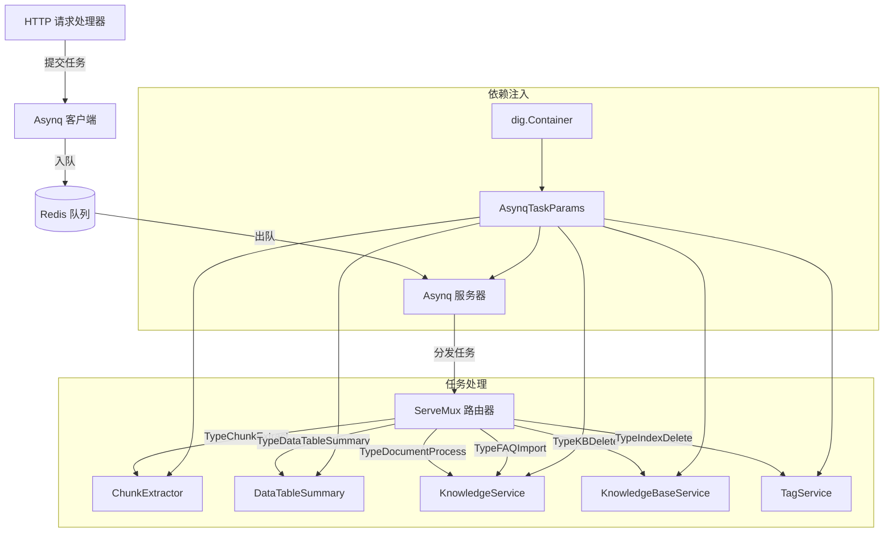

# 后台任务编排契约模块深度解析

## 模块概述

`background_task_wiring_contracts` 模块是系统中负责后台异步任务编排和管理的核心组件。它解决了一个关键问题：如何在不阻塞 HTTP 请求响应的情况下，可靠地执行耗时的知识处理、文档解析、FAQ 导入等操作。

想象一下，当用户上传一个 100MB 的 PDF 文档时，我们不能让他们在浏览器前等待几分钟直到文档完全处理完毕。这个模块就像一个高效的"任务调度中心"，它接收这些耗时任务，将它们放入队列，然后在后台异步处理，同时确保任务的可靠执行和优先级管理。

## 核心组件与架构

### 核心组件

#### 1. `AsynqTaskParams` 结构体

```go
type AsynqTaskParams struct {
    dig.In

    Server               *asynq.Server
    KnowledgeService     interfaces.KnowledgeService
    KnowledgeBaseService interfaces.KnowledgeBaseService
    TagService           interfaces.KnowledgeTagService
    ChunkExtractor       interfaces.TaskHandler `name:"chunkExtractor"`
    DataTableSummary     interfaces.TaskHandler `name:"dataTableSummary"`
}
```

这个结构体是依赖注入的核心容器，它使用 Uber 的 `dig` 库来组织和提供后台任务处理所需的所有依赖。它的设计体现了"依赖倒置原则"，通过接口而非具体实现来定义依赖，使得组件之间保持松耦合。

#### 2. Redis 客户端配置工厂

`getAsynqRedisClientOpt()` 函数负责从环境变量中读取 Redis 配置，并创建一个优化的 Redis 客户端选项。这个函数设置了合理的超时时间（读 100ms，写 200ms），确保即使在 Redis 响应较慢的情况下，系统也能保持稳定。

#### 3. Asynq 客户端和服务器工厂

- `NewAsyncqClient()`：创建并测试 Redis 连接的客户端工厂
- `NewAsynqServer()`：创建带有优先级队列配置的服务器工厂

#### 4. 任务路由器

`RunAsynqServer()` 是整个模块的核心编排函数，它负责：
- 创建任务多路复用器（ServeMux）
- 将任务类型映射到对应的处理函数
- 在后台 goroutine 中启动任务服务器

### 架构图



## 数据流程与任务处理

让我们追踪一个典型的后台任务从提交到完成的完整流程：

1. **任务提交阶段**：HTTP 处理器（如文档上传接口）接收请求后，创建一个 Asynq 任务，使用 `NewAsyncqClient()` 创建的客户端将任务推入 Redis 队列。

2. **任务排队阶段**：任务根据其类型被分配到相应的优先级队列（critical、default 或 low），等待处理。

3. **任务分发阶段**：`AsynqServer` 在后台持续监听队列，当有任务可用时，将其取出并传递给 `ServeMux`。

4. **任务路由阶段**：`ServeMux` 根据任务类型（如 `types.TypeDocumentProcess`）查找对应的处理函数。

5. **任务执行阶段**：调用相应服务的处理方法（如 `params.KnowledgeService.ProcessDocument`）执行实际业务逻辑。

6. **结果处理阶段**：任务执行完成后，Asynq 会自动处理任务状态更新、重试（如需要）或清理。

## 设计决策与权衡

### 1. 使用 Asynq 而非自定义队列系统

**决策**：选择 Asynq 库作为后台任务处理框架。

**权衡**：
- ✅ **优势**：Asynq 提供了任务重试、优先级队列、延迟执行、任务唯一性等开箱即用的功能，避免了重复造轮子。
- ✅ **优势**：基于 Redis 构建，Redis 作为成熟的内存数据存储，提供了良好的性能和可靠性。
- ⚠️ **考虑**：引入了对 Redis 的依赖，增加了系统的复杂度和运维成本。

### 2. 基于接口的依赖注入设计

**决策**：使用 `dig.In` 结构体和接口定义依赖，而非直接依赖具体实现。

**权衡**：
- ✅ **优势**：提高了代码的可测试性，可以轻松注入模拟实现进行单元测试。
- ✅ **优势**：增强了系统的可扩展性，更换服务实现时不需要修改此模块代码。
- ⚠️ **考虑**：增加了一定的抽象复杂度，对于简单场景可能显得过度设计。

### 3. 优先级队列配置

**决策**：配置三个优先级队列（critical:6, default:3, low:1）。

**权衡**：
- ✅ **优势**：确保重要任务（如知识库删除）能优先处理，避免被大量低优先级任务阻塞。
- ⚠️ **考虑**：优先级比例是经验值，可能需要根据实际负载进行调整。

### 4. 环境变量驱动的 Redis 配置

**决策**：通过环境变量而非配置文件配置 Redis 连接。

**权衡**：
- ✅ **优势**：符合 12-Factor App 原则，便于在不同环境（开发、测试、生产）间切换配置。
- ✅ **优势**：简化了配置管理，特别是在容器化部署环境中。
- ⚠️ **考虑**：缺少配置验证，错误的环境变量可能导致运行时故障。

## 使用指南与注意事项

### 基本使用模式

1. **添加新任务类型**：
   - 在 `types` 包中定义新的任务类型常量
   - 在相应的服务接口中添加处理方法
   - 在 `RunAsynqServer` 函数中注册任务处理函数

2. **提交任务**：
   ```go
   // 创建任务
   task := asynq.NewTask(types.TypeDocumentProcess, payload, opts...)
   
   // 提交任务
   client := NewAsyncqClient()
   info, err := client.Enqueue(task)
   ```

### 注意事项与陷阱

1. **Redis 连接管理**：
   - 注意，`NewAsyncqClient()` 每次调用都会创建新连接，应避免频繁调用
   - 在应用程序生命周期中重用客户端实例

2. **任务幂等性**：
   - 所有任务处理函数必须设计为幂等的，因为 Asynq 可能会重试失败的任务
   - 使用唯一标识符和状态检查来避免重复处理

3. **错误处理**：
   - 任务处理函数返回的错误会触发 Asynq 的重试机制
   - 对于不可恢复的错误，应使用 `asynq.SkipRetry()` 选项

4. **资源清理**：
   - 长时间运行的任务应注意内存使用和资源释放
   - 考虑使用上下文（context）来控制任务超时和取消

5. **优先级队列使用**：
   - 合理使用队列优先级，避免将所有任务都标记为 critical
   - 监控各队列的深度，及时发现处理瓶颈

## 依赖关系

这个模块依赖于以下关键组件：

- [Asynq 库](https://github.com/hibiken/asynq)：提供后台任务处理的核心功能
- [dig](https://go.uber.org/dig)：依赖注入容器
- Redis：作为任务队列的持久化存储
- 服务接口：如 `interfaces.KnowledgeService`、`interfaces.KnowledgeBaseService` 等，定义了任务处理的业务逻辑

## 总结

`background_task_wiring_contracts` 模块是系统后台处理能力的基石，它通过精心设计的依赖注入、任务路由和优先级队列机制，实现了高效、可靠的异步任务处理。它的设计既考虑了当前的功能需求，也为未来的扩展留出了空间，是一个优秀的模块化设计范例。
