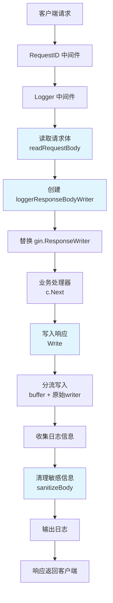

# logging_response_body_capture_writer 模块技术深度解析

## 1. 问题与动机

在分布式系统中，完整的请求响应日志对于故障排查、性能分析和安全审计至关重要。然而，标准的 HTTP 中间件面临一个核心挑战：**HTTP 请求和响应体是只能读取一次的流**。一旦下游处理器读取了请求体或写入了响应体，中间件就无法再获取这些内容进行日志记录。

同时，日志记录还需要解决以下问题：
- **敏感信息保护**：密码、令牌等敏感数据不应出现在日志中
- **日志大小控制**：避免记录过大的请求/响应体导致日志膨胀
- **内容类型过滤**：只记录文本类型的内容，跳过二进制数据
- **请求追踪**：将同一个请求的日志关联起来

这个模块就是为了解决这些问题而设计的，它提供了一个优雅的解决方案，能够在不影响正常请求处理的前提下，捕获并记录请求和响应体。

## 2. 核心抽象与心智模型

### 2.1 设计思路：装饰器模式

这个模块的核心是 **loggerResponseBodyWriter** 结构体，它采用了经典的**装饰器模式**（Decorator Pattern）。你可以把它想象成一个"分流器"：

- 对于响应写入：当业务代码向响应写入数据时，这个分流器会同时将数据写入原始响应流（发送给客户端）和一个内存缓冲区（用于日志记录）
- 对于请求读取：在业务代码读取请求体之前，先完整读取并保存一份副本，然后将副本重新包装成流供业务代码使用

### 2.2 心智模型

想象一下你在邮局寄信：
1. **请求处理**：邮局工作人员（中间件）在收下你的信（请求体）后，先复印一份留底，然后把原件交给分拣部门（业务处理器）
2. **响应处理**：分拣部门写好回信（响应体）交给工作人员，工作人员在把回信放入信封寄出前，也复印一份留底
3. **安全处理**：工作人员在复印时，会用黑笔涂掉信中的敏感信息（如密码、令牌）
4. **关联追踪**：每封信都有一个唯一编号（Request ID），寄信和回信的复印件都用这个编号归档

## 3. 架构与数据流



### 3.1 数据流向详解

1. **请求进入阶段**：
   - 首先经过 `RequestID` 中间件，为请求分配唯一标识
   - 然后进入 `Logger` 中间件，此时请求体还未被读取
   - `readRequestBody` 函数完整读取请求体，重置后供后续使用
   - 创建 `loggerResponseBodyWriter` 替换原始的 `gin.ResponseWriter`

2. **请求处理阶段**：
   - 业务处理器从重置后的请求体中读取数据
   - 业务处理器向 `loggerResponseBodyWriter` 写入响应
   - `Write` 方法同时写入缓冲区和原始响应流

3. **响应记录阶段**：
   - 业务处理完成后，从缓冲区获取响应体
   - 对请求和响应体进行敏感信息清理
   - 组装完整的日志信息并输出

## 4. 核心组件深度解析

### 4.1 loggerResponseBodyWriter 结构体

```go
type loggerResponseBodyWriter struct {
    gin.ResponseWriter  // 嵌入原始 ResponseWriter，实现接口委托
    body *bytes.Buffer  // 用于捕获响应内容的缓冲区
}
```

**设计意图**：
- 通过嵌入 `gin.ResponseWriter`，自动继承所有接口方法，无需手动实现
- 仅重写 `Write` 方法，添加捕获逻辑，保持其他行为不变
- 使用 `bytes.Buffer` 作为内存缓冲区，高效捕获响应内容

**关键决策**：
- 为什么不实现完整的 `gin.ResponseWriter` 接口？因为接口方法众多，通过嵌入可以避免代码重复，且能自动适应接口变化
- 为什么使用值接收器而不是指针接收器？虽然这里使用值接收器也能工作，但实际上这是一个潜在的问题（见"注意事项"部分）

### 4.2 Write 方法

```go
func (r loggerResponseBodyWriter) Write(b []byte) (int, error) {
    r.body.Write(b)              // 写入缓冲区
    return r.ResponseWriter.Write(b)  // 写入原始响应流
}
```

**工作原理**：
- 这是一个典型的"分流"操作，数据同时流向两个目的地
- 优先写入缓冲区，确保即使原始写入失败，我们也能捕获到尝试写入的内容
- 返回原始写入的结果，保持错误传播行为不变

### 4.3 sanitizeBody 函数

```go
func sanitizeBody(body string) string
```

**功能**：使用正则表达式替换常见的敏感字段

**敏感字段列表**：
- password
- token
- access_token
- refresh_token
- authorization
- api_key
- secret
- apikey
- apisecret

**设计特点**：
- 只处理 JSON 格式的字段，格式为 `"key":"value"`
- 使用 `\s*` 允许键和冒号之间有任意空白
- 替换为固定的 `"***"`，既表明有值，又不泄露实际内容

**局限性**：
- 只匹配双引号包裹的字符串值
- 不处理嵌套结构中的敏感字段（虽然正则表达式会匹配）
- 不处理非 JSON 格式的敏感数据

### 4.4 readRequestBody 函数

```go
func readRequestBody(c *gin.Context) string
```

**这是整个模块中最精巧的函数之一**，它解决了"请求体只能读取一次"的问题。

**工作流程**：
1. 检查 Content-Type，只记录文本类型
2. 使用 `io.ReadAll` 完整读取请求体
3. 使用 `io.NopCloser(bytes.NewBuffer(bodyBytes))` 重新创建请求体
4. 截取最多 10KB 用于日志记录
5. 对日志内容进行敏感信息清理

**关键设计决策**：
- **为什么要完整读取而不是只读取部分？** 因为我们需要确保后续处理器能获取完整的请求体，不能因为日志记录而破坏业务逻辑
- **为什么要重置请求体？** 因为 HTTP 请求体是一个流，读取后游标会移动到末尾，必须重置才能再次读取
- **为什么使用 `io.NopCloser`？** 因为 `bytes.Buffer` 没有 `Close` 方法，需要包装一下以满足 `io.ReadCloser` 接口

### 4.5 RequestID 中间件

```go
func RequestID() gin.HandlerFunc
```

**功能**：为每个请求分配唯一标识，并贯穿整个请求生命周期

**工作流程**：
1. 尝试从 `X-Request-ID` 请求头获取现有 ID
2. 如果没有，则生成新的 UUID
3. 将 ID 设置到响应头、Gin 上下文和请求上下文
4. 创建带 RequestID 的 logger 并设置到上下文

**设计意图**：
- 支持分布式追踪：如果上游系统已经传递了 RequestID，则继续使用
- 多层上下文设置：同时设置到 Gin 上下文和标准 context，确保在不同场景下都能获取
- Logger 关联：将 RequestID 绑定到 logger，后续所有日志自动携带此标识

### 4.6 Logger 中间件

```go
func Logger() gin.HandlerFunc
```

**功能**：协调整个日志记录流程

**关键步骤**：
1. 记录请求开始时间
2. 根据请求方法决定是否读取请求体
3. 创建响应捕获器并替换原始 ResponseWriter
4. 调用 `c.Next()` 执行后续中间件和业务处理器
5. 收集各种信息（状态码、延迟、客户端 IP 等）
6. 读取并处理响应体
7. 组装并输出日志

**信息收集清单**：
- request_id: 请求唯一标识
- method: HTTP 方法
- path: 请求路径（包括查询参数）
- status_code: HTTP 状态码
- size: 响应大小
- latency: 请求处理耗时
- client_ip: 客户端 IP
- request_body: 请求体（如果有）
- response_body: 响应体（如果有）

## 5. 依赖关系分析

### 5.1 被依赖关系

这个模块通常作为中间件被 Gin 路由框架调用，位于请求处理链路的较上层：

```
HTTP 请求 → RequestID 中间件 → Logger 中间件 → 其他中间件 → 业务处理器
```

### 5.2 外部依赖

| 依赖 | 用途 |
|------|------|
| `github.com/gin-gonic/gin` | Web 框架，提供 `ResponseWriter` 和 `Context` |
| `github.com/google/uuid` | 生成唯一请求 ID |
| `internal/logger` | 日志记录器 |
| `internal/types` | 定义上下文键类型 |
| `internal/utils` | 安全工具函数（如 `SanitizeForLog`） |

### 5.3 契约与假设

**对上游的假设**：
- 请求体如果是文本类型，应该设置正确的 `Content-Type`
- 如果需要分布式追踪，上游应该设置 `X-Request-ID` 请求头

**对下游的保证**：
- 请求体会被完整重置，下游可以正常读取
- 响应写入行为与原始 `ResponseWriter` 保持一致
- 不会因为日志记录失败而影响请求处理

## 6. 设计权衡与决策

### 6.1 内存使用 vs 日志完整性

**决策**：限制日志记录的请求/响应体大小为 10KB

**权衡分析**：
- ✅ 优点：避免大请求/响应导致内存占用过高和日志膨胀
- ❌ 缺点：对于超过 10KB 的内容，日志中只能看到部分数据

**为什么是 10KB？**
- 对于大多数 API 请求/响应，10KB 足够包含关键信息
- 即使在高并发场景下，内存占用也可控
- 如果需要完整内容，可以通过其他机制（如请求追踪）获取

### 6.2 正则表达式 vs 完整 JSON 解析

**决策**：使用正则表达式进行敏感信息清理

**权衡分析**：
- ✅ 优点：性能好，不依赖 JSON 格式的正确性，实现简单
- ❌ 缺点：可能误判，无法处理复杂结构，格式限制严格

**为什么选择正则？**
- 日志记录是"尽力而为"的操作，不应该因为 JSON 解析失败而影响日志输出
- 性能敏感：正则表达式比完整 JSON 解析快得多
- 常见场景下足够：大多数敏感信息都以简单的键值对形式出现

### 6.3 同步捕获 vs 异步处理

**决策**：同步捕获和记录日志

**权衡分析**：
- ✅ 优点：实现简单，不会丢失日志，资源占用可控
- ❌ 缺点：增加请求延迟，尤其是在大请求/响应时

**为什么选择同步？**
- 日志记录的额外开销通常很小（微秒级别）
- 异步处理会增加复杂性，且需要处理日志丢失的问题
- 在这个场景下，可靠性比微小的性能提升更重要

### 6.4 值接收器 vs 指针接收器

**决策**：`Write` 方法使用值接收器

**分析**：
这是一个值得讨论的设计。虽然当前实现能工作，但使用值接收器意味着：
- 每次调用 `Write` 都会复制 `loggerResponseBodyWriter` 结构体
- 不过由于结构体很小（只有一个接口和一个指针），复制成本很低
- `body` 字段是指针，所以即使复制结构体，多个副本仍共享同一个缓冲区

**潜在问题**：
如果 `gin.ResponseWriter` 接口包含其他修改状态的方法，通过值接收器调用可能不会生效。但在这个实现中，我们只重写了 `Write` 方法，其他方法委托给原始的 ResponseWriter，所以不受影响。

## 7. 使用指南与最佳实践

### 7.1 基本使用

```go
import (
    "github.com/Tencent/WeKnora/internal/middleware"
    "github.com/gin-gonic/gin"
)

func main() {
    r := gin.New()
    
    // 注意顺序：RequestID 应该在 Logger 之前
    r.Use(middleware.RequestID())
    r.Use(middleware.Logger())
    
    // 注册路由...
    
    r.Run(":8080")
}
```

**重要提示**：中间件顺序很重要！`RequestID` 必须在 `Logger` 之前，这样 Logger 才能获取到 RequestID。

### 7.2 配置选项

虽然这个模块没有提供显式的配置，但你可以通过修改常量来调整行为：

```go
const (
    maxBodySize = 1024 * 10 // 修改这个值来调整最大记录的 body 大小
)
```

### 7.3 扩展敏感字段

如果需要添加更多敏感字段，可以修改 `sensitivePatterns` 切片：

```go
sensitivePatterns := []struct {
    pattern     string
    replacement string
}{
    // 现有字段...
    {`"credit_card"\s*:\s*"[^"]*"`, `"credit_card":"***"`},
    {`"ssn"\s*:\s*"[^"]*"`, `"ssn":"***"`},
}
```

### 7.4 最佳实践

1. **中间件顺序**：
   ```
   RequestID → Logger → 认证中间件 → 其他中间件 → 业务处理器
   ```

2. **敏感信息保护**：
   - 定期审查 `sanitizeBody` 函数，确保覆盖所有敏感字段
   - 考虑使用更严格的匹配模式
   - 不要在 URL 查询参数中传递敏感信息（这个模块不会清理 URL）

3. **性能考虑**：
   - 如果发现日志记录成为瓶颈，可以考虑：
     - 减小 `maxBodySize`
     - 采样记录（只记录部分请求）
     - 异步写入日志

4. **日志分析**：
   - 使用 RequestID 关联同一个请求的所有日志
   - 注意日志中的 `[内容过长，已截断]` 和 `[非文本类型，已跳过]` 标记

## 8. 注意事项与潜在陷阱

### 8.1 值接收器问题

如前所述，`Write` 方法使用值接收器虽然在当前场景下能工作，但如果将来需要重写其他修改状态的方法，可能会遇到问题。建议考虑改为指针接收器：

```go
func (r *loggerResponseBodyWriter) Write(b []byte) (int, error) {
    r.body.Write(b)
    return r.ResponseWriter.Write(b)
}

// 创建时使用指针
responseWriter := &loggerResponseBodyWriter{
    ResponseWriter: c.Writer,
    body:           responseBody,
}
```

### 8.2 敏感信息清理的局限性

- **只清理 JSON 格式**：如果请求/响应体是其他格式（如 XML、表单数据等），敏感信息不会被清理
- **正则表达式可能误判**：例如，如果有一个字段叫 `"password_hint"`，它的值也会被替换
- **不处理数值类型**：如果敏感信息以数值形式存在（虽然不推荐），不会被清理

### 8.3 Content-Type 检查

模块会检查 `Content-Type` 来决定是否记录内容，但：
- 如果响应没有设置 `Content-Type`，即使是文本内容也不会被记录
- 如果错误地设置了 `Content-Type`（如将 JSON 设为 `application/octet-stream`），内容不会被记录

### 8.4 错误处理

这个模块的错误处理是"沉默"的：
- 如果读取请求体失败，只会记录 `"[读取请求体失败]"`，不会中断请求
- 如果缓冲区写入失败，不会影响原始响应的写入
- 这种设计是合理的，因为日志记录不应该影响业务逻辑

### 8.5 内存占用

虽然限制了单个请求/响应的大小，但在高并发场景下，内存占用仍可能显著增加：
- 假设 1000 并发请求，每个请求 10KB，就是 10MB
- 如果有文件上传等大请求场景，考虑添加跳过规则

### 8.6 请求体重复读取

如果请求体非常大（如几 GB），`io.ReadAll` 会将整个内容加载到内存中，可能导致 OOM。对于这种场景，应该：
- 添加请求体大小限制
- 或者对特定路由跳过日志记录

## 9. 总结

`logging_response_body_capture_writer` 模块是一个精心设计的中间件，它通过装饰器模式优雅地解决了 HTTP 请求/响应体捕获的难题。它的核心价值在于：

1. **无侵入性**：不影响业务逻辑，透明地添加日志记录功能
2. **安全性**：自动清理敏感信息，避免数据泄露
3. **实用性**：大小限制、内容类型过滤等设计考虑了生产环境的实际需求
4. **可观测性**：通过 RequestID 实现请求追踪，便于问题定位

虽然有一些小的改进空间（如指针接收器、更灵活的配置），但整体来说这是一个高质量、生产就绪的模块，值得在类似场景中参考和使用。
