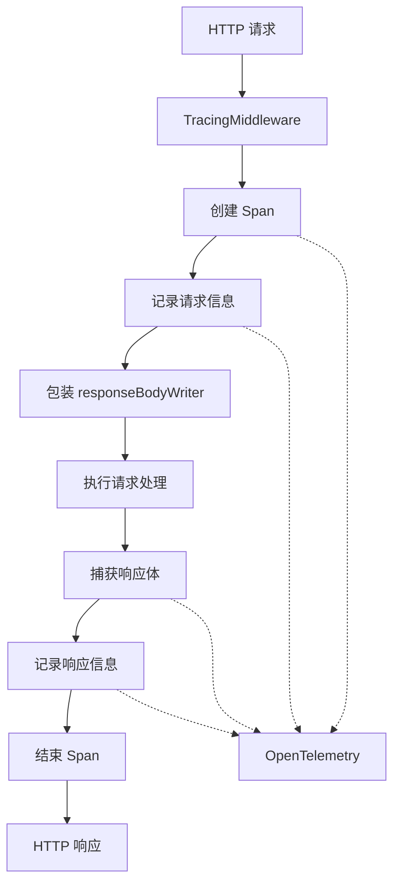

# tracing_response_body_capture_writer 模块技术文档

## 1. 问题背景

在分布式系统中，理解和调试 HTTP 请求/响应流是一个常见的挑战。当 API 出现问题时，开发人员需要知道：
- 请求的完整上下文（方法、URL、请求体、查询参数等）
- 响应的内容和状态码
- 请求的执行时间
- 错误发生时的详细信息

传统的日志记录方式往往只能捕获部分信息，或者需要在每个 handler 中手动编写记录代码，这既繁琐又容易遗漏重要信息。

这个模块解决的核心问题是：如何以非侵入式地捕获 HTTP 交互的完整上下文，并将其与分布式追踪系统（OpenTelemetry）集成，提供完整的请求链路追踪能力。

## 2. 核心抽象与心智模型

### 2.1 核心抽象

本模块的核心是一个简单而优雅的抽象：**响应写入器装饰器模式**。

想象一下，你在邮局寄信，正常情况下信会直接送到收件人手中。现在，我们在中间加了一个"影印机"，它在信送达的同时，也会保留一份副本。这就是 `responseBodyWriter` 的工作原理——它装饰了原始的响应写入器，在写入响应的同时，也将内容复制到内部缓冲区。

### 2.2 心智模型

```
请求 → [TracingMiddleware] → [responseBodyWriter] → 原始响应写入器 → 客户端
                    ↓                    ↓
              创建追踪 span          捕获响应体
              记录请求信息          记录到 span
```

## 3. 架构与数据流程

### 3.1 架构图



### 3.2 数据流程详解

1. **请求入口**：当 HTTP 请求到达时，`TracingMiddleware` 首先拦截请求
2. **创建追踪上下文**：从请求头中提取现有的追踪上下文（如果有），创建新的 span
3. **记录请求信息**：
   - HTTP 方法、URL、路径
   - 请求头（跳过敏感信息如 Authorization 和 Cookie）
   - 请求体（仅 POST/PUT/PATCH 请求）
   - 查询参数
4. **包装响应写入器**：用 `responseBodyWriter` 包装原始的 `gin.ResponseWriter`
5. **执行请求处理**：调用 `c.Next()` 继续执行后续的中间件和 handler
6. **捕获响应信息**：
   - 响应状态码
   - 响应体（通过 `responseBodyWriter` 捕获）
   - 响应头
7. **标记错误状态**：如果状态码 >= 400，标记 span 为错误状态
8. **结束 span**：完成追踪并发送到 OpenTelemetry 后端

## 4. 核心组件详解

### 4.1 responseBodyWriter 结构体

```go
type responseBodyWriter struct {
        gin.ResponseWriter
        body *bytes.Buffer
}
```

**设计意图**：这是一个典型的装饰器模式实现。它嵌入了原始的 `gin.ResponseWriter`，这样它可以继承所有原始的方法，同时添加了一个 `body` 字段来捕获响应内容。

**为什么选择嵌入而不是继承**：在 Go 中，接口组合优于继承。通过嵌入 `gin.ResponseWriter`，我们可以在不修改原始类型的情况下扩展其功能，同时保持完全兼容原始接口。

### 4.2 Write 方法重写

```go
func (r responseBodyWriter) Write(b []byte) (int, error) {
        r.body.Write(b)
        return r.ResponseWriter.Write(b)
}
```

**设计意图**：这是装饰器模式的核心。每次写入响应时，它会同时：
1. 将内容写入内部缓冲区
2. 调用原始写入器的 Write 方法，确保响应正常发送给客户端

**注意事项**：这里使用值接收者而不是指针接收者，这是因为 `gin.ResponseWriter` 接口要求值接收者。但这也意味着 `body` 字段需要是指针类型，否则会创建副本导致捕获失败。

### 4.3 TracingMiddleware 函数

这是整个模块的入口点，它返回一个 `gin.HandlerFunc`，可以直接作为 Gin 中间件使用。

**核心流程**：
1. 检查是否有可用的追踪器
2. 创建新的 span
3. 设置基本的 span 属性
4. 记录请求信息
5. 包装响应写入器
6. 执行请求处理
7. 记录响应信息
8. 标记错误状态
9. 结束 span

**关键设计点**：
- **请求体重置**：读取请求体后，会立即重置 `c.Request.Body`，这样后续的 handler 仍然可以正常读取请求体
- **敏感信息过滤**：跳过 Authorization 和 Cookie 等敏感头信息
- **错误处理**：自动识别 HTTP 错误状态，并记录 Gin 上下文中的最后一个错误

## 5. 依赖关系分析

### 5.1 依赖的模块

- **internal/tracing**：提供 OpenTelemetry 集成
- **github.com/gin-gonic/gin**：Web 框架
- **go.opentelemetry.io/otel**：OpenTelemetry 库

### 5.2 被依赖的模块

这个中间件通常会被路由配置模块依赖，用于在 HTTP 请求处理链中添加追踪能力。

### 5.3 数据契约

**输入契约**：
- 标准的 HTTP 请求（通过 Gin 上下文）
- 可能包含追踪上下文的请求头

**输出契约**：
- 完整的追踪 span，包含请求和响应的完整信息
- 未修改的 HTTP 响应（通过原始响应写入器）

## 6. 设计权衡与决策

### 6.1 装饰器模式 vs 直接记录

**选择**：装饰器模式

**原因**：
- 非侵入式：不需要修改任何 handler 代码
- 可复用：一次配置，所有路由自动获得追踪能力
- 完整性：确保捕获所有响应内容，无论 handler 如何写入响应

**权衡**：
- 会有一定的内存开销，因为需要在内存中缓冲响应内容
- 对于非常大的响应体可能会占用较多内存

### 6.2 请求体完全读取 vs 流式处理

**选择**：完全读取到内存

**原因**：
- 简单直接，易于实现
- 对于大多数 API 请求，请求体不会太大
- 可以确保完整记录请求内容

**权衡**：
- 对于非常大的请求体，会占用较多内存
- 可能会影响性能

### 6.3 敏感信息过滤 vs 完全记录

**选择**：过滤敏感信息

**原因**：
- 安全考虑，避免在追踪数据中泄露敏感信息
- 符合隐私保护要求

**权衡**：
- 可能会丢失一些调试信息
- 需要维护一个敏感头信息列表

## 7. 使用指南与示例

### 7.1 基本使用

```go
import (
    "github.com/gin-gonic/gin"
    "github.com/Tencent/WeKnora/internal/middleware"
)

func main() {
    r := gin.Default()
    
    // 注册追踪中间件
    r.Use(middleware.TracingMiddleware())
    
    // 定义路由
    r.GET("/api/v1/users", func(c *gin.Context) {
        // 你的处理逻辑
    })
    
    r.Run(":8080")
}
```

### 7.2 访问追踪上下文

在 handler 中，你可以访问追踪上下文：

```go
func handler(c *gin.Context) {
    // 获取 span
    if span, exists := c.Get("trace.span"); exists {
        // 使用 span 添加自定义属性
        if s, ok := span.(trace.Span); ok {
            s.SetAttributes(attribute.String("custom.key", "value"))
        }
    }
    
    // 获取追踪上下文
    if ctx, exists := c.Get("trace.ctx"); exists {
        // 使用上下文
        if traceCtx, ok := ctx.(context.Context); ok {
            // 在其他地方使用这个上下文
        }
    }
}
```

## 8. 边界情况与注意事项

### 8.1 大响应体处理

**问题**：对于非常大的响应体（如下载文件），将整个响应体缓冲在内存中可能会导致内存问题。

**解决方案**：
- 考虑添加响应体大小限制
- 对于大文件下载，可以考虑跳过响应体捕获

### 8.2 流式响应

**问题**：对于流式响应（如 SSE），这个中间件仍然可以工作，但可能会捕获到不完整的响应体。

**注意事项**：
- 对于流式响应，需要特别注意内存使用
- 考虑是否真的需要捕获完整的流式响应

### 8.3 性能影响

**问题**：这个中间件会有一定的性能开销，特别是在高并发场景下。

**优化建议**：
- 在生产环境中，可以考虑采样率配置
- 对于性能关键路径，可以考虑选择性地应用这个中间件

### 8.4 敏感信息

**问题**：当前实现只过滤了 Authorization 和 Cookie 头，可能还有其他敏感信息需要过滤。

**建议**：
- 根据你的应用需求，扩展敏感信息过滤列表
- 考虑添加请求体和响应体中的敏感信息过滤

## 9. 总结

`tracing_response_body_capture_writer` 模块是一个优雅的 HTTP 请求/响应捕获中间件，它通过装饰器模式实现了非侵入式的追踪能力。它将完整的 HTTP 交互上下文与 OpenTelemetry 集成，为分布式系统提供了强大的调试和监控能力。

这个模块的设计体现了几个关键的软件工程原则：
- **装饰器模式**：扩展功能而不修改原始代码
- **关注点分离**：将追踪逻辑与业务逻辑分离
- **安全性考虑**：过滤敏感信息
- **完整性**：捕获完整的请求和响应上下文

通过使用这个模块，开发人员可以更容易地理解和调试 HTTP 请求/响应流，提高系统的可观测性和可维护性。
