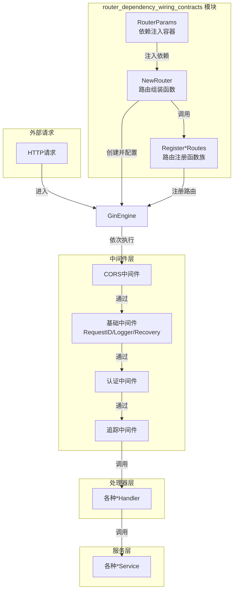

# router_dependency_wiring_contracts 模块深度解析

## 1. 模块概述

**router_dependency_wiring_contracts** 模块是整个系统 HTTP 层的核心连接器，它解决了一个看似简单但至关重要的问题：如何将系统中各种服务、处理器和中间件以一种可维护、可测试的方式组装到路由系统中。

### 1.1 问题背景

在没有这个模块之前，你可能会看到这样的场景：
- 每个路由注册函数直接实例化自己需要的服务
- 服务之间的依赖关系散落在代码各处
- 测试时需要手动 mock 大量依赖
- 添加新路由时容易遗漏中间件或配置

这个模块的出现，就像是给 HTTP 层提供了一个"中央接线板"，所有的依赖都在这里有序连接，然后输出一个完整的路由引擎。

### 1.2 核心洞察

这个模块的设计基于一个关键理念：**依赖注入（Dependency Injection）与路由注册分离**。通过将所有依赖集中在一个参数结构体中，再统一传递给路由注册函数，实现了高度的解耦和可测试性。

## 2. 核心组件解析

### 2.1 RouterParams 结构体

`RouterParams` 是整个模块的核心，它使用 `dig.In` 标记，表明这是一个用于依赖注入的参数结构体。

```go
type RouterParams struct {
    dig.In

    // 配置
    Config                *config.Config
    
    // 服务层依赖
    UserService           interfaces.UserService
    KBService             interfaces.KnowledgeBaseService
    KnowledgeService      interfaces.KnowledgeService
    // ... 更多服务
    
    // 处理器层依赖
    KBHandler             *handler.KnowledgeBaseHandler
    KnowledgeHandler      *handler.KnowledgeHandler
    // ... 更多处理器
}
```

**设计意图**：
- 使用 `dig.In` 让这个结构体可以被 Uber 的 dig 依赖注入容器自动填充
- 集中管理所有路由系统需要的依赖，避免依赖散落在各处
- 通过接口（如 `interfaces.UserService`）而不是具体类型依赖，提高了可测试性

### 2.2 NewRouter 函数

`NewRouter` 是模块的入口点，它接收 `RouterParams` 并返回一个完全配置好的 `*gin.Engine`。

**工作流程**：
1. 创建基础的 Gin 引擎
2. 配置 CORS 中间件（放在最前面，确保所有请求都经过 CORS 处理）
3. 配置基础中间件（RequestID、Logger、Recovery、ErrorHandler）
4. 设置健康检查端点（不需要认证）
5. 条件性配置 Swagger 文档（仅在非生产环境）
6. 配置认证中间件和追踪中间件
7. 注册所有 API 路由
8. 返回配置完成的引擎

**关键设计决策**：
- **中间件顺序严格**：CORS → 基础中间件 → 认证 → 追踪 → 业务路由
- **条件性启用 Swagger**：通过 `gin.Mode()` 判断，生产环境自动禁用
- **路由分组**：使用 `/api/v1` 作为统一前缀，便于版本管理

### 2.3 路由注册函数

模块包含一系列 `Register*Routes` 函数，每个函数负责注册一类相关的路由：

```go
func RegisterKnowledgeRoutes(r *gin.RouterGroup, handler *handler.KnowledgeHandler) {
    // 知识库下的知识路由组
    kb := r.Group("/knowledge-bases/:id/knowledge")
    {
        kb.POST("/file", handler.CreateKnowledgeFromFile)
        kb.POST("/url", handler.CreateKnowledgeFromURL)
        // ... 更多路由
    }
    
    // 知识路由组
    k := r.Group("/knowledge")
    {
        k.GET("/batch", handler.GetKnowledgeBatch)
        k.GET("/:id", handler.GetKnowledge)
        // ... 更多路由
    }
}
```

**设计模式**：
- **路由分组**：将相关路由组织在同一个路由组下，便于管理和共享中间件
- **处理器注入**：每个注册函数只接收自己需要的处理器，避免过度依赖
- **RESTful 设计**：遵循 RESTful 风格，使用恰当的 HTTP 方法和路径结构

## 3. 数据流向与架构角色

### 3.1 架构图



### 3.2 在系统中的位置

这个模块位于 HTTP 层的核心，它是连接外部请求与内部业务逻辑的桥梁：

```
外部请求 → Gin 引擎 → 中间件链 → 路由匹配 → 处理器 → 服务层
               ↑
         router_dependency_wiring_contracts (组装者)
```

### 3.3 依赖关系

**输入依赖**：
- 配置：`*config.Config`
- 服务层：各种 `interfaces.*Service` 接口实现
- 处理器层：各种 `*handler.*Handler` 实例
- 中间件：`middleware.*` 包中的中间件函数

**输出**：
- 完全配置好的 `*gin.Engine` 实例，可以直接用于启动 HTTP 服务器

### 3.4 关键数据流

1. **初始化阶段**：
   - DI 容器创建并填充 `RouterParams`
   - `NewRouter` 被调用，接收 `RouterParams`
   - 中间件按顺序添加到引擎
   - 路由通过 `Register*Routes` 函数逐一注册

2. **运行时请求处理**：
   - 请求到达 Gin 引擎
   - 经过 CORS 中间件
   - 经过基础中间件（RequestID、Logger 等）
   - 匹配到具体路由
   - 经过认证和追踪中间件
   - 调用对应的处理器方法

## 4. 设计决策与权衡

### 4.1 集中式依赖 vs 分散式依赖

**选择**：集中式依赖管理（通过 `RouterParams`）

**原因**：
- 便于理解整个路由系统的依赖关系
- 简化 DI 配置，所有依赖在一个地方声明
- 便于测试，可以一次性 mock 所有依赖

**权衡**：
- `RouterParams` 结构体可能会变得很大
- 添加新依赖需要修改这个结构体，可能引起合并冲突

### 4.2 中间件顺序的严格性

**选择**：严格定义中间件顺序

**原因**：
- CORS 必须最先处理，否则跨域请求会失败
- 认证中间件必须在业务路由之前，确保安全
- 追踪中间件应该在认证之后，以便获取用户信息

**权衡**：
- 灵活性降低，中间件顺序不能随意调整
- 但这是必要的，因为中间件之间有隐含的依赖关系

### 4.3 路由注册函数的分离

**选择**：将不同类型的路由注册分离到不同函数

**原因**：
- 单一职责，每个函数只负责一类路由
- 便于代码组织和维护
- 可以独立测试每个路由注册函数

**权衡**：
- 增加了函数数量
- 但提高了代码的可读性和可维护性

## 5. 使用指南与最佳实践

### 5.1 添加新路由

1. 在对应的处理器中添加新方法
2. 如果需要，在 `RouterParams` 中添加新的依赖
3. 创建或更新对应的 `Register*Routes` 函数
4. 在 `NewRouter` 中调用这个注册函数

### 5.2 测试建议

由于使用了依赖注入和接口，测试变得相对简单：

```go
// 测试时可以创建 mock 依赖
params := RouterParams{
    Config:          testConfig,
    UserService:     &mockUserService{},
    KBService:       &mockKBService{},
    // ... 其他 mock 依赖
}

// 创建路由引擎
router := NewRouter(params)

// 使用 httptest 进行测试
w := httptest.NewRecorder()
req, _ := http.NewRequest("GET", "/health", nil)
router.ServeHTTP(w, req)

// 断言结果
assert.Equal(t, http.StatusOK, w.Code)
```

### 5.3 注意事项

- **中间件顺序**：不要随意调整中间件顺序，特别是 CORS 和认证中间件
- **路由冲突**：注意路由的定义顺序，更具体的路由应该在更通用的路由之前
- **Swagger 配置**：确保 Swagger 只在非生产环境启用
- **CORS 配置**：生产环境应该限制 `AllowOrigins`，而不是使用 `*`

## 6. 相关模块参考

这个模块与以下模块有紧密的依赖关系：

- [http_handlers_and_routing](http_handlers_and_routing.md) - 父模块，包含所有 HTTP 处理相关功能
- [http_handlers_and_routing-routing_middleware_and_background_task_wiring-http_response_body_capture_middlewares](http_handlers_and_routing-routing_middleware_and_background_task_wiring-http_response_body_capture_middlewares.md) - 响应捕获中间件
- [core_domain_types_and_interfaces](core_domain_types_and_interfaces.md) - 定义了模块中使用的各种接口
- [platform_infrastructure_and_runtime](platform_infrastructure_and_runtime.md) - 提供配置和运行时支持

## 7. 总结

`router_dependency_wiring_contracts` 模块虽然看起来只是一个"接线板"，但它体现了良好的软件设计原则：依赖注入、单一职责、关注点分离。通过集中管理依赖和路由注册，它使得整个 HTTP 层更加可维护、可测试，同时也为系统的扩展提供了清晰的路径。

这个模块的价值不在于它做了多么复杂的事情，而在于它把复杂的依赖关系变得有序和可控。
