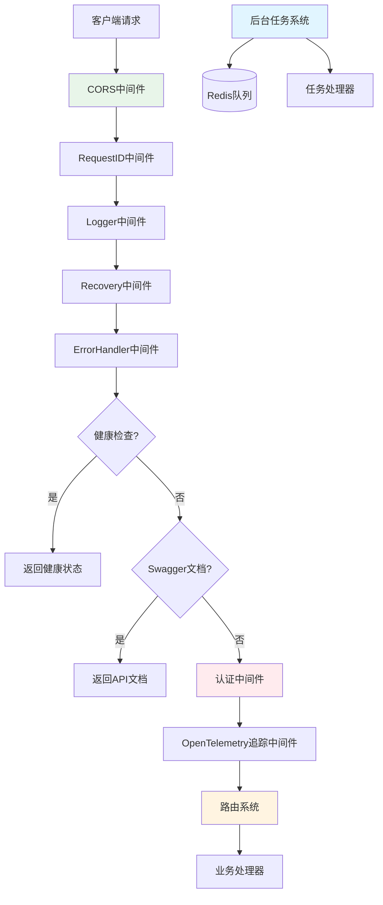

# 路由、中间件和后台任务连接模块

## 1. 模块概览

这是一个**应用网关和请求编排模块**，它就像整个系统的"交通枢纽"。想象一个繁忙的机场：HTTP请求就像旅客，中间件是安检和登机口，路由系统是航班调度，后台任务是行李处理和航班准备。这个模块负责将所有这些部分无缝连接在一起，确保请求能够安全、高效地到达目的地，同时处理好异步任务和系统监控。

**核心价值主张**：
- 集中管理HTTP请求的入口和出口
- 标准化请求处理流程（日志、追踪、错误处理）
- 无缝集成异步任务处理系统
- 提供安全的跨域访问和认证机制

## 2. 架构设计

### 2.1 核心架构图



### 2.2 架构详解

这个模块的架构设计遵循了**洋葱模型**（Onion Architecture）的思想，请求从外到内逐层经过各种中间件处理，然后到达路由系统，最后由业务处理器处理。响应则沿着相反的路径返回。

#### 2.2.1 中间件层（外层）

中间件层按照严格的顺序排列，每个中间件都有特定的职责：

1. **CORS中间件**：最外层，处理跨域资源共享，确保前端可以安全访问后端API
2. **RequestID中间件**：为每个请求生成唯一的请求ID，用于追踪和日志关联
3. **Logger中间件**：记录请求和响应的详细信息，包括请求体、响应体、耗时等
4. **Recovery中间件**：捕获panic，确保服务不会因为单个请求的错误而崩溃
5. **ErrorHandler中间件**：统一处理错误响应格式

#### 2.2.2 路由层（中间层）

路由系统是整个模块的核心，它负责：
- 将URL路径映射到对应的处理器函数
- 管理API版本控制（当前是v1）
- 组织相关的路由到一起（如知识、会话、消息等）

#### 2.2.3 后台任务层（并行层）

后台任务系统与HTTP请求处理是并行的，它使用Asynq库和Redis作为队列：
- 处理耗时的文档解析、FAQ导入、知识库克隆等操作
- 支持任务优先级（critical > default > low）
- 异步执行，不阻塞HTTP响应

## 3. 核心组件

### 3.1 路由参数配置（RouterParams）

`RouterParams` 是一个依赖注入容器，使用 `dig.In` 标记，它集中管理了路由系统需要的所有依赖。

**设计意图**：
- 通过依赖注入降低组件间的耦合
- 便于单元测试（可以轻松替换依赖为mock对象）
- 集中管理依赖，避免散落各处

**包含的主要依赖**：
- 配置服务（Config）
- 各种业务服务（UserService, KBService, KnowledgeService等）
- 各种HTTP处理器（KBHandler, KnowledgeHandler, TenantHandler等）

### 3.2 后台任务参数配置（AsynqTaskParams）

`AsynqTaskParams` 类似于 `RouterParams`，但专门用于后台任务系统。

**设计意图**：
- 与路由系统保持一致的依赖注入风格
- 分离HTTP处理和后台任务的依赖配置

**主要任务处理器**：
- 分块提取器（ChunkExtractor）
- 数据表摘要器（DataTableSummary）
- 文档处理器（ProcessDocument）
- FAQ导入处理器（ProcessFAQImport）
- 问题生成处理器（ProcessQuestionGeneration）
- 摘要生成处理器（ProcessSummaryGeneration）
- 知识库克隆处理器（ProcessKBClone）

### 3.3 日志响应体捕获器（loggerResponseBodyWriter）

这是一个自定义的 `gin.ResponseWriter` 包装器，用于捕获HTTP响应内容。

**工作原理**：
- 重写 `Write` 方法，同时写入原始writer和内部buffer
- 这样可以在请求处理完成后读取响应内容并记录到日志中

**设计权衡**：
- 需要额外的内存来存储响应体，但对于日志和调试来说是值得的
- 只记录文本类型的响应，避免记录大文件

### 3.4 追踪响应体捕获器（responseBodyWriter）

类似于 `loggerResponseBodyWriter`，但专门用于OpenTelemetry追踪。

**设计意图**：
- 分离日志和追踪的关注点
- 可以独立配置和启用/禁用这两个功能

## 4. 关键设计决策

### 4.1 中间件顺序的严格性

**决策**：中间件按照严格的顺序排列，CORS在最前面，然后是RequestID、Logger、Recovery、ErrorHandler，最后是Auth和Tracing。

**原因**：
- CORS需要在最前面处理，否则跨域请求可能会被提前拒绝
- RequestID需要尽早设置，这样后续的所有中间件都能使用这个ID
- Logger需要在Recovery前面，这样即使发生panic也能记录到日志
- Auth需要在业务路由前面，确保所有API都受到保护

**权衡**：
- 顺序的严格性意味着不能随意调整中间件位置
- 但这种严格性确保了请求处理的一致性和可预测性

### 4.2 依赖注入的使用

**决策**：使用 `dig` 库进行依赖注入，而不是手动创建和传递依赖。

**原因**：
- 减少了手动管理依赖的 boilerplate 代码
- 更容易进行单元测试（可以轻松替换依赖）
- 依赖关系更加清晰，集中在一个地方管理

**权衡**：
- 增加了一定的学习曲线，需要理解 `dig` 的工作原理
- 依赖关系在运行时才会解析，编译时无法检查所有依赖是否满足

### 4.3 后台任务的异步处理

**决策**：使用Asynq库和Redis队列来处理耗时任务，而不是在HTTP请求中同步处理。

**原因**：
- 提高了HTTP响应速度，用户不需要等待长时间操作完成
- 可以重试失败的任务，提高了系统的可靠性
- 可以控制任务的优先级，确保重要任务先执行

**权衡**：
- 增加了系统的复杂性，需要管理Redis和Asynq服务器
- 用户无法立即看到任务结果，需要额外的状态查询机制

### 4.4 敏感信息的自动过滤

**决策**：在日志和追踪中自动过滤敏感信息（如密码、token、API密钥等）。

**原因**：
- 保护用户隐私和系统安全
- 符合数据保护法规（如GDPR）
- 避免敏感信息意外泄露到日志文件中

**权衡**：
- 需要维护一个敏感字段的模式列表，可能会遗漏某些字段
- 正则表达式匹配有一定的性能开销，但对于日志来说是可以接受的

## 5. 数据流分析

### 5.1 HTTP请求处理流程

让我们以一个典型的知识问答请求为例，跟踪数据的流动：

1. **请求进入**：客户端发送 `POST /api/v1/agent-chat/:session_id` 请求
2. **CORS检查**：中间件验证请求来源，添加CORS头
3. **RequestID生成**：为请求分配唯一ID，添加到响应头和上下文
4. **日志记录**：读取请求体，记录到日志（过滤敏感信息）
5. **Panic恢复**：设置恢复机制，防止请求崩溃整个服务
6. **错误处理**：准备统一的错误响应格式
7. **健康检查/Swagger**：绕过，继续下一步
8. **认证验证**：验证用户token，获取用户和租户信息
9. **追踪设置**：创建OpenTelemetry span，设置追踪上下文
10. **路由匹配**：匹配到 `agent-chat/:session_id` 路由
11. **业务处理**：调用 `session.Handler.AgentQA` 方法处理请求
12. **响应捕获**：响应体被捕获到buffer中
13. **追踪记录**：将响应状态码、响应体等信息添加到追踪span
14. **日志记录**：将响应信息添加到日志，计算请求耗时
15. **响应返回**：将响应发送回客户端

### 5.2 后台任务处理流程

以文档解析为例：

1. **任务创建**：HTTP处理器调用 `KnowledgeService.CreateKnowledgeFromFile`
2. **任务入队**：服务创建Asynq任务，加入Redis队列
3. **HTTP响应**：立即返回任务ID给客户端，不等待任务完成
4. **任务调度**：Asynq服务器从队列中获取任务
5. **任务执行**：调用 `KnowledgeService.ProcessDocument` 处理文档
6. **任务完成**：更新任务状态，存储结果
7. **状态查询**：客户端可以通过任务ID查询处理进度

## 6. 与其他模块的关系

### 6.1 依赖的模块

这个模块依赖于以下模块：

- **[HTTP处理器模块](http_handlers_and_routing-session_message_and_streaming_http_handlers.md)**：提供所有的业务HTTP处理器
- **[配置模块](platform_infrastructure_and_runtime-runtime_configuration_and_bootstrap.md)**：提供系统配置
- **[日志模块](platform_infrastructure_and_runtime-platform_utilities_lifecycle_observability_and_security.md)**：提供日志功能
- **[追踪模块](platform_infrastructure_and_runtime-platform_utilities_lifecycle_observability_and_security.md)**：提供OpenTelemetry追踪功能
- **[业务服务模块](application_services_and_orchestration.md)**：提供各种业务服务

### 6.2 被依赖的模块

这个模块被以下模块依赖：

- **[应用启动模块](platform_infrastructure_and_runtime-runtime_configuration_and_bootstrap.md)**：在应用启动时初始化路由和后台任务系统

## 7. 使用指南和注意事项

### 7.1 添加新的路由

1. 在 `RouterParams` 中添加新的处理器依赖
2. 在 `NewRouter` 函数中调用注册函数
3. 实现注册函数，将路由映射到处理器方法

**示例**：
```go
// 1. 在RouterParams中添加依赖
type RouterParams struct {
    // ... 现有依赖
    MyHandler *handler.MyHandler
}

// 2. 在NewRouter中调用注册函数
func NewRouter(params RouterParams) *gin.Engine {
    // ... 现有代码
    v1 := r.Group("/api/v1")
    {
        // ... 现有路由
        RegisterMyRoutes(v1, params.MyHandler)
    }
    return r
}

// 3. 实现注册函数
func RegisterMyRoutes(r *gin.RouterGroup, handler *handler.MyHandler) {
    myGroup := r.Group("/my-resource")
    {
        myGroup.GET("", handler.List)
        myGroup.POST("", handler.Create)
        myGroup.GET("/:id", handler.Get)
        myGroup.PUT("/:id", handler.Update)
        myGroup.DELETE("/:id", handler.Delete)
    }
}
```

### 7.2 添加新的后台任务

1. 在 `AsynqTaskParams` 中添加任务处理器依赖
2. 在 `RunAsynqServer` 中注册任务处理器
3. 在业务代码中创建并入队任务

**示例**：
```go
// 1. 在AsynqTaskParams中添加依赖
type AsynqTaskParams struct {
    // ... 现有依赖
    MyTaskHandler interfaces.TaskHandler `name:"myTaskHandler"`
}

// 2. 在RunAsynqServer中注册
func RunAsynqServer(params AsynqTaskParams) *asynq.ServeMux {
    mux := asynq.NewServeMux()
    // ... 现有注册
    mux.HandleFunc(types.TypeMyTask, params.MyTaskHandler.Handle)
    return mux
}

// 3. 在业务代码中使用
func (s *MyService) DoSomethingAsync() error {
    task := asynq.NewTask(types.TypeMyTask, payload)
    _, err := s.asynqClient.Enqueue(task)
    return err
}
```

### 7.3 注意事项和常见陷阱

1. **中间件顺序**：不要随意调整中间件顺序，否则可能导致安全问题或功能异常
2. **请求体读取**：请求体只能读取一次，如果你在中间件中读取了，必须重置它
3. **敏感信息**：添加新的API时，注意是否有敏感信息需要过滤
4. **任务幂等性**：后台任务可能会重试，确保任务处理是幂等的
5. **Swagger文档**：非生产环境才会启用Swagger，生产环境无法访问
6. **CORS配置**：当前CORS配置允许所有来源，生产环境可能需要限制

## 8. 子模块文档

- [HTTP响应体捕获中间件](http_handlers_and_routing-routing_middleware_and_background_task_wiring-http_response_body_capture_middlewares.md)
- [路由依赖连接契约](http_handlers_and_routing-routing_middleware_and_background_task_wiring-router_dependency_wiring_contracts.md)
- [后台任务连接契约](http_handlers_and_routing-routing_middleware_and_background_task_wiring-background_task_wiring_contracts.md)
