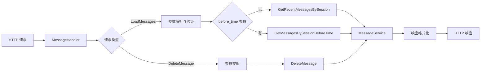

# `message_http_handler` 模块技术深度解析

## 1. 模块概述与问题空间

### 1.1 核心问题

在聊天应用系统中，消息历史管理是一个基础但关键的功能。当用户与智能代理进行对话时，需要能够：
- 查看之前的对话历史以保持上下文连贯性
- 删除不适当或不需要的消息
- 以高效的方式检索大量历史消息，避免一次性加载全部导致的性能问题

一个简单的消息历史管理方案可能只是提供一个简单的"获取全部消息"接口，但在实际生产环境中，这种方案会面临多个挑战：
- 当会话包含数百条消息时，传输全部消息会造成网络和客户端渲染的压力
- 无法支持"加载更多"的常见用户体验模式
- 缺少对时间范围的筛选能力
- 缺少适当的错误处理和日志记录

### 1.2 设计意图

`message_http_handler` 模块正是为了解决这些问题而设计的。它提供了两个核心功能：
1. **分页加载消息历史**：支持按会话ID、时间范围和数量限制来检索消息
2. **删除特定消息**：允许用户从会话中移除不需要的消息

这个模块位于 HTTP 接口层，它的职责是：
- 接收和验证 HTTP 请求
- 解析请求参数
- 调用业务逻辑服务（`MessageService`）
- 处理错误和格式化响应
- 记录关键操作日志

## 2. 架构与组件设计

### 2.1 核心组件

`message_http_handler` 模块的核心是 `MessageHandler` 结构体，它采用了依赖注入的设计模式：

```go
type MessageHandler struct {
    MessageService interfaces.MessageService // 消息服务接口
}
```

这种设计的优势在于：
- **解耦**：HTTP 处理层不直接依赖具体的业务逻辑实现，而是依赖于接口
- **可测试性**：在测试时可以轻松替换为 mock 实现
- **灵活性**：业务逻辑的变化不会直接影响 HTTP 处理层

### 2.2 组件协作图



### 2.3 数据流向

以 `LoadMessages` 接口为例，数据的完整流向是：
1. 客户端发送 HTTP GET 请求到 `/messages/{session_id}/load`
2. `MessageHandler.LoadMessages` 方法接收请求
3. 从 URL 路径和查询参数中提取 `session_id`、`limit` 和 `before_time`
4. 对参数进行清洗和日志记录（使用 `secutils.SanitizeForLog`）
5. 解析和验证参数：
   - 将 `limit` 转换为整数，无效时使用默认值 20
   - 如果提供了 `before_time`，则解析为 RFC3339Nano 格式的时间
6. 根据参数选择调用 `MessageService` 的不同方法
7. 处理服务层返回的结果或错误
8. 格式化 JSON 响应并返回给客户端

## 3. 核心功能详解

### 3.1 消息加载功能 (`LoadMessages`)

`LoadMessages` 方法是这个模块最复杂的功能，它支持两种使用场景：

#### 3.1.1 场景一：加载最近消息
当不提供 `before_time` 参数时，会加载会话中最近的 N 条消息（N 由 `limit` 参数决定）：

```go
if beforeTimeStr == "" {
    messages, err := h.MessageService.GetRecentMessagesBySession(ctx, sessionID, limitInt)
    // ...
}
```

这种模式适合：
- 首次进入会话时加载最新对话
- 快速查看最近的交互历史

#### 3.1.2 场景二：加载历史消息
当提供了 `before_time` 参数时，会加载该时间点之前的 N 条消息：

```go
beforeTime, err := time.Parse(time.RFC3339Nano, beforeTimeStr)
if err != nil {
    // 错误处理
}
messages, err := h.MessageService.GetMessagesBySessionBeforeTime(ctx, sessionID, beforeTime, limitInt)
```

这种模式适合：
- 实现"加载更多"功能，每次加载更早的一批消息
- 按时间范围查看历史对话

### 3.2 消息删除功能 (`DeleteMessage`)

`DeleteMessage` 方法相对简单，它的核心逻辑是：

```go
if err := h.MessageService.DeleteMessage(ctx, sessionID, messageID); err != nil {
    // 错误处理
}
```

这个方法：
- 从 URL 路径中提取 `session_id` 和消息 `id`
- 调用服务层执行删除操作
- 返回成功或失败的响应

## 4. 设计决策与权衡

### 4.1 参数解析与容错处理

在 `LoadMessages` 方法中，对 `limit` 参数的处理采用了容错策略：

```go
limitInt, err := strconv.Atoi(limit)
if err != nil {
    logger.Warnf(ctx, "Invalid limit value, using default value 20, input: %s", limit)
    limitInt = 20
}
```

**设计决策**：当 `limit` 参数无效时，使用默认值而不是返回错误。

**权衡分析**：
- ✅ **优点**：提高了接口的健壮性，客户端的小错误不会导致整个请求失败
- ❌ **缺点**：可能会掩盖客户端的问题，导致返回的数据量不符合预期

**适用场景**：这种处理方式适合非关键参数，对于关键参数（如 `session_id`），仍然需要严格验证。

### 4.2 时间格式选择

模块使用 RFC3339Nano 格式来表示时间：

```go
beforeTime, err := time.Parse(time.RFC3339Nano, beforeTimeStr)
```

**设计决策**：选择 RFC3339Nano 而不是更常见的 RFC3339。

**权衡分析**：
- ✅ **优点**：
  - 包含纳秒级精度，适合需要精确时间排序的场景
  - 是 Go 语言的标准时间格式之一，有良好的库支持
- ❌ **缺点**：
  - 格式较长，稍微增加了网络传输量
  - 对某些客户端来说可能不太熟悉

### 4.3 错误处理策略

模块中的错误处理遵循以下模式：

```go
if err != nil {
    logger.ErrorWithFields(ctx, err, nil)
    c.Error(errors.NewInternalServerError(err.Error()))
    return
}
```

**设计决策**：
1. 记录详细的错误日志
2. 向客户端返回通用的错误信息，而不是原始错误

**权衡分析**：
- ✅ **优点**：
  - 保护了系统内部细节，避免将敏感信息暴露给客户端
  - 为运维人员提供了详细的调试信息
- ❌ **缺点**：
  - 客户端可能无法获得足够的信息来诊断问题

## 5. 依赖关系与合约

### 5.1 依赖的服务

`MessageHandler` 依赖于 `interfaces.MessageService` 接口，该接口应该提供以下方法：
- `GetRecentMessagesBySession(ctx context.Context, sessionID string, limit int) ([]Message, error)`
- `GetMessagesBySessionBeforeTime(ctx context.Context, sessionID string, beforeTime time.Time, limit int) ([]Message, error)`
- `DeleteMessage(ctx context.Context, sessionID string, messageID string) error`

### 5.2 与其他模块的关系

- **上游依赖**：HTTP 路由层，将请求转发到 `MessageHandler`
- **下游依赖**：`MessageService` 实现，负责实际的业务逻辑和数据访问
- **相关模块**：
  - [session_lifecycle_management_http](http_handlers_and_routing-session_message_and_streaming_http_handlers-session_lifecycle_management_http.md) - 会话生命周期管理
  - [agent_streaming_endpoint_handler](http_handlers_and_routing-session_message_and_streaming_http_handlers-streaming_endpoints_and_sse_context.md) - 流式对话处理

## 6. 使用指南与最佳实践

### 6.1 接口使用示例

#### 加载最近消息
```http
GET /messages/session_123/load?limit=50
```

#### 加载历史消息
```http
GET /messages/session_123/load?limit=20&before_time=2023-10-01T12:00:00.000000000Z
```

#### 删除消息
```http
DELETE /messages/session_123/message_456
```

### 6.2 最佳实践

1. **合理设置 limit**：建议使用 20-50 作为默认值，根据客户端渲染能力调整
2. **实现"加载更多"模式**：在客户端记录最早一条消息的时间，作为下次请求的 `before_time`
3. **错误重试**：对于 5xx 错误，可以实现适当的重试逻辑
4. **缓存策略**：对于不常变化的历史消息，可以在客户端实现缓存

## 7. 注意事项与陷阱

### 7.1 时间格式问题

- 必须严格使用 RFC3339Nano 格式，包括纳秒部分
- 注意时区处理，建议统一使用 UTC 时间

### 7.2 参数验证

- `limit` 参数虽然有容错处理，但客户端仍应发送有效的整数值
- `session_id` 和消息 `id` 不能为空

### 7.3 性能考虑

- 避免设置过大的 `limit` 值，建议最大不超过 100
- 对于非常长的会话历史，考虑实现更高级的分页机制

### 7.4 安全注意事项

- 模块使用了 `secutils.SanitizeForLog` 来清洗日志中的敏感信息，这是一个良好的安全实践
- 实际部署时，应该在路由层添加认证和授权中间件，确保用户只能访问自己有权限的会话消息

## 8. 总结

`message_http_handler` 模块是一个设计良好的 HTTP 接口层组件，它通过清晰的职责划分、依赖注入和完善的错误处理，为聊天应用提供了可靠的消息历史管理功能。它的设计既考虑了功能的完整性，也考虑了性能和用户体验，是构建可扩展聊天系统的重要组成部分。
