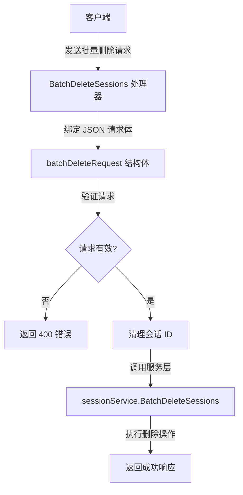

# session_batch_deletion_request_contract 模块技术深度解析

## 1. 问题定位与解决方案

### 问题背景
在多租户会话管理系统中，用户经常需要清理不再需要的会话历史。如果系统只提供单个会话删除功能，当用户需要删除几十个甚至上百个会话时，会面临以下问题：
- **用户体验差**：需要手动逐个点击删除，操作繁琐且耗时
- **API 调用效率低**：大量重复的 HTTP 请求会增加网络开销和服务器负载
- **事务一致性风险**：逐个删除无法保证原子性，如果中间某个删除失败，用户难以确定哪些已删除哪些未删除

### 解决方案
`session_batch_deletion_request_contract` 模块通过提供批量删除功能，一次性解决了上述问题。它定义了一个标准的批量删除请求契约，允许用户在单次 API 调用中指定多个会话 ID 进行删除操作。

## 2. 核心抽象与心智模型

### 核心数据结构
本模块的核心是 `batchDeleteRequest` 结构体，它是一个简洁而强大的抽象：

```go
type batchDeleteRequest struct {
    IDs []string `json:"ids" binding:"required,min=1"`
}
```

这个结构体体现了几个重要的设计决策：
- **契约优先**：明确定义了 API 的输入格式，作为前端和后端之间的契约
- **验证内置**：通过 `binding` 标签内置了基本的验证逻辑（必填且至少一个 ID）
- **简洁性**：只包含必要的字段，避免过度设计

### 心智模型
可以将批量删除操作想象成**快递批量投递**：
- 单个删除就像每次只寄一个快递，需要多次填写表单和排队
- 批量删除则是将多个快递打包成一个批次，一次提交给快递公司
- `batchDeleteRequest` 就是这个批次的"发货清单"，明确列出了要处理的所有项目
- 系统会像快递员处理包裹一样，逐个处理清单上的会话 ID

## 3. 数据流程与组件交互

### 架构流程图



### 详细流程解析

1. **请求接收与绑定**：
   - `BatchDeleteSessions` 方法作为 HTTP 处理器入口
   - 使用 `c.ShouldBindJSON(&req)` 将请求体绑定到 `batchDeleteRequest` 结构体
   - Gin 框架会自动根据 `binding` 标签进行验证

2. **ID 清理与安全处理**：
   - 对每个会话 ID 调用 `secutils.SanitizeForLog` 进行清理
   - 这是一个重要的安全措施，防止日志注入和其他安全问题
   - 过滤掉空字符串，确保只处理有效的会话 ID

3. **服务层调用**：
   - 将清理后的 ID 列表传递给 `sessionService.BatchDeleteSessions`
   - 服务层负责实际的删除逻辑和事务管理

4. **响应返回**：
   - 成功时返回包含 `success: true` 和提示消息的 JSON 响应
   - 失败时根据错误类型返回适当的 HTTP 状态码和错误信息

## 4. 设计决策与权衡

### 设计决策 1：使用结构体而非原始数组
**决策**：定义 `batchDeleteRequest` 结构体包装 ID 数组，而不是直接接受 `[]string`。

**原因**：
- **前向兼容性**：如果将来需要添加其他参数（如 `force` 标志或 `deleteBefore` 时间戳），可以在不破坏现有 API 的情况下扩展结构体
- **自文档化**：结构体字段标签提供了内置的验证和文档
- **一致性**：与系统中其他 API 请求保持相同的设计风格

### 设计决策 2：在处理器层进行 ID 清理
**决策**：在 HTTP 处理器层而非服务层进行 ID 清理。

**权衡**：
- **优点**：尽早清理恶意输入，防止其传播到系统深层
- **优点**：在记录日志前就已经清理了 ID，提高了日志安全性
- **缺点**：如果有其他调用路径也使用 `sessionService.BatchDeleteSessions`，需要重复清理逻辑

**缓解措施**：服务层也应该有自己的验证逻辑，形成多层防护。

### 设计决策 3：不返回详细的删除结果
**决策**：批量删除成功时只返回通用成功消息，不返回每个 ID 的删除状态。

**权衡**：
- **优点**：简化了 API 设计和响应处理
- **优点**：提高了性能，不需要收集和传输每个 ID 的状态
- **缺点**：客户端无法精确知道哪些 ID 成功删除，哪些失败
- **缺点**：如果部分 ID 不存在，整个请求仍会返回成功

**设计 rationale**：在大多数使用场景下，用户更关心"整体是否成功"而非"每个会话的状态"。如果需要更细粒度的控制，可以使用单个删除 API。

## 5. 依赖关系分析

### 入站依赖
- **HTTP 框架**：依赖 Gin 框架的 `Context` 对象处理请求和响应
- **验证系统**：隐式依赖 Gin 的绑定验证机制
- **会话服务**：依赖 `interfaces.SessionService` 接口的 `BatchDeleteSessions` 方法

### 出站调用
- **安全工具**：调用 `secutils.SanitizeForLog` 清理会话 ID
- **日志系统**：使用 `logger` 记录请求处理过程
- **错误处理**：使用 `errors` 包创建标准化的错误响应

### 数据契约
- **输入**：JSON 格式 `{"ids": ["session-id-1", "session-id-2"]}`
- **输出**：成功时 `{"success": true, "message": "Sessions deleted successfully"}`
- **错误**：失败时返回 `errors.AppError` 格式的错误响应

## 6. 使用指南与最佳实践

### 客户端使用示例

```javascript
// 批量删除会话
async function batchDeleteSessions(sessionIds) {
    const response = await fetch('/sessions/batch', {
        method: 'DELETE',
        headers: {
            'Content-Type': 'application/json',
            'Authorization': 'Bearer ' + authToken
        },
        body: JSON.stringify({
            ids: sessionIds
        })
    });
    
    return response.json();
}

// 使用示例
batchDeleteSessions(['session-123', 'session-456', 'session-789'])
    .then(result => console.log('删除成功:', result))
    .catch(error => console.error('删除失败:', error));
```

### 最佳实践

1. **批次大小控制**：
   - 建议单次请求的 ID 数量不超过 100 个
   - 过大的批次可能导致请求超时或数据库锁竞争

2. **错误处理**：
   - 客户端应该处理 400（无效请求）和 500（服务器错误）状态码
   - 对于 500 错误，建议采用指数退避策略重试

3. **安全考虑**：
   - 始终使用 HTTPS 传输敏感数据
   - 确保实施了适当的认证和授权检查

## 7. 边缘情况与注意事项

### 已知边缘情况

1. **空 ID 列表**：
   - 如果请求中的 `ids` 数组为空，验证会失败并返回 400 错误
   - 如果所有 ID 经过清理后都变成空字符串，也会返回 400 错误

2. **重复 ID**：
   - 系统不会去重，重复的 ID 会被传递给服务层
   - 服务层的实现决定了如何处理重复 ID

3. **部分 ID 不存在**：
   - 当前实现中，如果部分 ID 不存在，整个请求仍会返回成功
   - 这是一个设计选择，而非技术限制

### 扩展注意事项

如果未来需要修改此模块，请注意：
- 保持向后兼容性，不要改变现有字段的名称或类型
- 添加新字段时使用可选字段（不设置 `binding:"required"`）
- 考虑添加幂等性支持，使重复请求安全
- 如果需要更细粒度的删除结果，可以考虑添加一个可选参数来控制响应详细程度

## 8. 相关模块参考

- [session_lifecycle_http_handler](http_handlers_and_routing-session_message_and_streaming_http_handlers-session_lifecycle_management_http-session_lifecycle_http_handler.md) - 会话生命周期 HTTP 处理器
- [session_lifecycle_request_contracts](http_handlers_and_routing-session_message_and_streaming_http_handlers-session_lifecycle_management_http-session_lifecycle_request_contracts.md) - 会话生命周期请求契约
- [core_domain_types_and_interfaces](core_domain_types_and_interfaces.md) - 核心领域类型和接口定义
