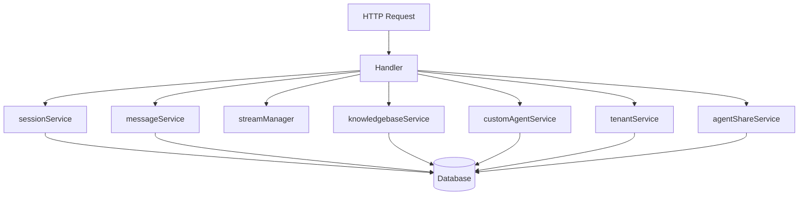

# Session Lifecycle HTTP Handler 模块技术深度解析

## 1. 模块概述

### 问题空间

在构建多租户对话式 AI 系统时，会话管理是一个核心挑战。早期的会话实现通常与会话特定的配置（如知识库绑定、检索策略等）紧密耦合，这导致了几个关键问题：

1. **灵活性不足**：用户无法在同一会话中切换不同的配置或知识库
2. **状态管理复杂**：会话对象承载了过多的业务逻辑和状态信息
3. **扩展性受限**：添加新功能需要修改会话核心结构

`session_lifecycle_http_handler` 模块通过将会话简化为"轻量级容器"解决了这些问题——现在的会话只存储基本信息（租户 ID、标题、描述），而所有的配置都在查询时由自定义代理提供。

### 核心价值

这个模块是 HTTP 层与会话生命周期业务逻辑之间的桥梁，它：
- 提供会话 CRUD 操作的 RESTful API
- 处理请求验证、租户隔离和错误转换
- 确保会话操作的安全性和一致性

## 2. 架构设计

### 核心抽象

可以将 `Handler` 结构想象成一个**会话管理的前台接待员**：
- 它不直接管理会话数据（那是后台服务的工作）
- 它负责验证来访者的身份（租户 ID）
- 它将请求转交给合适的后台服务处理
- 它将处理结果整理后返回给客户端

### 组件关系图



### 数据流向

1. **请求接收**：Gin 框架将 HTTP 请求路由到对应的 Handler 方法
2. **上下文提取**：从 Gin 上下文中提取租户 ID 等关键信息
3. **参数验证**：绑定并验证请求参数
4. **服务调用**：将业务逻辑委托给相应的服务接口
5. **响应处理**：将服务层的结果转换为标准的 HTTP 响应

## 3. 核心组件深度解析

### Handler 结构体

`Handler` 是整个模块的核心，它采用了**依赖注入**的设计模式，通过构造函数接收所有需要的依赖。这种设计带来了几个关键优势：

1. **可测试性**：可以轻松注入 mock 依赖进行单元测试
2. **解耦**：Handler 不依赖具体实现，只依赖接口
3. **明确性**：通过构造函数签名清晰地表达了模块的依赖关系

**设计洞察**：注意到 Handler 中注入了多个服务，但在当前实现中只使用了 `sessionService`。这是一个前瞻性的设计——为未来可能需要这些服务的功能预留了扩展点，同时保持了接口的稳定性。

### CreateSession 方法

这是模块中最具代表性的方法，展示了完整的请求处理流程：

1. **参数绑定**：使用 Gin 的 `ShouldBindJSON` 方法将请求体绑定到 `CreateSessionRequest` 结构
2. **租户验证**：从 Gin 上下文中提取租户 ID，这是多租户系统的关键安全机制
3. **会话创建**：构建一个只包含基本信息的 `types.Session` 对象
4. **服务委托**：调用 `sessionService.CreateSession` 处理实际的持久化逻辑
5. **响应格式化**：将结果包装成标准的 JSON 响应格式

**关键设计决策**：注释中明确提到 "Sessions are now knowledge-base-independent"，这标志着架构从"配置绑定"到"查询驱动"的重要转变。这种设计使得同一会话可以用于不同的知识库和配置，大大提高了系统的灵活性。

### 错误处理模式

模块采用了统一的错误处理策略：
- 使用自定义的 `errors.AppError` 类型包装错误
- 将错误映射到合适的 HTTP 状态码（400、401、404、500 等）
- 通过 `logger` 记录详细的错误信息，便于调试和监控

这种模式确保了 API 响应的一致性，同时为开发者提供了足够的调试信息。

### 安全性考虑

模块中体现了多层安全措施：
- **租户隔离**：所有操作都基于租户 ID 进行，防止跨租户数据访问
- **输入清理**：使用 `secutils.SanitizeForLog` 清理会话 ID，防止日志注入攻击
- **认证检查**：从上下文中验证租户 ID 的存在，确保请求的合法性

## 4. 依赖关系分析

### 依赖的服务接口

Handler 依赖以下关键接口（定义在 `types/interfaces` 包中）：

1. **SessionService**：核心依赖，处理所有会话的 CRUD 操作
2. **MessageService**：预留依赖，未来可能用于会话消息管理
3. **StreamManager**：预留依赖，用于处理流式响应
4. **KnowledgeBaseService**：预留依赖，可能用于知识库相关操作
5. **CustomAgentService**：预留依赖，用于自定义代理配置
6. **TenantService**：预留依赖，用于租户信息管理
7. **AgentShareService**：预留依赖，用于处理共享代理

### 调用者

这个 Handler 通常由 Gin 路由引擎调用，在应用启动时注册到 HTTP 路由器上。

### 数据契约

- **输入**：使用专门的请求结构（如 `CreateSessionRequest`、`batchDeleteRequest`）
- **输出**：统一的 JSON 响应格式，包含 `success` 字段和可选的 `data`、`message` 字段
- **错误**：使用 `errors.AppError` 类型，包含错误码和错误信息

## 5. 设计决策与权衡

### 1. 轻量级会话 vs 功能丰富的会话

**决策**：选择了轻量级会话设计，只存储基本信息

**理由**：
- 提高了灵活性：同一会话可以用于不同的场景
- 简化了状态管理：会话对象不再需要处理复杂的配置更新
- 更好的扩展性：新功能可以通过查询参数或代理配置添加，无需修改会话结构

**权衡**：
- 每次查询都需要提供完整配置，增加了请求的 payload 大小
- 某些需要跨请求保持的配置状态需要在客户端管理

### 2. 依赖注入 vs 直接依赖

**决策**：采用依赖注入模式

**理由**：
- 提高了可测试性
- 降低了模块间的耦合度
- 使依赖关系更加明确

**权衡**：
- 增加了构造函数的复杂度
- 需要额外的初始化代码来组装所有依赖

### 3. 接口依赖 vs 具体实现依赖

**决策**：所有依赖都基于接口

**理由**：
- 可以轻松切换实现而不影响 Handler 代码
- 便于进行单元测试（可以使用 mock 实现）
- 符合"面向接口编程"的设计原则

**权衡**：
- 增加了接口定义的维护成本
- 有时需要额外的转换代码

### 4. 集中错误处理 vs 分散错误处理

**决策**：采用集中的错误处理模式

**理由**：
- 确保了 API 响应的一致性
- 简化了错误日志记录
- 便于统一的错误监控和分析

**权衡**：
- 需要在每个方法中重复相似的错误处理代码
- 可能掩盖一些特定的错误上下文

## 6. 使用指南与最佳实践

### 基本使用

Handler 的使用非常直观，通常在应用启动时进行初始化：

```go
// 初始化依赖
sessionService := NewSessionService(...)
messageService := NewMessageService(...)
// ... 其他依赖

// 创建 Handler
handler := session.NewHandler(
    sessionService,
    messageService,
    streamManager,
    config,
    knowledgebaseService,
    customAgentService,
    tenantService,
    agentShareService,
)

// 注册路由
router.POST("/sessions", handler.CreateSession)
router.GET("/sessions/:id", handler.GetSession)
// ... 其他路由
```

### 扩展点

虽然当前实现相对简单，但 Handler 的设计为未来扩展预留了空间：

1. **添加新的会话操作**：可以在 Handler 中添加新方法来支持额外的会话功能
2. **使用预留依赖**：可以利用已注入但尚未使用的服务来增强功能
3. **中间件集成**：可以通过 Gin 中间件添加横切关注点（如缓存、速率限制等）

### 常见陷阱

1. **忘记设置租户上下文**：所有方法都依赖从 Gin 上下文中提取的租户 ID，确保在调用这些方法之前设置了正确的上下文
2. **忽略输入验证**：虽然 Handler 进行了基本的参数验证，但业务逻辑的验证应该在服务层完成
3. **过度扩展 Handler**：Handler 应该保持简洁，只负责 HTTP 层的职责，避免将过多的业务逻辑放入其中

## 7. 边缘情况与注意事项

### 并发考虑

Handler 本身是无状态的，所有的状态都存储在服务层和数据库中，因此它可以安全地处理并发请求。但需要注意：

- 确保依赖的服务实现是线程安全的
- 对于更新和删除操作，考虑使用乐观锁或悲观锁来防止并发冲突

### 数据一致性

在批量删除操作中（`BatchDeleteSessions`），当前实现没有提供部分成功的机制——要么全部删除成功，要么全部失败。这是一个设计决策，简化了错误处理，但在某些场景下可能需要更细粒度的控制。

### 性能考虑

- 对于 `GetSessionsByTenant` 方法，确保数据库查询有合适的索引支持
- 考虑为频繁访问的会话添加缓存层（虽然当前实现没有）
- 批量操作应该考虑适当的批次大小限制，防止单次请求处理过多数据

## 8. 相关模块参考

- [Session Lifecycle API](sdk_client_library-agent_session_and_message_api-session_lifecycle_api.md)：定义了会话相关的数据结构和 API 契约
- [Session Conversation Lifecycle Service](application_services_and_orchestration-conversation_context_and_memory_services-session_conversation_lifecycle_service.md)：实现了会话生命周期的业务逻辑
- [Routing Middleware and Background Task Wiring](http_handlers_and_routing-routing_middleware_and_background_task_wiring.md)：处理 HTTP 路由和中间件的模块

---

通过这个模块，我们看到了一个精心设计的 HTTP 处理层是如何平衡简洁性和扩展性的。它的核心价值不在于复杂的功能实现，而在于通过清晰的职责划分和前瞻性的设计，为整个会话管理系统奠定了灵活、可维护的基础。
