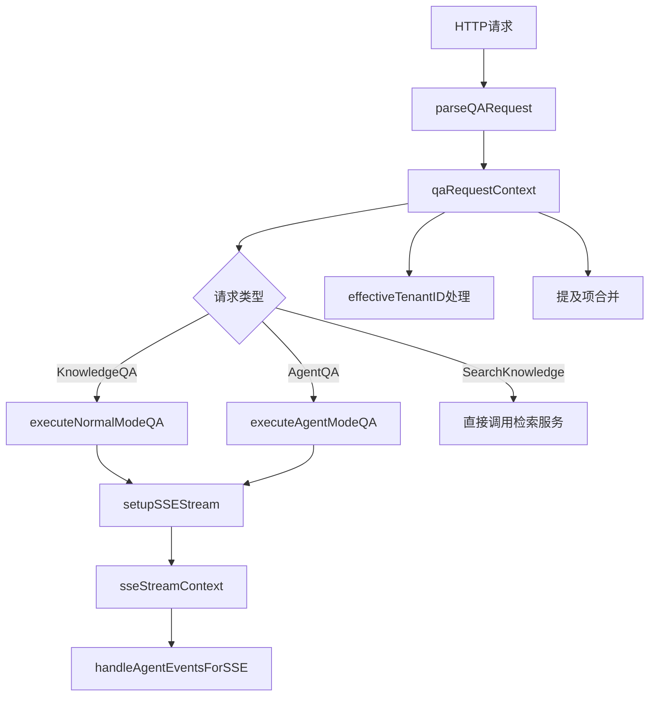

# qa_request_runtime_context 模块技术深度解析

## 1. 模块概览与问题定位

`qa_request_runtime_context` 模块是问答请求处理的核心上下文管理组件，解决了**问答请求处理中多阶段、多组件、多上下文状态传递与管理**的复杂问题。

### 核心问题域

在处理知识问答和 Agent 问答时，系统面临以下挑战：
1. **上下文一致性**：请求从 HTTP 接入层经过解析、验证、检索、生成等多个阶段，需要保持一致的上下文信息
2. **多组件协作**：会话服务、Agent 服务、知识检索服务、流式响应处理等多个组件需要共享请求状态
3. **租户隔离与共享**：处理共享 Agent 时需要正确解析和使用源租户的资源（模型、知识库、MCP 服务）
4. **用户意图解析**：正确处理用户在输入中 `@` 提及的知识库和文件，确保检索范围符合用户预期
5. **请求状态追踪**：跨异步调用和流式响应保持请求标识、会话关联等状态

### 设计洞察

该模块的核心设计思想是**将问答请求的所有相关状态封装在一个单一的上下文对象中**，通过"一次解析，多处使用"的模式，避免重复解析和状态不一致问题。这类似于在建筑工地上建立一个"中央工具箱"，所有工人都从这里取用工具和材料，确保整个工程使用统一的规格和标准。

## 2. 核心架构与组件角色

### 架构图



### 核心组件

#### 2.1 qaRequestContext 结构体

`qaRequestContext` 是整个模块的核心，它封装了处理问答请求所需的全部状态信息。

```go
type qaRequestContext struct {
    ctx               context.Context
    c                 *gin.Context
    sessionID         string
    requestID         string
    query             string
    session           *types.Session
    customAgent       *types.CustomAgent
    assistantMessage  *types.Message
    knowledgeBaseIDs  []string
    knowledgeIDs      []string
    summaryModelID    string
    webSearchEnabled  bool
    enableMemory      bool
    mentionedItems    types.MentionedItems
    effectiveTenantID uint64
}
```

**设计意图**：
- 将所有请求相关状态集中管理，避免在函数间传递大量参数
- 确保状态的一致性和完整性，防止部分状态丢失或不一致
- 为后续处理阶段提供统一的访问接口

#### 2.2 parseQARequest 函数

这是模块的入口函数，负责解析和验证 QA 请求，构建完整的 `qaRequestContext` 对象。

**主要职责**：
1. 提取并验证会话 ID
2. 解析请求体
3. 验证查询内容
4. 获取会话信息
5. 解析和处理自定义 Agent（包括共享 Agent 的有效租户解析）
6. 合并提及项到检索范围
7. 构建完整的请求上下文对象

**关键设计点**：
- **共享 Agent 处理**：当使用共享 Agent 时，正确解析源租户 ID（`effectiveTenantID`），确保后续使用源租户的资源
- **提及项合并**：将用户在查询中 `@` 提及的知识库和文件合并到检索范围，确保用户意图得到准确执行
- **日志安全**：使用 `secutils.SanitizeForLog` 对敏感信息进行脱敏处理

#### 2.3 sseStreamContext 结构体与 setupSSEStream 函数

负责设置 SSE（Server-Sent Events）流式响应的上下文，为后续的流式输出做准备。

**主要职责**：
1. 设置 SSE 响应头
2. 写入初始的 agent_query 事件
3. 处理有效租户的上下文传递（当使用共享 Agent 时）
4. 创建事件总线和可取消的异步上下文
5. 设置停止事件处理器和流处理器
6. 启动异步标题生成（如果需要）

**设计意图**：
- 分离 HTTP 层与流式处理层，保持架构清晰
- 使用事件总线模式实现组件间的松耦合通信
- 正确处理共享 Agent 场景下的租户上下文传递

## 3. 数据流向与处理流程

### 3.1 完整请求处理流程

以 `KnowledgeQA` 为例，数据流向如下：

1. **请求接入**：HTTP 请求到达 `KnowledgeQA` 处理函数
2. **解析验证**：调用 `parseQARequest` 解析请求，构建 `qaRequestContext`
3. **消息创建**：创建用户消息和助手消息
4. **流设置**：调用 `setupSSEStream` 设置 SSE 流上下文
5. **事件监听**：注册 `EventAgentFinalAnswer` 事件处理器
6. **异步执行**：在 goroutine 中调用 `sessionService.KnowledgeQA`
7. **流式处理**：在主 goroutine 中调用 `handleAgentEventsForSSE` 处理并发送 SSE 事件
8. **完成处理**：收到最终答案后，更新助手消息状态，发送完成事件

### 3.2 提及项合并流程

这是一个关键的用户体验优化设计，确保用户在查询中 `@` 提及的内容能够被正确纳入检索范围。

```
用户输入: "请帮我查找 @产品文档 中关于API的说明"
         ↓
parseQARequest 解析 MentionedItems
         ↓
提取类型为 "kb" 的项 → 合并到 knowledgeBaseIDs
提取类型为 "file" 的项 → 合并到 knowledgeIDs
         ↓
确保无重复（使用 map 去重）
         ↓
记录合并日志，便于调试
```

**设计意图**：
- 解决用户只 `@` 提及但未在侧边栏选择知识库时检索不到的问题
- 保持用户体验的一致性，符合用户的直观预期
- 通过去重处理避免重复检索

### 3.3 有效租户处理流程

当使用共享 Agent 时，需要正确解析和使用源租户的资源。

```
请求中包含 agent_id
         ↓
检查是否为共享 Agent（通过 agentShareService）
         ↓
是 → 从共享 Agent 信息中获取 source tenant ID → 设置为 effectiveTenantID
否 → 使用当前上下文中的租户
         ↓
在 setupSSEStream 中：
如果 effectiveTenantID 不为 0 → 创建包含有效租户信息的新上下文
         ↓
后续的模型、知识库、MCP 服务解析都使用这个有效租户
```

**设计意图**：
- 实现租户资源的安全共享，同时保持租户隔离
- 确保共享 Agent 使用源租户的配置和资源，而不是当前租户的
- 在消息更新等操作中，正确使用会话所属的租户（而不是有效租户）

## 4. 关键设计决策与权衡

### 4.1 集中式上下文管理 vs 分散式参数传递

**选择**：集中式上下文管理（使用 `qaRequestContext` 结构体）

**原因**：
- 问答处理涉及 10+ 个状态字段，分散传递会导致函数签名过长且难以维护
- 集中管理确保状态的一致性，避免部分状态丢失或不一致
- 便于添加新的状态字段，不需要修改所有相关函数的签名

**权衡**：
- 优点：代码更简洁，状态管理更一致，扩展性更好
- 缺点：`qaRequestContext` 可能变得过大，包含不相关的状态；需要注意字段的访问权限和初始化

### 4.2 显式提及项合并 vs 隐式处理

**选择**：显式合并到检索范围

**原因**：
- 用户 `@` 提及某个知识库或文件时，明确期望系统使用该内容
- 解决了用户只 `@` 提及但未在侧边栏选择时检索不到的常见问题
- 提供了良好的用户体验，符合直观预期

**权衡**：
- 优点：用户体验更好，减少了用户困惑
- 缺点：需要额外的合并逻辑；如果用户误 `@` 了不想使用的内容，可能会检索到不相关的结果

### 4.3 有效租户分离 vs 统一使用会话租户

**选择**：分离有效租户（用于资源解析）和会话租户（用于消息存储等操作）

**原因**：
- 共享 Agent 需要使用源租户的模型、知识库等资源
- 但会话和消息属于当前用户的租户，需要存储在当前租户的空间中
- 确保资源访问和数据存储的正确性和隔离性

**权衡**：
- 优点：正确实现了共享 Agent 功能，保持了租户隔离
- 缺点：增加了复杂度，需要在不同场景下使用正确的租户 ID；容易混淆

### 4.4 事件总线模式 vs 直接函数调用

**选择**：使用事件总线（`event.EventBus`）进行组件间通信

**原因**：
- 问答处理涉及多个异步组件，需要松耦合的通信方式
- 事件总线支持多订阅者，便于扩展功能
- 符合流式处理的特性，能够实时推送状态更新

**权衡**：
- 优点：组件间解耦，扩展性好，支持异步处理
- 缺点：增加了调试复杂度；事件类型和数据结构需要仔细设计

## 5. 代码深度解析

### 5.1 parseQARequest 函数深度解析

```go
func (h *Handler) parseQARequest(c *gin.Context, logPrefix string) (*qaRequestContext, *CreateKnowledgeQARequest, error) {
    ctx := logger.CloneContext(c.Request.Context())
    // ...
}
```

**关键实现细节**：

1. **上下文克隆**：使用 `logger.CloneContext` 克隆请求上下文，确保日志上下文的正确传递

2. **Agent 解析逻辑**：
   - 首先尝试通过 `agentShareService` 获取共享 Agent
   - 如果获取到共享 Agent，设置 `effectiveTenantID` 为源租户 ID
   - 否则，尝试获取用户自己的 Agent
   - 即使获取 Agent 失败，也继续处理，使用默认配置

3. **提及项合并**：
   - 使用两个 map（`kbIDSet` 和 `knowledgeIDSet`）进行去重
   - 区分 "kb" 和 "file" 类型，分别合并到对应的列表
   - 记录详细的合并日志，便于调试

4. **安全日志记录**：
   - 所有敏感信息都经过 `secutils.SanitizeForLog` 或 `secutils.SanitizeForLogArray` 处理
   - 防止敏感信息泄露到日志中

### 5.2 setupSSEStream 函数深度解析

```go
func (h *Handler) setupSSEStream(reqCtx *qaRequestContext, generateTitle bool) *sseStreamContext {
    // 设置 SSE 头
    setSSEHeaders(reqCtx.c)
    
    // 写入初始事件
    h.writeAgentQueryEvent(reqCtx.ctx, reqCtx.sessionID, reqCtx.assistantMessage.ID)
    
    // 处理有效租户上下文
    baseCtx := reqCtx.ctx
    if reqCtx.effectiveTenantID != 0 && h.tenantService != nil {
        // ... 创建包含有效租户的新上下文
    }
    
    // 创建事件总线和可取消上下文
    eventBus := event.NewEventBus()
    asyncCtx, cancel := context.WithCancel(logger.CloneContext(baseCtx))
    
    // ... 设置事件处理器
}
```

**关键实现细节**：

1. **有效租户上下文处理**：
   - 当使用共享 Agent 时，创建一个新的上下文，包含有效租户 ID 和租户信息
   - 这个上下文用于后续的资源解析（模型、知识库、MCP）
   - 但在更新消息等操作时，仍然使用会话所属的租户

2. **事件总线设置**：
   - 创建新的事件总线实例，用于当前请求的事件通信
   - 设置停止事件处理器，允许用户中断请求处理
   - 设置流处理器，处理并发送 SSE 事件

3. **异步标题生成**：
   - 如果会话没有标题且需要生成，启动异步标题生成
   - 使用与对话相同的模型（如果有自定义 Agent）
   - 通过事件总线发送标题生成进度和结果

### 5.3 完成处理逻辑

在 `executeNormalModeQA` 中的完成处理值得特别关注：

```go
streamCtx.eventBus.On(event.EventAgentFinalAnswer, func(ctx context.Context, evt event.Event) error {
    // ... 处理答案内容
    if data.Done {
        // 防止重复处理
        if completionHandled {
            return nil
        }
        completionHandled = true
        
        // 使用会话的租户更新消息
        updateCtx := context.WithValue(streamCtx.asyncCtx, types.TenantIDContextKey, reqCtx.session.TenantID)
        h.completeAssistantMessage(updateCtx, streamCtx.assistantMessage)
        
        // 发送完成事件
        streamCtx.eventBus.Emit(streamCtx.asyncCtx, event.Event{
            Type:      event.EventAgentComplete,
            // ...
        })
    }
    return nil
})
```

**设计要点**：

1. **防止重复处理**：使用 `completionHandled` 标志确保完成逻辑只执行一次
2. **租户正确使用**：在更新消息时，明确使用会话所属的租户 ID，而不是有效租户 ID
3. **事件顺序**：先更新消息状态，再发送完成事件，确保状态一致性

## 6. 依赖分析

### 6.1 核心依赖

| 依赖模块 | 用途 | 耦合度 |
|---------|------|--------|
| [session_service](...) | 会话管理、知识问答、Agent 问答 | 高 |
| [custom_agent_service](...) | 获取自定义 Agent 配置 | 中 |
| [agent_share_service](...) | 解析共享 Agent | 中 |
| [message_service](...) | 消息创建和更新 | 中 |
| [tenant_service](...) | 获取租户信息 | 低 |
| [event_bus](platform_infrastructure_and_runtime-event_bus_and_agent_runtime_event_contracts.md) | 事件总线，组件间通信 | 高 |
| [types](core_domain_types_and_interfaces.md) | 核心领域类型 | 高 |

### 6.2 被依赖情况

该模块主要被以下 HTTP 处理函数依赖：
- `KnowledgeQA`：知识问答端点
- `AgentQA`：Agent 问答端点

### 6.3 数据契约

**输入契约**：
- `CreateKnowledgeQARequest`：知识问答和 Agent 问答的请求体
- `SearchKnowledgeRequest`：知识搜索的请求体

**输出契约**：
- SSE 流事件（通过 `handleAgentEventsForSSE` 发送）
- JSON 响应（仅 `SearchKnowledge`）

## 7. 使用指南与最佳实践

### 7.1 扩展请求处理流程

当需要在问答请求处理流程中添加新的功能时：

1. **在 `qaRequestContext` 中添加必要的字段**（如果需要状态管理）
2. **在 `parseQARequest` 中进行必要的解析和初始化**
3. **在相应的处理函数（`executeNormalModeQA` 或 `executeAgentModeQA`）中使用新字段**
4. **考虑通过事件总线与其他组件通信**，而不是直接调用

### 7.2 处理租户上下文

当添加涉及资源访问或数据存储的功能时：

- **资源解析**（模型、知识库、MCP）：使用 `asyncCtx`，它可能包含 `effectiveTenantID`
- **数据存储**（消息、会话）：使用会话所属的租户（`reqCtx.session.TenantID`）
- 当不确定时，查看现有代码中类似操作是如何处理的

### 7.3 调试技巧

- 查看 `提及项合并` 的日志，确认检索范围是否正确
- 查看有效租户的日志，确认共享 Agent 是否正确解析
- 检查 `qaRequestContext` 的所有字段是否正确初始化
- 使用事件总线的调试功能，查看事件流是否正常

## 8. 边缘情况与注意事项

### 8.1 常见陷阱

1. **混淆有效租户和会话租户**：在错误的场景使用错误的租户 ID，可能导致资源访问失败或数据存储到错误的位置
2. **忘记初始化 `qaRequestContext` 字段**：导致后续处理时出现空指针异常
3. **在事件处理器中进行阻塞操作**：可能导致事件处理延迟或死锁
4. **忽略提及项合并逻辑**：在新的处理流程中可能导致用户体验不一致

### 8.2 边缘情况

1. **Agent 解析失败**：代码会记录警告并继续使用默认配置，需要确保后续处理能够处理 `customAgent` 为 `nil` 的情况
2. **有效租户获取失败**：即使设置了 `effectiveTenantID`，如果获取租户信息失败，仍然使用原始上下文
3. **并发事件处理**：需要注意 `completionHandled` 等标志的线程安全性（当前实现假设事件是顺序处理的）
4. **请求中断**：需要确保所有异步操作都能正确响应上下文取消

### 8.3 性能考虑

- `qaRequestContext` 的创建和解析是在请求处理的早期同步进行的，需要保持高效
- 提及项合并使用 map 去重，对于大量 ID 的情况，性能可以接受
- 事件总线的事件处理应该尽可能快，避免阻塞流式输出

## 9. 总结

`qa_request_runtime_context` 模块是问答请求处理的"神经中枢"，它通过集中式上下文管理解决了多阶段、多组件协作的复杂性。其核心价值在于：

1. **统一状态管理**：确保整个请求处理流程使用一致的状态
2. **正确处理共享资源**：通过有效租户机制实现安全的资源共享
3. **优化用户体验**：通过提及项合并确保用户意图得到准确执行
4. **支持异步流式处理**：通过事件总线实现松耦合的组件通信

该模块的设计体现了"关注点分离"和"高内聚、低耦合"的原则，同时也考虑了实际业务场景中的复杂性（如共享 Agent、用户体验优化等）。理解这个模块对于理解整个问答处理流程至关重要。
