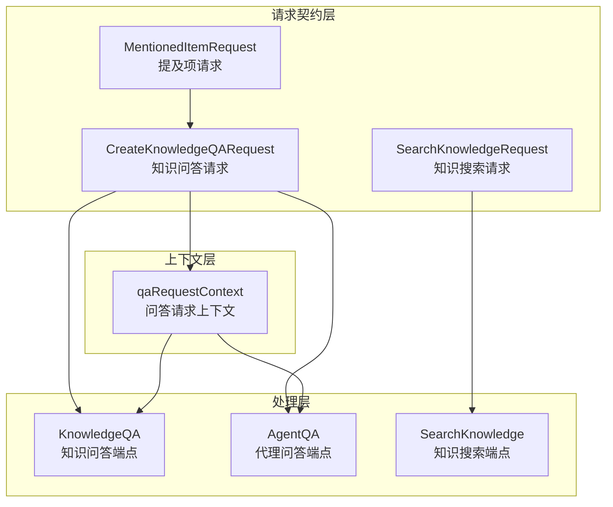

# session_qa_and_search_request_contracts 模块深度解析

## 1. 模块概览

这个模块是系统问答和搜索功能的"请求入口守门人"。它负责定义和处理所有与知识问答、知识搜索相关的 HTTP 请求契约，以及在请求处理过程中所需的运行时上下文。

想象一下这个模块就像是一家高级餐厅的前台接待：
- 它定义了菜单（请求结构）
- 它验证顾客的点餐（请求验证）
- 它为每个订单创建一个专属的服务上下文（qaRequestContext）
- 它确保订单信息准确传递给后厨（业务逻辑层）

### 核心问题解决

在没有这个模块之前，问答和搜索请求的处理可能会面临以下问题：
1. **请求格式混乱**：不同端点可能有不同的请求结构，导致客户端难以适配
2. **上下文丢失**：请求处理过程中需要的会话信息、代理配置等数据难以统一管理
3. **功能割裂**：知识搜索和问答功能可能有不同的处理逻辑，但实际上它们共享很多核心组件
4. **向后兼容性差**：API 演进时容易破坏现有客户端

这个模块通过统一的请求契约和上下文管理机制，优雅地解决了这些问题。

## 2. 架构设计

### 2.1 核心组件关系图



### 2.2 架构详解

这个模块采用了清晰的三层架构：

1. **请求契约层**：定义了三种核心请求结构
   - `CreateKnowledgeQARequest`：用于知识问答，支持 LLM 总结
   - `SearchKnowledgeRequest`：用于纯知识搜索，不涉及 LLM
   - `MentionedItemRequest`：表示用户在查询中 @ 提及的知识库或文件

2. **上下文层**：`qaRequestContext` 是整个模块的核心
   - 它封装了请求处理过程中所需的所有数据
   - 避免了在函数间传递大量参数
   - 提供了统一的数据访问点

3. **处理层**：包含三个主要的 HTTP 处理函数
   - `KnowledgeQA`：处理标准知识问答请求
   - `AgentQA`：处理基于代理的智能问答请求
   - `SearchKnowledge`：处理纯知识搜索请求

### 2.3 数据流向

让我们追踪一个典型的知识问答请求的数据流向：

1. **请求接收**：HTTP 请求到达 `KnowledgeQA` 或 `AgentQA` 端点
2. **请求解析**：`parseQARequest` 解析 JSON 并验证必填字段
3. **上下文构建**：创建 `qaRequestContext`，合并知识库 ID 和提及项
4. **会话获取**：从会话服务获取会话信息
5. **代理解析**：如果提供了代理 ID，解析自定义代理配置
6. **执行处理**：根据模式调用 `executeNormalModeQA` 或 `executeAgentModeQA`
7. **流式响应**：通过 SSE 流式返回结果

## 3. 核心组件深度解析

### 3.1 CreateKnowledgeQARequest - 知识问答请求契约

这个结构体定义了知识问答 API 的请求格式，它是客户端与服务器交互的"语言规范"。

```go
type CreateKnowledgeQARequest struct {
    Query            string                 `json:"query" binding:"required"`
    KnowledgeBaseIDs []string               `json:"knowledge_base_ids"`
    KnowledgeIds     []string               `json:"knowledge_ids"`
    AgentEnabled     bool                   `json:"agent_enabled"`
    AgentID          string                 `json:"agent_id"`
    WebSearchEnabled bool                   `json:"web_search_enabled"`
    SummaryModelID   string                 `json:"summary_model_id"`
    MentionedItems   []MentionedItemRequest `json:"mentioned_items"`
    DisableTitle     bool                   `json:"disable_title"`
    EnableMemory     bool                   `json:"enable_memory"`
}
```

**设计亮点**：
- **灵活的知识库选择**：同时支持 `KnowledgeBaseIDs`（知识库级别）和 `KnowledgeIds`（文件级别）
- **代理集成**：通过 `AgentID` 和 `AgentEnabled` 无缝集成自定义代理
- **提及项支持**：`MentionedItems` 允许用户在查询中 @ 提及特定的知识库或文件
- **可选的增强功能**：`WebSearchEnabled` 和 `EnableMemory` 提供了额外的功能开关

**设计权衡**：
- 优点：灵活性高，一个请求结构支持多种使用场景
- 缺点：结构相对复杂，客户端需要理解多个字段的含义和交互

### 3.2 SearchKnowledgeRequest - 知识搜索请求契约

这个结构体专门用于不需要 LLM 总结的纯知识搜索场景。

```go
type SearchKnowledgeRequest struct {
    Query            string   `json:"query" binding:"required"`
    KnowledgeBaseID  string   `json:"knowledge_base_id"`  // 向后兼容
    KnowledgeBaseIDs []string `json:"knowledge_base_ids"` // 推荐使用
    KnowledgeIDs     []string `json:"knowledge_ids"`
}
```

**设计亮点**：
- **向后兼容性**：保留了 `KnowledgeBaseID` 字段，避免破坏现有客户端
- **渐进式迁移**：同时支持单个知识库 ID 和多个知识库 ID
- **关注点分离**：与问答请求分开，保持各自的简洁性

**向后兼容策略**：
在 `SearchKnowledge` 函数中，我们可以看到如何处理这种兼容性：

```go
// Merge single knowledge_base_id into knowledge_base_ids for backward compatibility
knowledgeBaseIDs := request.KnowledgeBaseIDs
if request.KnowledgeBaseID != "" {
    // Check if it's already in the list to avoid duplicates
    found := false
    for _, id := range knowledgeBaseIDs {
        if id == request.KnowledgeBaseID {
            found = true
            break
        }
    }
    if !found {
        knowledgeBaseIDs = append(knowledgeBaseIDs, request.KnowledgeBaseID)
    }
}
```

这种设计既照顾了现有用户，又为未来的发展铺平了道路。

### 3.3 qaRequestContext - 问答请求上下文

这是整个模块的"神经中枢"，它封装了处理一个问答请求所需的所有数据和状态。

```go
type qaRequestContext struct {
    ctx               context.Context
    c                 *gin.Context
    sessionID         string
    requestID         string
    query             string
    session           *types.Session
    customAgent       *types.CustomAgent
    assistantMessage  *types.Message
    knowledgeBaseIDs  []string
    knowledgeIDs      []string
    summaryModelID    string
    webSearchEnabled  bool
    enableMemory      bool
    mentionedItems    types.MentionedItems
    effectiveTenantID uint64
}
```

**设计理念**：
- **统一数据访问**：所有相关数据集中在一个地方，避免参数传递的混乱
- **上下文传递**：包含了 `context.Context` 和 `gin.Context`，支持请求链路追踪
- **状态管理**：在整个请求生命周期中维护状态，包括助手消息、知识库 ID 等

**关键功能 - 提及项合并**：
`parseQARequest` 函数中有一个特别重要的设计，就是将 @ 提及的项目合并到知识库 ID 和知识 ID 中：

```go
// Merge @mentioned items into knowledge_base_ids and knowledge_ids so that
// retrieval (quick-answer and agent mode) uses the same targets the user @mentioned.
// This fixes the case where user only @mentions a (shared) KB in the input but
// does not select it in the sidebar — without this merge, retrieval would not search those KBs.
```

这个设计解决了一个实际的用户体验问题：用户可能在查询中 @ 提及了某个知识库，但忘记在侧边栏选择它。通过自动合并，系统能够确保用户的意图得到正确理解。

### 3.4 处理函数 - KnowledgeQA, AgentQA, SearchKnowledge

这三个函数是模块的"对外接口"，它们负责处理不同类型的请求。

#### KnowledgeQA - 知识问答
处理标准的知识问答请求，流程如下：
1. 解析和验证请求
2. 创建用户消息
3. 创建助手消息
4. 设置 SSE 流
5. 异步执行知识问答
6. 处理 SSE 事件

#### AgentQA - 代理问答
处理基于代理的智能问答，它与 KnowledgeQA 的主要区别在于：
- 它会根据代理配置决定是否启用代理模式
- 代理模式下有更复杂的推理和工具调用能力
- 总是生成会话标题

#### SearchKnowledge - 知识搜索
处理纯知识搜索请求，不涉及 LLM 总结，特点是：
- 直接调用知识检索服务
- 返回原始搜索结果
- 不创建消息记录
- 不使用 SSE 流式响应

## 4. 关键设计决策

### 4.1 统一请求结构 vs 分离请求结构

**决策**：为问答和搜索创建了分离但相似的请求结构

**权衡分析**：
- **统一结构的优点**：
  - 减少代码重复
  - 客户端只需要理解一种结构
- **分离结构的优点**：
  - 每个结构更简洁，职责更清晰
  - 可以独立演进，互不影响
  - 避免了为一种场景设计的字段在另一种场景中无意义

**最终选择理由**：
虽然有一些重复，但分离的结构提供了更好的关注点分离和演进灵活性。问答场景需要处理代理、记忆、标题生成等复杂逻辑，而搜索场景相对简单，将它们分开使得代码更易于理解和维护。

### 4.2 上下文对象 vs 参数传递

**决策**：创建 `qaRequestContext` 来封装所有请求相关数据

**权衡分析**：
- **参数传递的优点**：
  - 函数依赖更明确
  - 更容易进行单元测试
- **上下文对象的优点**：
  - 减少函数参数数量
  - 统一数据访问点
  - 更容易添加新的数据字段
  - 支持在请求生命周期中维护状态

**最终选择理由**：
考虑到问答请求处理涉及多个步骤和大量数据，上下文对象提供了更好的可维护性和可扩展性。虽然单元测试稍微复杂一些，但通过 mock 或依赖注入仍然可以很好地测试。

### 4.3 向后兼容性策略

**决策**：保留旧字段同时添加新字段，并在处理逻辑中进行合并

**权衡分析**：
- **彻底 breaking change 的优点**：
  - 代码更干净，没有历史包袱
- **保持向后兼容的优点**：
  - 现有客户端不需要修改
  - 可以渐进式迁移
  - 更好的用户体验

**最终选择理由**：
在 API 设计中，向后兼容性是一个重要考虑因素。通过保留 `KnowledgeBaseID` 并在内部将其合并到 `KnowledgeBaseIDs` 中，既照顾了现有用户，又为未来的发展铺平了道路。

### 4.4 @提及项自动合并

**决策**：自动将用户 @ 提及的知识库和文件合并到检索目标中

**权衡分析**：
- **不自动合并的优点**：
  - 行为更可预测，用户明确选择的才会使用
- **自动合并的优点**：
  - 更好的用户体验，符合用户直觉
  - 避免用户忘记在侧边栏选择的情况
  - 支持共享知识库的提及

**最终选择理由**：
用户体验优先。当用户在查询中 @ 提及某个知识库时，他们的意图显然是希望系统搜索该知识库。自动合并确保了这种意图得到正确理解，即使他们忘记在侧边栏选择。

## 5. 与其他模块的关系

### 5.1 依赖关系

这个模块依赖于以下关键模块：

1. **[core_domain_types_and_interfaces](../core_domain_types_and_interfaces.md)**：
   - 使用 `types.Session`、`types.Message`、`types.CustomAgent` 等核心域模型
   - 依赖 `types.TenantIDContextKey` 等上下文键

2. **[application_services_and_orchestration](../application_services_and_orchestration.md)**：
   - 调用 `sessionService.KnowledgeQA` 和 `sessionService.AgentQA` 执行业务逻辑
   - 使用 `sessionService.SearchKnowledge` 进行知识搜索

3. **[platform_infrastructure_and_runtime](../platform_infrastructure_and_runtime.md)**：
   - 使用 `event.EventBus` 进行事件处理
   - 依赖 `logger` 进行日志记录

### 5.2 被依赖关系

这个模块被以下模块依赖：

1. **[http_handlers_and_routing](../http_handlers_and_routing.md)**：
   - 作为 HTTP 处理层的一部分，被路由系统调用

### 5.3 数据契约

这个模块与其他模块之间的关键数据契约包括：

- **请求契约**：`CreateKnowledgeQARequest` 和 `SearchKnowledgeRequest` 定义了客户端与服务器之间的接口
- **事件契约**：通过 `event.EventBus` 传递的事件有明确的数据结构
- **服务接口**：与 `sessionService`、`customAgentService` 等的交互有明确的接口定义

## 6. 使用指南与注意事项

### 6.1 常见使用场景

#### 场景 1：标准知识问答

```go
// 客户端请求示例
{
    "query": "什么是机器学习？",
    "knowledge_base_ids": ["kb1", "kb2"],
    "web_search_enabled": false,
    "enable_memory": true
}
```

**注意事项**：
- 确保 `query` 不为空
- 至少提供一个知识库 ID 或知识 ID
- 如果启用记忆，确保会话有足够的历史记录

#### 场景 2：代理问答

```go
// 客户端请求示例
{
    "query": "分析这季度的销售数据",
    "agent_id": "agent123",
    "mentioned_items": [
        {
            "id": "file456",
            "name": "sales_data.xlsx",
            "type": "file"
        }
    ]
}
```

**注意事项**：
- 代理 ID 必须有效且用户有权限访问
- 提及的文件必须在可访问的知识库中
- 代理模式可能会调用工具，确保相关工具可用

#### 场景 3：知识搜索

```go
// 客户端请求示例
{
    "query": "API 文档",
    "knowledge_base_ids": ["docs_kb"],
    "knowledge_ids": ["file789"]
}
```

**注意事项**：
- 搜索结果不会经过 LLM 总结
- 响应是同步的，不是流式的
- 可以同时搜索多个知识库和文件

### 6.2 常见陷阱与解决方案

#### 陷阱 1：忘记处理提及项

**问题**：只使用 `KnowledgeBaseIDs` 而忽略了 `MentionedItems`

**解决方案**：
```go
// 使用 parseQARequest 函数，它会自动合并提及项
reqCtx, request, err := h.parseQARequest(c, "KnowledgeQA")
if err != nil {
    // 处理错误
}
// 现在可以安全地使用 reqCtx.knowledgeBaseIDs 和 reqCtx.knowledgeIDs
```

#### 陷阱 2：忽略向后兼容性

**问题**：直接移除旧字段，导致现有客户端出错

**解决方案**：
```go
// 参考 SearchKnowledge 函数中的处理方式
knowledgeBaseIDs := request.KnowledgeBaseIDs
if request.KnowledgeBaseID != "" {
    // 检查是否已在列表中，避免重复
    found := false
    for _, id := range knowledgeBaseIDs {
        if id == request.KnowledgeBaseID {
            found = true
            break
        }
    }
    if !found {
        knowledgeBaseIDs = append(knowledgeBaseIDs, request.KnowledgeBaseID)
    }
}
```

#### 陷阱 3：上下文使用不当

**问题**：在异步处理中使用了错误的上下文

**解决方案**：
```go
// 参考 setupSSEStream 函数中的处理方式
baseCtx := reqCtx.ctx
if reqCtx.effectiveTenantID != 0 && h.tenantService != nil {
    if tenant, err := h.tenantService.GetTenantByID(reqCtx.ctx, reqCtx.effectiveTenantID); err == nil && tenant != nil {
        baseCtx = context.WithValue(context.WithValue(reqCtx.ctx, types.TenantIDContextKey, reqCtx.effectiveTenantID), types.TenantInfoContextKey, tenant)
    }
}
// 创建可取消的上下文
asyncCtx, cancel := context.WithCancel(logger.CloneContext(baseCtx))
```

### 6.3 扩展建议

如果需要扩展这个模块，以下是一些建议：

1. **添加请求验证中间件**：
   - 将验证逻辑从处理函数中提取到中间件
   - 支持更复杂的验证规则

2. **增强上下文功能**：
   - 添加更多辅助方法到 `qaRequestContext`
   - 支持上下文数据的延迟加载

3. **改进错误处理**：
   - 定义更详细的错误类型
   - 提供更好的错误消息和恢复建议

4. **优化性能**：
   - 考虑对知识库 ID 列表进行缓存
   - 优化提及项合并逻辑

## 7. 总结

`session_qa_and_search_request_contracts` 模块是系统问答和搜索功能的入口层，它通过精心设计的请求契约和上下文管理机制，为上层业务逻辑提供了清晰、灵活、可维护的接口。

这个模块的设计体现了几个重要的软件工程原则：
- **关注点分离**：将请求契约、上下文管理、处理逻辑分开
- **向后兼容**：通过保留旧字段和合并逻辑确保 API 稳定性
- **用户体验优先**：通过自动合并提及项等设计提升用户体验
- **灵活性与可扩展性**：通过上下文对象和模块化设计支持未来演进

理解这个模块的设计思想和实现细节，对于有效地使用和扩展系统的问答和搜索功能至关重要。
