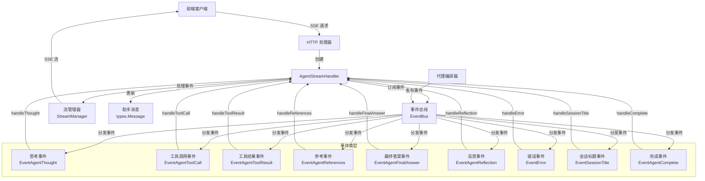

# Agent Streaming Endpoint Handler 模块深度解析

## 1. 问题背景与存在意义

在现代 AI 代理系统中，用户与代理的交互通常是实时性要求很高的过程。用户期望能够即时看到代理的思考过程、工具调用情况以及最终回答，而不是等待整个处理流程完成后才得到一个完整的响应。这就对系统架构提出了以下挑战：

1. **事件流式传输的需求**：代理的运行会产生多种事件（思考、工具调用、工具结果、参考资料、最终答案等），这些事件需要以流式方式实时推送给前端。
2. **多对一的事件映射**：单个代理请求可能会触发多个事件序列，如何将这些事件正确关联到特定的请求和会话是个难题。
3. **状态管理的复杂性**：在流式处理过程中，需要跟踪多个中间状态，如知识参考、事件时长、消息完成状态等。
4. **性能与内存平衡**：既要保证实时性，又要避免内存过度消耗。

传统的请求-响应模式无法满足这些需求，因为它本质上是阻塞式的，无法提供实时反馈。而全双工的 WebSocket 方案虽然可行，但实现复杂度高，且与 HTTP 基础设施兼容性较差。这就是 `agent_streaming_endpoint_handler` 模块存在的意义：它通过 SSE (Server-Sent Events) 技术实现了一种高效、轻量级的代理事件流式传输方案。

## 2. 核心概念与心智模型

理解这个模块的关键在于掌握以下核心概念和心智模型：

### 2.1 事件总线 (EventBus) 模型

想象一个**广播站**场景：
- `EventBus` 就像是一个专门为某个请求设立的私人广播电台
- `AgentStreamHandler` 是这个电台的忠实听众，订阅所有相关节目
- 各种代理事件就是电台播放的不同节目内容
- 前端通过 SSE 连接就像是收音机，实时接收这些节目

**设计亮点**：每个请求使用独立的 `EventBus`，这样就不需要通过 SessionID 过滤事件，简化了逻辑并提高了性能。

### 2.2 事件处理管道

可以将 `AgentStreamHandler` 想象成一个**事件加工厂**：
1. **原材料入口**：从 `EventBus` 接收各种原始事件
2. **加工车间**：不同的处理函数（`handleThought`、`handleToolCall` 等）对事件进行加工
3. **质量检测**：验证事件数据类型，计算元数据（如事件时长）
4. **包装输出**：将加工好的事件通过 `StreamManager` 发送给前端
5. **库存管理**：在本地维护必要的状态（知识参考、最终答案等）

## 3. 架构与数据流

### 3.1 系统架构图



### 3.2 数据流向详解

整个代理事件流式处理的生命周期可以分为以下几个阶段：

1. **初始化阶段**
   - HTTP 处理器接收前端的 SSE 连接请求
   - 创建 `AgentStreamHandler` 实例，传入必要的上下文和依赖
   - 调用 `Subscribe()` 方法注册所有事件处理器

2. **事件订阅与处理阶段**
   - 代理编排器在处理过程中向 `EventBus` 发布各种事件
   - `EventBus` 将事件分发给已注册的 `AgentStreamHandler`
   - 相应的处理函数（如 `handleThought`、`handleToolCall`）被调用
   - 处理函数验证事件数据类型，计算必要的元数据
   - 调用 `streamManager.AppendEvent()` 将事件发送给前端

3. **状态管理阶段**
   - 跟踪事件开始时间以计算持续时间
   - 累积知识参考资料
   - 保存最终答案内容
   - 更新助手消息状态

4. **完成阶段**
   - 接收到 `EventAgentComplete` 事件
   - 标记助手消息为已完成
   - 发送完成事件给前端

## 4. 核心组件详解

### 4.1 AgentStreamHandler 结构体

```go
type AgentStreamHandler struct {
    ctx                context.Context
    sessionID          string
    assistantMessageID string
    requestID          string
    assistantMessage   *types.Message
    streamManager      interfaces.StreamManager
    eventBus           *event.EventBus
    
    // State tracking
    knowledgeRefs      []*types.SearchResult
    finalAnswer        string
    eventStartTimes    map[string]time.Time
    mu                 sync.Mutex
}
```

**设计意图**：
- **上下文与标识**：保存请求上下文和各种标识符，用于事件关联和追踪
- **依赖注入**：通过字段持有 `streamManager` 和 `eventBus`，便于测试和替换
- **状态管理**：内部维护处理过程中需要的状态，避免外部依赖
- **并发安全**：使用 `sync.Mutex` 保护共享状态，确保并发安全

### 4.2 NewAgentStreamHandler 构造函数

```go
func NewAgentStreamHandler(
    ctx context.Context,
    sessionID, assistantMessageID, requestID string,
    assistantMessage *types.Message,
    streamManager interfaces.StreamManager,
    eventBus *event.EventBus,
) *AgentStreamHandler
```

**设计亮点**：
- **显式依赖**：所有依赖都通过参数传入，符合依赖倒置原则
- **完整初始化**：在构造函数中初始化所有内部状态，确保对象可用性
- **清晰的参数顺序**：上下文参数在前，标识参数次之，依赖对象最后

### 4.3 Subscribe 方法

```go
func (h *AgentStreamHandler) Subscribe() {
    h.eventBus.On(event.EventAgentThought, h.handleThought)
    h.eventBus.On(event.EventAgentToolCall, h.handleToolCall)
    h.eventBus.On(event.EventAgentToolResult, h.handleToolResult)
    h.eventBus.On(event.EventAgentReferences, h.handleReferences)
    h.eventBus.On(event.EventAgentFinalAnswer, h.handleFinalAnswer)
    h.eventBus.On(event.EventAgentReflection, h.handleReflection)
    h.eventBus.On(event.EventError, h.handleError)
    h.eventBus.On(event.EventSessionTitle, h.handleSessionTitle)
    h.eventBus.On(event.EventAgentComplete, h.handleComplete)
}
```

**设计意图**：
- **集中注册**：在一个地方集中注册所有事件处理器，便于维护
- **自描述**：方法名清晰表达其意图，事件类型与处理函数一一对应
- **无过滤设计**：利用每个请求独立的 EventBus，无需 SessionID 过滤

### 4.4 事件处理函数族

#### 4.4.1 handleThought - 处理思考事件

```go
func (h *AgentStreamHandler) handleThought(ctx context.Context, evt event.Event) error
```

**功能与设计**：
- **分块处理**：思考内容可能分多个块到达，每个块单独发送
- **时间追踪**：记录事件开始时间，完成时计算持续时间
- **元数据丰富**：添加事件 ID、持续时间等元数据，便于前端调试和展示
- **流式设计**：不累积内容，直接发送每个块，由前端负责累积

**关键流程**：
1. 验证事件数据类型
2. 记录或计算事件持续时间
3. 构建元数据
4. 调用 `streamManager.AppendEvent()` 发送事件

#### 4.4.2 handleToolCall - 处理工具调用事件

```go
func (h *AgentStreamHandler) handleToolCall(ctx context.Context, evt event.Event) error
```

**功能与设计**：
- **实时通知**：立即通知前端正在调用的工具
- **详细元数据**：包含工具名称、参数、调用 ID 等信息
- **时间记录**：为后续计算工具执行时长做准备

#### 4.4.3 handleToolResult - 处理工具结果事件

```go
func (h *AgentStreamHandler) handleToolResult(ctx context.Context, evt event.Event) error
```

**功能与设计**：
- **双时间源**：优先使用本地记录的开始时间，否则使用事件提供的时长
- **状态区分**：成功和失败使用不同的响应类型和内容
- **丰富元数据**：合并工具结果中的数据，支持前端丰富展示
- **错误处理**：优雅处理工具调用失败情况

#### 4.4.4 handleReferences - 处理知识参考事件

```go
func (h *AgentStreamHandler) handleReferences(ctx context.Context, evt event.Event) error
```

**功能与设计**：
- **类型兼容**：处理多种可能的输入类型（直接转换、接口数组、映射）
- **状态累积**：在本地累积所有参考资料，更新助手消息
- **实时更新**：每次收到新参考都立即发送给前端

**设计亮点**：
- **防御性编程**：通过多种类型断言尝试，提高鲁棒性
- **类型转换**：包含从通用 map 到结构化类型的转换逻辑

#### 4.4.5 handleFinalAnswer - 处理最终答案事件

```go
func (h *AgentStreamHandler) handleFinalAnswer(ctx context.Context, evt event.Event) error
```

**功能与设计**：
- **双重目的**：既流式发送给前端，又在本地累积用于数据库保存
- **时间追踪**：与思考事件类似，记录并报告生成时长
- **分块处理**：支持答案分块到达，实时展示

#### 4.4.6 handleError - 处理错误事件

```go
func (h *AgentStreamHandler) handleError(ctx context.Context, evt event.Event) error
```

**功能与设计**：
- **阶段信息**：包含错误发生的阶段信息，便于调试
- **立即完成**：错误事件标记为已完成，终止流式处理
- **元数据丰富**：包含详细的错误信息

#### 4.4.7 handleSessionTitle - 处理会话标题事件

```go
func (h *AgentStreamHandler) handleSessionTitle(ctx context.Context, evt event.Event) error
```

**设计亮点**：
- **独立上下文**：使用背景上下文，因为标题可能在流结束后到达
- **降级日志**：使用 Warn 级别日志，因为此时流可能已结束

#### 4.4.8 handleComplete - 处理完成事件

```go
func (h *AgentStreamHandler) handleComplete(ctx context.Context, evt event.Event) error
```

**功能与设计**：
- **消息更新**：标记助手消息为已完成
- **最终状态**：处理最终的知识参考和代理步骤
- **流终止**：发送完成事件，告知前端流已结束
- **统计信息**：包含总步数和总时长等统计数据

## 5. 依赖关系分析

### 5.1 依赖的组件

`AgentStreamHandler` 依赖以下关键组件：

1. **event.EventBus** - 事件总线
   - **作用**：事件的发布订阅机制
   - **交互**：通过 `On()` 方法订阅事件
   - **设计假设**：每个请求有独立的 EventBus 实例，无需 SessionID 过滤

2. **interfaces.StreamManager** - 流管理器接口
   - **作用**：管理 SSE 流，向客户端发送事件
   - **交互**：通过 `AppendEvent()` 方法发送事件
   - **设计假设**：处理流式传输的底层细节，如缓冲、连接管理等

3. **types.Message** - 消息类型
   - **作用**：表示会话中的一条消息
   - **交互**：更新消息内容、知识参考、完成状态等
   - **设计假设**：是一个可变对象，允许在处理过程中更新

4. **types.SearchResult** - 搜索结果类型
   - **作用**：表示知识搜索结果
   - **交互**：累积并存储在消息中
   - **设计假设**：包含足够的元数据用于前端展示

### 5.2 被依赖的情况

这个模块通常被以下组件调用：
- HTTP 处理器层 - 创建并初始化实例
- 会话管理模块 - 集成到会话生命周期中

### 5.3 数据契约

**输入事件契约**：
- 所有事件必须实现 `event.Event` 接口
- 特定事件类型有特定的数据结构（如 `AgentThoughtData`、`AgentToolCallData` 等）

**输出事件契约**：
- 通过 `interfaces.StreamEvent` 结构发送
- 包含 ID、类型、内容、完成状态、时间戳、元数据等字段

## 6. 设计决策与权衡

### 6.1 每个请求独立 EventBus vs 全局 EventBus

**决策**：使用每个请求独立的 EventBus

**原因**：
- 避免了事件过滤的复杂性和开销
- 提高了事件处理的性能
- 简化了代码逻辑，减少了错误可能性

**权衡**：
- 增加了内存使用（每个请求一个 EventBus）
- 但在请求级别隔离，有利于资源清理和错误 containment

### 6.2 前端累积 vs 后端累积

**决策**：思考和答案内容由前端累积，后端只发送分块

**原因**：
- 减少后端内存使用
- 提高实时性（不需要等待完整内容）
- 前端可以更好地控制展示逻辑

**权衡**：
- 增加了前端的复杂性
- 但对于最终答案，后端仍会累积一份用于保存到数据库

### 6.3 本地时间追踪 vs 依赖事件提供时间

**决策**：本地记录事件开始时间，计算持续时间

**原因**：
- 更准确的时间测量（避免网络延迟影响）
- 不依赖事件生产者是否提供时间信息

**权衡**：
- 增加了状态管理复杂度
- 但提供了降级方案（使用事件提供的时长）

### 6.4 直接依赖 vs 接口抽象

**决策**：通过接口依赖 StreamManager，直接使用 EventBus 具体类型

**原因**：
- StreamManager 可能有多种实现（内存、Redis 等）
- EventBus 在本模块上下文中是固定的协作模式

**权衡**：
- 一定程度的不一致性
- 但在特定上下文中是合理的平衡

### 6.5 可变状态 vs 不可变状态

**决策**：内部使用可变状态（knowledgeRefs、finalAnswer 等）

**原因**：
- 事件处理本质上是状态累积的过程
- 可变状态实现简单，性能好

**权衡**：
- 需要使用互斥锁保护并发访问
- 降低了一定的可测试性（但可以通过依赖注入缓解）

## 7. 使用指南与最佳实践

### 7.1 基本使用流程

```go
// 1. 创建必要的依赖
streamManager := getStreamManager()
eventBus := event.NewEventBus()
assistantMessage := &types.Message{...}

// 2. 创建处理器
handler := NewAgentStreamHandler(
    ctx,
    sessionID,
    assistantMessageID,
    requestID,
    assistantMessage,
    streamManager,
    eventBus,
)

// 3. 订阅事件
handler.Subscribe()

// 4. 将 eventBus 传递给代理编排器，由其发布事件
agentOrchestrator.Process(ctx, eventBus, ...)
```

### 7.2 扩展与定制

虽然 `AgentStreamHandler` 设计上比较具体，但仍有一些扩展点：

1. **自定义事件处理**：可以通过继承或组合方式添加新的事件处理逻辑
2. **元数据增强**：可以在各个处理函数中添加更多自定义元数据
3. **事件过滤**：虽然设计上不需要，但可以在处理函数中添加过滤逻辑

### 7.3 常见陷阱与注意事项

1. **并发安全**：
   - 始终使用 `mu` 锁保护共享状态访问
   - 注意锁的粒度，避免过长时间持有锁

2. **事件顺序**：
   - 依赖 EventBus 保证事件顺序，不要在处理函数中假设并发顺序
   - 对于需要严格顺序的操作，考虑在 EventBus 层面解决

3. **错误处理**：
   - 处理函数中的错误只记录日志，不中断流程
   - 这是为了保证一个事件处理失败不影响其他事件

4. **上下文使用**：
   - 大部分事件处理使用请求上下文
   - 但 handleSessionTitle 使用背景上下文，因为它可能在请求结束后到达

5. **内存管理**：
   - 注意 knowledgeRefs 的增长，特别是在有大量参考资料的情况下
   - 确保处理器实例在请求结束后能被正确垃圾回收

## 8. 总结

`agent_streaming_endpoint_handler` 模块是连接代理编排器和前端 SSE 流的关键组件，它通过精心设计的事件处理机制，实现了代理运行状态的实时、可靠传输。其核心价值在于：

1. **解耦**：将事件生产与消费解耦，通过 EventBus 中介
2. **实时性**：通过流式处理提供即时反馈
3. **可靠性**：完善的错误处理和状态管理
4. **可观测性**：丰富的元数据和时间追踪

这个模块展示了如何在保持简单性的同时，解决复杂的实时通信问题，是整个代理系统中不可或缺的一部分。
