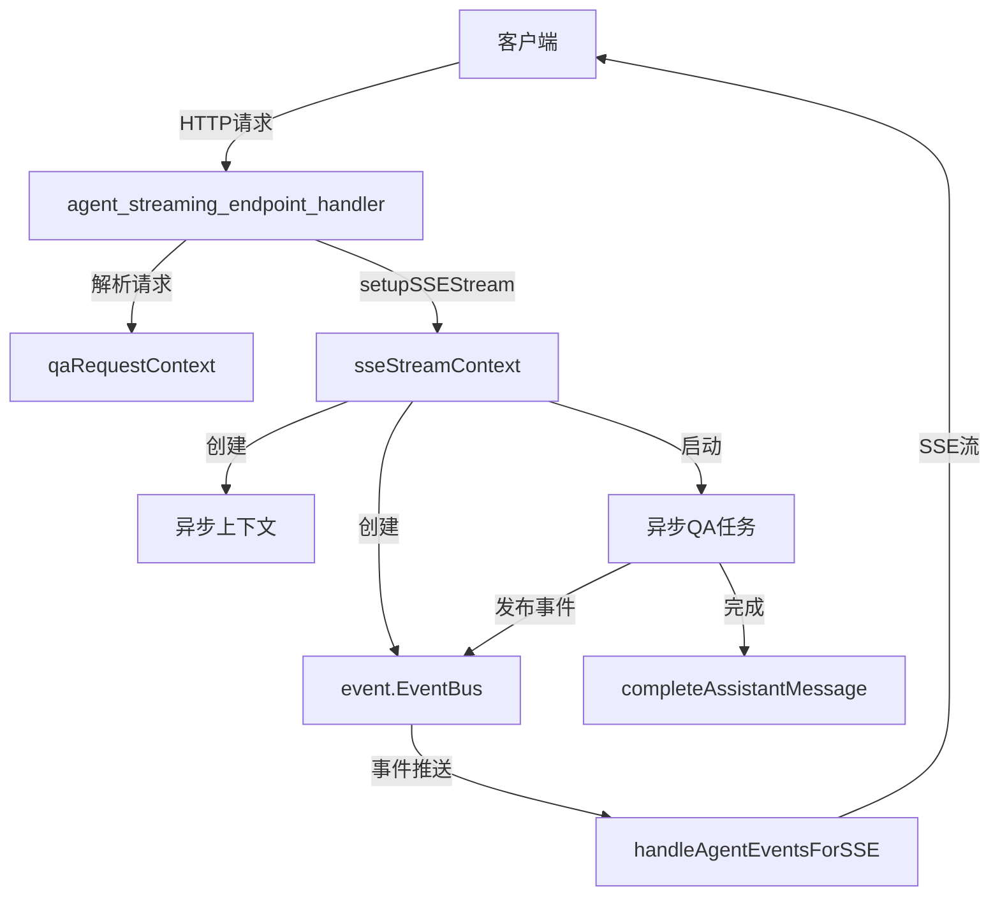

# sse_stream_runtime_context 模块技术深度解析

## 1. 模块概览

`sse_stream_runtime_context` 模块是系统中处理 Server-Sent Events (SSE) 流式响应的核心组件。它位于 HTTP 处理层，负责在知识问答和 Agent 问答场景中建立、管理和维护与客户端的长连接，实现实时的事件推送。

### 核心问题

在智能问答系统中，用户期望获得即时、流畅的响应体验，而传统的请求-响应模式无法满足这一需求。当 LLM 生成回答时，用户需要等待整个回答完成才能看到结果，这会导致：
- 长响应延迟感知
- 缺乏交互反馈
- 无法中途停止或干预

### 解决方案

该模块通过 SSE 技术建立双向事件流，将整个问答过程分解为多个事件并实时推送给客户端。它作为 HTTP 层与业务逻辑层之间的桥梁，管理异步任务生命周期，协调事件总线，确保流式响应的可靠性和一致性。

## 2. 核心架构与数据流程

### 架构图示



### 核心组件角色

#### `sseStreamContext` 结构体

这是整个模块的核心数据结构，封装了 SSE 流式响应所需的所有上下文信息：

- **`eventBus`**: 事件总线，用于在异步任务和 SSE 处理器之间传递事件
- **`asyncCtx`**: 异步上下文，用于控制异步任务的生命周期
- **`cancel`**: 取消函数，用于中断异步操作
- **`assistantMessage`**: 助手消息对象，跟踪当前正在生成的回复

### 数据流程详解

1. **请求初始化阶段**：
   - `KnowledgeQA` 或 `AgentQA` 端点接收客户端请求
   - `parseQARequest` 解析并验证请求，创建 `qaRequestContext`
   - 创建用户消息和初始助手消息

2. **SSE 流建立阶段**：
   - `setupSSEStream` 设置 SSE 响应头
   - 写入初始 `agent_query` 事件
   - 创建事件总线和可取消的异步上下文
   - 设置停止事件处理器和流处理器
   - 根据需要启动异步标题生成

3. **异步任务执行阶段**：
   - 在 goroutine 中启动 `KnowledgeQA` 或 `AgentQA` 服务
   - 服务通过事件总线发布各种事件（思考过程、工具调用、最终答案等）
   - 事件监听器捕获并处理这些事件

4. **SSE 事件推送阶段**：
   - `handleAgentEventsForSSE` 阻塞处理事件总线中的事件
   - 将事件转换为 SSE 格式推送给客户端
   - 等待完成事件后优雅关闭连接

## 3. 核心组件深度解析

### `sseStreamContext` 结构体

```go
type sseStreamContext struct {
    eventBus         *event.EventBus
    asyncCtx         context.Context
    cancel           context.CancelFunc
    assistantMessage *types.Message
}
```

**设计意图**：
这个结构体是 SSE 流式响应的"控制中心"，它将四个关键要素组合在一起：
- 事件通信机制（`eventBus`）
- 异步执行环境（`asyncCtx`）
- 生命周期控制（`cancel`）
- 状态跟踪（`assistantMessage`）

这种设计使得整个流式响应过程可以被统一管理，同时保持各组件之间的解耦。

### `setupSSEStream` 函数

这是创建 SSE 流环境的工厂函数，它执行以下关键操作：

1. **设置 SSE 响应头**：通过 `setSSEHeaders` 确保 HTTP 响应符合 SSE 协议要求
2. **发送初始事件**：写入 `agent_query` 事件，标记问答开始
3. **处理租户上下文**：当使用共享代理时，正确设置有效的租户 ID
4. **创建事件总线**：初始化 `event.EventBus` 作为事件通信中枢
5. **设置事件处理器**：
   - `setupStopEventHandler`：处理客户端停止请求
   - `setupStreamHandler`：处理流式输出
6. **条件性标题生成**：如果会话没有标题，异步生成一个

**关键设计决策**：
- 共享代理的租户处理：当使用共享代理时，需要使用代理所有者的租户上下文来解析模型、知识库和 MCP 服务，但消息更新仍使用会话所属租户
- 标题生成的异步性：避免阻塞主响应流程，提升用户体验

### 事件处理机制

系统通过事件总线实现了生产者-消费者模式：

1. **事件生产者**：异步执行的 `KnowledgeQA` 或 `AgentQA` 服务
2. **事件消费者**：注册在事件总线上的各种处理器
3. **关键事件类型**：
   - `EventAgentQuery`：查询开始
   - `EventAgentFinalAnswer`：最终答案（分块推送）
   - `EventAgentComplete`：问答完成
   - `EventError`：错误发生

**正常模式下的完成处理**：
```go
streamCtx.eventBus.On(event.EventAgentFinalAnswer, func(ctx context.Context, evt event.Event) error {
    data, ok := evt.Data.(event.AgentFinalAnswerData)
    if !ok {
        return nil
    }
    streamCtx.assistantMessage.Content += data.Content
    if data.Done {
        // 防止重复处理完成事件
        if completionHandled {
            return nil
        }
        completionHandled = true
        
        // 完成消息更新
        updateCtx := context.WithValue(streamCtx.asyncCtx, types.TenantIDContextKey, reqCtx.session.TenantID)
        h.completeAssistantMessage(updateCtx, streamCtx.assistantMessage)
        
        // 触发完成事件
        streamCtx.eventBus.Emit(streamCtx.asyncCtx, event.Event{
            Type:      event.EventAgentComplete,
            SessionID: sessionID,
            Data:      event.AgentCompleteData{FinalAnswer: streamCtx.assistantMessage.Content},
        })
    }
    return nil
})
```

## 4. 依赖关系分析

### 上游依赖

- **`agent_streaming_endpoint_handler`**：调用本模块设置 SSE 流
- **`qaRequestContext`**：提供请求上下文信息
- **`types.Session`**、**`types.CustomAgent`**、**`types.Message`**：核心领域模型

### 下游依赖

- **`event.EventBus`**：事件通信基础设施
- **`sessionService.KnowledgeQA`** / **`sessionService.AgentQA`**：实际的问答业务逻辑
- **`messageService`**：消息持久化服务
- **`handleAgentEventsForSSE`**：SSE 事件实际推送处理器

### 数据契约

模块依赖以下关键数据契约：
- SSE 事件格式必须符合 `event.Event` 结构
- 助手消息必须遵循 `types.Message` 接口
- 租户信息通过上下文值传递（`types.TenantIDContextKey`、`types.TenantInfoContextKey`）

## 5. 设计决策与权衡

### 1. 异步任务与 SSE 推送分离

**决策**：将实际的问答业务逻辑放在单独的 goroutine 中执行，而 SSE 事件推送在主请求 goroutine 中阻塞处理。

**理由**：
- HTTP 请求处理器需要保持活跃以维持 SSE 连接
- 业务逻辑可能耗时较长，不应阻塞 HTTP 处理层
- 通过事件总线解耦，使得两者可以独立演进

**权衡**：
- 增加了组件间通信的复杂性
- 需要仔细处理 goroutine 泄漏和 panic 恢复
- 但获得了更好的关注点分离和系统弹性

### 2. 租户上下文的双重处理

**决策**：当使用共享代理时，异步任务使用代理所有者的租户上下文，但消息更新使用会话所属租户的上下文。

**理由**：
- 模型、知识库和 MCP 服务属于代理所有者，需要在其租户上下文中解析
- 但会话和消息属于发起请求的用户，应该在其租户下持久化

**权衡**：
- 增加了上下文管理的复杂性
- 需要在多个地方正确切换租户上下文
- 但实现了共享代理的正确权限模型和资源隔离

### 3. 思考内容的嵌入方式

**决策**：将思考内容直接嵌入到答案流中，使用 `<think>` 标签标记，而不是作为单独的事件发送。

**理由**：
- 简化了客户端处理逻辑，只需处理单一的答案流
- 保持了内容的时序一致性
- 与 LLM 输出方式更匹配

**权衡**：
- 客户端需要解析内容来提取思考部分
- 但减少了事件类型的复杂性

### 4. 事件总线的使用

**决策**：使用事件总线作为异步通信机制，而不是直接的函数调用或通道。

**理由**：
- 支持多订阅者模式，允许多个组件监听同一事件
- 提供了更好的可扩展性，可以轻松添加新的事件处理器
- 解耦了事件生产者和消费者

**权衡**：
- 增加了一层间接性，调试可能更复杂
- 事件顺序和处理保证需要额外考虑
- 但获得了更好的系统可观测性和可扩展性

## 6. 实际应用与常见模式

### 基本使用流程

1. 创建 `qaRequestContext` 包含所有请求信息
2. 调用 `setupSSEStream` 建立 SSE 环境
3. 在事件总线上注册必要的事件处理器
4. 在 goroutine 中启动异步 QA 服务
5. 调用 `handleAgentEventsForSSE` 阻塞处理事件推送

### 错误处理模式

模块采用了多层错误处理策略：
1. **Panic 恢复**：在异步 goroutine 中使用 defer/recover 捕获 panic
2. **错误事件**：通过 `EventError` 事件将错误传递给客户端
3. **优雅降级**：即使发生错误，也尝试完成助手消息的更新

### 共享代理模式

当使用共享代理时，模块会：
1. 通过 `agentShareService` 解析共享代理
2. 设置 `effectiveTenantID` 为代理所有者的租户 ID
3. 在异步上下文中使用该租户 ID 解析资源
4. 但在更新消息时切换回会话所属租户

## 7. 边缘情况与注意事项

### 常见陷阱

1. **租户上下文混淆**：在更新消息时忘记切换回会话所属租户，可能导致权限错误或数据归属错误
2. **重复完成处理**：没有正确防止 `EventAgentFinalAnswer` 的完成处理被多次调用
3. **Goroutine 泄漏**：没有正确使用 cancel 函数或在所有情况下确保 goroutine 退出
4. **事件顺序问题**：依赖事件总线保证事件处理顺序，但在某些情况下可能出现乱序

### 调试建议

1. **跟踪事件流**：在关键事件处理器中添加日志，跟踪事件的发布和处理
2. **监控 goroutine**：注意观察 goroutine 的生命周期，特别是在长时间运行的流式响应中
3. **验证租户上下文**：在关键操作前检查当前上下文中的租户 ID 是否正确
4. **检查消息状态**：验证 `IsCompleted` 标志是否被正确设置

## 8. 相关模块参考

- [agent_streaming_endpoint_handler](http_handlers_and_routing-session_message_and_streaming_http_handlers-streaming_endpoints_and_sse_context-agent_streaming_endpoint_handler.md)：SSE 流的入口端点处理器
- [event_bus](platform_infrastructure_and_runtime-event_bus_and_agent_runtime_event_contracts-event_bus_core_contracts.md)：事件通信基础设施
- [session_lifecycle_api](sdk_client_library-agent_session_and_message_api-session_lifecycle_api.md)：会话生命周期管理
