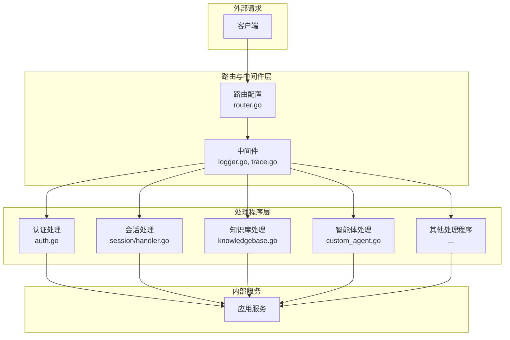

# HTTP 处理与路由模块

## 概述

`http_handlers_and_routing` 模块是应用程序的入口门户，负责将外部 HTTP 请求转换为内部业务调用。它就像一个交通枢纽，将来自前端或第三方集成的请求路由到正确的业务逻辑处理程序，同时处理身份验证、请求/响应转换和横切关注点。

这个模块不仅仅是路由请求 - 它定义了系统的公共 API 契约，管理会话和流式交互的状态，并确保安全边界得到尊重。

## 架构概览

### 核心架构原则

1. **关注点分离**：路由只关注路由，处理程序只关注 HTTP 协议转换，业务逻辑完全在内部服务中实现
2. **中间件管道**：横切关注点（日志、跟踪、认证）通过中间件组合实现，而不是在每个处理程序中重复
3. **契约优先**：通过 Swagger 注释和请求/响应结构明确定义 API 契约
4. **上下文传递**：使用 `context.Context` 在整个请求处理流程中传递请求范围的状态（租户 ID、用户 ID、请求 ID）

## 关键设计决策

### 1. 处理程序作为"薄适配器"

**决策**：HTTP 处理程序被设计为非常薄的一层，只负责：
- 请求参数绑定和验证
- 上下文准备（设置租户 ID、用户 ID）
- 调用内部服务
- 错误转换和响应格式化

**原因**：这确保业务逻辑不与 HTTP 传输耦合，使其更容易测试和重用。处理程序不需要知道业务规则，只需要知道如何"讲 HTTP"。

**权衡**：
- ✅ 优点：清晰的关注点分离，易于测试
- ⚠️ 缺点：需要更多的代码文件，在简单场景下可能感觉过度设计

### 2. 基于 Gin 的路由与自定义中间件

**决策**：使用 Gin 作为 HTTP 框架，但自定义中间件用于日志、跟踪和身份验证，而不是依赖 Gin 的内置中间件。

**原因**：
- Gin 提供出色的性能和路由 API
- 自定义中间件允许与系统的日志、跟踪和身份验证系统深度集成
- 团队在 Go 中间件模式方面有专业知识

### 3. 请求 ID 作为可观察性的主干

**决策**：每个请求都分配一个唯一的请求 ID（或从 `X-Request-ID` 头接受），并通过 `context.Context` 和所有日志消息传递。

**原因**：这使分布式追踪成为可能。当出现问题时，您可以获取单个请求 ID 并查看其在整个系统中的完整路径，从入口到数据库查询再到响应。

**实现**：查看 `RequestID()` 中间件和 `loggerResponseBodyWriter`，了解它如何嵌入到每个日志条目中。

### 4. 租户隔离通过上下文，而不是处理程序参数

**决策**：租户 ID 存储在 `context.Context` 中，由中间件设置，而不是作为每个处理程序方法的参数传递。

**原因**：
- 它减少了处理程序签名中的样板代码
- 它确保租户身份在调用链中不会"丢失"
- 它支持未来的多租户场景，而无需重构每个处理程序

**注意事项**：始终确保使用中间件准备的上下文调用内部服务，而不是原始的 `context.Background()`。

## 子模块

该模块分为几个关键子模块，每个子模块处理 API  surface 的不同区域：

### 路由、中间件和后台任务连接

该子模块将所有内容连接在一起 - 定义路由，设置中间件管道，并配置后台任务处理。它是应用程序 HTTP 层的"主入口"。

[了解有关路由、中间件和后台任务连接的更多信息](http_handlers_and_routing-routing_middleware_and_background_task_wiring.md)

### 会话、消息和流式 HTTP 处理程序

该子模块处理会话管理、消息历史记录和 LLM 交互的 SSE 流式传输。它是系统中最复杂的部分之一，因为它管理实时流式响应的状态。

[了解有关会话、消息和流式 HTTP 处理程序的更多信息](http_handlers_and_routing-session_message_and_streaming_http_handlers.md)

### 知识、FAQ 和标签内容处理程序

该子模块处理知识库内容管理 - 上传文档、管理分块、FAQ 条目和标签。它是内容管理功能的核心。

[了解有关知识、FAQ 和标签内容处理程序的更多信息](http_handlers_and_routing-knowledge_faq_and_tag_content_handlers.md)

### 智能体、租户、组织和模型管理处理程序

该子模块处理系统的"管理"方面 - 创建和配置智能体、管理租户、组织成员和模型目录。

[了解有关智能体、租户、组织和模型管理处理程序的更多信息](http_handlers_and_routing-agent_tenant_organization_and_model_management_handlers.md)

### 身份验证、初始化和系统操作处理程序

该子模块处理身份验证流、系统初始化（模型设置、Ollama 下载）和系统信息端点。

[了解有关身份验证、初始化和系统操作处理程序的更多信息](http_handlers_and_routing-auth_initialization_and_system_operations_handlers.md)

### 评估和 Web 搜索处理程序

该子模块处理评估运行和 Web 搜索配置 - 更多是"功能"API 而不是核心 CRUD。

[了解有关评估和 Web 搜索处理程序的更多信息](http_handlers_and_routing-evaluation_and_web_search_handlers.md)

## 与其他模块的依赖关系

`http_handlers_and_routing` 模块位于架构的"边缘"，因此它依赖于几个内部模块：

### 核心依赖

1. **application_services_and_orchestration** - 处理程序调用应用服务执行业务逻辑
2. **core_domain_types_and_interfaces** - 处理程序使用域类型和服务接口进行请求/响应转换
3. **platform_infrastructure_and_runtime** - 用于日志记录、跟踪和配置

### 数据流示例

让我们追踪一个典型的请求通过系统的流程：

1. **请求到达**：`POST /api/v1/sessions/{session_id}/knowledge-qa`
2. **中间件执行**：
   - `RequestID()` - 分配请求 ID
   - `Logger()` - 开始记录请求
   - `Auth()` - 验证 JWT 并提取租户/用户 ID
   - `TracingMiddleware()` - 创建 OpenTelemetry 跨度
3. **路由匹配**：Gin 将请求路由到 `SessionHandler.KnowledgeQA()`
4. **处理程序逻辑**：
   - 从 URL 和正文绑定参数
   - 验证查询内容
   - 创建用户消息
   - 设置 SSE 流式响应
   - 调用 `sessionService.KnowledgeQA()`
5. **服务执行**：会话服务编排检索和 LLM 调用，通过事件总线发出事件
6. **流式响应**：`AgentStreamHandler` 接收事件并将其作为 SSE 帧发送到客户端
7. **响应记录**：`Logger()` 中间件记录最终状态码和响应主体

## 新贡献者的注意事项

### 陷阱和常见错误

1. **忘记使用有效上下文**：始终使用 `c.Request.Context()` 或派生上下文，而不是 `context.Background()`。否则，租户隔离和日志记录将失败。

2. **在处理程序中放置业务逻辑**：如果您发现自己在处理程序方法中编写除参数绑定、上下文准备和服务调用之外的任何内容，请停止。该逻辑可能属于服务。

3. **忽略错误包装**：使用 `errors.New...Error()` 函数包装域错误，而不是直接返回服务错误。这确保了一致的 HTTP 状态码和错误格式。

4. **敏感数据记录**：在记录请求/响应主体之前，检查是否有密码、API 密钥或个人数据等敏感信息。`sanitizeBody()` 函数有助于解决此问题。

### 添加新端点的最佳实践

1. **首先定义契约**：编写请求/响应结构和 Swagger 注释，然后实现处理程序
2. **重用现有模式**：查看其他处理程序如何进行参数绑定、错误处理和响应格式化
3. **保持处理程序精简**：如果它超过 ~50 行，您可能需要将一些逻辑移到服务或辅助函数中
4. **测试横切关注点**：确保您的端点与日志记录、跟踪和身份验证中间件正常工作
5. **验证所有输入**：不要假设客户端会发送有效数据 - 使用 Gin 的绑定验证和自定义验证

## 结论

`http_handlers_and_routing` 模块是系统的"脸面" - 它定义了外部世界如何与我们的软件交互。通过保持处理程序精简、中间件可组合，并明确分离关注点，我们创建了一个既灵活又可维护的 API 层。

当您使用此模块时，请记住：处理程序不应该*做*事情，它们应该*将请求转换*为做事情的内部系统调用。
