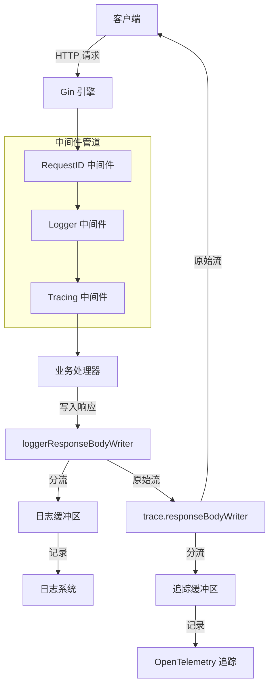

# HTTP 响应体捕获中间件

## 为什么这个模块存在？

在任何生产级别的 Web 应用中，可观测性和调试能力至关重要。当一个 API 请求失败时，我们需要知道：
- 发生了什么？
- 传入了什么数据？
- 返回了什么内容？
- 花费了多长时间？

标准的 HTTP 服务框架（如 Gin）默认不会自动捕获和记录请求/响应体，原因是：
1. **性能考虑**：读取和缓冲响应体会增加内存开销
2. **一次性读取限制**：HTTP 响应体是流式的，只能读取一次
3. **敏感数据风险**：响应体可能包含密码、令牌等敏感信息

`http_response_body_capture_middlewares` 模块专门解决这个问题。它通过包装标准的 HTTP 响应写入器，安全地捕获响应内容，同时保持对原始响应流的完整性。

## 心理模型：HTTP 响应的"分流器"

想象一下，你在一个水管系统中，水从服务器流向客户端。标准情况下，水直接从服务器流向客户端，没有留下任何记录。

这个模块就像是在水管中安装了一个"分流器"：
- 它不会阻止水（响应数据）流向客户端
- 但它会同时将一部分水（响应内容）分流到一个收集桶（缓冲区）中
- 这样，在请求完成后，你可以检查收集桶中的内容，了解发生了什么

## 架构概览



这个模块包含两个主要的响应体写入器实现：

1. **loggerResponseBodyWriter**：用于日志记录的响应体捕获器
2. **trace.responseBodyWriter**：用于分布式追踪的响应体捕获器

两者都遵循相同的设计模式，但服务于不同的可观测性目标。

## 核心组件详解

### loggerResponseBodyWriter

**职责**：在不干扰原始响应流的情况下，捕获 HTTP 响应内容用于日志记录。

**工作原理**：
- 包装原始的 `gin.ResponseWriter`
- 重写 `Write` 方法，同时写入缓冲区和原始 writer
- 提供完整的响应体副本，以便在请求完成后进行日志记录

**关键设计点**：
- 不修改原始响应的任何行为
- 使用内存缓冲区存储响应内容副本
- 与敏感数据清理函数配合使用，保护用户隐私

### trace.responseBodyWriter

**职责**：捕获 HTTP 响应内容用于分布式追踪系统（OpenTelemetry）。

**设计与 loggerResponseBodyWriter 几乎相同**，但有一个重要区别：
- 它不进行内容截断或敏感数据清理（这在追踪系统中可能是有意的，也可能需要根据具体安全需求调整）

## 数据流向

让我们通过一个典型的 API 请求来追踪数据流向：

1. **请求到达**：客户端发送 HTTP 请求到服务器
2. **RequestID 中间件**：为请求分配唯一 ID，设置日志上下文
3. **Logger 中间件**：
   - 创建 `loggerResponseBodyWriter` 包装原始 writer
   - 读取请求体（同时重置它供后续使用）
   - 调用 `c.Next()` 继续处理链
4. **Tracing 中间件**：
   - 创建 `trace.responseBodyWriter` 包装 logger 的 writer
   - 读取请求体（再次重置它）
   - 创建 OpenTelemetry  span
   - 调用 `c.Next()` 继续处理链
5. **业务处理器**：处理请求，写入响应
6. **响应回流**：
   - 业务处理器写入响应 → trace.responseBodyWriter（捕获副本 + 传递）
   - → loggerResponseBodyWriter（捕获副本 + 传递）
   - → 原始 writer → 客户端
7. **后处理**：
   - Tracing 中间件：将捕获的响应体添加到 span 属性中
   - Logger 中间件：清理敏感数据，截断过长内容，记录日志

## 设计决策与权衡

### 1. 为什么创建两个独立的 ResponseWriter 实现？

**选择**：为日志和追踪分别创建了几乎相同的响应体写入器。

**替代方案**：
- 创建一个通用的响应体捕获器，由两个中间件共享
- 将响应体捕获功能合并到一个中间件中

**权衡分析**：
- **优点**：
  - 职责分离：日志和追踪有不同的需求（敏感数据清理、截断等）
  - 独立性：可以独立启用/禁用日志和追踪功能
  - 灵活性：每个中间件可以根据自己的需求处理响应体
- **缺点**：
  - 代码重复：两个结构体有几乎相同的实现
  - 内存开销：响应体被缓冲两次（一次用于日志，一次用于追踪）

### 2. 为什么只在 POST/PUT/PATCH 请求中记录请求体？

**选择**：代码明确检查请求方法，只在 POST/PUT/PATCH 时读取请求体。

**原因**：
- GET/DELETE 请求通常没有请求体
- 避免不必要的内存分配和 I/O 操作
- 遵循 HTTP 语义规范

### 3. 敏感数据清理的正则表达式方法

**选择**：使用正则表达式替换 JSON 中的敏感字段。

**替代方案**：
- 解析 JSON 为结构体，清理后再序列化
- 使用更智能的 JSON 处理库

**权衡分析**：
- **优点**：
  - 性能好：正则表达式替换很快
  - 简单：不需要知道具体的 JSON 结构
  - 容错：即使 JSON 格式有问题也能工作
- **缺点**：
  - 可能误判：非 JSON 内容中的类似模式也会被替换
  - 有限：只处理预定义的敏感字段列表

### 4. 内容大小限制

**选择**：设置了 10KB 的最大内容记录限制。

**原因**：
- 防止日志/追踪系统被超大响应体淹没
- 平衡可观测性和资源使用
- 大多数情况下，10KB 足够诊断问题

## 子模块

这个模块包含两个子模块，分别处理日志记录和分布式追踪的响应体捕获：

- [logging_response_body_capture_writer](http_response_body_capture_middlewares-logging_response_body_capture_writer.md)：负责为日志系统捕获和处理响应体
- [tracing_response_body_capture_writer](http_response_body_capture_middlewares-tracing_response_body_capture_writer.md)：负责为分布式追踪系统捕获响应体

## 跨模块依赖

这个模块是 HTTP 处理层的基础组件，与以下模块有紧密联系：

- **http_handlers_and_routing**：这个模块是路由中间件的一部分，直接在 HTTP 处理管道中使用
- **platform_infrastructure_and_runtime**：依赖日志系统和分布式追踪基础设施
- **core_domain_types_and_interfaces**：使用上下文键类型定义

## 使用时的注意事项

### 1. 中间件顺序很重要

这些中间件必须在正确的顺序中使用：
```go
r.Use(middleware.RequestID())   // 首先设置请求 ID
r.Use(middleware.Logger())       // 然后设置日志
r.Use(middleware.TracingMiddleware())  // 最后设置追踪（或者根据需要调整顺序）
```

### 2. 响应体被缓冲在内存中

对于大响应体（如下载文件），这可能会导致：
- 内存使用峰值
- 延迟增加
- 日志/追踪系统中的大量数据

**建议**：对于已知的大响应端点，可以考虑跳过这些中间件，或者添加内容类型过滤。

### 3. 敏感数据清理不完美

当前的正则表达式方法有局限性：
- 只处理 JSON 格式
- 只处理预定义的字段列表
- 可能无法处理嵌套结构中的敏感数据

**建议**：
- 定期审查和更新敏感字段模式
- 考虑使用更结构化的方法处理已知的 API 响应
- 在生产环境中监控日志，确保没有敏感数据泄露

### 4. 请求体被读取两次

在当前的实现中，请求体被 Logger 和 Tracing 中间件各读取一次。虽然每次都重置了请求体，但这会增加一些开销。

**优化空间**：
- 考虑共享请求体读取结果
- 或者调整中间件职责，让一个中间件负责读取请求体，另一个中间件直接使用结果

## 总结

`http_response_body_capture_middlewares` 模块是一个看似简单但设计精妙的组件，解决了 Web 应用可观测性中的一个核心问题：如何在不干扰正常请求处理的情况下，捕获和记录 HTTP 交互的完整上下文。

它的价值不在于复杂的算法或高级的抽象，而在于对细节的关注：正确处理流式响应、谨慎管理内存、保护敏感数据，以及与现有可观测性系统的无缝集成。
