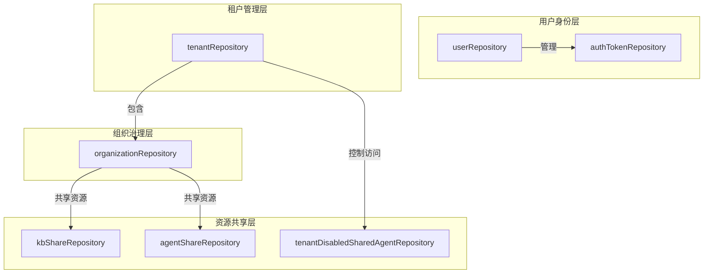

# identity_tenant_and_organization_repositories 模块技术文档

## 概述

想象一下，您正在构建一个多租户的协作平台，需要管理用户身份、租户隔离、组织协作以及资源共享。这个模块就像是整个系统的"身份管理中心"——它处理用户账户的创建与认证、租户的生命周期管理、组织的成员治理，以及知识库和智能体的共享访问控制。

在多租户 SaaS 架构中，这个模块扮演着至关重要的角色：它确保数据隔离的同时，提供了灵活的协作机制。用户可以加入组织、共享资源，而系统则确保所有操作都在正确的权限边界内进行。

## 架构概览



这个模块采用分层架构设计，从下到上分别是：

1. **用户身份层**：负责用户账户管理和认证令牌的持久化，是整个身份系统的基础。
2. **租户管理层**：处理租户的创建、查询和存储配额管理，确保多租户环境下的数据隔离。
3. **组织治理层**：管理组织的生命周期、成员关系和加入请求工作流，是协作的核心。
4. **资源共享层**：控制知识库和智能体在组织间的共享，以及租户级别的共享代理禁用策略。

数据流向通常是从用户身份验证开始，然后通过租户隔离，再到组织协作，最后实现资源共享。每个层次都有明确的职责边界，同时又紧密协作。

## 核心设计决策

### 1. 仓库模式（Repository Pattern）的采用

**决策**：所有数据访问都通过仓库接口进行，实现了数据访问逻辑与业务逻辑的分离。

**为什么这样设计**：
- 提供了清晰的数据访问抽象，使业务逻辑不直接依赖底层数据库
- 便于单元测试，可以轻松模拟仓库接口
- 集中管理数据访问策略，如软删除、预加载关联等

**权衡**：
- ✅ 优点：解耦、可测试性强、数据访问逻辑集中
- ❌ 缺点：增加了一层抽象，对于简单查询可能显得过度设计

### 2. 软删除策略

**决策**：大部分资源（组织、共享记录等）采用软删除而非物理删除。

**为什么这样设计**：
- 保留数据审计线索，便于问题排查
- 支持误操作恢复
- 保持引用完整性，避免因删除导致的关联数据问题

**权衡**：
- ✅ 优点：数据安全、可恢复、审计友好
- ❌ 缺点：数据库会累积已删除数据，查询时需要额外过滤条件

### 3. 悲观锁用于存储配额管理

**决策**：在 `tenantRepository.AdjustStorageUsed` 方法中使用悲观锁确保并发安全。

**为什么这样设计**：
- 存储配额是一个关键的业务指标，必须准确
- 并发更新可能导致数据不一致
- 悲观锁在这种场景下比乐观锁更简单直接

**代码示例**：
```go
func (r *tenantRepository) AdjustStorageUsed(ctx context.Context, tenantID uint64, delta int64) error {
    return r.db.WithContext(ctx).Transaction(func(tx *gorm.DB) error {
        var tenant types.Tenant
        // 使用悲观锁确保并发安全
        if err := tx.Clauses(clause.Locking{Strength: "UPDATE"}).First(&tenant, tenantID).Error; err != nil {
            return err
        }
        // ... 更新逻辑
    })
}
```

### 4. 批量查询优化

**决策**：提供批量查询方法（如 `ListByOrganizations`、`CountByOrganizations`）以减少数据库往返。

**为什么这样设计**：
- N+1 查询问题是常见的性能瓶颈
- 批量操作可以显著减少数据库负载
- 特别是在用户属于多个组织的场景下，批量查询尤为重要

## 子模块概览

这个模块可以进一步划分为以下几个子模块，每个子模块都有明确的职责：

### 用户身份与认证仓库
负责用户账户的创建、查询和更新，以及认证令牌的管理。这是整个身份系统的入口点，处理用户的基本身份信息和认证状态。

[查看详细文档](identity_tenant_and_organization_repositories-user_identity_and_auth_repositories.md)

### 租户管理仓库
管理租户的生命周期、配置和存储配额。租户是系统中最高级别的隔离单元，确保不同客户的数据完全分离。

[查看详细文档](identity_tenant_and_organization_repositories-tenant_management_repository.md)

### 组织成员资格、共享与访问控制仓库
这是最复杂的子模块，涵盖组织治理、资源共享和访问控制三个方面：

#### 组织成员资格与治理仓库
处理组织的创建、成员管理和加入请求工作流，是协作功能的核心。

[查看详细文档](identity_tenant_and_organization_repositories-organization_membership_sharing_and_access_control_repositories-organization_membership_and_governance_repository.md)

#### 共享资源访问仓库
控制知识库和智能体在组织间的共享，实现资源的协作使用。

[查看详细文档](identity_tenant_and_organization_repositories-organization_membership_sharing_and_access_control_repositories-shared_resource_access_repositories.md)

#### 租户级别共享代理访问控制仓库
提供租户级别的共享代理禁用机制，允许租户管理员控制哪些共享代理可以在本租户内使用。

[查看详细文档](identity_tenant_and_organization_repositories-organization_membership_sharing_and_access_control_repositories-tenant_level_shared_agent_access_control_repository.md)

## 跨模块依赖关系

这个模块是系统的基础支撑模块，与多个其他模块有紧密的交互：

1. **被 `agent_identity_tenant_and_configuration_services` 模块依赖**：
   - 服务层通过这些仓库实现业务逻辑
   - 例如，用户注册服务使用 `userRepository` 创建用户账户

2. **依赖 `core_domain_types_and_interfaces` 模块**：
   - 使用其中定义的领域模型（如 `types.User`、`types.Tenant`）
   - 实现其中定义的仓库接口（如 `interfaces.UserRepository`）

3. **与 `content_and_knowledge_management_repositories` 模块协作**：
   - 资源共享仓库需要查询知识库和智能体的存在性
   - 确保共享的资源仍然有效（未被删除）

## 新贡献者注意事项

### 1. 错误处理约定
模块定义了统一的错误变量（如 `ErrUserNotFound`），请始终使用这些错误而不是直接返回数据库错误。这使得上层可以统一处理错误类型。

### 2. 上下文传递
所有仓库方法都接受 `context.Context` 参数，请确保在调用时传递正确的上下文，这对于链路追踪和超时控制至关重要。

### 3. 软删除的影响
在编写查询时，始终考虑软删除的影响。GORM 的软删除机制会自动过滤已删除记录，但在使用原生 SQL 或 Joins 时需要格外注意。

### 4. 预加载关联
使用 `Preload` 方法预加载关联数据，避免 N+1 查询问题。例如，在查询组织成员时预加载用户信息：

```go
err := r.db.WithContext(ctx).
    Preload("User").
    Where("organization_id = ?", orgID).
    Find(&members).Error
```

### 5. 事务处理
对于需要原子性的操作，使用 GORM 的事务机制。特别是在涉及多个实体更新的场景下，确保数据一致性。

### 6. 搜索模式
注意搜索功能使用的是 PostgreSQL 的 `ILIKE` 操作符（不区分大小写），这在其他数据库（如 MySQL）中可能需要调整。

通过这个模块，系统实现了灵活而安全的多租户协作环境，既保证了数据隔离，又提供了丰富的共享和协作机制。
