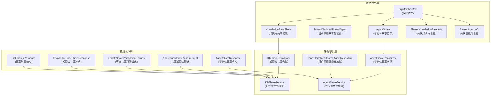

# 组织资源共享与访问控制契约

## 概述

在多租户 SaaS 环境中，不同团队和组织之间需要安全、灵活地共享知识库和智能体资源。`organization_resource_sharing_and_access_control_contracts` 模块定义了跨租户资源共享的核心契约、数据模型和服务接口，为组织内协作提供了坚实的基础设施。

想象一个企业内部的知识共享平台：不同部门（租户）各自管理自己的知识库，但需要在特定项目组（组织）中共享部分资源，同时保持严格的权限控制。这个模块就是实现这种"安全边界内的协作"的基石。

## 核心问题与解决方案

### 问题空间

1. **跨租户资源共享**：如何在保持租户隔离的前提下，让不同租户的用户共享知识库和智能体？
2. **细粒度权限控制**：如何实现从"只读查看"到"完全管理"的多级权限体系？
3. **可发现性与隐私平衡**：如何让组织可被发现，同时保持敏感资源的私密性？
4. **租户级偏好**：如何允许租户根据自身需求定制共享资源的可见性？

### 解决方案

该模块通过三层架构解决这些问题：
1. **数据模型层**：定义了 `KnowledgeBaseShare` 和 `AgentShare` 等核心实体，记录资源共享关系
2. **权限模型层**：基于 `OrgMemberRole` 的三级权限体系（viewer/editor/admin），支持权限继承和叠加
3. **服务契约层**：定义了 `KBShareService` 和 `AgentShareService` 等接口，规范共享操作的行为

## 架构设计

### 核心组件关系图



### 数据流动路径

当用户共享一个知识库到组织时，数据流动如下：

1. **请求发起**：用户通过 `ShareKnowledgeBaseRequest` 提交共享请求，指定组织ID和权限级别
2. **权限验证**：`KBShareService` 验证用户是否有该知识库的共享权限
3. **记录创建**：创建 `KnowledgeBaseShare` 记录，包含知识库ID、组织ID、权限和源租户信息
4. **持久化存储**：`KBShareRepository` 将共享记录保存到数据库
5. **响应返回**：返回 `KnowledgeBaseShareResponse`，包含共享记录的详细信息

当组织成员访问共享资源时：
1. **权限检查**：`CheckUserKBPermission` 方法同时检查用户在组织中的角色和资源共享权限
2. **权限叠加**：实际权限取两者中的较低值（min(组织角色, 共享权限)）
3. **访问控制**：根据最终权限决定用户可以执行的操作

## 核心设计决策

### 1. 三级权限模型（viewer/editor/admin）

**选择**：使用基于角色的三级权限体系，而非细粒度的ACL权限控制。

**权衡分析**：
- ✅ 优点：简单易懂，用户体验好，实现成本低
- ❌ 缺点：灵活性相对较低，无法支持极端复杂的权限场景

**设计理由**：在企业知识共享场景中，95%的需求可以通过三级权限满足。过度设计会增加用户认知负担和维护成本。权限级别通过数值映射（admin=3, editor=2, viewer=1）实现简洁的权限比较逻辑。

### 2. 双重权限检查机制

**选择**：实际权限 = min(用户在组织中的角色, 资源共享权限)

**权衡分析**：
- ✅ 优点：安全、灵活，既限制了资源提供者的权限范围，也考虑了组织内的角色分工
- ❌ 缺点：理解成本稍高，需要同时维护两套权限体系

**设计理由**：这种设计实现了"双重保险"：资源提供者可以限制共享权限（比如只共享viewer权限），而组织管理者可以控制成员在组织内的角色，两者的交集就是用户的实际权限。

### 3. 租户级资源禁用机制

**选择**：通过 `TenantDisabledSharedAgent` 实现租户级别的共享资源可见性控制，而非删除共享记录。

**权衡分析**：
- ✅ 优点：保持共享关系 intact，允许租户根据需要随时恢复可见性
- ❌ 缺点：增加了查询复杂度，需要在多处进行过滤

**设计理由**：租户可能希望暂时隐藏某个共享智能体，但并不想永久切断共享关系。这种"软禁用"机制提供了更好的用户体验和灵活性。

### 4. 跨租户资源的源租户追踪

**选择**：在 `KnowledgeBaseShare` 和 `AgentShare` 中显式记录 `SourceTenantID`。

**权衡分析**：
- ✅ 优点：支持跨租户的嵌入模型访问、计费追踪等高级功能
- ❌ 缺点：数据冗余，需要额外维护源租户信息

**设计理由**：在多租户环境中，资源的"所有者"和"使用者"可能属于不同租户，显式记录源租户是实现跨租户资源治理的基础。

## 子模块说明

本模块包含四个主要子模块，各自负责特定的功能领域：

### 1. 知识库共享契约
负责知识库共享的数据模型、请求响应契约和服务接口。

**主要组件**：
- `ShareKnowledgeBaseRequest` - 共享知识库的请求结构
- `KnowledgeBaseShare` - 知识库共享记录的核心模型
- `KnowledgeBaseShareResponse` - 知识库共享的响应结构
- `SharedKnowledgeBaseInfo` - 共享知识库的详细信息
- `OrganizationSharedKnowledgeBaseItem` - 组织范围内的共享知识库项

**详细文档**：[知识库共享契约](core_domain_types_and_interfaces-identity_tenant_organization_and_configuration_contracts-organization_resource_sharing_and_access_control_contracts-knowledge_base_sharing_contracts.md)

### 2. 智能体共享契约
负责智能体共享的数据模型、请求响应契约和服务接口。

**主要组件**：
- `AgentShare` - 智能体共享记录的核心模型
- `AgentShareResponse` - 智能体共享的响应结构
- `SharedAgentInfo` - 共享智能体的详细信息
- `OrganizationSharedAgentItem` - 组织范围内的共享智能体项
- `SourceFromAgentInfo` - 表示知识库通过共享智能体可见的信息

**详细文档**：[智能体共享契约](core_domain_types_and_interfaces-identity_tenant_organization_and_configuration_contracts-organization_resource_sharing_and_access_control_contracts-agent_sharing_contracts.md)

### 3. 共享权限与列表契约
负责共享权限更新和共享列表查询的契约定义。

**主要组件**：
- `UpdateSharePermissionRequest` - 更新共享权限的请求结构
- `ListSharesResponse` - 共享列表的响应结构

**详细文档**：[共享权限与列表契约](core_domain_types_and_interfaces-identity_tenant_organization_and_configuration_contracts-organization_resource_sharing_and_access_control_contracts-share_permission_and_listing_contracts.md)

### 4. 租户级共享智能体访问控制契约
负责租户级别的共享智能体可见性控制。

**主要组件**：
- `TenantDisabledSharedAgent` - 租户禁用共享智能体的记录模型
- `TenantDisabledSharedAgentRepository` - 租户禁用智能体的仓储接口

**详细文档**：[租户级共享智能体访问控制契约](core_domain_types_and_interfaces-identity_tenant_organization_and_configuration_contracts-organization_resource_sharing_and_access_control_contracts-tenant_level_shared_agent_access_control_contracts.md)

## 与其他模块的关系

### 依赖模块

1. **组织治理与成员管理契约**
   - 依赖关系：本模块依赖组织和成员模型来验证用户的组织角色
   - 交互：权限检查时需要查询用户在组织中的角色
   - 详细文档：[组织治理与成员管理契约](identity_tenant_organization_and_configuration_contracts-organization_governance_membership_and_join_workflow_contracts.md)

2. **知识库领域模型**
   - 依赖关系：本模块依赖知识库模型来表示共享的资源
   - 交互：共享记录中引用知识库ID，并在响应中返回知识库详细信息
   - 详细文档：[知识库领域模型](core_domain_types_and_interfaces-knowledge_graph_retrieval_and_content_contracts.md)

3. **自定义智能体领域模型**
   - 依赖关系：本模块依赖自定义智能体模型来表示共享的智能体资源
   - 交互：共享记录中引用智能体ID，并在响应中返回智能体详细信息
   - 详细文档：[自定义智能体领域模型](core_domain_types_and_interfaces-identity_tenant_organization_and_configuration_contracts-custom_agent_and_skill_capability_contracts.md)

### 被依赖模块

1. **组织资源共享与访问服务**
   - 依赖关系：服务层实现本模块定义的接口
   - 交互：服务层使用本模块的数据模型和接口契约
   - 详细文档：[资源共享与访问服务](application_services_and_orchestration-agent_identity_tenant_and_configuration_services-resource_sharing_and_access_services.md)

2. **共享资源访问仓储**
   - 依赖关系：仓储层实现本模块定义的仓储接口
   - 交互：仓储层负责持久化本模块定义的数据模型
   - 详细文档：[共享资源访问仓储](data_access_repositories-identity_tenant_and_organization_repositories-organization_membership_sharing_and_access_control_repositories-shared_resource_access_repositories.md)

## 实践指南

### 常见使用场景

#### 1. 共享知识库到组织

```go
// 创建共享请求
req := &types.ShareKnowledgeBaseRequest{
    OrganizationID: "org-123",
    Permission:     types.OrgRoleViewer,
}

// 调用服务共享知识库
share, err := kbShareService.ShareKnowledgeBase(
    ctx,
    "kb-456",
    req.OrganizationID,
    "user-789",
    12345, // 源租户ID
    req.Permission,
)
```

#### 2. 检查用户对共享资源的权限

```go
// 检查用户是否有编辑权限
hasPermission, err := kbShareService.HasKBPermission(
    ctx,
    "kb-456",
    "user-789",
    types.OrgRoleEditor,
)

if hasPermission {
    // 执行编辑操作
}
```

#### 3. 禁用租户内的共享智能体

```go
// 禁用共享智能体
err := agentShareService.SetSharedAgentDisabledByMe(
    ctx,
    12345, // 当前租户ID
    "agent-456",
    67890, // 源租户ID
    true,   // 禁用
)
```

### 注意事项与常见陷阱

1. **权限叠加逻辑**
   - 记住实际权限是用户组织角色和共享权限的较小值
   - 即使资源共享了admin权限，如果用户在组织中只是viewer，实际权限仍然是viewer

2. **源租户ID的重要性**
   - 在跨租户场景中，始终确保正确设置和传递 `SourceTenantID`
   - 缺少源租户信息会导致嵌入模型访问、计费等功能异常

3. **软删除机制**
   - 共享记录使用软删除（`DeletedAt` 字段），查询时注意过滤已删除记录
   - 仓储层的方法通常已经处理了这一点，但自定义查询需要特别注意

4. **租户禁用 vs 共享删除**
   - 租户禁用智能体只是隐藏可见性，不影响共享关系
   - 如果需要彻底解除共享，使用 `RemoveShare` 方法

5. **组织内资源的"IsMine"标志**
   - 在组织共享列表中，`IsMine` 标志表示资源是否属于当前用户
   - 这对于区分"我共享的"和"他人共享的"资源很重要

## 总结

`organization_resource_sharing_and_access_control_contracts` 模块是实现多租户环境下安全、灵活资源共享的核心基础设施。它通过简洁的三级权限模型、双重权限检查机制和租户级偏好控制，在安全性和易用性之间取得了良好的平衡。

该模块的设计体现了"简单但足够灵活"的原则：三级权限覆盖了绝大多数场景，双重检查确保了安全性，软删除和禁用机制提供了良好的用户体验。对于新加入团队的开发者来说，理解这些设计决策背后的权衡，是正确使用和扩展该模块的关键。
