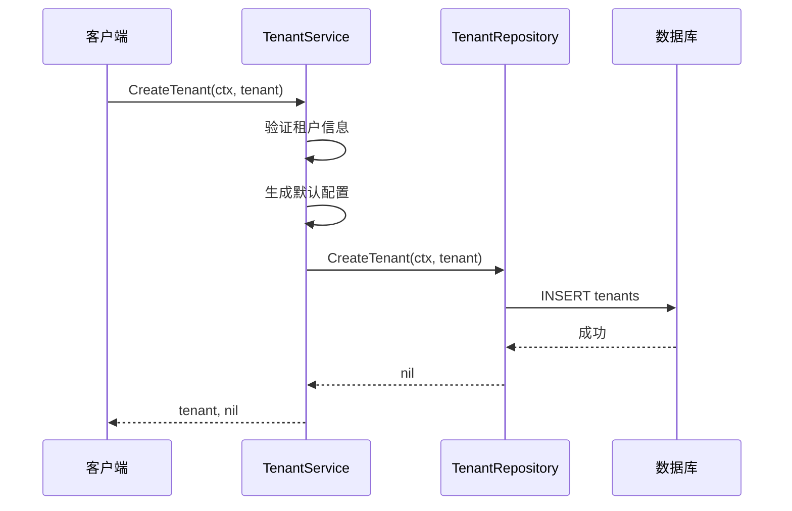
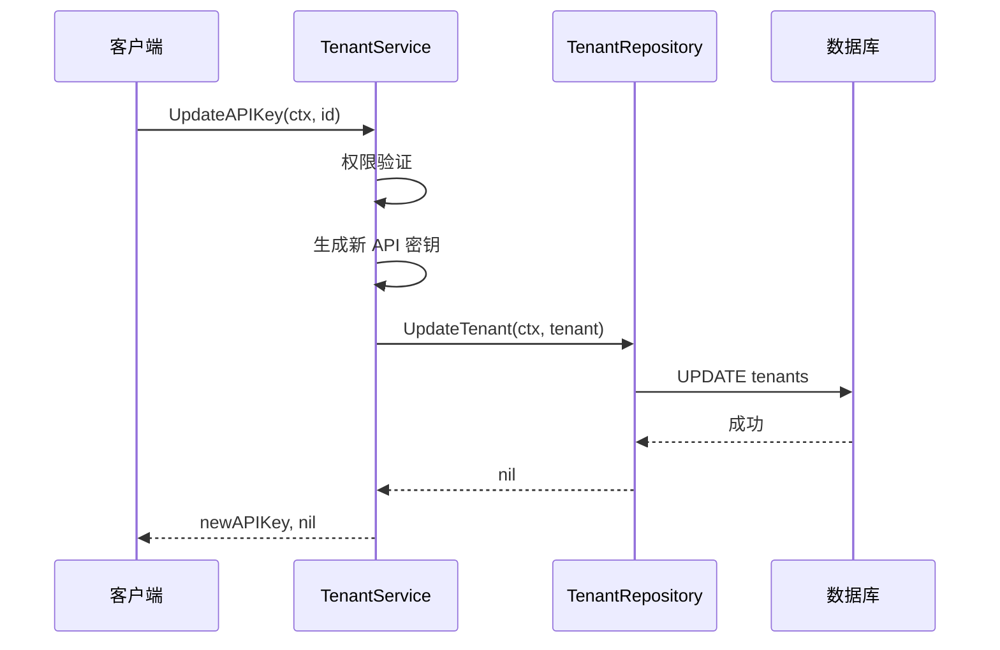
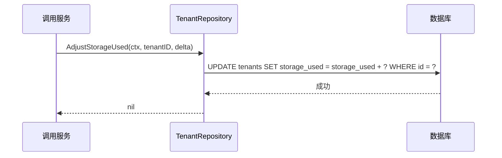
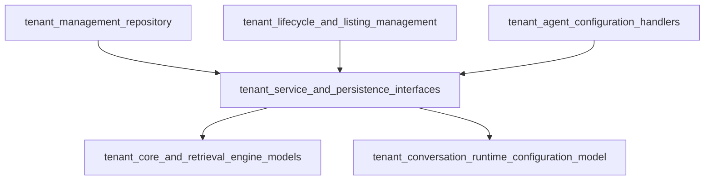

# 租户服务与持久化接口深度解析

## 1. 模块概览

想象一个大型办公楼，里面有多家公司各自租用办公空间。每家公司（租户）都有自己的办公室、会议室、储物空间，他们共享大楼的基础设施，但彼此的业务完全独立。大楼管理员需要知道每层楼有哪些公司、每家公司使用了多少空间、如何识别不同公司的员工等。

在软件系统中，`tenant_service_and_persistence_interfaces` 模块就扮演着"大楼管理员"的角色——它定义了多租户系统中租户的"花名册"和"管理手册"。在多租户架构中，租户是资源隔离和权限控制的核心边界，每个租户拥有自己的数据、配置和用户群体，但共享同一个应用实例。

这个模块定义了租户生命周期管理和数据持久化的抽象契约，为整个系统提供了统一的租户领域模型和操作接口。它不包含具体的实现逻辑，而是通过清晰的接口定义，确保了租户信息的一致性、安全性和可扩展性。无论是传统的 SQL 数据库还是现代的 NoSQL 存储，都可以通过实现这些接口来支持系统的租户管理需求。

## 2. 核心组件详解

### TenantService 接口
`TenantService` 定义了租户业务逻辑的抽象接口，它是租户管理功能的"大脑"，处理租户的创建、查询、更新、删除以及 API 密钥管理等核心操作。

```go
// TenantService 定义了租户服务接口
type TenantService interface {
    // 基础 CRUD 操作
    CreateTenant(ctx context.Context, tenant *types.Tenant) (*types.Tenant, error)
    GetTenantByID(ctx context.Context, id uint64) (*types.Tenant, error)
    ListTenants(ctx context.Context) ([]*types.Tenant, error)
    UpdateTenant(ctx context.Context, tenant *types.Tenant) (*types.Tenant, error)
    DeleteTenant(ctx context.Context, id uint64) error
    
    // API 密钥管理
    UpdateAPIKey(ctx context.Context, id uint64) (string, error)
    ExtractTenantIDFromAPIKey(apiKey string) (uint64, error)
    
    // 高级查询和权限控制
    ListAllTenants(ctx context.Context) ([]*types.Tenant, error)
    SearchTenants(ctx context.Context, keyword string, tenantID uint64, page, pageSize int) ([]*types.Tenant, int64, error)
    GetTenantByIDForUser(ctx context.Context, tenantID uint64, userID string) (*types.Tenant, error)
}
```

**接口设计解析**：
- **基础 CRUD 操作**：提供标准的创建、读取、更新、删除功能，注意 CreateTenant 和 UpdateTenant 方法会返回更新后的租户对象，这是因为在创建或更新过程中可能会设置一些服务器端生成的字段（如创建时间、更新时间等）。
- **API 密钥管理**：这两个方法是租户认证的核心，UpdateAPIKey 用于重新生成租户的 API 密钥，ExtractTenantIDFromAPIKey 则用于从 API 密钥中解析租户 ID，注意后者不需要 context 参数，说明它是一个纯函数操作。
- **高级查询和权限控制**：这些方法提供了更复杂的查询功能和权限检查，ListAllTenants 可能用于具有管理员权限的用户，SearchTenants 支持关键字搜索和分页，GetTenantByIDForUser 则在获取租户信息的同时进行权限验证。

### TenantRepository 接口
`TenantRepository` 定义了租户数据持久化的抽象接口，它是租户管理功能的"手脚"，负责与底层存储系统的交互。

```go
// TenantRepository 定义了租户仓库接口
type TenantRepository interface {
    // 基础 CRUD 操作
    CreateTenant(ctx context.Context, tenant *types.Tenant) error
    GetTenantByID(ctx context.Context, id uint64) (*types.Tenant, error)
    ListTenants(ctx context.Context) ([]*types.Tenant, error)
    SearchTenants(ctx context.Context, keyword string, tenantID uint64, page, pageSize int) ([]*types.Tenant, int64, error)
    UpdateTenant(ctx context.Context, tenant *types.Tenant) error
    DeleteTenant(ctx context.Context, id uint64) error
    
    // 特殊操作
    AdjustStorageUsed(ctx context.Context, tenantID uint64, delta int64) error
}
```

**接口设计解析**：
- **基础 CRUD 操作**：与 Service 层的方法相比，Repository 层的 CreateTenant 和 UpdateTenant 方法不返回更新后的对象，这是因为 Repository 层只负责数据持久化，不处理业务逻辑生成的字段。
- **SearchTenants**：这个方法在两个接口中都存在，但职责不同，Repository 层只负责执行查询和返回结果，不处理权限逻辑。
- **AdjustStorageUsed**：这是 Repository 层特有的方法，专门用于高效地调整租户的存储使用量，使用 delta（增量）而不是直接设置新值，这种设计有利于并发控制和性能优化。

## 3. 设计思想与架构模式

### 3.1 分层架构设计

这个模块采用了经典的分层架构模式，通过 Service-Repository 模式实现了业务逻辑与数据持久化的解耦。这种架构就像餐厅的运营模式：

- **Service 层**就像餐厅的服务员和经理，负责接待顾客、处理订单、协调厨房工作
- **Repository 层**就像餐厅的后厨，负责食材的存储和准备
- **Domain Model**就像菜单和食谱，定义了可以提供什么

具体来说：
1. **Service 层**：负责业务逻辑、权限控制、事务协调
2. **Repository 层**：专注于数据存取、查询优化、数据转换
3. **Domain Model**：租户领域模型

### 3.2 接口隔离原则

模块通过定义清晰的接口，遵循了接口隔离原则（ISP），将不同的关注点分离到不同的接口中。就像一个好的API设计，不应该让客户依赖他们不需要的方法。

这种设计使得：
- **服务层和持久化层可以独立演化**：就像餐厅可以更换后厨设备而不改变前台服务流程
- **测试变得更加容易**：可以轻松实现 Mock 对象，就像彩排时不需要真的做饭
- **支持多种存储后端的实现**：系统可以根据需要切换不同的数据库，就像餐厅可以选择不同的食材供应商

### 3.3 依赖倒置原则

这个模块很好地体现了依赖倒置原则（DIP）：高层模块不依赖低层模块，二者都依赖抽象；抽象不依赖细节，细节依赖抽象。这意味着系统的业务逻辑不直接依赖于具体的数据库实现，而是依赖于定义好的接口，这样整个系统更加灵活和可维护。

## 4. 核心功能与数据流程

### 4.1 租户生命周期管理

租户生命周期管理是这个模块最核心的功能，涵盖了租户从创建到删除的完整管理流程。

#### 租户创建流程


#### 租户查询流程
租户查询支持多种方式，包括按 ID 查询、列表查询和搜索查询。其中搜索查询还支持分页，适合处理大量租户数据的场景。

#### 租户更新与删除
更新和删除操作通常需要先进行权限验证，确保当前用户有权限执行这些操作。删除操作可能还需要级联处理与该租户相关的其他数据。

### 4.2 API 密钥管理

API 密钥管理是租户安全认证的重要组成部分，通过 API 密钥可以快速识别租户身份。

#### API 密钥更新流程


#### API 密钥解析
`ExtractTenantIDFromAPIKey` 方法不需要访问数据库，直接从 API 密钥中解析出租户 ID，这是一个纯函数操作，性能很高。这意味着 API 密钥的格式必须包含租户 ID 信息，通常是通过编码方式将租户 ID 嵌入到密钥中。

### 4.3 存储管理

`AdjustStorageUsed` 是一个特殊的操作，用于调整租户的存储使用量。与普通的更新操作不同，这个方法使用增量（delta）方式调整，而不是直接设置新值。

#### 存储使用量调整流程


这种设计有几个优点：
1. **并发安全**：使用数据库的原子操作，避免并发更新冲突
2. **性能优化**：不需要先读取当前值，直接在数据库端进行计算
3. **准确性**：避免了在应用层计算可能带来的误差

### 4.4 权限控制设计

模块中包含了几个与权限控制相关的方法，如 `GetTenantByIDForUser`、`ListAllTenants` 等。这些方法的设计体现了系统的安全模型：

- `GetTenantByIDForUser`：需要同时提供租户 ID 和用户 ID，用于验证用户是否有权限访问该租户
- `ListAllTenants`：列出所有租户，通常只允许具有跨租户访问权限的用户调用
- `SearchTenants`：支持关键字搜索和分页，同时还接受一个 `tenantID` 参数，可能用于限制搜索范围

这些权限控制逻辑通常在 Service 层实现，确保了 Repository 层的通用性。

## 5. 依赖关系与系统集成

### 5.1 模块依赖图



### 5.2 依赖关系分析

- **上游调用者**：
  - 租户管理服务层：`tenant_lifecycle_and_listing_management`
  - 数据访问层：`tenant_management_repository`
  - HTTP 接口层：`tenant_agent_configuration_handlers`

- **下游依赖**：
  - 租户核心模型：`tenant_core_and_retrieval_engine_models`
  - 运行时配置：`tenant_conversation_runtime_configuration_model`

### 5.3 系统集成角色

这个模块在系统中扮演着"契约层"的角色，定义了租户管理功能的核心接口和数据契约，确保了各个组件之间的解耦和可替换性。

## 6. 设计权衡与决策

### 6.1 接口 vs 实现分离

**决策**：采用纯接口定义，不包含任何实现细节
**原因**：
- 支持多种实现方式：可以有 SQL 数据库、NoSQL 数据库、甚至内存存储等不同的实现
- 便于测试：可以轻松创建 Mock 对象进行单元测试
- 遵循依赖倒置原则：高层模块不依赖低层模块，都依赖抽象

### 6.2 权限控制的位置

**决策**：在 Service 层进行权限控制，而不是在 Repository 层
**原因**：
- 权限逻辑属于业务逻辑范畴，应该放在 Service 层
- Repository 层应该保持简单，专注于数据存取
- 这样设计使得 Repository 层更加通用，可以在不同的权限上下文中复用

### 6.3 存储管理操作的特殊处理

**决策**：`AdjustStorageUsed` 方法单独放在 Repository 层
**原因**：
- 存储使用量的调整通常需要原子操作和并发控制
- 这种操作更接近数据层，而不是业务逻辑层
- 单独设计可以优化性能，避免不必要的对象加载

### 6.4 API 密钥功能的设计

**决策**：API 密钥管理功能放在 Service 层
**原因**：
- API 密钥管理涉及密钥生成、验证、编码等业务逻辑
- 这些逻辑与具体的存储实现无关
- 可以在不改变存储层的情况下更改密钥生成算法

## 7. 使用指南与最佳实践

### 7.1 实现 TenantService

当实现 `TenantService` 时，应该注意以下几点：

1. **事务管理**：在涉及多个操作的方法中，确保使用事务来保证数据一致性
2. **权限检查**：在需要权限控制的方法中，先进行权限检查，再执行实际操作
3. **错误处理**：提供清晰的错误信息，区分不同类型的错误（如权限错误、数据不存在错误等）
4. **日志记录**：记录关键操作的日志，便于审计和问题排查

### 7.2 实现 TenantRepository

当实现 `TenantRepository` 时，应该注意以下几点：

1. **数据完整性**：确保实现数据完整性约束，如外键约束、唯一约束等
2. **查询优化**：针对常用查询进行优化，如添加索引、优化查询语句等
3. **并发控制**：对于可能并发修改的数据，实现适当的并发控制机制
4. **资源管理**：确保正确管理数据库连接等资源，避免资源泄漏

## 8. 常见问题与注意事项

### 8.1 租户 ID 类型

注意到租户 ID 使用的是 `uint64` 类型，这意味着系统最多支持 18446744073709551615 个租户，这在大多数情况下是足够的。但需要注意与其他可能使用不同 ID 类型的系统集成时的类型转换问题。

### 8.2 API 密钥安全

`ExtractTenantIDFromAPIKey` 方法从 API 密钥中提取租户 ID，这意味着 API 密钥必须包含租户 ID 信息。这带来了一些安全考虑：
- API 密钥应该使用安全的加密算法生成
- 不要在 API 密钥中包含敏感信息
- API 密钥应该定期更换

### 8.3 存储使用量调整

`AdjustStorageUsed` 方法使用 `delta` 参数来调整存储使用量，这意味着可以增加或减少存储使用量。需要注意：
- 确保 `delta` 的计算是准确的
- 在并发环境下，确保操作的原子性
- 考虑添加验证，防止存储使用量变为负数

### 8.4 分页查询

`SearchTenants` 方法支持分页查询，这对于处理大量租户数据是必要的。需要注意：
- 合理设置默认页面大小
- 考虑最大页面大小限制，防止恶意请求
- 确保分页查询的性能

## 9. 总结与展望

`tenant_service_and_persistence_interfaces` 模块是系统租户管理功能的核心抽象层，它通过清晰的接口定义和分层设计，实现了业务逻辑与数据持久化的解耦。这种设计使得系统具有良好的可扩展性、可测试性和可维护性。

未来可能的演进方向：
- 添加更多的查询方法，支持更复杂的查询需求
- 引入事件驱动架构，支持租户状态变化的事件通知
- 增强租户配额管理功能，支持更细粒度的资源控制
- 优化 API 密钥管理，支持更灵活的密钥策略

通过理解这个模块的设计思想和实现细节，开发者可以更好地使用和扩展租户管理功能，为系统的多租户架构提供坚实的基础。

