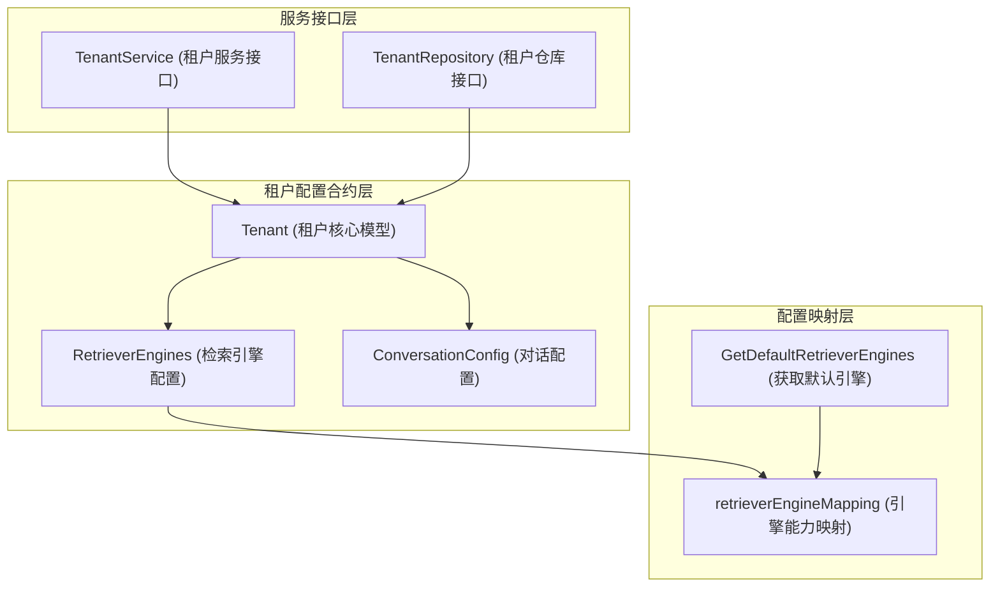

# 租户生命周期与运行时配置合约

## 模块概述

想象一个多租户的智能知识库平台，每个租户都像一个独立的"虚拟办公室"——它们共享基础设施，但拥有自己的空间、配置和资源。`tenant_lifecycle_and_runtime_configuration_contracts` 模块就是这个平台的"物业管理系统"，它定义了如何创建、管理和配置这些独立空间的核心规则。

这个模块解决的核心问题是：**如何在共享基础设施的同时，为每个租户提供完全隔离的配置空间、资源配额和检索引擎选择？** 它不仅定义了租户的数据模型，还规定了如何安全地存储、检索和更新这些配置，以及如何在系统默认配置和租户自定义配置之间优雅地切换。

## 核心概念与心智模型

在深入代码之前，让我们建立几个关键的心智模型：

### 1. 租户作为"配置容器"
把 `Tenant` 想象成一个智能的"配置盒子"：
- 它包含身份信息（名称、描述、API密钥）
- 它持有资源配额（存储限制）
- 它封装了运行时配置（检索引擎、对话参数）
- 它知道如何"回退"到系统默认值（当自身配置缺失时）

### 2. 检索引擎的"能力矩阵"
`RetrieverEngines` 不是一个简单的列表，而是一个"能力矩阵"：
- 不同的后端（Postgres、Elasticsearch、Qdrant等）支持不同的检索类型（关键词、向量）
- `retrieverEngineMapping` 就像一张"能力地图"，告诉系统每个后端能做什么
- 租户可以选择自己的组合，也可以使用系统默认配置

### 3. 配置的"层级 fallback"机制
这个模块采用了一种优雅的配置 fallback 策略：
```
租户自定义配置 → 系统默认配置 → 编译时默认值
```
这种设计意味着租户可以只覆盖他们关心的配置，其余的自动使用系统默认值。

## 架构概览

让我们通过一个 Mermaid 图来理解这个模块的架构：



### 架构叙事

这个模块的架构遵循了清晰的分层设计：

1. **数据模型层**：由 `Tenant`、`RetrieverEngines` 和 `ConversationConfig` 组成，它们定义了租户数据的结构和序列化/反序列化逻辑。
   
2. **能力映射层**：`retrieverEngineMapping` 和相关函数构成了配置的"知识库"，它知道不同检索后端的能力边界。

3. **服务接口层**：`TenantService` 和 `TenantRepository` 定义了业务逻辑和数据持久化的契约，它们是连接此模块与系统其他部分的桥梁。

数据流向很直观：当需要检索租户配置时，系统会先检查租户是否有自定义配置，如果没有，就从 `GetDefaultRetrieverEngines` 获取系统默认值。

## 核心组件详解

### Tenant 结构体：租户的"配置容器"

`Tenant` 是这个模块的核心，它不仅仅是一个数据结构，更是一个智能的配置管理器。

#### 设计亮点：

1. **JSON/数据库无缝映射**：通过 `gorm:"type:json"` 和自定义的 `Value/Scan` 方法，复杂配置对象可以直接存储为数据库 JSON 字段。

2. **优雅的配置 fallback**：`GetEffectiveEngines()` 方法体现了"约定优于配置"的理念——租户可以完全自定义检索引擎，也可以什么都不配置而使用系统默认值。

3. **向后兼容性**：注意 `AgentConfig` 和 `ConversationConfig` 字段上的 `Deprecated` 注释，这显示了模块设计者对迁移路径的深思熟虑。

#### 关键方法分析：

```go
func (t *Tenant) GetEffectiveEngines() []RetrieverEngineParams {
    if len(t.RetrieverEngines.Engines) > 0 {
        return t.RetrieverEngines.Engines
    }
    return GetDefaultRetrieverEngines()
}
```

这个简单的方法蕴含了重要的设计哲学：**租户配置应该是可选的覆盖，而不是必需的重复**。它让系统在保持灵活性的同时，避免了配置爆炸。

### RetrieverEngines：检索引擎的"能力组合"

`RetrieverEngines` 结构体和相关的映射逻辑是这个模块最有趣的部分之一。

#### 设计意图：

`retrieverEngineMapping` 不是一个简单的配置，而是一个**能力声明系统**。它告诉系统：
- Postgres 可以同时处理关键词和向量检索
- Elasticsearch v7 只能处理关键词检索（而 v8 可以处理两者）
- Milvus 可以处理向量和关键词检索

这种设计允许：
1. **租户选择适合自己的后端**：一个注重成本的租户可能选择 Postgres，一个追求性能的租户可能选择 Elasticsearch v8。
2. **系统优雅降级**：如果某个后端不可用，系统可以知道哪些能力会受到影响。

### ConversationConfig：对话的"参数控制面板"

`ConversationConfig` 是一个典型的"参数对象"模式，它将对话相关的所有配置集中管理。

#### 设计权衡：

这个结构体展示了一个常见的设计权衡：**完整性 vs 简洁性**。它包含了从提示词到模型参数，从检索策略到 fallback 配置的所有内容。

这种设计的优点是：
- **配置的一致性**：所有对话相关的参数都在一个地方
- **序列化的便利性**：可以轻松地将整个配置存储为 JSON

缺点是：
- **结构可能变得臃肿**：随着功能增加，这个结构体会越来越大
- **部分参数可能相互影响**：修改一个参数可能会影响其他参数的行为

### 服务接口：契约大于实现

`TenantService` 和 `TenantRepository` 接口展示了这个模块的另一个重要设计理念：**面向接口编程**。

#### 设计亮点：

1. **清晰的职责分离**：
   - `TenantRepository` 专注于数据持久化
   - `TenantService` 专注于业务逻辑（如 API 密钥管理、权限检查）

2. **丰富的查询能力**：
   - `SearchTenants` 支持分页和关键词搜索
   - `GetTenantByIDForUser` 支持权限检查
   - `ListAllTenants` 支持跨租户访问

这些接口定义了模块与外部世界的契约，使得不同的实现可以无缝替换，同时保持系统行为的一致性。

## 关键设计决策

### 1. JSON 存储 vs 关系型存储

**决策**：将复杂配置（`RetrieverEngines`、`ConversationConfig`）存储为 JSON 字段。

**权衡分析**：
- ✅ **灵活性**：可以轻松添加新的配置字段，无需数据库迁移
- ✅ **性能**：一次查询就能获取所有配置，无需 JOIN
- ❌ **查询能力**：无法高效地查询配置内部的特定字段
- ❌ **类型安全**：数据库层面无法验证 JSON 内部结构

**为什么这样选择**：对于租户配置这种"写入少、读取多、结构可能变化"的数据，JSON 存储是一个很好的折中。配置通常作为一个整体使用，很少需要查询配置内部的单个字段。

### 2. 配置 fallback 机制

**决策**：实现租户配置 → 系统默认配置的 fallback 机制。

**权衡分析**：
- ✅ **简单性**：租户只需配置他们关心的部分
- ✅ **可维护性**：系统默认配置可以统一更新
- ❌ **行为不可预测**：如果系统默认配置改变，租户行为可能会意外改变
- ❌ **调试复杂性**：需要追踪配置的来源（租户自定义 vs 系统默认）

**为什么这样选择**：对于大多数租户来说，使用系统默认配置就足够了。只有特殊需求的租户才需要自定义配置。这种设计大大降低了租户的配置负担。

### 3. 能力映射 vs 动态发现

**决策**：使用静态的 `retrieverEngineMapping` 来定义后端能力，而不是动态发现。

**权衡分析**：
- ✅ **可预测性**：系统行为在编译时就确定了
- ✅ **性能**：无需运行时查询后端能力
- ❌ **扩展性**：添加新后端需要修改代码
- ❌ **灵活性**：无法动态适应后端能力变化

**为什么这样选择**：检索后端的能力相对稳定，不会频繁变化。静态映射提供了更好的性能和可预测性，这对于核心基础设施来说更为重要。

## 模块依赖与交互

这个模块在系统中处于**核心合约层**的位置，它定义了数据结构和接口，但不包含具体的实现。依赖关系如下：

### 被依赖模块
- **[identity_tenant_organization_and_configuration_contracts](../identity_tenant_organization_and_configuration_contracts.md)**：父模块，提供更广泛的身份和组织管理合约
- **[agent_configuration_and_external_service_repositories](../../data_access_repositories/agent_configuration_and_external_service_repositories.md)**：可能实现 `TenantRepository` 接口
- **[agent_identity_tenant_and_configuration_services](../../application_services_and_orchestration/agent_identity_tenant_and_configuration_services.md)**：可能实现 `TenantService` 接口

### 数据流向示例

让我们追踪一个典型的"创建租户并使用默认配置"的数据流：

1. **API 层**接收创建租户的请求
2. **服务层**调用 `TenantService.CreateTenant()`
3. **服务层**可能生成 API 密钥，设置默认状态
4. **仓库层**调用 `TenantRepository.CreateTenant()` 保存租户
5. **数据库层**将 `Tenant` 对象序列化为 JSON 并存储
6. 当后续需要检索配置时，调用 `Tenant.GetEffectiveEngines()` 获取有效配置

## 使用指南与注意事项

### 正确使用模式

#### 1. 创建租户时的最小配置
```go
tenant := &types.Tenant{
    Name:        "新租户",
    Description: "一个示例租户",
    // 不需要配置 RetrieverEngines，会自动使用默认值
    // 不需要配置 StorageQuota，会自动使用默认值 10GB
}
```

#### 2. 自定义检索引擎
```go
tenant := &types.Tenant{
    Name: "高级租户",
    RetrieverEngines: types.RetrieverEngines{
        Engines: []types.RetrieverEngineParams{
            {RetrieverType: types.KeywordsRetrieverType, RetrieverEngineType: types.ElasticsearchRetrieverEngineType},
            {RetrieverType: types.VectorRetrieverType, RetrieverEngineType: types.QdrantRetrieverEngineType},
        },
    },
}
```

#### 3. 始终使用 GetEffectiveEngines()
```go
// ❌ 错误：直接访问可能得到空配置
engines := tenant.RetrieverEngines.Engines

// ✅ 正确：使用 GetEffectiveEngines() 获取有效配置
engines := tenant.GetEffectiveEngines()
```

### 常见陷阱与注意事项

#### 1. 配置来源不明确
**问题**：当系统行为与预期不符时，很难判断是租户自定义配置还是系统默认配置导致的。

**缓解措施**：在日志中记录配置的来源（租户自定义 vs 系统默认）。

#### 2. 向后兼容性处理
**问题**：`AgentConfig` 和 `ConversationConfig` 已被弃用，但仍在代码中存在。

**缓解措施**：
- 新代码应该使用 CustomAgent 配置
- 实现迁移工具，帮助租户从旧配置迁移到新配置
- 在移除这些字段前，至少保留一个主要版本的过渡期

#### 3. JSON 序列化的边界情况
**问题**：当数据库中的 JSON 格式不正确时，`Scan()` 方法可能会静默失败。

**缓解措施**：
- 在写入时进行严格的验证
- 在读取时记录反序列化错误
- 考虑使用数据库层面的 JSON Schema 验证（如果数据库支持）

#### 4. 存储配额的原子性
**问题**：`AdjustStorageUsed()` 可能在高并发场景下产生竞态条件。

**缓解措施**：
- 实现数据库层面的原子更新（如使用 `UPDATE ... SET storage_used = storage_used + ?`）
- 考虑使用分布式锁来协调并发更新

## 子模块概览

这个模块被组织成三个清晰的子模块：

1. **[tenant_core_and_retrieval_engine_models](./core_domain_types_and_interfaces-identity_tenant_organization_and_configuration_contracts-tenant_lifecycle_and_runtime_configuration_contracts-tenant_core_and_retrieval_engine_models.md)**：定义租户核心数据模型和检索引擎配置
2. **[tenant_conversation_runtime_configuration_model](./core_domain_types_and_interfaces-identity_tenant_organization_and_configuration_contracts-tenant_lifecycle_and_runtime_configuration_contracts-tenant_conversation_runtime_configuration_model.md)**：定义对话运行时配置模型
3. **[tenant_service_and_persistence_interfaces](./core_domain_types_and_interfaces-identity_tenant_organization_and_configuration_contracts-tenant_lifecycle_and_runtime_configuration_contracts-tenant_service_and_persistence_interfaces.md)**：定义租户服务和持久化接口

每个子模块都有详细的文档，深入解释其职责、设计意图和使用方法。

## 总结

`tenant_lifecycle_and_runtime_configuration_contracts` 模块是多租户系统的基石，它通过精心设计的数据模型和接口，解决了共享基础设施中的租户隔离、配置管理和资源配额问题。

这个模块的设计体现了几个重要的软件工程原则：
- **约定优于配置**：通过默认配置减少租户的配置负担
- **面向接口编程**：通过接口定义契约，实现解耦
- **向后兼容性**：通过弃用注释和迁移路径，平滑演进
- **能力导向设计**：通过能力映射，让系统自适应不同的后端组合

理解这个模块的关键是不要把它看作简单的数据结构定义，而要把它看作一个**配置管理系统**——它知道如何在灵活性和简单性之间取得平衡，如何在共享基础设施中为每个租户提供个性化的体验。
