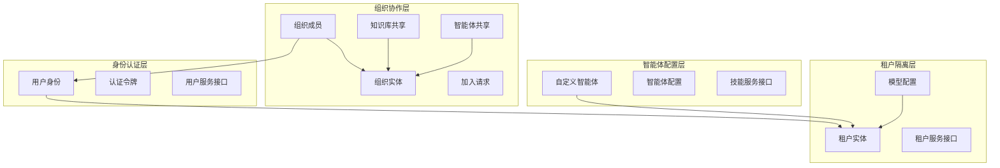

# 身份、租户、组织与配置契约模块

## 模块概览

**identity_tenant_organization_and_configuration_contracts** 模块是整个系统的基础架构层，定义了身份认证、租户隔离、组织协作和配置管理的核心数据模型与接口契约。它就像一座大厦的地基和框架，为上层的所有功能提供了稳定的结构支撑和边界定义。

这个模块解决的核心问题是：如何在一个多租户、支持组织协作的系统中，清晰地定义用户身份、数据隔离边界、资源共享规则和系统配置契约，同时保持足够的灵活性以支持不同的业务场景。

## 架构概述



这个架构图展示了模块的核心层次结构：

1. **身份认证层**：定义用户身份、认证令牌和相关服务接口，是系统的入口点
2. **租户隔离层**：提供数据隔离的基本单位，每个租户拥有独立的模型配置和资源
3. **组织协作层**：实现跨租户的资源共享和协作机制，支持知识库和智能体的共享
4. **智能体配置层**：定义可配置的AI智能体模型，支持不同的工作模式和能力组合

### 数据流动

典型的数据流动路径如下：

1. 用户通过 `LoginRequest` 认证，获得 `AuthToken`
2. 系统从令牌中提取用户身份和租户信息
3. 根据租户配置，加载对应的模型和智能体
4. 如果涉及组织协作，检查用户在组织中的角色和权限
5. 最终通过智能体配置执行相应的AI任务

## 核心设计决策

### 1. 租户作为数据隔离的基本单位

**设计选择**：采用租户（Tenant）作为数据隔离的边界，而不是基于用户或组织。

**为什么这样设计**：
- 租户代表一个独立的业务实体或组织单位，拥有完整的资源和配置
- 相比于用户级隔离，租户级隔离提供了更好的资源管理和成本控制
- 相比于组织级隔离，租户级隔离提供了更强的数据安全边界

**权衡**：
- ✅ 优点：数据隔离清晰，配置管理简单，适合SaaS场景
- ❌ 缺点：跨租户协作需要额外的机制（如组织共享）

### 2. 组织作为跨租户协作的桥梁

**设计选择**：引入组织（Organization）概念，允许不同租户的用户在同一个组织中协作和共享资源。

**为什么这样设计**：
- 纯租户隔离无法满足团队协作和资源共享的需求
- 组织提供了一个灵活的框架，可以在保持数据安全的同时促进协作
- 支持多种加入方式（邀请码、申请审批、公开搜索）适应不同场景

**权衡**：
- ✅ 优点：灵活的协作机制，支持多种权限级别，可发现性控制
- ❌ 缺点：增加了系统复杂度，需要仔细处理权限继承和冲突

### 3. 智能体配置的集中式管理

**设计选择**：将智能体的所有配置集中在 `CustomAgentConfig` 结构体中，而不是分散在多个实体中。

**为什么这样设计**：
- 智能体配置通常作为一个整体被使用和修改
- 集中式配置简化了序列化和持久化（使用JSON存储）
- 提供了完整的默认值机制，确保配置的一致性

**权衡**：
- ✅ 优点：配置完整一致，易于扩展，默认值管理简单
- ❌ 缺点：配置结构体可能变得很大，修改粒度较粗

### 4. 接口与实现分离

**设计选择**：明确定义服务接口（如 `CustomAgentService`、`TenantService`），将契约与实现分离。

**为什么这样设计**：
- 便于不同层次的测试（可以轻松mock服务）
- 支持多种实现方式（如不同的数据库后端）
- 清晰的API边界，便于模块间协作

**权衡**：
- ✅ 优点：高内聚低耦合，易于测试和扩展
- ❌ 缺点：增加了接口定义的代码量

## 子模块概览

本模块包含以下子模块，每个子模块负责特定的功能领域：

### 1. [用户身份注册与认证契约](identity_tenant_organization_and_configuration_contracts-user_identity_registration_and_auth_contracts.md)
定义用户身份模型、认证令牌、注册登录请求响应等核心概念，以及用户服务的接口契约。

### 2. [租户生命周期与运行时配置契约](identity_tenant_organization_and_configuration_contracts-tenant_lifecycle_and_runtime_configuration_contracts.md)
定义租户实体、检索引擎配置、会话配置等，以及租户管理的服务接口。

### 3. [组织治理、成员与加入工作流契约](identity_tenant_organization_and_configuration_contracts-organization_governance_membership_and_join_workflow_contracts.md)
定义组织实体、成员角色、加入请求工作流等，支持组织的创建、管理和成员加入。

### 4. [组织资源共享与访问控制契约](identity_tenant_organization_and_configuration_contracts-organization_resource_sharing_and_access_control_contracts.md)
定义知识库和智能体的共享机制、权限控制模型，以及相关的服务接口。

### 5. [自定义智能体与技能能力契约](identity_tenant_organization_and_configuration_contracts-custom_agent_and_skill_capability_contracts.md)
定义自定义智能体模型、配置选项、内置智能体，以及智能体和技能服务的接口。

### 6. [模型目录与参数契约](identity_tenant_organization_and_configuration_contracts-model_catalog_and_parameter_contracts.md)
定义AI模型的类型、参数、来源，以及模型服务和仓库的接口契约。

## 与其他模块的关系

这个模块是整个系统的基础，被几乎所有其他模块依赖：

- **依赖本模块的模块**：
  - [application_services_and_orchestration](../application_services_and_orchestration.md)：使用租户、用户和智能体配置执行业务逻辑
  - [data_access_repositories](../data_access_repositories.md)：实现本模块定义的仓库接口
  - [http_handlers_and_routing](../http_handlers_and_routing.md)：使用本模块的请求/响应模型处理HTTP请求

- **本模块依赖的模块**：
  - 核心域类型基础（无外部依赖，是最底层的模块之一）

## 关键使用指南

### 智能体配置默认值

当创建自定义智能体时，始终使用 `EnsureDefaults()` 方法确保配置的完整性：

```go
agent := &CustomAgent{
    Name: "我的智能体",
    TenantID: 123,
    Config: CustomAgentConfig{
        AgentMode: AgentModeQuickAnswer,
    },
}
agent.EnsureDefaults()  // 填充所有必要的默认值
```

### 权限检查

在组织协作场景中，使用 `HasPermission()` 方法检查角色权限：

```go
userRole := OrgRoleViewer
requiredRole := OrgRoleEditor

if userRole.HasPermission(requiredRole) {
    // 允许执行操作
}
```

### 模型参数持久化

模型参数使用自定义的 `Value()` 和 `Scan()` 方法实现数据库序列化，无需额外处理：

```go
// 保存到数据库时自动序列化为JSON
model.Parameters = ModelParameters{
    BaseURL: "https://api.example.com",
    APIKey: "secret-key",
}

// 从数据库读取时自动反序列化
// ...
```

## 注意事项与陷阱

1. **租户ID的重要性**：大多数操作都需要正确的租户ID，忘记设置可能导致数据隔离失效。

2. **配置默认值**：创建智能体时务必调用 `EnsureDefaults()`，否则可能导致运行时错误。

3. **角色权限层次**：权限检查使用层次模型（admin > editor > viewer），确保理解权限继承关系。

4. **JSON配置字段**：`CustomAgentConfig`、`ModelParameters` 等结构体作为JSON存储在数据库中，修改字段时要考虑向后兼容性。

5. **内置智能体的只读性**：内置智能体（如快速问答、智能推理）不能被修改或删除，尝试这样做会返回错误。

6. **跨租户资源共享**：共享资源时要注意源租户ID的正确记录，这对于跨租户访问嵌入模型等场景至关重要。
