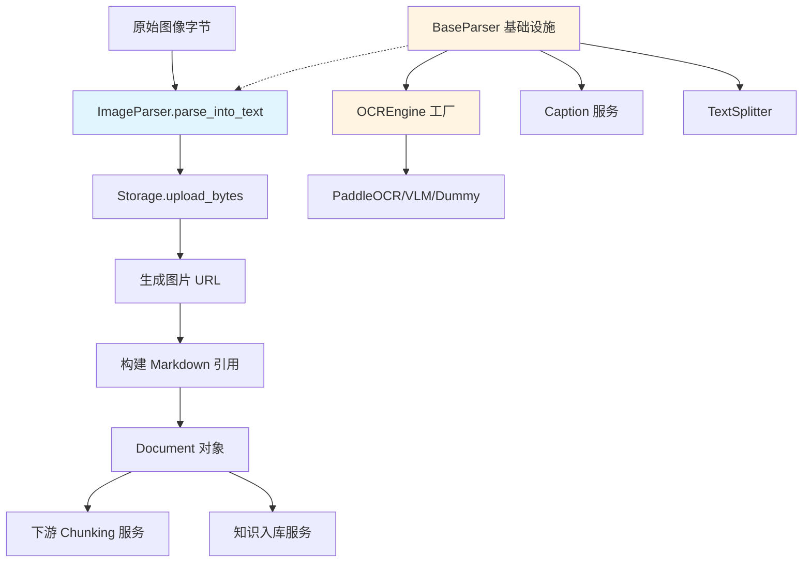

# image_ocr_parsing 模块技术深度解析

## 模块概述

想象一下，你有一个智能文档处理系统，用户上传了一份扫描的合同图片、一张包含表格的截图，或者一份产品手册的照片。系统需要"看懂"这些图片里的文字内容，才能进行后续的检索、问答和分析。`image_ocr_parsing` 模块正是解决这个问题的核心组件 —— 它负责将图像文件转换为机器可读的文本，同时保留图像本身的引用信息。

这个模块的设计洞察在于：**图像解析不是单一操作，而是一个多阶段的流水线**。 naive 的做法可能是直接调用 OCR 库然后返回文本，但实际生产环境需要考虑更多：图片可能很大需要预处理、OCR 可能失败需要降级策略、图片本身需要存储并生成可访问的 URL、某些场景还需要 AI 生成图片描述（caption）。`ImageParser` 通过继承 `BaseParser` 复用了一整套基础设施，自身专注于图像文件的特定处理逻辑，体现了"组合优于继承"的设计哲学。

从架构角色来看，这个模块是 `docreader_pipeline` 中的**格式特定解析器**之一，位于文档 ingestion 流程的最前端。它接收原始字节流，输出结构化的 `Document` 对象，供下游的 chunking、索引构建和检索服务使用。

## 架构与数据流



**数据流 walkthrough**：

1. **入口**：上层服务（如 `knowledgeService`）调用 `ImageParser.parse()` 方法，传入图像文件的原始字节
2. **存储上传**：`parse_into_text()` 首先调用 `self.storage.upload_bytes()` 将图片上传到对象存储（COS/MinIO 等），获取可访问的 URL
3. **Markdown 构建**：生成 `` 格式的 Markdown 文本，同时将图片 base64 编码存入 `images` 字典
4. **文档返回**：返回 `Document` 对象，包含文本内容和图片映射
5. **可选的 OCR 扩展**：如果启用了多模态处理，`BaseParser.parse()` 会进一步调用 `process_chunks_images()` 对 chunk 中的图片执行 OCR 和 caption 生成

**关键依赖关系**：
- **被调用方**：`knowledgeService`、`chunkService` 等 ingestion 服务通过 parser 工厂实例化并调用此模块
- **调用方**：依赖 `BaseParser` 提供的 OCR 引擎、Caption 服务、Storage 客户端；依赖 `OCREngine` 工厂获取具体 OCR 后端

## 核心组件深度解析

### ImageParser 类

**设计意图**：`ImageParser` 是专门处理图像文件格式的解析器。它的设计哲学是"轻量级封装"—— 对于纯图像文件，核心任务是将图片上传到存储并生成引用，而不是立即执行 OCR。这是因为 OCR 是耗时操作，应该按需触发（例如在 chunk 处理阶段）。

**内部机制**：
```python
def parse_into_text(self, content: bytes) -> Document:
    # 1. 获取文件扩展名
    ext = os.path.splitext(self.file_name)[1].lower()
    
    # 2. 上传到对象存储
    image_url = self.storage.upload_bytes(content, file_ext=ext)
    
    # 3. 构建 Markdown 引用
    text = f""
    images = {image_url: base64.b64encode(content).decode()}
    
    # 4. 返回 Document
    return Document(content=text, images=images)
```

这个看似简单的方法背后有几个关键设计点：

1. **延迟 OCR 策略**：方法本身不执行 OCR，只负责存储和引用。OCR 在 `BaseParser.parse()` 的后续流程中按需执行。这样做的好处是：如果用户只需要图片引用而不需要 OCR 文本，可以避免不必要的计算开销。

2. **双重图片表示**：同时存储 `image_url`（用于前端展示）和 base64 编码（用于后续 OCR 处理）。这是一个空间换时间的权衡 —— base64 会增加约 33% 的存储开销，但避免了二次读取原始文件的 IO。

3. **失败降级**：如果 `storage.upload_bytes()` 返回空 URL，方法不会抛出异常，而是返回仅包含文件名的 Document。这种"尽力而为"的策略保证了 pipeline 的健壮性。

**参数与返回值**：
- `content: bytes`：原始图像字节流
- 返回 `Document`：包含 Markdown 文本、图片映射、以及后续填充的 chunks

**副作用**：
- 将图片上传到对象存储（副作用发生在 `self.storage`）
- 可能触发 OCR 引擎的懒加载（如果后续调用 `parse()`）

### BaseParser 的 OCR 基础设施（继承能力）

虽然 `ImageParser` 自身代码简洁，但它继承了 `BaseParser` 的一整套 OCR 基础设施。理解这些 inherited 能力对于有效使用 `ImageParser` 至关重要。

#### OCR 引擎工厂模式

`BaseParser` 使用类变量共享 OCR 引擎实例，采用**懒加载 + 失败熔断**模式：

```python
@classmethod
def get_ocr_engine(cls, backend_type="paddle", **kwargs):
    if cls._ocr_engine is None and not cls._ocr_engine_failed:
        try:
            cls._ocr_engine = OCREngine.get_instance(backend_type=backend_type, **kwargs)
        except Exception as e:
            cls._ocr_engine_failed = True  # 熔断：避免重复尝试
            return None
    return cls._ocr_engine
```

**设计权衡**：
- **共享实例 vs 每实例独立**：选择共享实例是因为 OCR 引擎初始化开销大（加载模型、初始化推理引擎），且引擎本身是无状态的。但这意味着所有 parser 实例共享同一个后端配置，无法为不同文件类型使用不同 OCR 引擎。
- **失败熔断**：`_ocr_engine_failed` 标志位防止在引擎初始化失败后反复尝试，避免日志污染和性能浪费。代价是：如果后续修复了环境问题（如安装了缺失的依赖），需要重启进程才能重新初始化。

#### 异步并发图像处理

`BaseParser` 提供了完整的异步并发框架来处理多张图片：

```python
async def process_multiple_images(self, images_data: List[Tuple[Image.Image, str]]):
    semaphore = asyncio.Semaphore(self.max_concurrent_tasks)  # 限流
    tasks = [self.process_with_limit(i, img, url, semaphore) for i, (img, url) in enumerate(images_data)]
    results = await asyncio.gather(*tasks, return_exceptions=True)  # 容错
```

**关键设计点**：
1. **Semaphore 限流**：通过 `max_concurrent_tasks`（默认 5）控制并发度，避免同时发起过多 OCR 请求导致内存爆炸或 API 限流。
2. **异常隔离**：`return_exceptions=True` 确保单张图片处理失败不影响其他图片，符合"部分成功优于完全失败"的原则。
3. **资源清理**：在 `finally` 块中显式关闭 PIL Image 对象，防止内存泄漏。

#### 图像预处理：尺寸归一化

```python
def _resize_image_if_needed(self, image: Image.Image) -> Image.Image:
    width, height = image.size
    if width > self.max_image_size or height > self.max_image_size:
        scale = min(self.max_image_size / width, self.max_image_size / height)
        return image.resize((int(width * scale), int(height * scale)))
    return image
```

**为什么需要这个**：OCR 模型的推理时间通常与图像像素数成正比。一张 4000x3000 的手机截图可能是 1920x1080 的 3.5 倍像素，但文字可读性并不会线性提升。限制最大边长（默认 1920）是在精度和性能之间的折中。

**潜在问题**：对于包含密集小字的图像（如表格脚注），缩小可能导致文字模糊。这是一个已知的 tradeoff，用户可通过调整 `max_image_size` 参数平衡。

#### SSRF 防护：URL 安全验证

`BaseParser._is_safe_url()` 实现了严格的 URL 白名单机制，防止 SSRF（Server-Side Request Forgery）攻击：

```python
def _is_safe_url(url: str) -> bool:
    parsed_url = urlparse(url)
    if parsed_url.scheme not in ["http", "https"]:
        return False
    hostname = parsed_url.hostname
    # 拒绝私有 IP、回环地址、云元数据端点等
    if ip.is_private or ip.is_loopback or ip.is_link_local:
        return False
    # 拒绝常见内部主机名
    if hostname_lower in ["localhost", "metadata.google.internal", ...]:
        return False
```

**安全考量**：当 parser 处理包含外部图片链接的文档时，如果不加验证直接下载，攻击者可以构造指向内网资源的链接，诱导服务器访问内部服务。这个方法是纵深防御的一环。

### OCREngine 工厂

**职责**：根据配置的 `backend_type` 创建具体的 OCR 后端实例。

**支持的后端**：
- `paddle`：PaddleOCR 后端，开源、离线、支持多语言
- `vlm`：基于视觉语言模型（VLM）的 OCR，适合复杂场景但依赖 API
- `dummy`：空实现，用于测试或禁用 OCR 的场景

**单例模式实现**：
```python
_instances: Dict[str, OCRBackend] = {}
_lock = threading.Lock()

@classmethod
def get_instance(cls, backend_type: str) -> OCRBackend:
    with cls._lock:  # 线程安全
        if backend_type not in cls._instances:
            cls._instances[backend_type] = PaddleOCRBackend()  # 或其他
        return cls._instances[backend_type]
```

**设计权衡**：
- **线程安全 vs 性能**：使用锁保证多线程环境下不会重复创建实例，但锁竞争可能成为瓶颈。考虑到 OCR 引擎初始化是低频操作，这个 tradeoff 是可接受的。
- **进程内单例**：实例存储在类变量中，意味着多进程部署时每个进程有自己的实例。这是合理的，因为 OCR 引擎通常绑定本地资源（GPU 内存、模型文件）。

### Document 数据模型

```python
class Document(BaseModel):
    content: str = ""                    # Markdown 文本
    images: Dict[str, str] = {}          # URL -> Base64 映射
    chunks: List[Chunk] = []             # 分块结果（后续填充）
    metadata: Dict[str, Any] = {}        # 元数据
```

**设计意图**：`Document` 是 parser 管道的统一输出格式，无论输入是 PDF、Word、图片还是 Markdown，都转换为这个结构。这种**标准化输出**使得下游服务（chunking、索引）无需关心原始文件格式。

**images 字段的语义**：键是图片 URL（用于前端渲染），值是 base64 编码（用于后续 OCR）。这种设计允许下游按需选择使用哪种表示。

## 依赖关系分析

### 上游调用者

1. **knowledgeService** (`internal.application.service.knowledge.knowledgeService`)
   - 调用场景：用户上传图像文件到知识库时
   - 期望行为：返回包含 OCR 文本的 chunks，用于构建向量索引
   - 数据契约：传入文件字节和配置，期望 `Document` 对象包含 `chunks` 字段

2. **chunkService** (`internal.application.service.chunk.chunkService`)
   - 调用场景：对已有文档的 chunk 进行重新处理
   - 期望行为：增量更新 chunk 的文本内容

3. **PipelineParser** (`docreader.parser.chain_parser.PipelineParser`)
   - 调用场景：在解析器链中作为其中一环
   - 期望行为：输出 `Document` 供下一个 parser 消费

### 下游被调用者

1. **Storage 客户端** (`self.storage`)
   - 调用：`upload_bytes(content, file_ext)`
   - 契约：返回图片的公开访问 URL，失败时返回空字符串
   - 实现：根据 `StorageConfig` 可能是 COS、MinIO、S3 等

2. **OCREngine** (`docreader.ocr.__init__.OCREngine`)
   - 调用：`get_instance(backend_type)`
   - 契约：返回 `OCRBackend` 实例，提供 `predict(image)` 方法
   - 配置：通过 `ocr_backend` 参数指定

3. **Caption 服务** (`self.caption_parser`)
   - 调用：`get_caption(image_base64)`
   - 契约：返回图片的自然语言描述
   - 依赖：VLM 模型配置（`VLMConfig`）

4. **TextSplitter**（在 `BaseParser.parse()` 中）
   - 调用：`split_text(document.content)`
   - 契约：将长文本分割为带位置信息的 chunks

### 数据契约示例

**输入配置**（通过 `ChunkingConfig` 传递）：
```python
chunking_config = ChunkingConfig(
    chunk_size=1000,
    chunk_overlap=200,
    ocr_backend="paddle",
    enable_multimodal=True,
    storage_config=StorageConfig(type="cos", bucket="..."),
    vlm_config=VLMConfig(model="...", api_key="...")
)
```

**输出 Document**：
```python
Document(
    content="",
    images={"https://cos.example.com/contract.png": "iVBORw0KGgoAAA..."},
    chunks=[
        Chunk(seq=0, content="合同编号：XYZ-123...", start=0, end=100),
        # ... 更多 chunks，每个包含 images 字段
    ]
)
```

## 设计决策与权衡

### 1. OCR 延迟执行 vs 即时执行

**选择**：`ImageParser.parse_into_text()` 不执行 OCR，OCR 在 `BaseParser.parse()` 的后续阶段按需触发。

**理由**：
- **性能**：OCR 是 CPU/GPU 密集型操作，如果用户只需要图片引用（如快速预览），可以避免不必要的开销
- **灵活性**：允许根据配置动态启用/禁用 OCR，而无需修改 parser 代码
- **流水线解耦**：存储上传和 OCR 是两个独立关注点，分离后便于独立优化

**代价**：
- 代码理解成本增加：新贡献者可能困惑"为什么 `ImageParser` 叫这个名字却不执行 OCR"
- 调试复杂度：问题可能出现在 `parse_into_text()` 或后续的 `parse()` 中，需要追踪完整调用链

### 2. 共享 OCR 引擎实例 vs 每文件独立实例

**选择**：使用类变量 `_ocr_engine` 在所有 parser 实例间共享。

**理由**：
- **资源效率**：OCR 引擎（尤其是 PaddleOCR）初始化需要加载数 MB 的模型文件，共享避免重复加载
- **一致性**：所有文件使用相同的 OCR 配置，避免同一批处理中结果不一致

**代价**：
- **配置僵化**：无法为不同文件类型使用不同 OCR 引擎（如表格用 Paddle，手写用 VLM）
- **状态污染风险**：如果 OCR 引擎内部有状态（理论上不应该），会影响后续调用

**改进方向**：可以考虑按 `ocr_backend` 参数缓存多个实例，允许同一进程内使用不同后端。

### 3. 异步并发 vs 同步顺序

**选择**：使用 `asyncio` + `Semaphore` 实现并发图像处理。

**理由**：
- **吞吐量**：OCR 通常是 IO 绑定（调用外部 API）或 GPU 绑定，并发可以充分利用资源
- **容错**：`gather(return_exceptions=True)` 确保单张图片失败不影响整体

**代价**：
- **复杂度**：需要处理事件循环、协程、异常传播等异步编程概念
- **调试困难**：异步堆栈追踪不如同步直观

**注意事项**：`process_chunks_images()` 内部使用 `loop.run_until_complete()`，这意味着它在同步上下文中运行。如果上层已经是异步环境，可能导致"嵌套事件循环"问题。

### 4. Base64 双重存储 vs 单一 URL 引用

**选择**：同时存储图片 URL 和 base64 编码。

**理由**：
- **解耦**：URL 用于前端展示，base64 用于后端 OCR，两者生命周期不同
- **容错**：即使存储服务暂时不可用，base64 仍可用于 OCR

**代价**：
- **内存开销**：base64 使内存占用增加约 33%
- **序列化成本**：大图片的 base64 编解码消耗 CPU

**改进方向**：对于超大图片，可以考虑临时文件而非内存中的 base64。

### 5. 失败降级策略

**选择**：OCR 失败时返回空文本而非抛出异常。

**理由**：
- **鲁棒性**：文档处理 pipeline 通常是批量的，单张图片失败不应阻塞整个流程
- **可恢复性**：失败的图片可以后续重试，而不需要重新处理整个文档

**代价**：
- **静默失败风险**：如果没有充分的日志和监控，可能难以发现 OCR 大面积失败
- **数据质量**：下游服务可能假设 OCR 总是成功，导致检索结果不完整

**最佳实践**：配合 `evaluationService` 的指标监控，跟踪 OCR 成功率。

## 使用指南与示例

### 基础用法

```python
from docreader.parser.image_parser import ImageParser
from docreader.models.read_config import ChunkingConfig

# 1. 配置解析器
config = ChunkingConfig(
    chunk_size=1000,
    chunk_overlap=200,
    ocr_backend="paddle",  # 或 "vlm", "no_ocr"
    enable_multimodal=True,
    max_concurrent_tasks=5,
)

# 2. 实例化 parser
parser = ImageParser(
    file_name="contract.png",
    chunking_config=config,
)

# 3. 解析图像
with open("contract.png", "rb") as f:
    content = f.read()

document = parser.parse(content)  # 注意：调用 parse() 而非 parse_into_text()

# 4. 访问结果
print(f"文本内容：{document.content}")
print(f"Chunk 数量：{len(document.chunks)}")
for chunk in document.chunks:
    print(f"Chunk {chunk.seq}: {chunk.content[:100]}...")
    if chunk.images:
        print(f"  包含 {len(chunk.images)} 张图片")
```

### 配置选项详解

| 参数 | 类型 | 默认值 | 说明 |
|------|------|--------|------|
| `ocr_backend` | str | `"no_ocr"` | OCR 引擎类型：`"paddle"`（离线）、`"vlm"`（API）、`"no_ocr"`（禁用） |
| `enable_multimodal` | bool | `True` | 是否启用 caption 生成 |
| `max_image_size` | int | `1920` | 图像最大边长，超过会等比缩放 |
| `max_concurrent_tasks` | int | `5` | 并发处理图片数上限 |
| `max_chunks` | int | `1000` | 返回的 chunk 数量上限，防止内存爆炸 |
| `chunk_size` | int | `1000` | 每个 chunk 的目标字符数 |
| `chunk_overlap` | int | `200` | chunk 之间的重叠字符数，提升检索召回 |

### 在 Pipeline 中使用

```python
from docreader.parser.chain_parser import PipelineParser
from docreader.parser.image_parser import ImageParser
from docreader.parser.markdown_parser import MarkdownParser

# 创建解析器链：先处理图像，再处理 Markdown
CustomParser = PipelineParser.create(ImageParser, MarkdownParser)
parser = CustomParser(chunking_config=config)

document = parser.parse_into_text(image_content)
```

### 与后端服务集成

```python
# 在 knowledgeService 中的典型调用
async def process_uploaded_file(file_bytes: bytes, file_name: str, config: ChunkingConfig):
    file_ext = os.path.splitext(file_name)[1].lower()
    
    # 根据文件类型选择 parser
    if file_ext in [".png", ".jpg", ".jpeg", ".webp"]:
        parser = ImageParser(file_name=file_name, chunking_config=config)
    elif file_ext == ".pdf":
        parser = PDFParser(file_name=file_name, chunking_config=config)
    # ... 其他类型
    
    document = parser.parse(file_bytes)
    
    # 存入数据库
    for chunk in document.chunks:
        await chunkRepository.create(chunk)
    
    return document
```

## 边界情况与注意事项

### 1. OCR 引擎初始化失败

**现象**：日志中出现 `Failed to initialize OCR engine (paddle)`，后续所有 OCR 请求返回空文本。

**原因**：
- 缺少依赖库（如 `paddlepaddle`、`paddleocr`）
- 模型文件下载失败
- GPU 驱动不兼容（如果使用 GPU 版本）

**排查**：
```python
# 手动测试 OCR 引擎
from docreader.ocr import OCREngine
engine = OCREngine.get_instance("paddle")
if engine is None:
    print("OCR 引擎初始化失败，检查依赖和日志")
```

**解决**：
- 安装缺失的依赖：`pip install paddlepaddle paddleocr`
- 检查网络连接（模型首次使用需下载）
- 降级到 `"no_ocr"` 模式作为临时方案

### 2. 大图片内存爆炸

**现象**：处理高分辨率图片时进程 OOM（Out Of Memory）。

**原因**：
- 图片未缩放直接送入 OCR
- 并发数过高，多张大图同时处理

**解决**：
```python
parser = ImageParser(
    max_image_size=1024,  # 降低最大尺寸
    max_concurrent_tasks=2,  # 减少并发
)
```

### 3. 存储服务不可用

**现象**：`image_url` 为空，返回的 Document 仅包含文件名。

**影响**：前端无法显示图片，但 OCR 仍可进行（使用 base64）。

**缓解**：
- 配置存储服务健康检查
- 实现存储服务故障转移（COS -> MinIO）
- 在监控中跟踪 `storage.upload_bytes()` 失败率

### 4. 异步事件循环冲突

**现象**：`RuntimeError: This event loop is already running`

**原因**：`process_chunks_images()` 内部创建了自己的事件循环，如果上层已经是异步环境（如 FastAPI），会导致冲突。

**解决**：
```python
# 方案 1：在同步上下文中调用
document = parser.parse(content)  # 内部会创建事件循环

# 方案 2：重构为纯异步（需要修改 BaseParser）
document = await parser.parse_async(content)
```

### 5. SSRF 验证误杀

**现象**：合法的 internal 图片 URL 被拒绝。

**原因**：`_is_safe_url()` 过于严格，拒绝了某些内部服务域名。

**解决**：
- 在配置中添加白名单域名
- 调整 `restricted_hostnames` 列表（需谨慎评估安全风险）

### 6. Chunk 数量超限

**现象**：日志警告 `Limiting chunks from 1500 to maximum 1000`。

**影响**：部分文本内容丢失，影响检索召回。

**解决**：
```python
parser = ImageParser(
    max_chunks=5000,  # 提高上限
    chunk_size=2000,  # 增大每个 chunk 的容量
)
```

## 性能优化建议

### 1. OCR 缓存

对于重复出现的图片（如公司 logo、标准表格），可以实现 OCR 结果缓存：

```python
# 伪代码示例
import hashlib

def get_ocr_with_cache(self, image: Image.Image) -> str:
    image_hash = hashlib.md5(image.tobytes()).hexdigest()
    if image_hash in self.ocr_cache:
        return self.ocr_cache[image_hash]
    
    ocr_text = self.perform_ocr(image)
    self.ocr_cache[image_hash] = ocr_text
    return ocr_text
```

### 2. 批量 OCR 请求

如果 OCR 后端支持批量推理（如 PaddleOCR），可以一次性处理多张图片，减少模型加载开销：

```python
# OCREngine 扩展
def predict_batch(self, images: List[Image.Image]) -> List[str]:
    # 批量推理实现
    pass
```

### 3. GPU 利用率优化

如果使用 GPU 版 PaddleOCR，确保：
- 设置 `CUDA_VISIBLE_DEVICES` 限制进程使用的 GPU
- 调整 `max_concurrent_tasks` 匹配 GPU 显存容量
- 监控 GPU 利用率，避免过度并发导致 OOM

## 相关模块参考

- [parser_framework_and_orchestration](parser_framework_and_orchestration.md)：Parser 框架的抽象和编排机制
- [pdf_and_ocr_driven_parsers](pdf_and_ocr_driven_parsers.md)：同级的 PDF 解析器和 MinerU OCR 后端
- [knowledge_ingestion_extraction_and_graph_services](knowledge_ingestion_extraction_and_graph_services.md)：上游的知识入库服务
- [model_providers_and_ai_backends](model_providers_and_ai_backends.md)：VLM caption 服务依赖的模型后端

## 总结

`image_ocr_parsing` 模块体现了生产级文档处理系统的典型设计模式：**分层抽象、延迟执行、容错降级**。它表面上是一个简单的图像解析器，实际上依赖于一整套基础设施（OCR 引擎工厂、异步并发框架、存储客户端、安全验证）。理解这些隐藏的能力对于有效使用和扩展这个模块至关重要。

对于新贡献者，最需要注意的陷阱是：**不要假设 `parse_into_text()` 完成了所有工作**。完整的 OCR 和 chunking 发生在 `parse()` 方法中，这是 `BaseParser` 定义的模板方法。修改任何行为前，务必追踪完整的调用链，理解每个阶段的职责边界。
