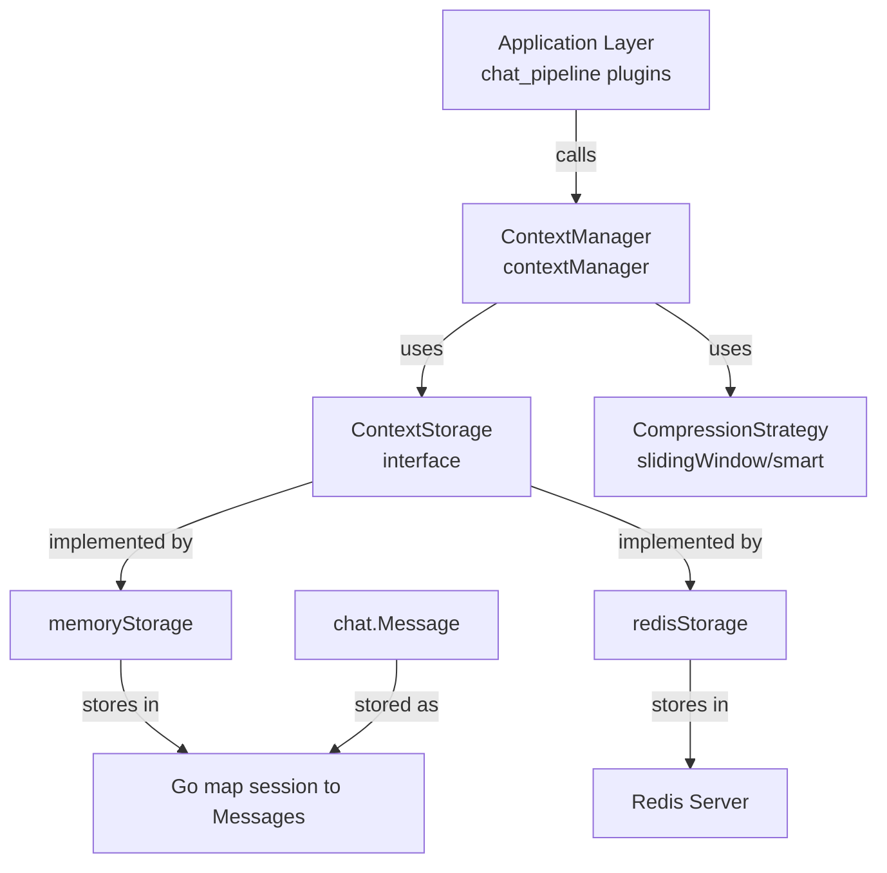

# In-Memory Context Storage Implementation

## 概述

想象你正在设计一个对话系统，每次用户和 AI 交谈时，都需要记住之前说过的话 —— 这就是**上下文（Context）**。`in_memory_context_storage_implementation` 模块的核心职责就是：**在内存中临时存储和检索会话的对话历史**。

这个模块存在的根本原因是：LLM（大语言模型）本身是无状态的，它不会"记住"之前的对话。每次调用 LLM 时，都需要把完整的对话历史作为输入传递给它。因此，系统需要一个地方来持久化这些对话消息，而 `memoryStorage` 提供了一种简单、快速的实现方式 —— 直接把数据放在进程的内存里。

为什么需要这个抽象？你可能会问，为什么不直接把数据存在某个全局变量里？关键在于**可替换性**。系统同时支持 Redis 存储（[redis_context_storage_implementation](redis_context_storage_implementation.md)）和内存存储两种方式。通过定义统一的 `ContextStorage` 接口，上层业务逻辑（如 [context_manager](context_manager_orchestration.md)）无需关心数据到底存在哪里，只需调用 `Save`、`Load`、`Delete` 三个方法即可。这种设计让系统可以在开发测试时使用轻量的内存存储，在生产环境切换到持久的 Redis 存储，而无需修改任何业务代码。

## 架构与数据流



**核心组件角色：**

1. **`ContextStorage` 接口**（[storage.go](storage.go)）：定义存储契约，包含 `Save`、`Load`、`Delete` 三个方法。这是典型的**仓储模式（Repository Pattern）**，将数据访问逻辑抽象出来。

2. **`memoryStorage` 结构体**：接口的内存实现，使用 `map[string][]chat.Message` 存储数据，key 是 sessionID，value 是该会话的所有消息列表。

3. **`contextManager`**（[context_manager_orchestration.md](context_manager_orchestration.md)）：业务逻辑层，负责上下文压缩、token 计数、系统提示管理等。它依赖 `ContextStorage` 接口，而非具体实现。

4. **`CompressionStrategy`**（[context_compression_strategies.md](context_compression_strategies.md)）：当对话历史过长时，负责压缩消息（如滑动窗口保留最近 N 条，或使用 LLM 生成摘要）。

**数据流动路径（以添加消息为例）：**

```
用户发送消息 
  → chat_pipeline 插件调用 ContextManager.AddMessage()
  → contextManager 调用 storage.Load(sessionID) 加载现有历史
  → 追加新消息到切片
  → 检查 token 数是否超限，若超限则调用 CompressionStrategy.Compress()
  → 调用 storage.Save(sessionID, messages) 持久化
  → memoryStorage 将消息副本存入 map
```

## 核心组件深度解析

### `memoryStorage` 结构体

```go
type memoryStorage struct {
    sessions map[string][]chat.Message
    mu       sync.RWMutex
}
```

**设计意图：**

这是整个模块的核心数据结构。`sessions` 字段是一个典型的**会话 - 消息映射表**：每个 sessionID 对应一个消息切片。`mu` 是读写锁，用于保证并发安全 —— 这是内存存储最容易忽略但最关键的部分。

**为什么需要 `sync.RWMutex`？**

想象多个用户同时发送消息的场景：
- 用户 A 的会话正在执行 `Load`（读操作）
- 用户 B 的会话正在执行 `Save`（写操作）
- 如果没有锁保护，可能导致 map 的并发读写 panic，或者读取到半写入的不一致状态

`RWMutex` 的精妙之处在于：**读操作可以并发**（多个 `RLock` 同时持有），但**写操作独占**（`Lock` 会阻塞所有读写）。对于对话系统这种"读多写少"的场景，这比普通的 `Mutex` 更高效。

**关键方法分析：**

#### `Save(ctx, sessionID, messages)`

```go
func (ms *memoryStorage) Save(ctx context.Context, sessionID string, messages []chat.Message) error {
    ms.mu.Lock()
    defer ms.mu.Unlock()
    
    // Make a copy to avoid external modifications
    messageCopy := make([]chat.Message, len(messages))
    copy(messageCopy, messages)
    
    ms.sessions[sessionID] = messageCopy
    return nil
}
```

**为什么需要复制消息切片？**

这是一个经典的 Go 并发陷阱。切片在 Go 中是**引用类型**，底层指向同一个数组。如果直接存储传入的 `messages` 切片，外部代码后续对该切片的修改会直接影响存储中的数据，导致难以追踪的 bug。

通过 `copy()` 创建深拷贝，`memoryStorage` 拥有了数据的独立副本，实现了**防御性编程**。这是一种"不信任调用者"的设计哲学 —— 即使调用者不小心修改了原始切片，也不会污染存储层的数据。

**时间复杂度：** O(n)，其中 n 是消息数量。对于典型对话（几十到几百条消息），这个开销可以忽略不计。

#### `Load(ctx, sessionID)`

```go
func (ms *memoryStorage) Load(ctx context.Context, sessionID string) ([]chat.Message, error) {
    ms.mu.RLock()
    defer ms.mu.RUnlock()
    
    messages, exists := ms.sessions[sessionID]
    if !exists {
        return []chat.Message{}, nil  // 返回空切片而非 nil
    }
    
    // Return a copy to avoid external modifications
    messageCopy := make([]chat.Message, len(messages))
    copy(messageCopy, messages)
    
    return messageCopy, nil
}
```

**为什么返回空切片而非 `nil`？**

这是一个重要的 API 设计决策。返回 `[]chat.Message{}`（空切片）而非 `nil` 的好处：
1. 调用者无需检查 `nil`，可以直接 `for _, msg := range messages` 遍历
2. JSON 序列化时，空切片输出 `[]`，而 `nil` 输出 `null`，前者更符合"空列表"的语义
3. 避免调用者意外对 `nil` 切片执行 `append` 导致的潜在问题

**为什么读操作也要复制？**

与 `Save` 同理，防止调用者修改返回的切片影响存储层。这种"进出都复制"的策略虽然增加了内存分配，但换来了**数据不可变性保证**，简化了上层逻辑的推理。

#### `Delete(ctx, sessionID)`

```go
func (ms *memoryStorage) Delete(ctx context.Context, sessionID string) error {
    ms.mu.Lock()
    defer ms.mu.Unlock()
    delete(ms.sessions, sessionID)
    return nil
}
```

简洁直接。注意 Go 的 `map` 删除不存在的 key 不会 panic，因此无需先检查存在性。

### `NewMemoryStorage()` 构造函数

```go
func NewMemoryStorage() ContextStorage {
    return &memoryStorage{
        sessions: make(map[string][]chat.Message),
    }
}
```

返回接口类型而非具体类型，这是**依赖倒置**的体现。调用者只依赖抽象，不依赖实现。

## 依赖关系分析

### 被谁调用（Upstream）

1. **[contextManager](context_manager_orchestration.md)**：直接依赖 `ContextStorage` 接口，通过构造函数注入具体实现。
   - `AddMessage()` → `storage.Load()` + `storage.Save()`
   - `GetContext()` → `storage.Load()`
   - `ClearContext()` → `storage.Delete()`
   - `SetSystemPrompt()` → `storage.Load()` + `storage.Save()`

2. **[context_manager_factory.go](context_manager_orchestration.md)**：负责根据配置创建 `ContextStorage` 实例。当配置为 `"memory"` 或未配置时，使用 `NewMemoryStorage()`。

### 调用谁（Downstream）

`memoryStorage` 本身不依赖任何外部服务，只使用 Go 标准库：
- `sync.RWMutex`：并发控制
- `map`：数据存储
- `chat.Message`：数据类型（来自 [chat_core_message_and_tool_contracts](chat_core_message_and_tool_contracts.md)）

这种**零外部依赖**的特性是内存存储的最大优势 —— 无需网络连接、无需序列化、无需错误处理（除了并发控制）。

### 数据契约

**输入/输出类型：**
- `sessionID`：`string`，会话唯一标识
- `messages`：`[]chat.Message`，消息切片
- `chat.Message`：包含 `Role`（system/user/assistant）、`Content`（文本内容）等字段

**错误处理：**
- `memoryStorage` 的所有方法**永远不会返回错误**（除了 context 取消等极端情况），因为内存操作几乎不会失败。这与 [redisStorage](redis_context_storage_implementation.md) 形成对比 —— Redis 操作可能因网络、内存、连接池等问题失败。

## 设计决策与权衡

### 1. 内存 vs 持久化：为什么需要两种存储？

**内存存储的优势：**
- **零延迟**：map 读写是 O(1)，无需网络往返
- **零依赖**：无需部署 Redis，开发测试更简单
- **零成本**：不产生额外的基础设施费用

**内存存储的劣势：**
- **进程重启数据丢失**：这是致命问题，生产环境不可接受
- **内存泄漏风险**：长期运行的服务，会话数据只增不减会耗尽内存
- **无法水平扩展**：多实例部署时，每个实例的内存数据不共享

**设计权衡：**

系统采用**策略模式**，允许在开发和生产环境使用不同存储：
- **开发/测试**：使用 `memoryStorage`，快速启动，无需 Redis
- **生产环境**：使用 `redisStorage`，数据持久化，支持多实例共享

这种设计的代价是**代码复杂度增加**（需要维护两套实现），但换来的是**部署灵活性**和**环境隔离**。

### 2. 复制 vs 零拷贝：为什么选择防御性复制？

**可选方案：**
- **方案 A（当前）**：进出都复制，保证数据不可变
- **方案 B**：不复制，直接存储/返回引用
- **方案 C**：只读不复制，写时复制

**选择方案 A 的原因：**

对话系统的核心是**状态一致性**。想象以下场景：

```go
// 方案 B 的问题
messages, _ := storage.Load(ctx, sessionID)
messages[0].Content = "hacked!"  // 直接修改存储层数据！
storage.Save(ctx, sessionID, messages)  // 再次保存，数据已污染
```

方案 A 通过复制彻底杜绝了这种风险。代价是每次读写都要分配新内存，但对于对话场景（消息数量有限，复制开销微秒级），这个 tradeoff 是值得的。

**性能影响量化：**
- 假设每条消息 500 字节，100 条消息 = 50KB
- 内存复制 50KB 约需 1-2 微秒
- 相比网络延迟（Redis 约 1-5 毫秒），复制开销可忽略

### 3. 锁粒度：为什么不用更细粒度的锁？

**可选方案：**
- **当前**：全局 `RWMutex`，所有 session 共享一把锁
- **方案 B**：每 session 一把锁（`map[sessionID]*sync.RWMutex`）
- **方案 C**：使用 `sync.Map`（无锁并发 map）

**选择全局锁的原因：**

1. **简单性优先**：全局锁逻辑清晰，不易出错
2. **实际并发度低**：同一 session 的并发读写概率极低（用户不会同时发送两条消息）
3. **锁竞争不严重**：读操作使用 `RLock`，可并发执行

**潜在问题：**

当系统有数千个活跃会话时，全局锁可能成为瓶颈。此时可考虑方案 B（每 session 锁），但会增加代码复杂度（需要管理锁的生命周期，避免内存泄漏）。

### 4. 无 TTL 机制：为什么内存存储不支持过期？

对比 [redisStorage](redis_context_storage_implementation.md) 的 `ttl time.Duration` 参数，`memoryStorage` 没有 TTL 机制。

**原因：**
1. **职责分离**：内存存储定位为"临时存储"，生命周期由调用者管理
2. **实现复杂度**：需要额外的 goroutine 定期清理过期数据，增加复杂度
3. **使用场景**：主要用于测试，测试用例会显式调用 `Delete()` 清理

**生产风险：**

如果在生产环境使用 `memoryStorage`，必须确保：
- 会话结束时调用 `ClearContext()`
- 或有外部的内存监控和清理机制

否则会导致**内存泄漏**，长期运行后 OOM（Out Of Memory）。

## 使用指南

### 基本用法

```go
// 1. 创建存储实例
storage := llmcontext.NewMemoryStorage()

// 2. 创建 ContextManager（使用内存存储）
strategy := llmcontext.NewSlidingWindowStrategy(20)  // 保留最近 20 条
manager := llmcontext.NewContextManager(storage, strategy, 128*1024)  // 128K tokens

// 3. 添加消息
msg := chat.Message{
    Role:    "user",
    Content: "你好，请介绍一下自己",
}
err := manager.AddMessage(ctx, "session-123", msg)

// 4. 获取上下文
context, err := manager.GetContext(ctx, "session-123")

// 5. 清理会话
err = manager.ClearContext(ctx, "session-123")
```

### 工厂模式配置

```go
// 从配置创建 ContextManager
config := &types.ContextConfig{
    MaxTokens:          64 * 1024,
    RecentMessageCount: 15,
    CompressionStrategy: "sliding_window",
}

storage := llmcontext.NewMemoryStorage()
manager := llmcontext.NewContextManagerFromConfig(config, storage, chatModel)
```

### 配置选项

| 参数 | 默认值 | 说明 |
|------|--------|------|
| `MaxTokens` | 128K | 上下文最大 token 数，超限触发压缩 |
| `RecentMessageCount` | 20 | 滑动窗口保留的最近消息数 |
| `SummarizeThreshold` | 5 | 智能压缩触发摘要的最小消息数 |
| `CompressionStrategy` | "sliding_window" | 压缩策略：`sliding_window` 或 `smart` |

## 边界情况与陷阱

### 1. 并发修改导致的竞态条件

**错误示例：**

```go
// 危险！两个 goroutine 同时操作同一 session
go manager.AddMessage(ctx, sessionID, msg1)
go manager.AddMessage(ctx, sessionID, msg2)
```

虽然 `memoryStorage` 有锁保护，但 `contextManager.AddMessage()` 的"加载 - 修改 - 保存"不是原子操作。两个 goroutine 可能同时加载相同的历史，各自追加消息后保存，导致**一条消息丢失**。

**解决方案：**
- 确保同一 session 的消息串行处理（如通过 sessionID 哈希到同一 worker）
- 或使用分布式锁（生产环境 Redis 存储时）

### 2. 大会话的内存爆炸

**问题：**

如果某会话有 10000 条消息，每次 `AddMessage` 都要复制全部消息：
- 内存分配：10000 × 500 字节 ≈ 5MB
- GC 压力：频繁分配释放触发 GC

**缓解措施：**
- 合理设置 `MaxTokens`（如 128K），触发压缩
- 使用 `smart` 压缩策略，用摘要替代历史消息
- 监控 `ContextStats`，主动清理长期不活跃的会话

### 3. 进程重启数据丢失

**问题：**

```bash
# 服务重启后，所有内存数据丢失
$ kill -9 <pid>
$ ./weknora-server  # 启动后，所有会话历史为空
```

**解决方案：**
- 生产环境**必须**使用 `redisStorage`
- 或在服务关闭时导出内存数据到持久化存储（增加复杂度）

### 4. 空会话的语义

`Load()` 返回空切片 `[]` 而非 `nil`，调用者需注意：

```go
// 正确：无需检查 nil
messages, _ := storage.Load(ctx, sessionID)
for _, msg := range messages {  // 空切片时循环不执行
    // ...
}

// 错误：不必要的检查
if messages == nil {  // 永远不会为 true
    // ...
}
```

## 扩展点

### 添加新的存储后端

实现 `ContextStorage` 接口即可：

```go
type postgresStorage struct {
    db *sql.DB
}

func (ps *postgresStorage) Save(ctx context.Context, sessionID string, messages []chat.Message) error {
    // 实现 PostgreSQL 存储逻辑
}

func (ps *postgresStorage) Load(ctx context.Context, sessionID string) ([]chat.Message, error) {
    // 实现加载逻辑
}

func (ps *postgresStorage) Delete(ctx context.Context, sessionID string) error {
    // 实现删除逻辑
}
```

然后在 `context_manager_factory.go` 中添加配置分支。

### 添加 TTL 支持

为 `memoryStorage` 添加过期机制：

```go
type memoryStorage struct {
    sessions map[string]sessionEntry
    mu       sync.RWMutex
}

type sessionEntry struct {
    messages   []chat.Message
    expiresAt  time.Time
}

// 定期清理过期数据
func (ms *memoryStorage) startCleanupTicker(interval time.Duration) {
    ticker := time.NewTicker(interval)
    go func() {
        for range ticker.C {
            ms.cleanupExpired()
        }
    }()
}
```

## 相关模块

- **[context_storage_contract](context_storage_contract.md)**：`ContextStorage` 接口定义
- **[redis_context_storage_implementation](redis_context_storage_implementation.md)**：Redis 存储实现，生产环境推荐
- **[context_manager_orchestration](context_manager_orchestration.md)**：上下文管理器，业务逻辑层
- **[context_compression_strategies](context_compression_strategies.md)**：压缩策略（滑动窗口、智能摘要）
- **[chat_core_message_and_tool_contracts](chat_core_message_and_tool_contracts.md)**：`chat.Message` 数据类型定义

## 总结

`in_memory_context_storage_implementation` 是一个**简单但设计精良**的模块。它通过：

1. **清晰的职责分离**：存储层只负责 CRUD，业务逻辑在 `contextManager`
2. **防御性编程**：进出复制，保证数据不可变
3. **并发安全**：`RWMutex` 保护共享状态
4. **可替换性**：接口抽象支持多种存储后端

实现了"简单场景够用，复杂场景可扩展"的设计目标。对于新加入的工程师，理解这个模块的关键是：**它不是简单的"全局变量包装器"，而是一个经过并发、安全、扩展性考量的仓储实现**。
