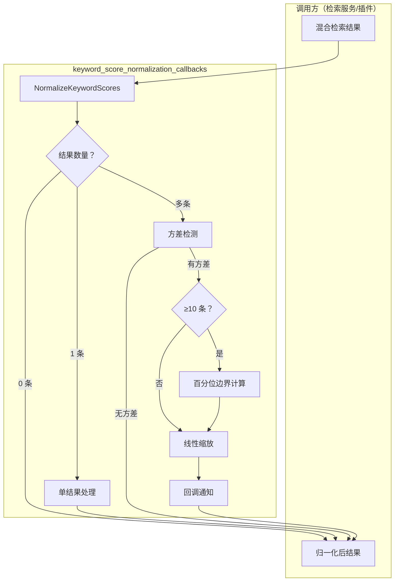

# keyword_score_normalization_callbacks 模块深度解析

## 概述：为什么需要分数归一化？

想象你正在构建一个混合检索系统——它同时使用**关键词匹配**和**向量语义搜索**。向量搜索返回的相似度分数通常在 0 到 1 之间，分布相对均匀；但关键词匹配的原始分数可能来自 BM25、TF-IDF 或其他算法，其量纲和分布完全不可控：有时是 0.5 到 0.6 之间的窄幅波动，有时是 10 到 1000 的巨大跨度。

**问题**：当你需要把这两类结果合并排序时，如何确保关键词分数不会主导或淹没向量分数？

**朴素方案的陷阱**：
- 直接除以最大值？—— 一个异常高分会让所有其他结果趋近于 0
- 固定范围缩放？—— 无法适应不同查询的分数分布特性
- 忽略归一化？—— 混合排序完全失衡

`keyword_score_normalization_callbacks` 模块的核心洞察是：**归一化必须对异常值鲁棒，同时保留有效区分度**。它采用**百分位截断 + 线性缩放**的策略，在 10 条以上结果时使用 P5-P95 范围而非最小 - 最大值，有效隔离了长尾噪声。此外，通过回调钩子暴露归一化过程的遥测数据，让上层系统能够观察和调试分数变换行为。

---

## 架构与数据流



### 组件角色说明

| 组件 | 职责 | 架构定位 |
|------|------|----------|
| `KeywordScoreCallbacks` | 定义归一化过程的观察点 | **遥测接口** —— 不改变行为，只暴露状态 |
| `NormalizeKeywordScores` | 执行分数归一化核心逻辑 | **转换器** —— 原地修改结果集分数 |

### 数据流追踪

1. **输入**：调用方传入泛型结果切片 `[]T` 和四个函数参数（类型判断、读分数、写分数、回调）
2. **过滤**：`isKeyword` 筛选出关键词匹配结果，向量结果保持不变
3. **边界计算**：
   - < 10 条：使用实际最小/最大值
   - ≥ 10 条：排序后取 P5/P95 百分位
4. **缩放**：将分数线性映射到 [0, 1] 区间，超出边界的值被钳制
5. **输出**：原地修改后的结果集，同时通过回调发送遥测事件

---

## 组件深度解析

### KeywordScoreCallbacks 结构体

```go
type KeywordScoreCallbacks struct {
    OnNoVariance   func(count int, score float64)
    OnNormalized   func(count int, rawMin, rawMax, normalizeMin, normalizeMax float64)
}
```

**设计意图**：这是一个**可选的遥测钩子容器**，两个字段都是函数指针，调用方可以选择不传入任何回调（零值安全）。

#### 字段详解

| 字段 | 触发条件 | 参数含义 | 典型用途 |
|------|----------|----------|----------|
| `OnNoVariance` | 所有关键词分数相同（`maxS <= minS`） | `count`: 结果数量<br>`score`: 唯一分数值 | 监控退化场景，记录日志或触发告警 |
| `OnNormalized` | 成功完成归一化缩放 | `count`: 结果数量<br>`rawMin/rawMax`: 原始边界<br>`normalizeMin/normalizeMax`: 归一化使用的边界 | 分析分数分布变化，调试 P5/P95 截断效果 |

**为什么分离两个回调？** —— 无方差场景是特殊退化情况，归一化公式不适用（分母为 0），需要单独处理。分离回调让调用方能针对性地监控这两种截然不同的执行路径。

**使用示例**：
```go
callbacks := KeywordScoreCallbacks{
    OnNoVariance: func(count int, score float64) {
        log.Warnf("keyword scores have no variance: count=%d, score=%.4f", count, score)
    },
    OnNormalized: func(count int, rawMin, rawMax, normMin, normMax float64) {
        log.Debugf("normalized %d results: raw=[%.4f, %.4f], norm=[%.4f, %.4f]", 
            count, rawMin, rawMax, normMin, normMax)
    },
}
```

---

### NormalizeKeywordScores 函数

```go
func NormalizeKeywordScores[T any](
    results []T,
    isKeyword func(T) bool,
    getScore func(T) float64,
    setScore func(T, float64),
    callbacks KeywordScoreCallbacks,
)
```

**核心抽象**：这是一个**泛型原地转换器**，通过函数参数注入类型特定的行为，实现与具体结果类型的解耦。

#### 参数契约

| 参数 | 类型 | 职责 | 调用约束 |
|------|------|------|----------|
| `results` | `[]T` | 待归一化的结果切片 | **原地修改** —— 函数会直接修改切片中元素的分数 |
| `isKeyword` | `func(T) bool` | 判断结果是否来自关键词匹配 | 必须是无副作用的纯函数 |
| `getScore` | `func(T) float64` | 读取当前分数 | 必须与 `setScore` 操作同一字段 |
| `setScore` | `func(T, float64)` | 写入归一化后的分数 | 写入值应在 [0, 1] 区间 |
| `callbacks` | `KeywordScoreCallbacks` | 遥测回调钩子 | 可为零值，字段为 nil 时不触发 |

#### 执行路径分析

**路径 1：空结果集**
```go
if len(keywordResults) == 0 {
    return  // 直接返回，无副作用
}
```
快速路径，避免不必要的计算。

**路径 2：单结果**
```go
if len(keywordResults) == 1 {
    setScore(keywordResults[0], 1.0)
    return
}
```
**设计决策**：单结果直接设为 1.0 而非保持原值。原因是归一化的目的是**相对排序**，单结果时它自然是"最佳匹配"，设为 1.0 便于与向量分数对齐。

**路径 3：无方差**
```go
if maxS <= minS {
    for _, r := range keywordResults {
        setScore(r, 1.0)
    }
    if callbacks.OnNoVariance != nil {
        callbacks.OnNoVariance(len(keywordResults), minS)
    }
    return
}
```
当所有分数相同时，归一化公式 `(score - min) / (max - min)` 会除零。此时统一设为 1.0，表示"同等相关"。

**路径 4：百分位边界计算（≥10 条）**
```go
if len(keywordResults) >= 10 {
    scores := make([]float64, len(keywordResults))
    // ... 收集分数 ...
    sort.Float64s(scores)
    p5Idx := len(scores) * 5 / 100
    p95Idx := len(scores) * 95 / 100
    // ... 更新 normalizeMin/normalizeMax ...
}
```
**关键设计洞察**：为什么是 10 条？为什么是 P5/P95？

- **10 条阈值**：少于 10 条时，百分位计算本身不稳定（P5 可能对应不到 1 条），直接用最小 - 最大值更可靠
- **P5/P95 截断**：排除顶部 5% 和底部 5% 的极端值，防止单个异常高分/低分扭曲整个缩放范围。这是**鲁棒统计**的经典实践

**路径 5：线性缩放**
```go
rangeSize := normalizeMax - normalizeMin
if rangeSize > 0 {
    for _, r := range keywordResults {
        clamped := getScore(r)
        if clamped < normalizeMin {
            clamped = normalizeMin
        } else if clamped > normalizeMax {
            clamped = normalizeMax
        }
        ns := (clamped - normalizeMin) / rangeSize
        // ... 钳制到 [0, 1] ...
        setScore(r, ns)
    }
    // ... 触发 OnNormalized 回调 ...
}
```
**钳制逻辑的必要性**：使用 P5/P95 后，原始最小/最大值可能超出归一化边界。例如：
- 原始分数：[0.1, 0.2, ..., 0.8, 0.9, 5.0]（5.0 是异常值）
- P5=0.15, P95=0.85
- 5.0 会被钳制到 0.85，然后缩放为 1.0

这确保了异常值不会获得 >1.0 的分数，同时也不会被过度惩罚（仍为 1.0，与 P95 相同）。

**路径 6：百分位范围坍缩的兜底**
```go
// Fallback when percentile filtering collapses the range.
for _, r := range keywordResults {
    setScore(r, 1.0)
}
```
极端情况下，P5 和 P95 可能相等（例如所有中间值都相同）。此时退化为无方差处理。

---

## 依赖关系分析

### 调用方（谁在用这个模块）

根据模块树，`internal.searchutil.normalize.KeywordScoreCallbacks` 位于 `application_services_and_orchestration → retrieval_and_web_search_services → search_result_conversion_and_normalization_utilities` 路径下。

**典型调用场景**：
1. **混合检索插件**（如 `PluginSearch`、`PluginRerank`）在合并关键词和向量结果前调用
2. **重排序服务**在计算最终排序分数前对关键词部分归一化
3. **评估指标计算**（如 `MAPMetric`、`NDCGMetric`）在比较不同检索策略时确保分数可比

### 被调用方（依赖什么）

| 依赖 | 类型 | 用途 |
|------|------|------|
| `sort.Float64s` | Go 标准库 | 对分数切片排序以计算百分位 |
| 泛型约束 `any` | Go 1.18+ | 支持任意结果类型，通过函数参数注入行为 |

**无外部依赖** —— 这是纯粹的算法工具函数，不依赖任何业务逻辑或基础设施，便于单元测试和复用。

### 数据契约

**输入契约**：
- `results` 切片中的元素必须支持通过 `getScore`/`setScore` 访问分数字段
- `isKeyword` 必须能正确区分关键词结果和向量结果

**输出契约**：
- 关键词结果的分数被修改为 [0, 1] 区间
- 非关键词结果（向量结果）保持不变
- 切片顺序不变，只修改分数值

---

## 设计决策与权衡

### 1. 原地修改 vs 返回新切片

**选择**：原地修改 `results` 切片

**权衡**：
- ✅ **优势**：避免额外内存分配，适合大结果集；调用方无需处理返回值
- ❌ **代价**：调用方必须接受副作用，不能保留原始分数

**为什么合理**：检索场景下，原始分数在归一化后通常不再需要，且结果集可能很大（数百条），复制成本显著。

**注意事项**：如果调用方需要保留原始分数用于其他用途（如日志、调试），必须在调用前自行深拷贝。

### 2. 泛型设计 vs 具体类型

**选择**：使用泛型 `T any` + 函数参数注入

**权衡**：
- ✅ **优势**：与具体结果类型解耦，可复用；类型安全（编译期检查）
- ❌ **代价**：每次调用需要传入 4 个函数参数，略显冗长

**替代方案对比**：
| 方案 | 灵活性 | 类型安全 | 代码简洁性 |
|------|--------|----------|------------|
| 泛型 + 函数参数（当前） | 高 | 高 | 中 |
| 接口类型约束 | 中 | 高 | 高 |
| `interface{}` + 类型断言 | 高 | 低 | 低 |

**为什么选择当前方案**：结果类型在不同检索场景下差异很大（有的包含文档 ID，有的包含高亮片段），用接口约束会强制统一结构，反而增加耦合。

### 3. P5/P95 百分位 vs 其他鲁棒统计量

**选择**：5% 和 95% 百分位

**替代方案**：
- **Z-Score 标准化**：需要计算均值和标准差，对极端值仍敏感
- **中位数 + MAD**：更鲁棒，但缩放后难以解释
- **固定分位数（如 P10/P90）**：截断更激进，可能丢失有效区分度

**为什么是 P5/P95**：
- 排除 10% 的极端值，保留 90% 的有效分布
- 在"抗异常值"和"保留区分度"之间取得平衡
- 业界常见实践（如箱线图的须线通常用 1.5×IQR，约对应 P1/P99）

### 4. 10 条阈值的选取

**选择**：≥10 条时使用百分位，否则用最小 - 最大值

**权衡**：
- 少于 10 条时，P5 可能对应 0 条（`10 * 5 / 100 = 0`），百分位无意义
- 但 10 条是经验值，小数据集的最小 - 最大值本身也不稳定

**潜在改进**：可考虑动态阈值（如 `len >= 100/百分位间隔`），但当前简单规则已覆盖大多数场景。

### 5. 回调可选性

**选择**：回调字段为函数指针，nil 时不触发

**优势**：
- 调用方无需实现空回调
- 零值 `KeywordScoreCallbacks{}` 安全可用
- 生产环境可关闭回调减少开销

**代价**：每次调用前需检查 `!= nil`，略微增加代码量

---

## 使用指南与示例

### 基本用法

```go
type SearchResult struct {
    DocID     string
    Score     float64
    IsKeyword bool
}

results := []SearchResult{
    {DocID: "doc1", Score: 0.8, IsKeyword: true},
    {DocID: "doc2", Score: 1.2, IsKeyword: true},
    {DocID: "doc3", Score: 0.5, IsKeyword: false}, // 向量结果，不变
}

NormalizeKeywordScores(
    results,
    func(r SearchResult) bool { return r.IsKeyword },
    func(r SearchResult) float64 { return r.Score },
    func(r SearchResult, s float64) { r.Score = s }, // 注意：需要指针或索引访问
    KeywordScoreCallbacks{},
)
```

**注意**：上面的 `setScore` 无法真正修改原切片（值拷贝）。正确做法：

```go
for i := range results {
    NormalizeKeywordScores(
        results,
        func(r SearchResult) bool { return r.IsKeyword },
        func(r SearchResult) float64 { return r.Score },
        func(idx int, s float64) { results[idx].Score = s }, // 通过索引修改
        KeywordScoreCallbacks{},
    )
}
```

或使用指针类型：

```go
type SearchResult struct {
    DocID     string
    Score     float64
    IsKeyword bool
}

results := []*SearchResult{...}

NormalizeKeywordScores(
    results,
    func(r *SearchResult) bool { return r.IsKeyword },
    func(r *SearchResult) float64 { return r.Score },
    func(r *SearchResult, s float64) { r.Score = s }, // 直接修改
    KeywordScoreCallbacks{},
)
```

### 带遥测回调的用法

```go
var logBuffer []string

callbacks := KeywordScoreCallbacks{
    OnNoVariance: func(count int, score float64) {
        logBuffer = append(logBuffer, fmt.Sprintf("NO_VARIANCE: count=%d, score=%.4f", count, score))
    },
    OnNormalized: func(count int, rawMin, rawMax, normMin, normMax float64) {
        compressionRatio := (normMax - normMin) / (rawMax - rawMin)
        logBuffer = append(logBuffer, fmt.Sprintf(
            "NORMALIZED: count=%d, raw=[%.4f, %.4f], norm=[%.4f, %.4f], compression=%.2f%%",
            count, rawMin, rawMax, normMin, normMax, compressionRatio*100,
        ))
    },
}

NormalizeKeywordScores(results, isKeyword, getScore, setScore, callbacks)

// 后续可将 logBuffer 写入日志系统或监控指标
```

### 在混合检索插件中的集成

```go
// 伪代码：PluginRerank 中的典型用法
func (p *PluginRerank) Execute(ctx *PipelineContext) error {
    // 1. 分别获取关键词和向量结果
    keywordResults := p.keywordSearch(ctx.Query)
    vectorResults := p.vectorSearch(ctx.Query)
    
    // 2. 对关键词结果归一化
    NormalizeKeywordScores(
        keywordResults,
        func(r *Result) bool { return true }, // 全是关键词
        func(r *Result) float64 { return r.Score },
        func(r *Result, s float64) { r.Score = s },
        KeywordScoreCallbacks{
            OnNormalized: func(count int, rawMin, rawMax, normMin, normMax float64) {
                ctx.Metrics.Record("keyword_score_range", normMax-normMin)
            },
        },
    )
    
    // 3. 合并结果（此时分数量纲一致）
    merged := mergeResults(keywordResults, vectorResults)
    
    // 4. 按归一化后分数排序
    sort.Slice(merged, func(i, j int) bool {
        return merged[i].Score > merged[j].Score
    })
    
    ctx.Results = merged
    return nil
}
```

---

## 边界情况与陷阱

### 1. 浮点精度问题

**现象**：当 `normalizeMax - normalizeMin` 极小时，除法可能产生 NaN 或 Inf

**防护**：代码已检查 `rangeSize > 0`，但极端情况下（如 `1e-300`）仍可能精度丢失

**建议**：调用方在比较分数时使用容差（如 `math.Abs(a-b) < 1e-9`）

### 2. 负分数的处理

**当前行为**：负分数会被正常缩放。例如原始 [-5, -3, -1] 会映射到 [0, 0.5, 1]

**潜在问题**：某些检索系统（如 BM25）理论上不应有负分，但实现 bug 可能导致

**建议**：在 `isKeyword` 或调用前增加分数有效性校验

### 3. 并发安全

**当前行为**：函数本身无状态，但**原地修改**意味着多个 goroutine 不能同时处理同一切片

**陷阱示例**：
```go
// 错误：并发修改同一切片
go NormalizeKeywordScores(results, ...)
go NormalizeKeywordScores(results, ...) // 数据竞争！
```

**正确做法**：每个 goroutine 处理独立的切片副本

### 4. 回调中的性能敏感操作

**风险**：回调在归一化循环内触发（虽然只触发一次），但调用方可能在回调中执行耗时操作

**建议**：回调内只记录必要指标，避免 I/O 或复杂计算

### 5. 百分位索引的整数除法

**代码**：
```go
p5Idx := len(scores) * 5 / 100
```

**行为**：整数除法向下取整。15 条结果时，`p5Idx = 15 * 5 / 100 = 0`

**影响**：小数据集的百分位实际退化为最小值，但这是可接受的（已有 10 条阈值保护）

---

## 相关模块参考

- [retrieval_and_web_search_services](retrieval_and_web_search_services.md) —— 上层检索服务，典型调用方
- [PluginRerank](chat_pipeline_plugins_and_flow.md) —— 重排序插件，可能在合并结果前调用本模块
- [MAPMetric](evaluation_dataset_and_metric_services.md) —— 评估指标，可能使用归一化分数计算排名质量
- [ScoreComparable](platform_infrastructure_and_runtime.md) —— 通用分数比较接口，可与本模块配合使用

---

## 总结：核心设计哲学

`keyword_score_normalization_callbacks` 模块体现了三个关键设计原则：

1. **鲁棒性优先**：通过百分位截断隔离异常值，而非简单假设分数分布理想
2. **可观察性**：通过可选回调暴露内部状态，便于调试和监控，而非黑盒执行
3. **泛型解耦**：通过函数参数注入类型特定行为，避免与具体结果结构耦合

理解这个模块的关键是认识到：**归一化不是数学变换，而是工程权衡**——在"保留区分度"和"抵抗噪声"之间找到适合检索场景的平衡点。
