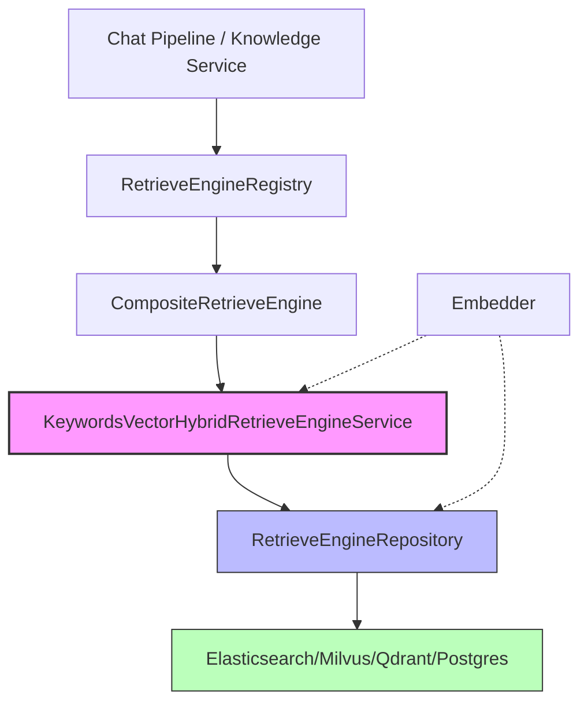

# KeywordsVectorHybridRetrieveEngineService 模块深度解析

## 概述：为什么需要混合检索引擎

想象一下你在一个大型图书馆里找书。如果只能用一种方式找书，你会遇到什么困境？

- **只用关键词搜索**：你能找到包含特定词汇的书，但找不到语义相关但用词不同的内容。比如搜索"汽车保养"，可能错过标题为"车辆维护指南"的相关文档。
- **只用向量搜索**：你能找到语义相似的内容，但可能错过精确匹配特定术语的文档，而且向量搜索在精确匹配场景下往往不如关键词搜索高效。

`KeywordsVectorHybridRetrieveEngineService` 模块正是为了解决这个困境而存在的。它是一个**混合检索引擎服务**，同时支持关键词检索和向量检索两种模式，让系统能够根据实际场景灵活选择或组合使用两种检索策略。

这个模块的核心设计洞察是：**检索引擎不应该关心底层存储的具体实现细节，但需要协调嵌入向量生成与索引存储的时序关系**。它充当了上层业务逻辑与底层向量数据库之间的"智能适配器"——对上提供统一的检索和索引接口，对下委托给具体的 Repository 实现，同时在中间层处理嵌入计算、批量优化和并发控制等横切关注点。

## 架构定位与数据流

### 模块在系统中的位置



### 架构角色解析

这个模块在系统中扮演**服务层适配器**的角色：

1. **对上（服务层）**：实现 `RetrieveEngineService` 接口，被 [`CompositeRetrieveEngine`](composite_retrieve_engine_orchestration.md) 调用，后者通过 [`RetrieveEngineRegistry`](retrieve_engine_registry_management.md) 统一管理多个检索引擎实例。

2. **对下（存储层）**：依赖 `RetrieveEngineRepository` 接口，该接口有多个实现（Elasticsearch、Milvus、Qdrant、Postgres），分别位于 [`vector_retrieval_backend_repositories`](vector_retrieval_backend_repositories.md) 模块中。

3. **横向依赖**：使用 `Embedder` 接口生成嵌入向量，该接口由 [`embedding_interfaces_batching_and_backends`](embedding_interfaces_batching_and_backends.md) 模块提供。

### 核心数据流：索引写入路径

当系统需要为一批文档块建立索引时，数据流如下：

```
KnowledgeService → BatchIndex → [生成嵌入向量] → [分块] → [并发保存] → Repository → 向量数据库
```

1. **嵌入生成阶段**：如果启用了向量检索，先调用 `Embedder.BatchEmbedWithPool` 为所有内容生成向量表示。这里有一个关键设计：系统会最多重试 5 次，每次失败后等待 100ms，这是为了应对嵌入服务可能出现的短暂不可用。

2. **分块阶段**：将索引列表按 40 条/批进行切分（通过 `utils.ChunkSlice`），这是为了平衡单次请求大小和并发粒度。

3. **并发保存阶段**：根据批次数量动态选择并发策略：
   - 批次 ≤ 5：使用无限制并发（`concurrentBatchSave`）
   - 批次 > 5：使用信号量限制最大 5 个并发（`boundedConcurrentBatchSave`）

这个设计的精妙之处在于：**它既利用了并发带来的性能提升，又通过信号量机制防止了并发度过高导致后端数据库连接池耗尽**。

### 核心数据流：检索查询路径

检索流程相对简单，体现了"薄服务层"的设计哲学：

```
PluginSearch → Retrieve → [直接委托] → Repository → 向量数据库
```

`Retrieve` 方法几乎不做任何处理，直接将 `RetrieveParams` 透传给 Repository。这是因为检索参数已经包含了查询文本、嵌入向量、过滤条件等所有必要信息，服务层无需额外加工。

## 核心组件深度解析

### KeywordsVectorHybridRetrieveEngineService

这是模块的唯一核心结构体，但它的设计体现了清晰的职责分离。

#### 字段设计

```go
type KeywordsVectorHybridRetrieveEngineService struct {
    indexRepository interfaces.RetrieveEngineRepository
    engineType      types.RetrieverEngineType
}
```

- **`indexRepository`**：存储层抽象。注意这里依赖的是接口而非具体实现，这意味着同一个服务可以无缝切换底层存储（Elasticsearch、Milvus 等）。这是典型的**依赖倒置**设计。

- **`engineType`**：标识当前引擎的类型。这个字段看似简单，但在 [`CompositeRetrieveEngine`](composite_retrieve_engine_orchestration.md) 合并多个引擎的检索结果时至关重要——它用于标识每个结果来自哪个引擎。

#### 构造函数：NewKVHybridRetrieveEngine

```go
func NewKVHybridRetrieveEngine(
    indexRepository interfaces.RetrieveEngineRepository,
    engineType types.RetrieverEngineType,
) interfaces.RetrieveEngineService
```

这里有一个值得注意的设计细节：返回类型是接口 `RetrieveEngineService` 而非具体结构体。这意味着调用方不应该依赖具体实现细节，只能通过接口定义的方法进行交互。这种设计限制了耦合，为未来替换实现留出了空间。

"KV" 前缀代表 "KeywordsVector"，这是团队内部的命名约定，用于快速识别这是一个混合引擎。

#### 索引方法：Index 与 BatchIndex

这两个方法是模块的"重头戏"，承载了大部分业务逻辑。

**`Index` 方法**（单条索引）：

```go
func (v *KeywordsVectorHybridRetrieveEngineService) Index(
    ctx context.Context,
    embedder embedding.Embedder,
    indexInfo *types.IndexInfo,
    retrieverTypes []types.RetrieverType,
) error
```

关键参数解析：
- **`indexInfo`**：包含待索引内容的元数据，如 `Content`（文本内容）、`SourceID`（来源文档 ID）、`ChunkID`（分块 ID）、`KnowledgeBaseID`（知识库 ID）等。完整结构见 [`IndexInfo`](index_metadata_definition.md)。
- **`retrieverTypes`**：指定使用哪些检索类型（如 `VectorRetrieverType`、`KeywordRetrieverType`）。这个设计允许同一份内容同时建立多种索引。

内部逻辑：
1. 检查是否包含 `VectorRetrieverType`
2. 如果是，调用 `embedder.Embed` 生成向量
3. 将向量放入 `embeddingMap`，key 为 `SourceID`
4. 调用 `indexRepository.Save` 持久化

这里的设计取舍：**向量生成在服务层而非 Repository 层**。这样做的好处是服务层可以统一控制嵌入生成的重试、批量化等策略；缺点是服务层需要知道 `Embedder` 的存在，增加了耦合。

**`BatchIndex` 方法**（批量索引）：

这是整个模块最复杂的方法，它的设计体现了对性能优化的深度思考。

```go
func (v *KeywordsVectorHybridRetrieveEngineService) BatchIndex(
    ctx context.Context,
    embedder embedding.Embedder,
    indexInfoList []*types.IndexInfo,
    retrieverTypes []types.RetrieverType,
) error
```

**设计决策 1：嵌入批量化与重试**

```go
for range 5 {
    embeddings, err = embedder.BatchEmbedWithPool(ctx, embedder, contentList)
    if err == nil {
        break
    } else {
        logger.Errorf(ctx, "BatchEmbedWithPool failed: %v", err)
        time.Sleep(100 * time.Millisecond)
    }
}
```

为什么需要重试？嵌入服务通常是远程 API（如 OpenAI、阿里云等），网络抖动或服务限流可能导致临时失败。5 次重试 + 100ms 退让是一个经验值，平衡了容错性和响应时间。

为什么用 `BatchEmbedWithPool` 而非循环调用 `Embed`？因为大多数嵌入服务对批量请求有优化（如共享 HTTP 连接、合并计算等），批量调用的吞吐远高于多次单条调用。

**设计决策 2：动态并发策略**

```go
const maxConcurrency = 5
if len(chunks) <= maxConcurrency {
    return v.concurrentBatchSave(ctx, chunks, embeddings, batchSize)
}
return v.boundedConcurrentBatchSave(ctx, chunks, embeddings, batchSize, maxConcurrency)
```

这里体现了**自适应优化**的思想：
- 小批量场景：直接全并发，减少调度开销
- 大批量场景：限制并发度，保护后端数据库

为什么选择 5 作为阈值和最大并发数？这通常基于以下考虑：
1. 数据库连接池大小（避免连接耗尽）
2. 网络带宽限制
3. 嵌入服务的并发限制
4. 经验测试得出的最佳平衡点

**设计决策 3：无嵌入路径的优化**

```go
// For non-vector retrieval, use concurrent batch saving as well
chunks := utils.ChunkSlice(indexInfoList, 10)
```

注意这里批次大小是 10 而非 40。这是因为纯关键词检索不需要携带向量数据，单条记录更小，可以承受更细粒度的分批。

#### 删除方法族

模块提供了三种删除方法，分别对应不同的删除场景：

| 方法 | 参数 | 使用场景 |
|------|------|----------|
| `DeleteByChunkIDList` | 分块 ID 列表 | 删除特定分块（如用户手动删除某个分块） |
| `DeleteBySourceIDList` | 来源文档 ID 列表 | 删除整个文档的所有分块（如文档更新后重新索引） |
| `DeleteByKnowledgeIDList` | 知识 ID 列表 | 删除整个知识条目（如知识被标记为废弃） |

这种多粒度的删除设计反映了系统的多层次数据模型：`Chunk → Knowledge → KnowledgeBase`。

#### 特殊功能方法

**`CopyIndices`**：从一个知识库复制索引到另一个知识库。

```go
func (v *KeywordsVectorHybridRetrieveEngineService) CopyIndices(
    ctx context.Context,
    sourceKnowledgeBaseID string,
    sourceToTargetKBIDMap map[string]string,
    sourceToTargetChunkIDMap map[string]string,
    targetKnowledgeBaseID string,
    dimension int,
    knowledgeType string,
) error
```

这个方法的设计非常巧妙：**它避免了重新计算嵌入向量**。当用户克隆知识库时，系统只需要复制已有的索引数据，并通过映射表更新 `KnowledgeBaseID` 和 `ChunkID`。这对于大型知识库的克隆操作可以节省大量时间和计算资源。

**`EstimateStorageSize`**：估算存储大小。

```go
func (v *KeywordsVectorHybridRetrieveEngineService) EstimateStorageSize(
    ctx context.Context,
    embedder embedding.Embedder,
    indexInfoList []*types.IndexInfo,
    retrieverTypes []types.RetrieverType,
) int64
```

注意这里的实现细节：它并不真正调用嵌入服务，而是创建一个占位向量 `make([]float32, embedder.GetDimensions())`。这是因为估算只需要知道向量维度，不需要真实的向量值。这是一个典型的**惰性计算**优化。

**`BatchUpdateChunkEnabledStatus` 与 `BatchUpdateChunkTagID`**：批量更新分块状态。

这两个方法支持运行时动态调整分块的检索行为：
- `EnabledStatus`：控制分块是否参与检索（如临时禁用质量差的分块）
- `TagID`：用于 FAQ 优先级过滤（见 [`FAQConfig`](faq_and_question_generation_configuration.md)）

## 依赖关系分析

### 上游调用者

1. **[`CompositeRetrieveEngine`](composite_retrieve_engine_orchestration.md)**：这是最主要的调用者。组合引擎会遍历所有注册的检索引擎，并行调用它们的 `Retrieve` 方法，然后合并结果。

2. **[`KnowledgeService`](knowledge_ingestion_orchestration.md)**：在知识入库流程中调用 `BatchIndex` 为新增的分块建立索引。

3. **[`PluginSearch`](retrieval_execution.md)**：检索插件在 QA 流程中调用 `Retrieve` 执行实际检索。

### 下游被调用者

1. **`RetrieveEngineRepository` 实现**：
   - [`elasticsearchRepository`](elasticsearch_v8_retrieval_repository.md)（v7 和 v8 两个版本）
   - [`milvusRepository`](milvus_repository_implementation.md)
   - [`qdrantRepository`](qdrant_vector_retrieval_repository.md)
   - [`pgRepository`](postgres_retrieval_repository_implementation.md)

2. **`Embedder` 实现**：
   - [`OpenAIEmbedder`](openai_embedding_backend.md)
   - [`AliyunEmbedder`](aliyun_embedding_backend.md)
   - [`JinaEmbedder`](jina_embedding_backend.md)
   - 等（见 [`embedding_interfaces_batching_and_backends`](embedding_interfaces_batching_and_backends.md)）

### 数据契约

**输入契约**：
- `RetrieveParams`：定义检索请求的所有参数，包括查询文本、嵌入向量、过滤条件、返回数量等。
- `IndexInfo`：定义待索引内容的元数据。
- `[]RetrieverType`：指定检索类型组合。

**输出契约**：
- `[]*RetrieveResult`：检索结果列表，每个结果包含 `IndexWithScore`（带分数的索引）和来源引擎类型。
- `error`：错误处理采用 Go 语言惯用的返回错误模式。

## 设计决策与权衡

### 决策 1：服务层 vs Repository 层的职责划分

**问题**：嵌入向量生成应该放在服务层还是 Repository 层？

**选择**：放在服务层（当前实现）。

**理由**：
1. 嵌入生成是跨 Repository 的通用逻辑，放在服务层避免重复实现
2. 服务层可以更好地控制批量化和重试策略
3. Repository 层可以保持纯粹的存储抽象，不依赖嵌入服务

**代价**：
1. 服务层需要知道 `Embedder` 的存在，增加了耦合
2. 如果未来需要更换嵌入策略（如缓存、预计算），需要修改服务层

**替代方案**：在 Repository 层接收原始文本，由 Repository 内部调用嵌入服务。这样服务层更简洁，但每个 Repository 实现都需要处理嵌入逻辑，导致代码重复。

### 决策 2：同步 vs 异步索引

**问题**：`BatchIndex` 应该同步等待所有索引完成，还是异步返回？

**选择**：同步（当前实现）。

**理由**：
1. 调用方（如 KnowledgeService）需要知道索引是否成功，以便更新知识状态
2. 同步模式更简单，不需要额外的状态追踪机制
3. 通过并发优化，实际延迟已经可以接受

**代价**：
1. 大批量索引时，HTTP 请求可能超时
2. 调用方需要设置合适的超时时间

**缓解措施**：通过分块和并发控制，将单次请求的规模限制在合理范围内。

### 决策 3：固定批次大小 vs 动态调整

**问题**：批次大小（40 条/批）应该是固定的还是根据内容大小动态调整？

**选择**：固定（当前实现）。

**理由**：
1. 实现简单，易于理解和维护
2. 在大多数场景下表现良好
3. 动态调整的收益可能不足以抵消复杂度

**代价**：
1. 对于超长内容，单批可能超过后端限制
2. 对于超短内容，可能过于保守

**改进方向**：可以引入基于字节大小的分批策略，而非简单的条数分批。

### 决策 4：信号量并发控制 vs 协程池

**问题**：如何限制并发度？使用信号量（channel）还是协程池？

**选择**：信号量（当前实现）。

**理由**：
1. Go 语言原生支持，无需额外依赖
2. 代码简洁，易于理解
3. 性能足够好

**替代方案**：使用协程池（如 `ants` 库）可以更精细地控制协程复用，但增加了外部依赖和复杂度。

## 使用指南与示例

### 基本使用模式

```go
// 1. 创建引擎实例
engine := NewKVHybridRetrieveEngine(repository, types.KeywordsVectorHybridEngine)

// 2. 索引单条内容
err := engine.Index(ctx, embedder, &types.IndexInfo{
    ID:              "chunk-001",
    Content:         "这是待索引的内容",
    SourceID:        "doc-001",
    ChunkID:         "chunk-001",
    KnowledgeID:     "know-001",
    KnowledgeBaseID: "kb-001",
    KnowledgeType:   "manual",
}, []types.RetrieverType{types.VectorRetrieverType, types.KeywordRetrieverType})

// 3. 批量索引
indexInfoList := []*types.IndexInfo{...}
err = engine.BatchIndex(ctx, embedder, indexInfoList, 
    []types.RetrieverType{types.VectorRetrieverType})

// 4. 执行检索
results, err := engine.Retrieve(ctx, types.RetrieveParams{
    Query:            "搜索关键词",
    Embedding:        queryEmbedding,  // 可选，向量检索时需要
    KnowledgeBaseIDs: []string{"kb-001"},
    TopK:             10,
    Threshold:        0.7,
    RetrieverType:    types.VectorRetrieverType,
})
```

### 配置建议

**批次大小调优**：
- 默认 40 条/批适用于大多数场景
- 如果后端是 Elasticsearch，可以适当增大到 100-200
- 如果后端是 Milvus，建议保持较小（20-50）以避免内存压力

**并发度调优**：
- 默认最大 5 并发是一个保守值
- 如果数据库连接池较大（如 50+），可以增加到 10
- 如果嵌入服务有严格的速率限制，可能需要降低到 2-3

**重试策略**：
- 当前 5 次重试 + 100ms 退让适用于大多数云 API
- 对于本地部署的嵌入服务，可以减少重试次数（如 3 次）
- 对于不稳定的网络环境，可以增加退让时间（如 200-500ms）

## 边界情况与注意事项

### 1. 嵌入服务不可用

如果嵌入服务持续失败（超过 5 次重试），`BatchIndex` 会返回错误。调用方需要：
- 记录详细错误日志
- 考虑将失败的内容放入重试队列
- 对于关键业务，可能需要降级为纯关键词检索

### 2. 上下文取消

所有方法都接受 `context.Context` 参数。如果上下文被取消（如 HTTP 请求超时），正在进行的嵌入生成和保存操作会中断。注意：
- 已经保存的索引不会回滚
- 可能产生部分索引（部分成功）
- 调用方需要设置合理的超时时间

### 3. 向量维度不匹配

`EstimateStorageSize` 方法使用 `embedder.GetDimensions()` 获取向量维度。如果实际嵌入的维度与预期不符，可能导致：
- 存储估算不准确
- 检索时维度不匹配错误

**建议**：在系统初始化时验证嵌入模型的维度配置。

### 4. 并发写入冲突

当多个协程同时更新同一个分块时（如一个在更新 `EnabledStatus`，另一个在更新 `TagID`），可能产生竞态条件。虽然 Repository 层应该有锁机制，但调用方最好：
- 避免对同一分块的并发更新
- 使用事务或乐观锁机制

### 5. 内存占用

`BatchIndex` 会将所有嵌入向量加载到内存中。对于超大批次（如 10000+ 条），可能导致内存压力。建议：
- 在调用方进行分批，每批不超过 1000 条
- 监控服务内存使用，设置合理的资源限制

## 扩展点

### 添加新的检索类型

如果需要支持新的检索类型（如稀疏向量检索 BM25+DPR）：
1. 在 `types.RetrieverType` 中添加新类型
2. 在 `Index` 和 `BatchIndex` 中添加对应的处理逻辑
3. 确保 Repository 层支持该类型的存储和检索

### 自定义并发策略

当前的并发策略是硬编码的。如果需要更灵活的配置：
1. 将 `batchSize` 和 `maxConcurrency` 提取为配置参数
2. 在构造函数中接收配置
3. 根据内容特征动态调整策略

### 嵌入缓存

当前实现每次都重新计算嵌入。如果需要缓存：
1. 在服务层添加缓存层（如 Redis）
2. 在生成嵌入前先查缓存
3. 注意缓存失效策略（内容更新时清除缓存）

## 相关模块

- [CompositeRetrieveEngine](composite_retrieve_engine_orchestration.md) — 组合多个检索引擎的统一入口
- [RetrieveEngineRegistry](retrieve_engine_registry_management.md) — 检索引擎注册表
- [vector_retrieval_backend_repositories](vector_retrieval_backend_repositories.md) — 底层向量存储 Repository 实现
- [embedding_interfaces_batching_and_backends](embedding_interfaces_batching_and_backends.md) — 嵌入服务接口与实现
- [KnowledgeService](knowledge_ingestion_orchestration.md) — 知识入库服务，调用本模块进行索引
- [PluginSearch](retrieval_execution.md) — 检索插件，调用本模块执行检索
