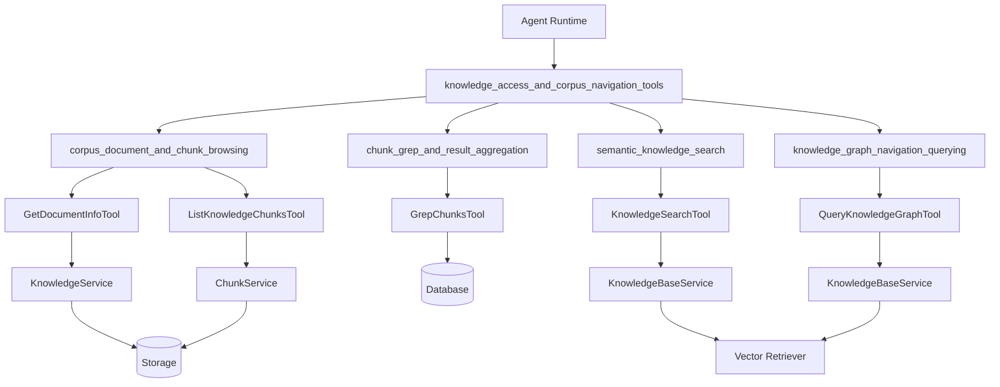

# 知识访问与语料库导航工具 (knowledge_access_and_corpus_navigation_tools)

## 概述

想象一下，你站在一个巨大的图书馆里，书架上摆满了各种书籍、文档和资料。你需要快速找到特定的信息，但不知道从哪里开始。这个模块就像是你的智能图书管理员，提供了多种工具帮助你在知识库中精确定位所需的内容：

- **关键词搜索**：像用 Google 搜索网页一样，用关键词在知识库中查找精确匹配的内容
- **语义搜索**：理解你的查询意图，找到概念上相关的内容，即使用词完全不同
- **文档元数据检索**：查看文档的详细信息（标题、大小、处理状态等）
- **分块浏览**：按顺序阅读文档的各个部分，就像翻书一样
- **知识图谱探索**：理解实体之间的关系，发现隐藏的连接

这个模块的核心价值在于提供多层次的信息检索能力，从精确的关键字匹配到智能的语义理解，再到结构化的关系探索，让智能体能够以最适合当前任务的方式访问知识库。

## 架构概览



这个模块采用工具化设计，每个工具都是独立的组件，专注于解决一种特定类型的检索问题。工具之间通过共享的服务层（KnowledgeService、ChunkService、KnowledgeBaseService）与底层数据存储交互，实现了关注点分离和代码复用。

### 数据流向

1. **工具调用**：Agent 通过标准工具接口调用相应的检索工具
2. **输入验证**：工具验证输入参数的合法性和完整性
3. **权限检查**：通过 `searchTargets` 验证用户对知识库的访问权限
4. **服务调用**：调用相应的服务层接口执行实际的检索操作
5. **结果处理**：对原始结果进行聚合、排序、去重和格式化
6. **返回结果**：将处理后的结果以结构化的方式返回给 Agent

## 核心设计决策

### 1. 工具化的检索策略

**选择**：将不同类型的检索需求封装成独立的工具，每个工具专注于一种检索方式

**替代方案**：
- 单一的通用检索工具，通过参数控制不同的检索模式
- 直接暴露底层服务接口，让 Agent 自己组合使用

**权衡分析**：
- **优点**：职责清晰、接口简单、易于测试和维护
- **缺点**：工具之间可能存在功能重叠，需要 Agent 正确选择工具

**为什么这样选择**：不同的检索方式有完全不同的输入要求和输出格式，将它们分离成独立工具可以让每个工具的接口更清晰，使用更简单。

### 2. 基于 SearchTargets 的权限控制

**选择**：通过预计算的 `SearchTargets` 对象来控制访问权限，而不是在每次查询时动态检查

**替代方案**：
- 每次查询时从数据库读取权限信息
- 基于租户 ID 的简单过滤

**权衡分析**：
- **优点**：性能更好、支持跨租户共享知识库、权限逻辑集中管理
- **缺点**：需要在工具初始化时预计算权限信息，增加了复杂度

**为什么这样选择**：在多租户环境中，权限检查是高频操作，预计算可以显著提升性能。同时，这种设计也更好地支持了知识库共享功能。

### 3. 多层次的结果处理管道

**选择**：结果处理采用管道式设计，包括去重、评分、排序、MMR（最大边际相关性）等多个阶段

**替代方案**：
- 直接返回原始检索结果
- 简单的排序和截断

**权衡分析**：
- **优点**：结果质量更高、多样性更好、用户体验更佳
- **缺点**：增加了处理延迟、代码复杂度较高

**为什么这样选择**：检索结果的质量直接影响 Agent 的回答质量，投资于结果处理是值得的。特别是在语义搜索场景中，MMR 等技术可以有效避免结果冗余。

## 子模块概览

### corpus_document_and_chunk_browsing

负责文档元数据检索和分块浏览，提供对知识库内容的结构化访问能力。

- **GetDocumentInfoTool**：获取文档的详细元数据信息
- **ListKnowledgeChunksTool**：按顺序列出文档的所有分块

详细文档请参考 [corpus_document_and_chunk_browsing](agent_runtime_and_tools-knowledge_access_and_corpus_navigation_tools-corpus_document_and_chunk_browsing.md)。

### chunk_grep_and_result_aggregation

提供基于关键词的精确文本匹配功能，类似于 Unix 系统中的 grep 命令。

- **GrepChunksTool**：在知识库分块中进行精确的文本模式匹配

详细文档请参考 [chunk_grep_and_result_aggregation](agent_runtime_and_tools-knowledge_access_and_corpus_navigation_tools-chunk_grep_and_result_aggregation.md)。

### semantic_knowledge_search

实现基于向量嵌入的语义搜索，理解查询意图并找到概念相关的内容。

- **KnowledgeSearchTool**：进行语义/向量搜索，返回概念相关的内容

详细文档请参考 [semantic_knowledge_search](agent_runtime_and_tools-knowledge_access_and_corpus_navigation_tools-semantic_knowledge_search.md)。

### knowledge_graph_navigation_querying

提供知识图谱查询功能，探索实体之间的关系和知识网络。

- **QueryKnowledgeGraphTool**：查询知识图谱，探索实体关系和知识网络

详细文档请参考 [knowledge_graph_navigation_querying](agent_runtime_and_tools-knowledge_access_and_corpus_navigation_tools-knowledge_graph_navigation_querying.md)。

## 跨模块依赖关系

### 依赖的核心服务

1. **KnowledgeService**：提供知识文档的 CRUD 操作
2. **ChunkService**：提供分块的检索和管理功能
3. **KnowledgeBaseService**：提供知识库级别的操作，包括混合搜索
4. **Reranker**：提供重排序功能，提升检索结果质量
5. **Chat**：可选的 LLM 模型，用于基于大语言模型的重排序

### 与其他模块的交互

- **agent_core_orchestration_and_tooling_foundation**：提供工具注册和执行的基础设施
- **data_access_repositories**：提供数据持久化能力
- **application_services_and_orchestration**：提供检索服务的业务逻辑实现
- **model_providers_and_ai_backends**：提供嵌入模型和重排序模型的实现

## 使用指南

### 工具选择策略

当需要从知识库中获取信息时，应该根据任务类型选择合适的工具：

1. **需要精确的关键字或实体匹配** → 使用 `GrepChunksTool`
2. **需要理解查询意图，找到概念相关内容** → 使用 `KnowledgeSearchTool`
3. **需要查看文档的基本信息或处理状态** → 使用 `GetDocumentInfoTool`
4. **需要按顺序阅读文档的完整内容** → 使用 `ListKnowledgeChunksTool`
5. **需要探索实体之间的关系** → 使用 `QueryKnowledgeGraphTool`

### 典型使用模式

#### 模式 1：先搜索后浏览

```
1. KnowledgeSearchTool(["什么是 RAG？"]) → 获取相关分块
2. 从结果中选择感兴趣的文档
3. ListKnowledgeChunksTool(knowledge_id) → 阅读完整文档
```

#### 模式 2：关键词定位 + 上下文扩展

```
1. GrepChunksTool(["Transformer", "注意力机制"]) → 找到包含关键词的分块
2. GetDocumentInfoTool(knowledge_ids) → 了解文档基本信息
3. ListKnowledgeChunksTool(knowledge_id, offset=chunk_index-2, limit=5) → 查看上下文
```

#### 模式 3：多工具协同

```
1. KnowledgeSearchTool(["RAG 的工作原理"]) → 语义搜索
2. GrepChunksTool(["召回率", "准确率"]) → 关键词补充
3. QueryKnowledgeGraphTool(knowledge_base_ids, "RAG") → 图谱探索
4. 综合所有结果，形成完整回答
```

## 注意事项和常见陷阱

### 1. 工具输入格式的重要性

每个工具对输入格式都有严格的要求，特别是：

- **GrepChunksTool**：必须使用简短的核心关键词，不要使用长句
- **KnowledgeSearchTool**：应该使用语义化的查询，而不是关键词列表

如果输入格式不正确，检索质量会大幅下降。

### 2. 权限边界

所有工具都通过 `searchTargets` 进行权限检查，确保用户只能访问有权限的知识库。在实现新工具或修改现有工具时，务必保持这种权限检查机制。

### 3. 结果处理的性能考虑

虽然结果处理管道（去重、排序、MMR等）可以提升结果质量，但也会增加处理延迟。在处理大量结果时，需要注意性能影响，可能需要调整参数或增加限流机制。

### 4. 跨租户共享知识库的复杂性

支持跨租户共享知识库增加了权限检查的复杂性。在使用文档的 `tenant_id` 进行查询时，务必确保使用的是文档所属租户的 ID，而不是当前用户的租户 ID。

## 扩展点和未来方向

### 1. 新工具的添加

模块设计支持轻松添加新的检索工具，只需：

1. 创建新的工具结构体，实现工具接口
2. 定义输入参数结构
3. 实现 `Execute` 方法
4. 在工具注册表中注册

### 2. 结果处理策略的扩展

当前的结果处理管道是模块化的，可以轻松添加新的处理阶段，例如：

- 基于学习的排序模型
- 更复杂的去重算法
- 结果聚类和分类

### 3. 检索方式的融合

未来可以考虑实现更智能的工具选择和结果融合策略，让 Agent 能够自动组合多个工具的结果，提供更全面的回答。

---

这个模块是知识库访问的核心基础设施，通过提供多层次、多维度的检索能力，让智能体能够以最适合当前任务的方式访问和利用知识库内容。理解每个工具的设计意图和使用场景，是有效利用这个模块的关键。
