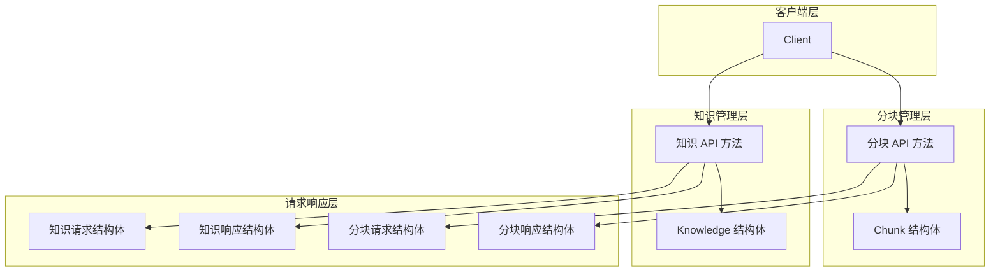

# knowledge_and_chunk_api 模块

## 概述

`knowledge_and_chunk_api` 模块是 WeKnora SDK 客户端库中负责管理知识库内容的核心组件。它解决了**如何高效地将各种来源的知识（文件、URL、文本）导入到知识库中，并将其分解为可检索的小片段**这一问题。

想象一下，你有一个大型文档仓库，里面有 PDF、Word 文档、网页链接等各种格式的内容。你需要让这些内容变得可搜索、可被 AI 理解。这个模块就像是一个**知识加工工厂**：它接收原始材料，将其送入处理流水线，然后输出标准化的、可检索的知识单元。

## 架构概览

这个模块采用了清晰的分层架构：

1. **客户端层**：提供统一的入口点 `Client`，所有操作都通过它发起
2. **知识管理层**：处理知识条目的完整生命周期（创建、读取、更新、删除、重新解析）
3. **分块管理层**：管理知识条目被分解后的小片段
4. **请求响应层**：定义了与服务器通信的数据结构

数据流向通常是这样的：
- **创建知识**：客户端调用 `CreateKnowledgeFromFile` 或 `CreateKnowledgeFromURL` → 构造请求 → 发送到服务器 → 解析响应 → 返回 `Knowledge` 对象
- **管理分块**：客户端调用 `ListKnowledgeChunks` → 获取分块列表 → 可选地调用 `UpdateChunk` 或 `DeleteChunk` 进行修改

## 核心设计决策

### 1. 知识与分块的分离设计

**决策**：将 `Knowledge`（完整知识条目）和 `Chunk`（知识片段）作为两个独立但关联的实体进行管理。

**为什么这样设计**：
- 一个完整的文档可能太长，不适合直接进行向量检索
- 将文档分解为多个小片段，可以提高检索的精确度
- 保留完整知识条目作为"容器"，便于管理文档的元数据和生命周期

**权衡**：
- ✅ 优点：检索精度更高，可以灵活处理不同粒度的内容
- ❌ 缺点：增加了系统复杂度，需要维护知识条目与分块之间的一致性

### 2. 多源知识导入的统一接口

**决策**：提供 `CreateKnowledgeFromFile` 和 `CreateKnowledgeFromURL` 两个独立但相似的方法，而不是一个通用的 `CreateKnowledge` 方法。

**为什么这样设计**：
- 文件上传和 URL 导入在实现上有很大差异（文件需要 multipart/form-data，URL 是 JSON 请求体）
- 明确的方法名让 API 更加自文档化
- 可以针对不同来源提供不同的参数选项（如文件的自定义文件名，URL 的文件类型提示）

**权衡**：
- ✅ 优点：API 更清晰，类型安全，参数更符合场景
- ❌ 缺点：代码有一定重复，需要维护两个相似的方法

### 3. 异步处理模型

**决策**：知识的解析和分块是异步进行的，客户端需要通过 `ParseStatus` 字段跟踪处理状态。

**为什么这样设计**：
- 文档解析可能是一个耗时操作（特别是大型 PDF 或复杂文档）
- 异步处理可以避免 HTTP 请求超时
- 提供 `ReparseKnowledge` 方法允许在需要时重新触发解析

**权衡**：
- ✅ 优点：更好的用户体验，不会因为长时间处理而阻塞
- ❌ 缺点：客户端需要实现轮询或事件监听来获取处理结果，增加了客户端复杂度

### 4. 灵活的元数据设计

**决策**：`Knowledge` 结构体使用 `json.RawMessage` 类型的 `Metadata` 字段，`Chunk` 结构体使用 `any` 类型的 `Metadata` 字段。

**为什么这样设计**：
- 不同类型的知识可能需要存储不同的元数据
- 保持客户端的灵活性，不需要为每种元数据类型定义新的结构体
- 允许未来扩展而不破坏现有代码

**权衡**：
- ✅ 优点：高度灵活，易于扩展
- ❌ 缺点：类型安全性降低，需要客户端自己处理元数据的序列化和反序列化

## 子模块概览

该模块被进一步细分为以下子模块：

### [knowledge_core_model](sdk_client_library-knowledge_and_chunk_api-knowledge_core_model.md)

负责定义知识条目的核心数据结构，包括 `Knowledge` 结构体及其相关的请求和响应类型。这个子模块是整个知识管理的基础，它定义了知识条目的属性、状态和关系。

### [knowledge_requests_and_responses](sdk_client_library-knowledge_and_chunk_api-knowledge_requests_and_responses.md)

封装了与知识管理相关的所有 API 请求和响应结构，包括创建知识、更新知识、批量获取知识等操作的数据契约。这个子模块确保了客户端与服务器之间通信的数据一致性。

### [chunk_management_api](sdk_client_library-knowledge_and_chunk_api-chunk_management_api.md)

专注于知识分块的管理，提供了列出分块、更新分块、删除分块等功能。这个子模块处理的是知识被分解后的最小单元，是实现精确检索的关键。

## 与其他模块的关系

`knowledge_and_chunk_api` 模块位于 `sdk_client_library` 下，与其他模块有以下重要关系：

- **依赖于**：[core_client_runtime](../sdk_client_library-core_client_runtime.md) - 提供了底层的 HTTP 客户端功能和请求处理机制
- **被依赖于**：间接被 [knowledge_base_api](../sdk_client_library-knowledge_base_api.md) 使用，因为知识库是知识条目的容器
- **协作关系**：与 [tag_api](../sdk_client_library-tag_api.md) 协作，为知识条目添加标签；与 [faq_api](../sdk_client_library-faq_api.md) 协作，处理 FAQ 类型的知识

## 新开发者注意事项

### 1. 状态跟踪的重要性

创建知识条目后，不要假设它立即可用。一定要检查 `ParseStatus` 字段，它会告诉你知识条目是否已经处理完成。常见的状态值包括：
- `pending`：等待处理
- `processing`：正在处理
- `completed`：处理完成
- `failed`：处理失败

### 2. 重复检测机制

模块提供了 `ErrDuplicateFile` 和 `ErrDuplicateURL` 错误来检测重复的知识条目。当你收到这些错误时，API 仍然会返回已存在的知识条目对象，你可以根据需要决定是使用现有条目还是进行其他处理。

### 3. URL 导入的智能模式切换

使用 `CreateKnowledgeFromURL` 时要注意，当 URL 路径包含已知文件扩展名（如 .pdf、.docx），或者你提供了 `FileName` 或 `FileType` 参数时，服务器会自动切换到文件下载模式而不是网页爬取模式。这是一个很有用的特性，但需要你理解它的工作原理。

### 4. 分块的链式关系

`Chunk` 结构体中有 `PreChunkID` 和 `NextChunkID` 字段，它们建立了分块之间的链式关系。在处理需要保持上下文连贯性的场景时，这些字段非常有用。

### 5. 多模态支持

模块提供了 `enableMultimodel` 参数，用于启用多模态处理。这对于包含图像的文档特别有用，但会增加处理时间和资源消耗。

## 总结

`knowledge_and_chunk_api` 模块是 WeKnora SDK 中连接客户端与知识库服务的桥梁。它通过清晰的分层设计、灵活的 API 接口和异步处理模型，为开发者提供了一套完整的知识管理工具。理解这个模块的设计思想和内部机制，将帮助你更高效地构建基于知识库的应用程序。
