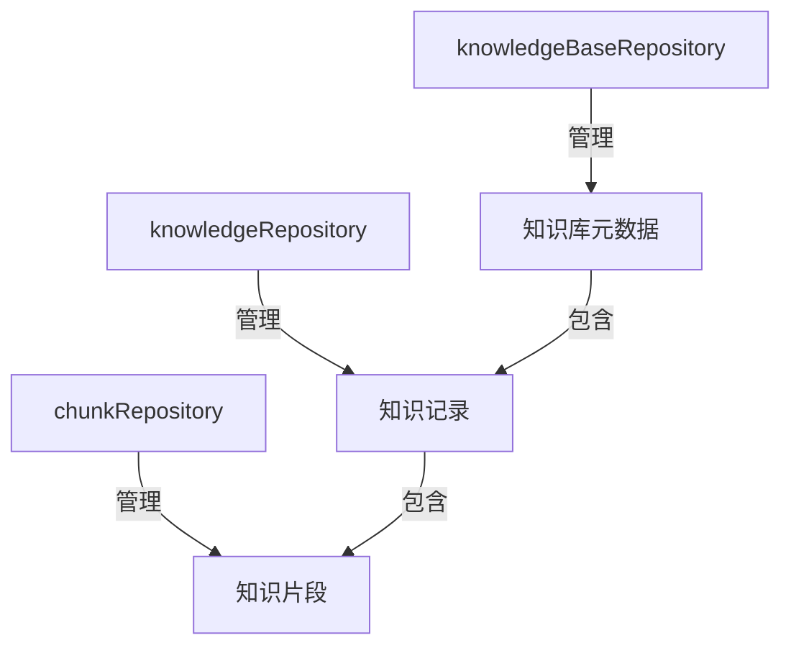
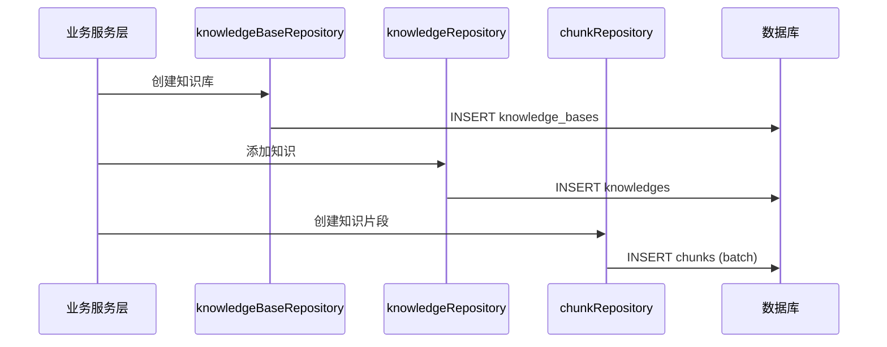
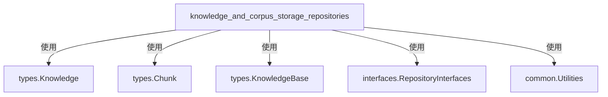

# knowledge_and_corpus_storage_repositories 模块技术深度文档

## 1. 模块概述

### 1.1 问题空间
在知识管理系统中，我们需要高效地存储和管理三种核心实体：知识库（KnowledgeBase）、知识（Knowledge）和知识片段（Chunk）。这个模块解决了以下问题：

- **多租户数据隔离**：如何确保不同租户的数据完全隔离，同时保持查询效率
- **实体关系管理**：如何高效管理知识库-知识-片段的层级关系
- **批量操作性能**：如何处理大量知识片段的创建、更新和删除操作
- **灵活的查询能力**：如何支持按标签、关键词、文件类型等多维度筛选
- **数据一致性**：如何在复杂操作中保持数据的完整性和一致性

### 1.2 模块定位
这个模块是系统的数据访问层（Repository），负责知识相关数据的持久化和检索。它位于业务逻辑层和数据库之间，提供了清晰的数据访问抽象。

## 2. 架构设计

### 2.1 核心组件



本模块包含三个主要子模块，每个子模块负责管理一种核心实体：

- **[knowledge_base_metadata_persistence](data_access_repositories-content_and_knowledge_management_repositories-knowledge_and_corpus_storage_repositories-knowledge_base_metadata_persistence.md)**：管理知识库元数据
- **[knowledge_record_persistence](data_access_repositories-content_and_knowledge_management_repositories-knowledge_and_corpus_storage_repositories-knowledge_record_persistence.md)**：管理知识记录
- **[chunk_record_persistence](data_access_repositories-content_and_knowledge_management_repositories-knowledge_and_corpus_storage_repositories-chunk_record_persistence.md)**：管理知识片段

#### 2.1.1 knowledgeBaseRepository
**职责**：管理知识库的元数据，包括创建、查询、更新和删除知识库。
**关键特性**：
- 支持按租户ID查询知识库
- 提供临时知识库的过滤机制
- 确保知识库ID的唯一性

详细内容请参考：[knowledge_base_metadata_persistence](data_access_repositories-content_and_knowledge_management_repositories-knowledge_and_corpus_storage_repositories-knowledge_base_metadata_persistence.md)

#### 2.1.2 knowledgeRepository
**职责**：管理知识记录，包括文档、URL、手动内容等。
**关键特性**：
- 支持知识的存在性检查（基于文件哈希、文件名+大小等）
- 提供分页查询和多维度筛选（标签、关键词、文件类型）
- 支持知识库间的知识对比（AminusB方法）
- 提供跨知识库的搜索能力

详细内容请参考：[knowledge_record_persistence](data_access_repositories-content_and_knowledge_management_repositories-knowledge_and_corpus_storage_repositories-knowledge_record_persistence.md)

#### 2.1.3 chunkRepository
**职责**：管理知识片段，这是知识检索的基本单位。
**关键特性**：
- 批量创建知识片段（每批100条）
- 支持FAQ类型和文本类型的片段
- 提供灵活的元数据查询（针对FAQ类型）
- 支持片段的差异比较（FAQChunkDiff）
- 批量更新片段的标志位（UpdateChunkFlagsBatch）

详细内容请参考：[chunk_record_persistence](data_access_repositories-content_and_knowledge_management_repositories-knowledge_and_corpus_storage_repositories-chunk_record_persistence.md)

### 2.2 数据流向



## 3. 关键设计决策

### 3.1 租户隔离策略
**选择**：在所有查询中显式使用 `tenant_id` 过滤  
**替代方案**：使用数据库的行级安全策略（RLS）或分库分表  
**权衡分析**：
- ✅ 简单直接，易于理解和调试
- ✅ 性能可控，可以通过索引优化
- ❌ 需要在代码中处处注意添加租户过滤
- ❌ 存在忘记添加过滤导致数据泄露的风险

### 3.2 批量操作处理
**选择**：使用原生SQL和CASE表达式实现批量更新  
**替代方案**：使用GORM的Save方法逐个更新  
**权衡分析**：
- ✅ 性能优异，减少数据库往返次数
- ✅ 可以精确控制更新的字段
- ❌ 代码复杂度较高，需要手动构建SQL
- ❌ 数据库迁移时需要注意SQL兼容性

**示例**：在 `UpdateChunks` 方法中，使用CASE表达式一次性更新多个片段的内容、启用状态、标签等字段。

### 3.3 查询灵活性与性能的平衡
**选择**：提供多种查询方法，针对不同场景优化  
**替代方案**：提供通用的查询构建器  
**权衡分析**：
- ✅ 方法语义清晰，易于使用
- ✅ 可以针对特定查询进行索引优化
- ❌ 方法数量较多，维护成本较高
- ❌ 新的查询需求需要添加新方法

**示例**：
- `ListPagedKnowledgeByKnowledgeBaseID`：针对知识库内的分页查询优化
- `SearchKnowledge`：针对跨知识库搜索优化
- `SearchKnowledgeInScopes`：针对有权限限制的搜索优化

### 3.4 数据一致性保障
**选择**：依赖数据库事务和外键约束（隐式）  
**替代方案**：应用层实现分布式事务或事件溯源  
**权衡分析**：
- ✅ 利用数据库成熟的事务机制
- ✅ 实现简单，不易出错
- ❌ 跨服务操作时无法保证一致性
- ❌ 长事务可能影响并发性能

## 4. 核心实现细节

### 4.1 knowledgeRepository 的存在性检查
`CheckKnowledgeExists` 方法实现了智能的知识存在性检查：

```go
// 优先使用文件哈希匹配
if params.FileHash != "" {
    // 基于哈希的精确匹配
}
// 回退到文件名+大小匹配
else if params.FileName != "" && params.FileSize > 0 {
    // 基于文件名和大小的匹配
}
```

**设计意图**：
- 文件哈希是最可靠的唯一性标识，但计算哈希需要额外开销
- 文件名+大小是快速的近似匹配，可以在大多数情况下工作
- 提供两层检查，在性能和准确性之间取得平衡

### 4.2 chunkRepository 的批量创建
`CreateChunks` 方法有两个关键点：

```go
// 1. 清理无效的UTF-8字符
for _, chunk := range chunks {
    chunk.Content = common.CleanInvalidUTF8(chunk.Content)
}

// 2. 使用Select("*")确保零值字段也被插入
return r.db.WithContext(ctx).Select("*").CreateInBatches(chunks, 100).Error
```

**设计意图**：
- 清理无效UTF-8：防止数据库存储异常，提高数据质量
- Select("*")：GORM默认会忽略零值字段，这可能导致IsEnabled=false等重要信息丢失
- 100条一批：在内存使用和数据库往返次数之间取得平衡

### 4.3 数据库兼容性处理
在 `ListPagedChunksByKnowledgeID` 方法中，针对不同数据库使用不同的JSON查询语法：

```go
isPostgres := db.Dialector.Name() == "postgres"

if isPostgres {
    db = db.Where("metadata->>'standard_question' ILIKE ?", like)
} else {
    db = db.Where("metadata->>'$.standard_question' LIKE ?", like)
}
```

**设计意图**：
- PostgreSQL使用 `->>` 操作符，支持ILIKE进行不区分大小写的匹配
- MySQL使用 `->>'$.key'` 语法，使用LIKE进行匹配
- 通过检测数据库方言，在运行时选择合适的语法

## 5. 依赖关系

### 5.1 内部依赖


### 5.2 外部依赖
- **gorm.io/gorm**：ORM框架，用于数据库操作
- **context**：Go标准库，用于请求上下文管理
- **errors**：Go标准库，用于错误处理

## 6. 使用指南

### 6.1 基本使用模式

```go
// 创建仓库实例
kbRepo := NewKnowledgeBaseRepository(db)
kRepo := NewKnowledgeRepository(db)
cRepo := NewChunkRepository(db)

// 创建知识库
kb := &types.KnowledgeBase{...}
err := kbRepo.CreateKnowledgeBase(ctx, kb)

// 添加知识
knowledge := &types.Knowledge{...}
err = kRepo.CreateKnowledge(ctx, knowledge)

// 创建知识片段
chunks := []*types.Chunk{...}
err = cRepo.CreateChunks(ctx, chunks)
```

### 6.2 注意事项和最佳实践

1. **租户隔离**：
   - 始终使用带租户ID的查询方法，除非明确需要跨租户操作
   - `GetKnowledgeByIDOnly` 和 `GetChunkByIDOnly` 仅用于权限解析场景

2. **批量操作**：
   - 对于大量片段的创建，使用 `CreateChunks` 而不是逐个创建
   - 对于大量片段的更新，使用 `UpdateChunks` 而不是 `UpdateChunk`

3. **查询优化**：
   - 对于分页查询，先获取总数再获取数据，避免全表扫描
   - 使用 `SearchKnowledgeInScopes` 而不是多次调用 `SearchKnowledge`

4. **错误处理**：
   - 检查 `ErrKnowledgeNotFound` 和 `ErrKnowledgeBaseNotFound` 等特定错误
   - 对于批量操作，注意部分成功部分失败的情况

## 7. 扩展点和未来改进

### 7.1 可能的扩展方向
1. **缓存层**：为频繁查询的知识库和知识添加缓存
2. **读写分离**：将查询操作路由到只读副本
3. **更丰富的查询能力**：添加全文索引和复杂查询支持
4. **审计日志**：记录所有数据变更操作
5. **软删除优化**：当前使用GORM的软删除，但查询性能可能受影响

### 7.2 当前限制
1. 缺少数据库迁移的自动化测试
2. 某些方法（如 `UpdateChunks`）的SQL兼容性有限
3. 没有对大查询结果集的流式处理支持
4. 缺少对数据库连接池的精细配置

## 8. 总结

`knowledge_and_corpus_storage_repositories` 模块是知识管理系统的核心数据访问层，它通过三个Repository类管理知识库、知识和知识片段的完整生命周期。模块在设计上注重性能优化（批量操作）、数据质量（UTF-8清理）、租户隔离（显式过滤）和查询灵活性（多维度筛选），同时也在代码复杂度和可维护性之间做出了合理的权衡。

对于新加入的开发者，理解这个模块的关键在于掌握三个Repository的职责分工、批量操作的实现细节，以及租户隔离的策略。
