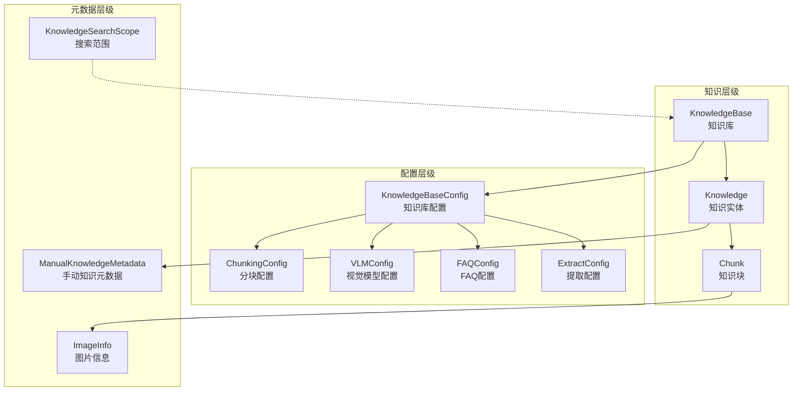
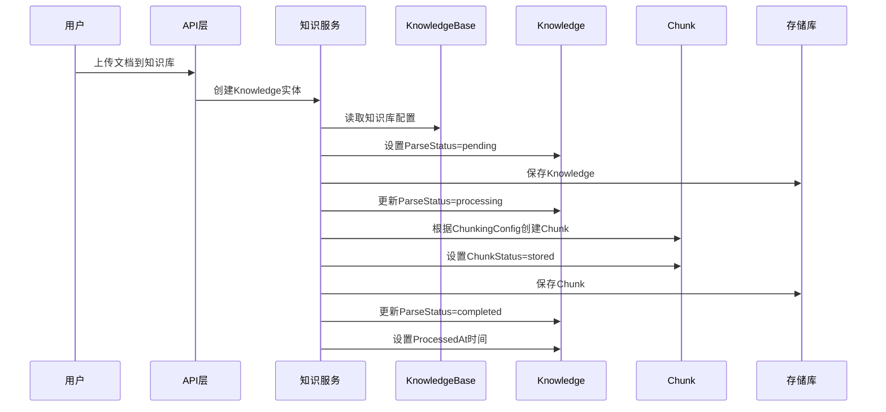

# 知识与知识库领域模型

## 概述

这个模块定义了整个知识管理系统的核心领域模型，是连接数据存储、业务逻辑和API接口的桥梁。它解决了以下关键问题：

1. **知识实体的统一表示** - 无论是文档、FAQ还是手动创建的知识，都需要一个一致的数据模型来存储和检索
2. **知识库的配置管理** - 不同知识库可能有不同的分块策略、索引方式和处理流程
3. **多模态知识的支持** - 现代知识管理不仅包含文本，还需要处理图片、表格等复杂内容
4. **知识处理的状态追踪** - 从上传到解析再到索引，需要清晰的状态机来管理异步处理流程

可以把这个模块想象成**知识管理系统的"建筑图纸"**——它定义了所有核心概念的形状、关系和行为规则，就像建筑图纸规定了房子的结构、尺寸和功能分区一样。

## 核心架构



### 架构解析

这个模块采用了**分层聚合**的设计模式：

1. **知识聚合层**：`KnowledgeBase` → `Knowledge` → `Chunk` 形成了清晰的聚合根结构
   - `KnowledgeBase` 是聚合根，负责整体配置和组织
   - `Knowledge` 代表单个知识单元（文档、FAQ等）
   - `Chunk` 是最小的检索单元，支持精确的内容定位

2. **配置组合层**：各种配置对象通过组合的方式挂载到 `KnowledgeBase` 上
   - 每个配置对象都是独立的，可单独演进
   - 通过 JSON 序列化存储到数据库，保持灵活性

3. **元数据扩展层**：使用 `Metadata` 字段和专门的元数据结构来支持不同类型知识的特殊需求
   - 避免了主模型的臃肿
   - 保持了扩展性

## 关键设计决策

### 1. 单表继承 vs 独立表结构

**选择**：使用单一 `Knowledge` 表，通过 `Type` 字段区分知识类型，特殊数据存入 `Metadata` JSON 字段

**替代方案**：为每种知识类型创建独立表（DocumentKnowledge、FAQKnowledge等）

**权衡分析**：
- ✅ **灵活性**：新增知识类型无需修改数据库结构
- ✅ **查询统一**：跨类型查询无需复杂的 JOIN
- ❌ **类型安全**：编译期无法验证类型特定字段
- ❌ **查询性能**：JSON 字段的查询效率低于结构化字段

**为什么这样选择**：知识管理系统的类型变化较快，且查询模式以整体检索为主，灵活性优先于严格的类型安全。

### 2. 分块策略配置化

**选择**：将分块参数（chunk_size、chunk_overlap、separators）作为知识库配置的一部分

**替代方案**：使用固定的分块策略，或在知识级别配置

**权衡分析**：
- ✅ **场景适配**：不同知识库可以根据内容特点选择最佳分块方式
- ✅ **一致性**：同一知识库内的分块策略保持一致
- ❌ **复杂度**：用户需要理解分块参数的含义
- ❌ **迁移成本**：修改分块策略需要重新处理所有知识

**为什么这样选择**：不同类型的文档（代码、论文、FAQ）对分块的要求差异极大，配置化是必要的。

### 3. 多模态配置的向后兼容

**选择**：`VLMConfig` 同时支持新老两套配置方案，`IsEnabled()` 方法自动判断

**替代方案**：强制迁移，或创建独立的配置表

**权衡分析**：
- ✅ **无缝升级**：老用户无需修改配置即可升级
- ✅ **渐进迁移**：可以逐步引导用户使用新配置
- ❌ **代码复杂度**：需要维护两套配置逻辑
- ❌ **理解成本**：新开发者需要理解历史包袱

**为什么这样选择**：对于生产系统，向后兼容性的优先级很高，避免破坏性升级。

### 4. 状态机设计

**选择**：使用字符串类型的状态字段（`ParseStatus`、`SummaryStatus`），而非枚举

**替代方案**：使用数据库枚举类型，或独立的状态表

**权衡分析**：
- ✅ **灵活性**：新增状态无需数据库迁移
- ✅ **可读性**：字符串状态在日志和调试中更直观
- ❌ **类型安全**：编译器无法捕获无效状态
- ❌ **存储开销**：字符串比整数占用更多空间

**为什么这样选择**：知识处理流程可能频繁调整，状态机需要保持灵活性。

## 数据流动

让我们追踪一个文档从上传到可检索的完整流程：



### 关键节点说明

1. **配置读取**：创建知识时首先读取知识库配置，确保使用正确的分块策略和处理流程
2. **状态流转**：`pending` → `processing` → `completed`/`failed`，清晰的状态机管理
3. **异步处理**：实际的文档解析和分块是异步进行的，避免阻塞API响应
4. **关联关系**：Chunk 与 Knowledge、KnowledgeBase 都建立了关联，支持多种查询方式

## 子模块详解

本模块分为四个清晰的子模块，每个子模块负责特定的功能领域：

1. **[知识领域模型与手动内容载体](core_domain_types_and_interfaces-knowledge_graph_retrieval_and_content_contracts-knowledge_and_knowledgebase_domain_models-knowledge_domain_models_and_manual_content_payloads.md)** - 定义知识实体的核心结构和手动知识的特殊处理
2. **[知识查询范围与完整性契约](core_domain_types_and_interfaces-knowledge_graph_retrieval_and_content_contracts-knowledge_and_knowledgebase_domain_models-knowledge_query_scope_and_integrity_contracts.md)** - 定义知识搜索的范围边界和数据完整性检查规则
3. **[知识库核心与存储配置](core_domain_types_and_interfaces-knowledge_graph_retrieval_and_content_contracts-knowledge_and_knowledgebase_domain_models-knowledgebase_core_and_storage_configuration.md)** - 定义知识库的基本结构和云存储配置
4. **[知识库提取、FAQ与多模态处理配置](core_domain_types_and_interfaces-knowledge_graph_retrieval_and_content_contracts-knowledge_and_knowledgebase_domain_models-knowledgebase_extraction_faq_and_multimodal_processing_configuration.md)** - 定义FAQ索引策略、知识提取配置和多模态处理参数

## 核心组件详解

### KnowledgeBase - 知识库聚合根

`KnowledgeBase` 是整个知识管理的核心组织单元，它不仅存储元数据，还包含了处理知识的所有配置信息。

**设计意图**：
- 作为聚合根，确保知识库内所有知识的处理策略一致
- 集中管理配置，避免在每个知识上重复设置
- 支持多租户隔离（通过 `TenantID`）

**关键特性**：
- `EnsureDefaults()` 方法确保配置的完整性
- `IsMultimodalEnabled()` 提供向后兼容的多模态检测
- 计算字段（`KnowledgeCount`、`ChunkCount`等）通过查询时填充，避免冗余存储

### Knowledge - 知识实体

`Knowledge` 代表一个独立的知识单元，可以是文档、FAQ或手动创建的内容。

**设计意图**：
- 统一不同类型知识的公共属性
- 通过 `Type` 字段和 `Metadata` 支持类型差异化
- 状态机管理处理生命周期

**关键特性**：
- `BeforeCreate` 钩子自动生成 UUID
- `ManualMetadata()` / `SetManualMetadata()` 提供类型安全的元数据访问
- `IsManual()` 等类型判断方法简化业务逻辑

### Chunk - 知识块

`Chunk` 是最小的检索单元，是知识管理系统的"原子"。

**设计意图**：
- 将大文档拆分为可管理的小片段，提高检索精度
- 保留原始位置信息，支持内容定位和上下文重建
- 通过 `ChunkType` 支持多种内容类型的索引

**关键特性**：
- 双向链表结构（`PreChunkID` / `NextChunkID`）支持上下文浏览
- 位标志（`Flags`）高效存储多个布尔状态
- `ImageInfo` JSON 字段支持多模态内容

### 配置对象族

配置对象采用统一的设计模式：
- 纯数据结构，无业务逻辑
- 实现 `driver.Valuer` 和 `sql.Scanner` 接口支持数据库序列化
- 可选字段使用指针类型，区分"未设置"和"零值"

## 与其他模块的关系

### 依赖关系

这个模块是**被依赖者**，处于架构的核心层：

- **上游依赖**：几乎所有业务模块都依赖这些领域模型
  - [content_and_knowledge_management_repositories](data_access_repositories-content_and_knowledge_management_repositories.md) - 使用这些模型进行数据持久化
  - [knowledge_ingestion_extraction_and_graph_services](application_services_and_orchestration-knowledge_ingestion_extraction_and_graph_services.md) - 使用模型进行知识处理
  - [knowledge_faq_and_tag_content_handlers](http_handlers_and_routing-knowledge_faq_and_tag_content_handlers.md) - 使用模型进行API序列化

- **下游依赖**：几乎没有，只依赖基础库
  - `gorm` - 数据库 ORM
  - `uuid` - ID 生成

### 数据契约

这个模块定义了系统中的关键数据契约：
- `KnowledgeSearchScope` - 定义搜索的范围边界
- `KnowledgeCheckParams` - 定义知识重复性检查的参数
- 各种配置对象 - 定义知识库的行为契约

## 使用指南

### 创建知识库

```go
kb := &types.KnowledgeBase{
    Name:        "技术文档库",
    Type:        types.KnowledgeBaseTypeDocument,
    Description: "存储团队技术文档",
    TenantID:    tenantID,
    ChunkingConfig: types.ChunkingConfig{
        ChunkSize:    512,
        ChunkOverlap: 50,
        Separators:   []string{"\n\n", "\n", "。", "！", "？"},
    },
}
kb.EnsureDefaults() // 重要：确保默认值
```

### 添加手动知识

```go
knowledge := &types.Knowledge{
    KnowledgeBaseID: kbID,
    Type:            types.KnowledgeTypeManual,
    Title:           "API 使用指南",
    TenantID:        tenantID,
}
knowledge.EnsureManualDefaults()

meta := types.NewManualKnowledgeMetadata(content, types.ManualKnowledgeStatusPublish, 1)
knowledge.SetManualMetadata(meta)
```

### 检查多模态支持

```go
if kb.IsMultimodalEnabled() {
    // 使用 VLM 处理图片
    vlmModelID := kb.VLMConfig.ModelID
    // ...
}
```

## 注意事项与陷阱

### 1. 必须调用 EnsureDefaults

**问题**：创建 `KnowledgeBase` 或 `Knowledge` 后忘记调用 `EnsureDefaults()` 可能导致配置不完整。

**后果**：默认值缺失可能导致处理流程出错。

**解决方案**：养成习惯，创建后立即调用 `EnsureDefaults()`。

### 2. JSON 字段的 nil vs 空对象

**问题**：`Metadata` 字段的 `nil` 和空 JSON 对象 `{}` 在数据库中是不同的，但在业务逻辑中可能需要同等对待。

**后果**：`GetMetadata()` 对 `nil` 返回 `nil`，对 `{}` 返回空 map。

**解决方案**：使用提供的辅助方法（如 `ManualMetadata()`）而非直接操作 JSON。

### 3. 状态机的并发安全

**问题**：多个异步任务可能同时更新 `ParseStatus`，导致状态混乱。

**后果**：可能出现 `processing` 状态永远无法转换到 `completed`。

**解决方案**：使用数据库乐观锁或分布式锁确保状态转换的原子性。

### 4. 向后兼容的配置判断

**问题**：直接访问 `VLMConfig.Enabled` 可能忽略老版本配置。

**后果**：老用户升级后多模态功能意外关闭。

**解决方案**：始终使用 `IsEnabled()` 方法而非直接访问字段。

### 5. 计算字段的生命周期

**问题**：`KnowledgeCount` 等字段不是数据库字段，需要在查询后手动填充。

**后果**：忘记填充会导致零值，误导用户。

**解决方案**：在 Repository 层统一处理计算字段的填充。

## 扩展点

### 新增知识类型

1. 在 `KnowledgeType` 常量中添加新类型
2. 创建对应的元数据结构（如 `XxxKnowledgeMetadata`）
3. 添加类型判断方法（如 `IsXxx()`）
4. 添加元数据访问方法（如 `XxxMetadata()` / `SetXxxMetadata()`）

### 新增配置项

1. 在对应的配置结构中添加字段
2. 更新 `EnsureDefaults()` 方法（如需要）
3. 考虑是否需要向后兼容逻辑
4. 更新使用该配置的业务逻辑

### 新增 Chunk 类型

1. 在 `ChunkType` 常量中添加新类型
2. 在业务逻辑中处理新类型的特殊需求
3. 考虑是否需要扩展 `Chunk` 结构或使用 `Metadata` 字段

## 总结

`knowledge_and_knowledgebase_domain_models` 模块是整个知识管理系统的"脊柱"，它定义了核心概念和交互规则。其设计哲学可以概括为：

1. **灵活性优先** - 使用 JSON 字段和配置化设计，快速响应需求变化
2. **向后兼容** - 谨慎处理变更，保护现有用户的投资
3. **聚合设计** - 清晰的层次结构，确保数据一致性
4. **状态机思维** - 明确定义生命周期，管理异步流程

对于新加入团队的开发者，理解这个模块是理解整个系统的关键——一旦掌握了这些领域模型，你就掌握了系统的"语言"。
