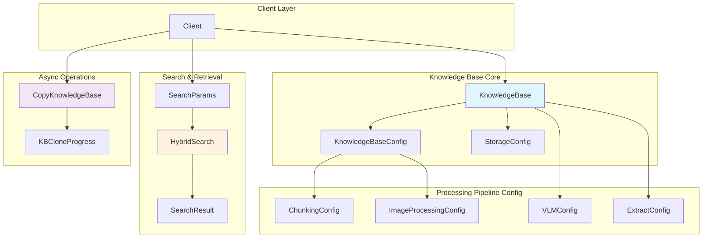
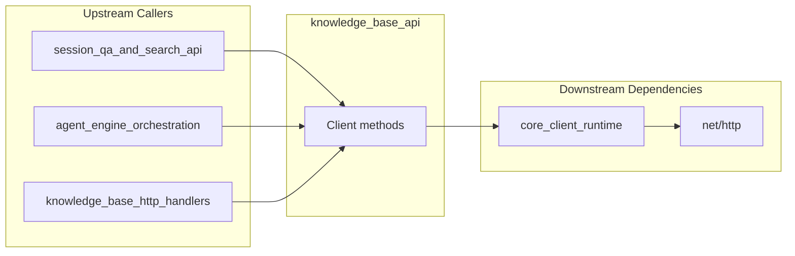

# Knowledge Base API 模块深度解析

## 概述：为什么需要这个模块

想象一下，你正在构建一个企业级问答系统。用户上传了数百份 PDF 文档、Word 报告、Excel 表格，甚至还有一些网页截图。用户期望能够像和专家对话一样提问："上个季度的销售趋势是什么？"，系统需要快速从海量文档中找到相关信息并给出准确答案。

**核心问题**：如何高效地组织、索引和检索这些非结构化知识？

`knowledge_base_api` 模块正是为解决这个问题而生。它不是简单的 CRUD 接口封装，而是一个**知识库生命周期管理的统一抽象层**。这个模块的核心设计洞察是：**知识库不仅仅是文档的容器，而是一个包含分块策略、嵌入模型、图像处理和图谱提取配置的完整检索系统**。

如果你尝试用 naive 的方式解决这个问题，可能会为每种文档类型写独立的存储逻辑，为每种检索方式（关键词、向量、混合）写独立的查询接口。这个模块通过统一的 `KnowledgeBase` 抽象，将复杂性封装在配置层，让上层应用只需关心"我要在这个知识库里搜索"，而不必关心底层是用 Elasticsearch 还是 Milvus，是用 BM25 还是向量相似度。

---

## 架构全景



### 组件角色与数据流

**架构定位**：这个模块是 SDK 客户端层与后端知识库服务之间的**契约层**。它定义了：
1. **知识库的完整状态模型**（`KnowledgeBase`）
2. **检索操作的输入输出契约**（`SearchParams` → `SearchResult`）
3. **异步任务的进度追踪模型**（`KBCloneProgress`）

**数据流核心路径**：

1. **知识库创建流**：`Client.CreateKnowledgeBase()` → 发送 `KnowledgeBase` → 后端持久化 → 返回带 ID 的 `KnowledgeBase`
2. **混合检索流**：`Client.HybridSearch()` → 发送 `SearchParams` → 后端执行向量 + 关键词检索 → 返回 `[]SearchResult`
3. **知识库克隆流**：`Client.CopyKnowledgeBase()` → 返回 `TaskID` → 轮询 `GetKBCloneProgress()` → 完成

**依赖关系**：
- **被依赖**：[agent_session_and_message_api](agent_session_and_message_api.md) 中的会话 QA 功能会调用此模块进行知识检索
- **依赖**：[core_client_runtime](core_client_runtime.md) 提供底层 HTTP 客户端和请求解析
- **关联**：[knowledge_and_chunk_api](knowledge_and_chunk_api.md) 管理知识库内的具体文档和分块，此模块管理知识库容器本身

---

## 核心组件深度解析

### KnowledgeBase：知识库的完整状态模型

```go
type KnowledgeBase struct {
    ID                    string                `json:"id"`
    Name                  string                `json:"name"`
    Type                  string                `json:"type"`
    IsTemporary           bool                  `json:"is_temporary"`
    Description           string                `json:"description"`
    TenantID              uint64                `json:"tenant_id"`
    ChunkingConfig        ChunkingConfig        `json:"chunking_config"`
    ImageProcessingConfig ImageProcessingConfig `json:"image_processing_config"`
    FAQConfig             *FAQConfig            `json:"faq_config"`
    EmbeddingModelID      string                `json:"embedding_model_id"`
    SummaryModelID        string                `json:"summary_model_id"`
    VLMConfig             VLMConfig             `json:"vlm_config"`
    StorageConfig         StorageConfig         `json:"cos_config"`
    ExtractConfig         *ExtractConfig        `json:"extract_config"`
    CreatedAt             time.Time             `json:"created_at"`
    UpdatedAt             time.Time             `json:"updated_at"`
    // 计算字段（不存储在数据库中）
    KnowledgeCount  int64 `json:"knowledge_count"`
    ChunkCount      int64 `json:"chunk_count"`
    IsProcessing    bool  `json:"is_processing"`
    ProcessingCount int64 `json:"processing_count"`
}
```

**设计意图**：这个结构体是模块的**核心抽象**。它采用了"配置内聚"的设计模式——所有与知识库行为相关的配置都作为字段内嵌，而不是分散在多个独立的 API 调用中。

**关键字段解析**：

| 字段 | 设计原因 | 使用场景 |
|------|----------|----------|
| `ChunkingConfig` | 文档分块策略直接影响检索质量，必须在知识库级别统一 | 上传文档时自动按此配置分块 |
| `EmbeddingModelID` | 向量检索的核心，更换模型需要重新嵌入所有文档 | 检索时调用对应的嵌入服务 |
| `FAQConfig` (指针) | 可选功能，只有 FAQ 模式的知识库需要 | FAQ 导入和问答匹配 |
| `ExtractConfig` (指针) | 图谱提取是高级功能，默认禁用 | 构建知识图谱时启用 |
| `IsProcessing` | 异步处理的进度指示，避免重复操作 | 前端显示处理状态，阻止并发修改 |

**计算字段的设计考量**：`KnowledgeCount`、`ChunkCount`、`IsProcessing` 等字段标注为"Computed fields"，这意味着它们**不直接存储在数据库的知识库记录中**，而是在查询时动态计算（通常通过 `COUNT` 子查询或缓存）。这种设计的 tradeoff 是：
- **优点**：保证数据一致性（计数永远反映真实状态），避免更新知识库时需要额外维护计数
- **缺点**：列表查询时可能有性能开销，需要数据库支持高效的聚合查询

**指针 vs 值类型的选择**：注意 `FAQConfig` 和 `ExtractConfig` 是指针类型，而 `ChunkingConfig` 是值类型。这反映了设计者的意图：
- 分块配置是**必需的**，每个知识库都必须有（即使使用默认值）
- FAQ 和图谱提取是**可选的**，`nil` 表示未启用

### SearchParams：混合检索的控制面板

```go
type SearchParams struct {
    QueryText            string  `json:"query_text"`
    VectorThreshold      float64 `json:"vector_threshold"`
    KeywordThreshold     float64 `json:"keyword_threshold"`
    MatchCount           int     `json:"match_count"`
    DisableKeywordsMatch bool    `json:"disable_keywords_match"`
    DisableVectorMatch   bool    `json:"disable_vector_match"`
}
```

**为什么需要这么多参数？**

混合检索（Hybrid Search）的核心挑战是**如何平衡向量相似度匹配和关键词精确匹配**。这个结构体提供了细粒度的控制：

- `VectorThreshold` / `KeywordThreshold`：过滤低质量结果的阈值。想象向量相似度是 0~1 的小数，设置 0.7 意味着只返回相似度高于 70% 的结果。这是**精度与召回率的调节旋钮**。
- `DisableKeywordsMatch` / `DisableVectorMatch`：允许退化为单一检索模式。某些场景下（如专业术语查询），关键词匹配更可靠；某些场景下（如语义相似问题），向量匹配更合适。
- `MatchCount`：限制返回数量，控制响应大小和后续处理开销。

**使用示例**：
```go
// 高精度模式：只返回非常相关的结果
params := &SearchParams{
    QueryText:        "季度财务报告",
    VectorThreshold:  0.85,
    KeywordThreshold: 0.8,
    MatchCount:       5,
}

// 高召回模式：尽可能多地找到相关文档
params := &SearchParams{
    QueryText:        "季度财务报告",
    VectorThreshold:  0.5,
    KeywordThreshold: 0.3,
    MatchCount:       20,
}

// 仅关键词匹配（适用于精确术语）
params := &SearchParams{
    QueryText:            "API-KEY-2024-Q3",
    DisableVectorMatch:   true,
    KeywordThreshold:     0.5,
    MatchCount:           10,
}
```

### SearchResult：检索结果的标准契约

```go
type SearchResult struct {
    ID                string            `json:"id"`
    Content           string            `json:"content"`
    KnowledgeID       string            `json:"knowledge_id"`
    ChunkIndex        int               `json:"chunk_index"`
    KnowledgeTitle    string            `json:"knowledge_title"`
    StartAt           int               `json:"start_at"`
    EndAt             int               `json:"end_at"`
    Seq               int               `json:"seq"`
    Score             float64           `json:"score"`
    ChunkType         string            `json:"chunk_type"`
    ImageInfo         string            `json:"image_info"`
    Metadata          map[string]string `json:"metadata"`
    KnowledgeFilename string            `json:"knowledge_filename"`
    KnowledgeSource   string            `json:"knowledge_source"`
    MatchedContent    string            `json:"matched_content,omitempty"`
}
```

**设计洞察**：这个结构体承载了**检索结果到用户展示的完整信息链**。

**关键字段说明**：

- `Content` vs `MatchedContent`：这是最容易混淆的两个字段。`Content` 是整个分块的完整内容，而 `MatchedContent` 是**实际匹配到的片段**。对于 FAQ 类型，`MatchedContent` 是匹配到的问题文本；对于普通文档，可能是高亮的关键词上下文。这个设计允许前端灵活展示——既可以看到完整分块，也可以只高亮匹配部分。

- `StartAt` / `EndAt`：字符级别的偏移量，用于在原文中高亮显示匹配位置。这是**用户体验优化的关键**，没有这两个字段，用户需要手动在长文档中查找匹配内容。

- `ChunkIndex` / `Seq`：分块在文档中的顺序索引，支持按原文顺序展示结果。

- `Metadata`：灵活的键值对存储，用于传递解析器提取的额外信息（如表格的行列数、图片的 OCR 结果等）。

### ExtractConfig 与 Graph 配置：知识图谱提取

```go
type ExtractConfig struct {
    Enabled   bool             `json:"enabled"`
    Text      string           `json:"text,omitempty"`
    Tags      []string         `json:"tags,omitempty"`
    Nodes     []*GraphNode     `json:"nodes,omitempty"`
    Relations []*GraphRelation `json:"relations,omitempty"`
}

type GraphNode struct {
    Name string `json:"name"`
}

type GraphRelation struct {
    Node1 string `json:"node1"`
    Node2 string `json:"node2"`
    Type  string `json:"type"`
}
```

**设计背景**：这是模块中最复杂的部分之一。知识图谱提取允许从文档中自动抽取实体和关系，构建结构化知识。

**配置模式**：
1. **自动模式**：只设置 `Enabled=true`，由 LLM 自动识别实体和关系
2. **引导模式**：通过 `Nodes` 和 `Relations` 预定义要提取的实体类型和关系类型

**示例**：
```go
// 提取公司-人物关系图谱
extractConfig := &ExtractConfig{
    Enabled: true,
    Nodes: []*GraphNode{
        {Name: "公司"},
        {Name: "人物"},
        {Name: "职位"},
    },
    Relations: []*GraphRelation{
        {Node1: "人物", Node2: "公司", Type: "任职于"},
        {Node1: "人物", Node2: "职位", Type: "担任"},
    },
}
```

**设计 tradeoff**：预定义节点和关系可以提高提取准确性，但降低了灵活性。这个设计选择了**混合模式**——允许用户根据场景选择自动或引导。

### KBCloneProgress：异步任务的进度追踪

```go
type KBCloneProgress struct {
    TaskID    string `json:"task_id"`
    SourceID  string `json:"source_id"`
    TargetID  string `json:"target_id"`
    Status    string `json:"status"`    // pending, processing, completed, failed
    Progress  int    `json:"progress"`  // 0-100
    Total     int    `json:"total"`     // 总操作数
    Processed int    `json:"processed"` // 已完成操作数
    Message   string `json:"message"`
    Error     string `json:"error,omitempty"`
    CreatedAt int64  `json:"created_at"`
    UpdatedAt int64  `json:"updated_at"`
}
```

**为什么需要这么详细的进度信息？**

知识库克隆是一个**耗时且资源密集型**的操作，涉及：
1. 复制知识库元数据
2. 复制所有文档（Knowledge）
3. 复制所有分块（Chunk）
4. 重新计算向量嵌入（如果需要）
5. 重建索引

对于大型知识库，这个过程可能持续数分钟甚至数小时。`KBCloneProgress` 提供了：
- **状态机**：`pending` → `processing` → `completed/failed`
- **进度百分比**：用于前端进度条
- **详细计数**：`Total` / `Processed` 用于精确进度计算
- **错误信息**：失败时的诊断信息

**轮询模式示例**：
```go
// 启动克隆
resp, err := client.CopyKnowledgeBase(ctx, &CopyKnowledgeBaseRequest{
    SourceID: "kb-123",
    TargetID: "kb-456",
})
taskID := resp.TaskID

// 轮询进度
for {
    progress, err := client.GetKBCloneProgress(ctx, taskID)
    if err != nil {
        // 处理错误
    }
    
    fmt.Printf("进度：%d%% (%d/%d)\n", 
        progress.Progress, progress.Processed, progress.Total)
    
    if progress.Status == "completed" {
        break
    }
    if progress.Status == "failed" {
        return fmt.Errorf("克隆失败：%s", progress.Error)
    }
    
    time.Sleep(2 * time.Second)
}
```

---

## 依赖关系与数据流分析

### 调用此模块的组件



**主要调用方**：

1. **[session_qa_and_search_api](agent_session_and_message_api.md)**：会话 QA 时调用 `HybridSearch()` 检索相关知识
2. **[agent_engine_orchestration](agent_runtime_and_tools.md)**：Agent 工具 `KnowledgeSearchTool` 底层调用此模块
3. **[knowledge_base_http_handlers](http_handlers_and_routing.md)**：HTTP 路由层调用此模块的 Client 方法（在内部服务间调用场景）

### 此模块调用的组件

| 调用目标 | 原因 | 耦合程度 |
|----------|------|----------|
| `client.Client.doRequest()` | 所有 API 调用的底层 HTTP 封装 | 强耦合，无法替换 |
| `client.parseResponse()` | 统一的响应解析逻辑 | 强耦合，依赖响应格式约定 |
| `context.Context` | 超时和取消控制 | 标准库，无耦合风险 |
| `net/http` | HTTP 方法常量 | 标准库，无耦合风险 |

**数据契约**：

1. **请求契约**：所有请求结构体（`UpdateKnowledgeBaseRequest`、`SearchParams` 等）通过 JSON 序列化发送到后端
2. **响应契约**：所有响应遵循 `{success: bool, data: T}` 的统一格式
3. **错误处理**：HTTP 错误和解析错误通过 `error` 返回，业务错误通过响应体中的 `success=false` 表示

---

## 设计决策与权衡

### 1. 同步 vs 异步：为什么克隆是异步的，而 CRUD 是同步的？

**观察**：`CreateKnowledgeBase` 是同步的，但 `CopyKnowledgeBase` 返回 `TaskID`，需要轮询进度。

**原因分析**：
- **创建知识库**：只是插入一条元数据记录，配置信息在请求体中，操作是毫秒级的
- **克隆知识库**：需要复制 N 个文档、M 个分块，可能还需要重新计算向量嵌入，操作是分钟级甚至小时级的

**设计洞察**：这个模块根据**操作的时间复杂度**选择了不同的模式：
- 秒级以下操作 → 同步，直接返回结果
- 秒级以上操作 → 异步，返回任务 ID，提供进度查询接口

**tradeoff**：异步模式增加了客户端的复杂性（需要轮询逻辑），但避免了 HTTP 超时和连接占用问题。

### 2. 配置内聚 vs 配置分离

**观察**：`KnowledgeBase` 结构体包含了所有配置（`ChunkingConfig`、`VLMConfig` 等），而不是通过独立的 API 管理。

**选择**：内聚模式

**原因**：
- 知识库的配置是**相对静态**的，创建后很少修改
- 配置之间**存在依赖关系**（如 `VLMConfig.Enabled` 影响 `ImageProcessingConfig` 的使用）
- 内聚设计保证了**配置的原子性**，不会出现配置不一致的状态

**代价**：更新配置需要传入完整的配置对象，无法单独更新某个子配置。

### 3. 混合检索的参数暴露程度

**观察**：`SearchParams` 暴露了非常细粒度的控制参数（阈值、禁用选项等）。

**选择**：完全暴露

**原因**：
- 不同应用场景对检索的**精度/召回率要求差异很大**
- 上层应用（如 Agent）需要根据用户意图动态调整检索策略
- 封装这些参数会限制上层应用的灵活性

**风险**：不当的参数组合可能导致检索结果质量下降。文档中应提供参数调优指南。

### 4. 计算字段的设计

**观察**：`KnowledgeCount`、`ChunkCount` 等字段标注为"Computed fields (not stored in database)"。

**选择**：动态计算而非缓存

**原因**：
- 保证**数据强一致性**，计数永远准确
- 避免缓存失效的复杂性（文档增删时需要更新计数）

**代价**：列表查询时可能有性能开销。对于大规模部署，可能需要引入缓存层（如 Redis）来优化。

---

## 使用指南与示例

### 创建知识库

```go
kb := &client.KnowledgeBase{
    Name:        "产品文档库",
    Description: "公司产品手册和技术文档",
    Type:        "general",
    TenantID:    12345,
    ChunkingConfig: client.ChunkingConfig{
        ChunkSize:    500,
        ChunkOverlap: 50,
        Separators:   []string{"\n\n", "\n", "。", "！"},
    },
    ImageProcessingConfig: client.ImageProcessingConfig{
        ModelID: "vlm-001",
    },
    EmbeddingModelID: "embedding-v2",
    SummaryModelID:   "summary-v1",
    VLMConfig: client.VLMConfig{
        Enabled: true,
        ModelID: "vlm-001",
    },
    StorageConfig: client.StorageConfig{
        Provider:   "cos",
        BucketName: "my-kb-bucket",
        Region:     "ap-beijing",
        // ... 其他认证信息
    },
}

created, err := client.CreateKnowledgeBase(ctx, kb)
if err != nil {
    // 处理错误
}
fmt.Printf("知识库创建成功，ID: %s\n", created.ID)
```

### 执行混合检索

```go
params := &client.SearchParams{
    QueryText:        "如何配置 API 密钥",
    VectorThreshold:  0.7,
    KeywordThreshold: 0.6,
    MatchCount:       10,
}

results, err := client.HybridSearch(ctx, kbID, params)
if err != nil {
    // 处理错误
}

for _, result := range results {
    fmt.Printf("文档：%s, 相似度：%.2f\n", result.KnowledgeTitle, result.Score)
    fmt.Printf("匹配内容：%s\n", result.MatchedContent)
    fmt.Printf("完整分块：%s...\n", result.Content[:100])
}
```

### 克隆知识库并跟踪进度

```go
// 启动克隆
copyResp, err := client.CopyKnowledgeBase(ctx, &client.CopyKnowledgeBaseRequest{
    SourceID: sourceKBID,
    TargetID: targetKBID,
})
if err != nil {
    // 处理错误
}

// 轮询进度
ticker := time.NewTicker(2 * time.Second)
defer ticker.Stop()

for range ticker.C {
    progress, err := client.GetKBCloneProgress(ctx, copyResp.TaskID)
    if err != nil {
        // 处理错误
    }
    
    fmt.Printf("克隆进度：%s - %d%% (%d/%d)\n", 
        progress.Status, progress.Progress, progress.Processed, progress.Total)
    
    switch progress.Status {
    case "completed":
        fmt.Println("克隆完成！")
        return nil
    case "failed":
        return fmt.Errorf("克隆失败：%s", progress.Error)
    }
}
```

---

## 边界情况与注意事项

### 1. 知识库名称唯一性约束

```go
Name string `json:"name"` // Name must be unique within the same tenant
```

**注意**：注释明确指出名称在租户内必须唯一。创建知识库时应：
- 先调用 `ListKnowledgeBases()` 检查名称是否已存在
- 或者捕获 409 Conflict 错误并提示用户

### 2. 配置字段的指针陷阱

```go
FAQConfig      *FAQConfig     `json:"faq_config"`
ExtractConfig  *ExtractConfig `json:"extract_config"`
```

**Gotcha**：这两个字段是指针类型。更新知识库时：
- 如果传入 `nil`，后端可能理解为"禁用该功能"或"保持不变"
- **务必查阅后端 API 文档**确认具体行为
- 建议：更新时始终传入完整的配置对象，避免歧义

### 3. 混合检索的 HTTP 方法异常

```go
// Note: The backend route is GET but expects JSON body, which is non-standard.
// This client uses POST with JSON body for better compatibility.
func (c *Client) HybridSearch(...) {
    resp, err := c.doRequest(ctx, http.MethodGet, path, params, nil)
    // ...
}
```

**重要**：代码注释明确指出这是一个**非标准设计**——GET 请求通常不应该有请求体。客户端这里使用 GET 是为了与后端路由匹配，但实际实现可能发送的是 POST。

**风险**：
- 某些 HTTP 中间件（如 WAF、代理）可能拒绝带请求体的 GET 请求
- 缓存层可能不会正确缓存响应

**建议**：如果可能，推动后端将路由改为 POST。

### 4. 异步任务的状态机

`KBCloneProgress.Status` 的可能值：`pending`, `processing`, `completed`, `failed`

**注意事项**：
- 没有 `cancelled` 状态——如果需要取消任务，需要额外的 API（当前模块未提供）
- `failed` 状态后，任务不会自动重试，需要手动重新发起
- 轮询间隔建议 2-5 秒，过短会增加服务器负载

### 5. 存储配置的敏感性

```go
type StorageConfig struct {
    SecretID   string `json:"secret_id"`
    SecretKey  string `json:"secret_key"`
    // ...
}
```

**安全警告**：`SecretKey` 是敏感凭证。
- 确保传输使用 HTTPS
- 日志中应脱敏这些字段
- 考虑使用临时凭证或 IAM 角色代替长期凭证

### 6. 分块配置的修改限制

**隐含约束**：修改 `ChunkingConfig` 后，**已有文档的分块不会自动重新处理**。

**正确流程**：
1. 更新知识库配置
2. 重新上传需要重新分块的文档
3. 或者调用额外的"重新处理"API（如果存在）

---

## 相关模块参考

- [knowledge_and_chunk_api](knowledge_and_chunk_api.md)：管理知识库内的具体文档（Knowledge）和分块（Chunk）
- [agent_session_and_message_api](agent_session_and_message_api.md)：会话 QA 功能调用此模块进行知识检索
- [agent_runtime_and_tools](agent_runtime_and_tools.md)：`KnowledgeSearchTool` 的底层实现
- [http_handlers_and_routing](http_handlers_and_routing.md)：HTTP 路由层对此模块的封装
- [data_access_repositories](data_access_repositories.md)：`knowledgeBaseRepository` 的持久化实现

---

## 总结

`knowledge_base_api` 模块是知识库管理系统的**客户端契约层**。它的核心价值在于：

1. **统一抽象**：将复杂的检索系统（向量、关键词、图谱）封装为简单的 API
2. **配置内聚**：知识库的所有行为配置集中在一个结构中，保证一致性
3. **异步支持**：为耗时操作提供完整的进度追踪机制
4. **细粒度控制**：检索参数完全暴露，支持上层应用灵活调优

理解这个模块的关键是认识到：**知识库不是静态的文档容器，而是一个可配置的检索引擎**。每次创建知识库，实际上是在实例化一个具有特定分块策略、嵌入模型和检索配置的检索服务。
