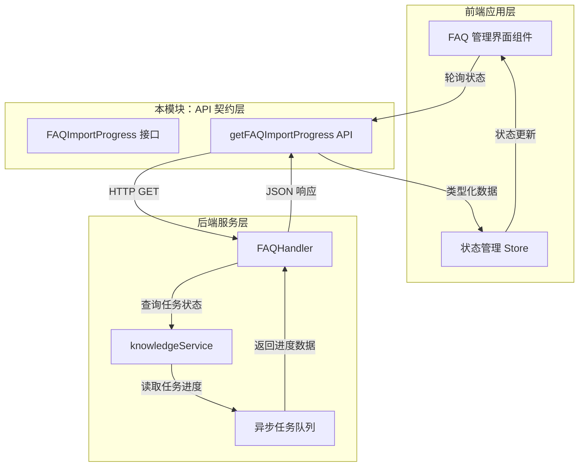

# knowledge_base_faq_import_status_contracts 模块深度解析

## 模块概述：为什么需要追踪 FAQ 导入状态？

想象一下你正在上传一个包含上千条 FAQ 条目的 Excel 文件到知识库系统。这个操作不可能瞬间完成——系统需要解析文件、验证每条数据、检查重复项、生成向量嵌入、写入数据库。如果前端只是简单地发送请求然后等待响应，用户会在漫长的等待中失去耐心，或者在网络超时时不知道发生了什么。

**`knowledge_base_faq_import_status_contracts` 模块的核心使命**就是解决这个异步长任务的状态追踪问题。它定义了一套标准化的数据契约，让前端能够：
1. **轮询导入进度** —— 用户可以看到"已处理 500/1000 条"这样的实时反馈
2. **理解失败原因** —— 哪些条目被阻塞了，为什么被阻塞
3. **查看成功结果** —— 哪些条目成功导入，它们被分配了什么 ID 和标签

这个模块的设计洞察在于：**长任务的状态本身是一种需要被建模的一等公民**。它不是简单的"成功/失败"二元状态，而是一个包含进度、部分成功、部分失败的复杂状态机。

---

## 架构定位与数据流

### 模块在系统中的位置



### 数据流追踪：一次完整的导入状态查询

当用户在界面上触发 FAQ 导入后，数据流动遵循以下路径：

1. **后端启动异步任务** → 任务被放入队列，生成 `task_id`
2. **前端轮询** → 调用 `getFAQImportProgress(taskId)` 
3. **HTTP 请求** → `GET /api/v1/faq/import/progress/{taskId}`
4. **后端查询** → 从任务存储中读取当前进度
5. **响应序列化** → 后端将进度数据序列化为 `FAQImportProgress` 结构
6. **前端消费** → 类型化数据被存入状态管理，驱动 UI 更新

这个模块处于**前后端边界的关键位置**，它不关心任务如何执行，只关心如何**标准化地表达任务状态**。

---

## 核心组件深度解析

### FAQImportProgress 接口：任务状态的全景视图

```typescript
export interface FAQImportProgress {
  task_id: string
  kb_id: string
  knowledge_id: string
  status: 'pending' | 'processing' | 'completed' | 'failed'
  progress: number
  total: number
  processed: number
  blocked: number
  blocked_entries?: FAQBlockedEntry[]
  success_entries?: FAQSuccessEntry[]
  message: string
  error: string
  created_at: number
  updated_at: number
}
```

#### 设计意图解析

这个接口的设计反映了**异步任务状态建模的最佳实践**：

| 字段分组 | 字段 | 设计理由 |
|---------|------|---------|
| **身份标识** | `task_id`, `kb_id`, `knowledge_id` | 三层标识确保可追溯性：任务级、知识库级、知识文件级 |
| **状态机** | `status` | 四状态有限状态机，覆盖任务全生命周期 |
| **进度度量** | `progress`, `total`, `processed`, `blocked` | 多维度进度指标，支持精确的进度条渲染 |
| **明细数据** | `blocked_entries`, `success_entries` | 部分成功场景下，用户需要知道"哪些成功了，哪些失败了" |
| **可观测性** | `message`, `error`, `created_at`, `updated_at` | 调试、日志、超时检测的必备字段 |

#### 状态机语义

```
pending → processing → completed
                      ↘ failed
```

- **`pending`**：任务已创建，但尚未开始处理（可能在队列中等待）
- **`processing`**：任务正在执行中，`progress` 字段会持续更新
- **`completed`**：任务完成，可能有部分条目被阻塞（`blocked > 0` 不代表失败）
- **`failed`**：任务因系统性错误而终止（如存储不可用、解析器崩溃）

**关键设计决策**：`completed` 状态允许存在 `blocked_entries`。这反映了业务现实——FAQ 导入是"尽力而为"的操作，单条数据格式错误不应导致整个任务失败。

---

### FAQBlockedEntry：被阻塞条目的诊断信息

```typescript
export interface FAQBlockedEntry {
  index: number
  standard_question: string
  reason: string
}
```

#### 为什么需要这个结构？

想象用户导入了 1000 条 FAQ，其中 5 条因为"问题文本超过 500 字符限制"被拒绝。如果没有这个结构，用户只能看到"导入失败"，却不知道哪 5 条有问题。

**设计模式**：这是 **Error Report Pattern** 的变体——每个被拒绝的条目都携带：
- `index`：原始文件中的行号，方便用户定位
- `standard_question`：出问题的内容本身（用于确认）
- `reason`：人类可读的错误原因（用于修复）

#### 使用场景

```typescript
// 前端渲染错误列表的典型用法
blockedEntries.map(entry => (
  <Alert key={entry.index} type="warning">
    第 {entry.index} 行："{entry.standard_question.substring(0, 50)}..." 
    被拒绝：{entry.reason}
  </Alert>
))
```

---

### FAQSuccessEntry：成功导入条目的回执

```typescript
export interface FAQSuccessEntry {
  index: number
  seq_id: number
  tag_id?: number
  tag_name?: string
  standard_question: string
}
```

#### 设计意图

成功条目需要返回**双向映射**：
- `index` → 原始文件中的位置（用户视角）
- `seq_id` → 数据库中的主键 ID（系统视角）

这样设计的好处是：
1. 用户可以对照原始文件确认哪些条目已导入
2. 前端可以缓存 `seq_id` 用于后续操作（如编辑、删除）
3. `tag_id` 和 `tag_name` 的冗余存储避免了额外的标签查询

---

### API 函数：状态查询与显示控制

#### getFAQImportProgress

```typescript
export function getFAQImportProgress(taskId: string) {
  return get(`/api/v1/faq/import/progress/${taskId}`);
}
```

**调用模式**：前端通常使用轮询或长轮询

```typescript
// 典型轮询实现
const pollImportProgress = async (taskId: string) => {
  const interval = setInterval(async () => {
    const progress = await getFAQImportProgress(taskId);
    updateUI(progress);
    
    if (progress.status === 'completed' || progress.status === 'failed') {
      clearInterval(interval);
    }
  }, 2000); // 每 2 秒轮询一次
};
```

**设计权衡**：
- ✅ 简单：无需 WebSocket 或 SSE 基础设施
- ⚠️ 延迟：最多 2 秒的状态更新延迟
- ⚠️ 负载：大量并发导入时会产生较多 HTTP 请求

#### updateFAQImportResultDisplayStatus

```typescript
export function updateFAQImportResultDisplayStatus(
  knowledgeBaseId: string, 
  displayStatus: 'open' | 'close'
) {
  return put(`/api/v1/knowledge-bases/${knowledgeBaseId}/faq/import/last-result/display`, {
    display_status: displayStatus
  });
}
```

**这个 API 解决什么问题？**

用户可能在一个知识库中多次导入 FAQ。每次导入都会生成新的 `task_id`，但用户界面上通常只显示**最近一次**的导入结果。这个 API 允许用户：
- `'open'`：展开显示最近导入结果的详情（成功/失败条目列表）
- `'close'`：折叠结果，只显示摘要

**设计洞察**：这是一个 **UI 状态持久化** 的契约。后端存储用户的显示偏好，确保用户刷新页面后仍能看到他们选择的状态。

---

## 依赖关系分析

### 上游依赖：本模块被谁调用？

| 调用方 | 调用场景 | 期望行为 |
|-------|---------|---------|
| `frontend/src/stores/` (状态管理) | FAQ 导入界面轮询 | 返回类型化的 `FAQImportProgress` |
| `frontend/src/components/` (UI 组件) | 渲染进度条、错误列表 | 需要 `progress`, `blocked_entries` 等字段 |

### 下游依赖：本模块调用谁？

| 被调用方 | 接口 | 本模块的假设 |
|---------|------|-------------|
| `frontend/src/utils/request` | `get()`, `put()` | 返回 Promise，自动处理认证头和错误 |

### 数据契约边界

```
┌─────────────────────────────────────────────────────────┐
│  前端 UI 组件                                            │
│  - 期望 progress 是 0-100 的数字                          │
│  - 期望 status 是四个枚举值之一                          │
└─────────────────────────────────────────────────────────┘
                          ↓
┌─────────────────────────────────────────────────────────┐
│  本模块 (knowledge_base_faq_import_status_contracts)    │
│  - 保证类型安全                                         │
│  - 不转换数据，原样透传后端响应                         │
└─────────────────────────────────────────────────────────┘
                          ↓
┌─────────────────────────────────────────────────────────┐
│  后端 API (/api/v1/faq/import/progress/{taskId})        │
│  - 负责从任务存储中读取状态                              │
│  - 负责序列化 FAQImportProgress 结构                     │
└─────────────────────────────────────────────────────────┘
```

**关键假设**：本模块假设后端严格遵守接口定义的字段类型。如果后端返回 `progress: "50"`（字符串而非数字），TypeScript 类型检查在编译期无法捕获，会在运行时导致 UI 错误。

---

## 设计决策与权衡

### 决策 1：轮询 vs WebSocket

**选择**：轮询（Polling）

**理由**：
1. **基础设施简单**：无需维护 WebSocket 连接，复用现有 HTTP 客户端
2. **防火墙友好**：轮询使用标准 HTTP，不会被企业防火墙拦截
3. **实现成本低**：前端只需 `setInterval`，后端只需暴露 REST 端点

**代价**：
- 实时性较差（典型延迟 1-2 秒）
- 无效请求较多（任务完成后仍可能轮询 1-2 次）

**适用场景**：FAQ 导入是低频操作（用户一天可能只导入 1-2 次），轮询的开销可以接受。

---

### 决策 2：部分成功语义

**选择**：`completed` 状态允许存在 `blocked_entries`

**理由**：
1. **业务现实**：1000 条数据中 5 条格式错误，不应让整个任务失败
2. **用户体验**：用户可以看到"995 条成功，5 条失败"，而不是"导入失败"
3. **可恢复性**：用户可以只修复那 5 条失败的数据，重新导入

**代价**：
- 状态判断逻辑变复杂：`status === 'completed' && blocked > 0` 是成功还是失败？
- 前端需要处理三种结果：完全成功、部分成功、完全失败

---

### 决策 3：时间戳用数字而非 ISO 字符串

**选择**：`created_at: number`（Unix 时间戳）

**理由**：
1. **前端友好**：JavaScript 的 `Date` 构造函数直接接受时间戳
2. **序列化简单**：JSON 原生支持数字，无需解析 ISO 字符串
3. **比较方便**：数字可以直接比较大小，计算时间差

**代价**：
- 可读性差：`1704067200000` 不如 `2024-01-01T00:00:00Z` 直观
- 时区信息丢失：需要前端根据用户时区格式化

---

## 使用指南与最佳实践

### 典型使用模式：导入状态轮询组件

```typescript
import { getFAQImportProgress, FAQImportProgress } from '@/api/knowledge-base';

function FAQImportMonitor({ taskId, onComplete }: { taskId: string; onComplete: () => void }) {
  const [progress, setProgress] = useState<FAQImportProgress | null>(null);
  
  useEffect(() => {
    const poll = async () => {
      const data = await getFAQImportProgress(taskId);
      setProgress(data);
      
      if (data.status === 'completed' || data.status === 'failed') {
        onComplete();
      }
    };
    
    poll(); // 立即执行一次
    const interval = setInterval(poll, 2000);
    return () => clearInterval(interval);
  }, [taskId]);
  
  if (!progress) return <Spinner />;
  
  return (
    <div>
      <ProgressBar value={progress.progress} />
      <p>{progress.processed} / {progress.total} 已处理</p>
      {progress.blocked > 0 && (
        <Alert type="warning">
          {progress.blocked} 条数据被拒绝
          {progress.blocked_entries?.map(entry => (
            <div key={entry.index}>行 {entry.index}: {entry.reason}</div>
          ))}
        </Alert>
      )}
    </div>
  );
}
```

### 配置选项

本模块没有运行时配置，但调用方可以配置：

| 配置项 | 默认值 | 说明 |
|-------|-------|------|
| 轮询间隔 | 2000ms | 过短会增加服务器负载，过长会降低用户体验 |
| 超时时间 | 300000ms (5 分钟) | 超过此时间未完成的任务应视为失败 |
| 最大重试次数 | 3 | 网络错误时的重试次数 |

---

## 边界情况与陷阱

### 陷阱 1：任务 ID 过期

**问题**：`task_id` 可能在后端有 TTL（如 24 小时后删除）。用户刷新页面后，旧的 `task_id` 可能已失效。

**解决方案**：
```typescript
try {
  const progress = await getFAQImportProgress(taskId);
} catch (error) {
  if (error.status === 404) {
    // 任务已过期，显示"任务已过期，请联系管理员"
  }
}
```

---

### 陷阱 2：进度回退

**问题**：理论上 `progress` 应该单调递增，但后端可能因重试机制导致 `processed` 计数暂时减少。

**解决方案**：前端应使用 `Math.max()` 保持进度单调：
```typescript
const [maxProgress, setMaxProgress] = useState(0);

const handleProgressUpdate = (newProgress: number) => {
  setMaxProgress(prev => Math.max(prev, newProgress));
};
```

---

### 陷阱 3：并发导入冲突

**问题**：用户可能在同一个知识库中同时发起两个导入任务。后端可能只保留最后一个任务的状态。

**解决方案**：
- 前端在发起新导入前检查是否有进行中的任务
- 或者后端返回所有进行中的任务列表，前端选择显示哪一个

---

### 边界情况：空任务

**场景**：用户上传了一个空文件（0 条 FAQ）

**预期行为**：
```typescript
{
  status: 'completed',
  total: 0,
  processed: 0,
  blocked: 0,
  message: '文件中没有可导入的 FAQ 条目'
}
```

前端应特殊处理 `total === 0` 的情况，避免显示 "0/0 (0%)" 这样的无意义进度。

---

## 相关模块参考

- [knowledge_base_api](knowledge_base_api.md) — 后端知识库管理 API 的完整定义
- [faq_api](faq_api.md) — FAQ 条目 CRUD 操作的客户端契约
- [frontend_state_store_contracts](frontend_state_store_contracts.md) — 前端状态管理的类型定义
- [knowledge_ingestion_extraction_and_graph_services](knowledge_ingestion_extraction_and_graph_services.md) — 后端知识导入服务实现

---

## 总结：这个模块的设计哲学

`knowledge_base_faq_import_status_contracts` 体现了**异步任务状态建模**的核心原则：

1. **状态是一等公民** — 任务状态不是附属信息，而是需要被精心设计的数据结构
2. **部分成功是常态** — 长任务很少是"全有或全无"，需要支持细粒度的成功/失败报告
3. **可观测性优先** — 时间戳、消息、错误字段让调试和监控成为可能
4. **简单优于完美** — 轮询虽然不够实时，但在低频场景下是务实的选择

理解这个模块的关键在于认识到：**它不是业务逻辑，而是业务逻辑的镜子** — 它反射后端任务的执行状态，让前端用户能够"看见"原本不可见的异步过程。
