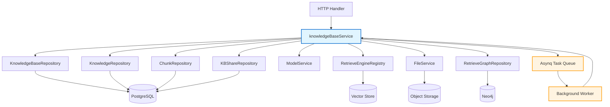

# Knowledge Base Lifecycle Management 模块深度解析

## 模块概述

想象一下你正在管理一个大型图书馆：你需要登记新书入库、配置分类规则、处理读者检索请求，当书籍需要下架时还要确保所有索引卡片、借阅记录都被清理干净。**`knowledge_base_lifecycle_management`** 模块正是这样一个"图书馆管理员"——它负责知识库（Knowledge Base）从创建到销毁的完整生命周期，同时处理核心的混合检索逻辑。

这个模块的核心挑战在于：**知识库不是简单的数据库记录**。一个知识库背后关联着向量索引、分块数据、物理文件、知识图谱等多套存储系统。如果删除操作只删除数据库记录而不清理这些关联资源，系统会迅速积累"数字垃圾"。同样，检索操作需要协调向量检索和关键词检索两套引擎，并在多租户和跨租户共享的复杂场景下保证数据隔离与访问控制的正确性。

模块的设计洞察是：**将轻量级操作同步执行，将重量级清理异步化**。删除知识库时，先快速标记数据库记录为已删除（用户请求立即返回），再将耗时的资源清理工作放入后台任务队列。这种设计在用户体验和系统可靠性之间取得了平衡。

---

## 架构与数据流



### 组件角色说明

| 组件 | 职责 | 耦合关系 |
|------|------|----------|
| **knowledgeBaseService** | 核心服务层，编排所有知识库操作 | 依赖 10+ 个仓库/服务接口，是系统的"编排中心" |
| **KnowledgeBaseRepository** | 知识库元数据持久化 | 仅处理 `KnowledgeBase` 表的 CRUD |
| **KnowledgeRepository / ChunkRepository** | 知识条目与分块数据持久化 | 删除操作中被级联调用 |
| **RetrieveEngineRegistry** | 检索引擎注册表 | 混合检索时动态组合向量/关键词引擎 |
| **Asynq Client** | 后台任务队列客户端 | 解耦删除请求与清理执行 |

### 关键数据流：删除操作

```
用户请求 DeleteKnowledgeBase
    ↓
[同步] 1. 验证 KB 存在性
    ↓
[同步] 2. 标记数据库记录为已删除 (软删除)
    ↓
[同步] 3. 删除组织共享关系 (立即生效)
    ↓
[同步] 4. 序列化 KBDeletePayload 并入队 Asynq 任务
    ↓
[立即返回] HTTP 200 OK
    ↓
[异步] 5. Background Worker 消费任务
    ↓
[异步] 6. 批量删除向量索引 → 分块记录 → 物理文件 → 图谱数据
    ↓
[异步] 7. 调整租户存储配额
```

这种**两阶段删除**设计的关键在于：即使用户请求返回后后台任务失败，系统也不会处于"半删除"的中间状态——数据库记录已删除，用户无法再访问该知识库，后台任务可以重试清理残留资源。

---

## 核心组件深度解析

### 1. knowledgeBaseService

**设计意图**：作为知识库领域的"编排器"，它不直接操作存储，而是协调多个下游服务完成复杂业务逻辑。这种设计遵循**单一职责原则**——每个依赖的仓库只负责一种数据的持久化，而服务层负责业务流程。

```go
type knowledgeBaseService struct {
    repo           interfaces.KnowledgeBaseRepository
    kgRepo         interfaces.KnowledgeRepository
    chunkRepo      interfaces.ChunkRepository
    shareRepo      interfaces.KBShareRepository
    kbShareService interfaces.KBShareService
    modelService   interfaces.ModelService
    retrieveEngine interfaces.RetrieveEngineRegistry
    tenantRepo     interfaces.TenantRepository
    fileSvc        interfaces.FileService
    graphEngine    interfaces.RetrieveGraphRepository
    asynqClient    *asynq.Client
}
```

**关键方法分析**：

#### `CreateKnowledgeBase` —— 元数据初始化

```go
func (s *knowledgeBaseService) CreateKnowledgeBase(ctx context.Context, kb *types.KnowledgeBase) (*types.KnowledgeBase, error)
```

这个方法看似简单，但有几个关键设计点：

1. **UUID 生成在服务层**：ID 不在数据库层自增，而是使用 `uuid.New().String()`。这使得系统在分库分表或数据迁移时更加灵活。

2. **租户隔离在写入时强制**：`kb.TenantID = ctx.Value(types.TenantIDContextKey).(uint64)` —— 租户 ID 不从请求体读取，而是从上下文提取，防止用户越权指定其他租户。

3. **默认值兜底**：`kb.EnsureDefaults()` 确保配置字段的完整性，避免后续逻辑因空值 panic。

#### `DeleteKnowledgeBase` —— 两阶段删除的同步阶段

```go
func (s *knowledgeBaseService) DeleteKnowledgeBase(ctx context.Context, id string) error
```

**为什么不用事务一次性删除所有资源？**

这是一个典型的**性能 vs 一致性**权衡：

| 方案 | 优点 | 缺点 |
|------|------|------|
| 单事务删除 | 强一致性，要么全成功要么全失败 | 锁表时间长，大知识库可能超时，用户请求阻塞 |
| 两阶段删除 | 用户请求快速返回，后台可重试 | 短暂不一致（记录已删但资源未清理） |

代码选择了后者，因为：
- 知识库删除是低频操作，短暂不一致可接受
- 后台任务有 `MaxRetry(3)` 机制，失败可重试
- 即使重试失败，残留资源可通过定期巡检脚本清理

**容错设计**：注意这段代码：
```go
if err := s.asynqClient.Enqueue(task); err != nil {
    logger.Warnf(ctx, "Failed to enqueue KB delete task: %v", err)
    // Don't fail the request, the KB record is already deleted
    return nil
}
```

即使入队失败，也不返回错误——因为数据库记录已删除，用户侧已认为删除成功。日志告警后，运维可手动触发清理。这是一种**优雅降级**：优先保证用户可见状态的一致性。

#### `ProcessKBDelete` —— 异步清理的核心逻辑

```go
func (s *knowledgeBaseService) ProcessKBDelete(ctx context.Context, t *asynq.Task) error
```

这是后台 worker 执行的方法，清理顺序经过精心设计：

```
1. 获取所有知识条目
   ↓
2. 按 embedding model 分组 → 批量删除向量索引
   ↓
3. 删除分块记录 (Chunk)
   ↓
4. 删除物理文件 + 调整租户存储配额
   ↓
5. 删除知识图谱数据
   ↓
6. 最后删除知识条目本身
```

**为什么先删向量索引再删数据库记录？**

因为向量索引是"派生数据"，重建成本高。如果先删数据库记录，后续清理向量索引时无法通过 ID 关联，可能导致向量库中残留"孤儿"数据。

**分组删除向量的优化**：
```go
type groupKey struct {
    EmbeddingModelID string
    Type             string
}
embeddingGroups := make(map[groupKey][]string)
```

不同 embedding model 生成的向量维度不同，必须分组删除。这种设计避免了"逐条删除"的 N+1 问题，将 O(N) 次调用优化为 O(M) 次（M 为 model 数量）。

---

### 2. HybridSearch —— 混合检索的融合策略

```go
func (s *knowledgeBaseService) HybridSearch(ctx context.Context, id string, params types.SearchParams) ([]*types.SearchResult, error)
```

这是模块中最复杂的算法，需要理解三个核心问题：

#### 问题 1：为什么需要混合检索？

向量检索擅长语义匹配（"手机" 能匹配 "iPhone"），但可能忽略精确关键词；关键词检索擅长字面匹配，但无法理解语义。两者结合可以互补。

#### 问题 2：如何融合两套检索结果？

代码使用 **RRF (Reciprocal Rank Fusion)** 算法：

```go
const rrfK = 60
// RRF score = sum(1 / (k + rank)) for each retriever
rrfScore += 1.0 / float64(rrfK+rank)
```

**RRF 的直观理解**：想象两个评委给选手排名。选手 A 在评委 1 排第 3，在评委 2 排第 5；选手 B 在评委 1 排第 1，在评委 2 排第 20。RRF 通过倒数加权，让"在多个榜单都靠前"的选手获得更高综合分，而不是"在一个榜单极好但在另一个榜单极差"。

`k=60` 是经验值，来自 TREC 评测的最佳实践。k 越大，排名差异的影响越小；k 越小，头部排名的权重越大。

#### 问题 3：FAQ 场景的特殊处理

FAQ 知识库有一个特殊需求：**负向问题过滤**。用户提问 "如何退款" 时，不应匹配到 "不支持退款" 的 FAQ 条目。

```go
func (s *knowledgeBaseService) filterByNegativeQuestions(ctx context.Context, chunks []*types.IndexWithScore, queryText string) []*types.IndexWithScore
```

**迭代检索优化**：当首次检索结果不足时，FAQ 场景会触发迭代检索：

```go
func (s *knowledgeBaseService) iterativeRetrieveWithDeduplication(...) []*types.IndexWithScore
```

这类似于搜索引擎的"分页加载"——先取 Top 100，不够再取 Top 200，直到满足数量或无更多结果。关键优化是**分块数据缓存**：

```go
chunkDataCache := make(map[string]*types.Chunk)
filteredOutChunks := make(map[string]struct{})
```

避免每次迭代都重复查询数据库，这是典型的**空间换时间**策略。

---

### 3. 跨租户共享访问控制

系统支持知识库跨租户共享，这带来了数据访问的复杂性。核心方法是 `fetchKnowledgeDataWithShared` 和 `listChunksByIDWithShared`。

**访问控制流程**：
```
1. 先按当前租户 ID 查询
   ↓
2. 对未命中的 ID，查询知识所属 KB
   ↓
3. 调用 kbShareService.HasKBPermission 检查权限
   ↓
4. 有权限则纳入结果集
```

**设计权衡**：

| 设计选择 | 优点 | 风险 |
|----------|------|------|
| 先查租户内，再查共享 | 大多数请求只需一次查询 | 最坏情况需 N+1 次权限检查 |
| 权限检查在服务层 | 逻辑集中，易审计 | 仓库层无法做过滤优化 |
| 缺失 ID 逐个检查 | 精确控制 | 可优化为批量权限检查 |

这是一个**安全优先**的设计：即使性能有损耗，也要确保每次访问都经过权限验证。

---

## 依赖关系分析

### 上游调用者

| 调用方 | 调用场景 | 期望行为 |
|--------|----------|----------|
| `KnowledgeBaseHandler` | HTTP 请求处理 | 快速响应，错误信息明确 |
| `Asynq Worker` | 后台任务消费 | 可重试，幂等执行 |
| `ChatPipeline` | 会话中的知识检索 | 低延迟，支持跨租户 |

### 下游依赖

| 依赖 | 契约 | 变更影响 |
|------|------|----------|
| `KnowledgeBaseRepository` | 软删除（DeletedAt 字段） | 若改为硬删除，`ProcessKBDelete` 需调整 |
| `RetrieveEngineRegistry` | 支持 `VectorRetrieverType` / `KeywordsRetrieverType` | 新增检索类型需修改 `HybridSearch` |
| `FileService` | 文件路径与存储大小 | 存储模型变更需调整配额计算 |

**最脆弱的耦合点**：`HybridSearch` 中对 `kb.Type` 的判断逻辑。如果新增知识库类型（如 `KnowledgeBaseTypeGraph`），需要在此处添加分支，违反开闭原则。更好的设计是策略模式，让每种 KB 类型自己实现检索逻辑。

---

## 设计决策与权衡

### 1. 同步 vs 异步的边界

| 操作 | 执行方式 | 理由 |
|------|----------|------|
| 创建/更新 KB | 同步 | 需立即返回结果，逻辑简单 |
| 删除 KB 记录 | 同步 | 用户需立即看到删除状态 |
| 清理关联资源 | 异步 | 耗时长，可重试，不影响用户 |
| 混合检索 | 同步 | 用户等待响应，需低延迟 |

**边界选择原则**：用户能否接受"操作成功但后台仍在处理"的状态？删除场景可以（记录已删），但检索场景不行。

### 2. 租户隔离的实现层次

系统在三个层次实现租户隔离：

1. **仓库层**：`GetKnowledgeBaseByIDAndTenant` —— SQL 中带 `WHERE tenant_id = ?`
2. **服务层**：`fetchKnowledgeDataWithShared` —— 权限检查
3. **上下文层**：`ctx.Value(types.TenantIDContextKey)` —— 租户 ID 传递

**为什么需要三层？**

- 仓库层：防止 SQL 注入和越权查询
- 服务层：支持跨租户共享的复杂逻辑
- 上下文层：避免每个方法都传 `tenantID` 参数

这是一种**纵深防御**策略，但增加了代码复杂度。新贡献者容易忽略某一层导致安全漏洞。

### 3. 错误处理策略

```go
if err := s.graphEngine.DelGraph(ctx, namespaces); err != nil {
    logger.Warnf(ctx, "Failed to delete knowledge graph: %v", err)
    // 不返回错误，继续执行
}
```

**设计哲学**：后台清理任务是"尽力而为"。图谱删除失败不应阻止文件删除，因为残留的图谱数据比残留的文件更容易被后续巡检发现。

**风险**：如果所有清理步骤都 `Warn` 而不失败，可能掩盖系统性问题。建议对关键步骤（如向量索引删除）设置失败阈值，超过阈值时告警。

---

## 使用示例与配置

### 创建知识库

```go
kb := &types.KnowledgeBase{
    Name:        "产品文档库",
    Type:        types.KnowledgeBaseTypeDocument,
    Description: "存储产品手册和 FAQ",
    ChunkingConfig: types.ChunkingConfig{
        ChunkSize: 500,
        Overlap:   50,
    },
    EmbeddingModelID: "text-embedding-3-small",
}

created, err := kbService.CreateKnowledgeBase(ctx, kb)
```

### 执行混合检索

```go
params := types.SearchParams{
    QueryText:        "如何重置密码",
    MatchCount:       10,
    VectorThreshold:  0.7,
    KeywordThreshold: 0.5,
    // 不禁用任何检索方式，启用混合检索
    DisableVectorMatch:   false,
    DisableKeywordsMatch: false,
}

results, err := kbService.HybridSearch(ctx, kbID, params)
```

### 配置 FAQ 负向问题

```go
kb.FAQConfig = &types.FAQConfig{
    IndexingStrategy: "separate", // 独立索引问题和答案
}

// 在 Chunk 级别设置负向问题
chunk.Metadata = json.Marshal(map[string]interface{}{
    "negative_questions": []string{"不支持退款", "无法取消订单"},
})
```

---

## 边界情况与陷阱

### 1. 跨租户检索的 embedding 模型兼容性

```go
// 危险：直接使用当前租户的 embedding model
embeddingModel, err := s.modelService.GetEmbeddingModel(ctx, kb.EmbeddingModelID)

// 正确：跨租户时使用源租户的 model
if kb.TenantID != currentTenantID {
    embeddingModel, err = s.modelService.GetEmbeddingModelForTenant(ctx, kb.EmbeddingModelID, kb.TenantID)
}
```

**陷阱**：不同租户可能配置不同的 embedding 服务，向量维度不兼容会导致检索失败或错误匹配。

### 2. 迭代检索的无限循环风险

```go
for i := 0; i < maxIterations; i++ {
    // ...
    if totalRetrieved < currentTopK {
        break // 早停：没有更多结果了
    }
    currentTopK *= 2
}
```

**必须有的早停条件**：
1. `maxIterations` 限制循环次数
2. `totalRetrieved < currentTopK` 检测数据耗尽

缺少任一条件都可能在边界情况下导致无效循环。

### 3. 后台任务丢失的处理

Asynq 任务可能因以下原因丢失：
- 队列服务宕机
- 任务序列化失败
- Worker 崩溃且任务未 ack

**缓解措施**：
```go
task := asynq.NewTask(types.TypeKBDelete, payloadBytes, 
    asynq.Queue("low"), 
    asynq.MaxRetry(3))
```

但仍需定期巡检脚本，扫描"已软删除但资源未清理"的知识库。

### 4. RRF 分数与原始分数的语义混淆

在 `HybridSearch` 中，RRF 融合后会覆盖原始分数：
```go
info.Score = rrfScores[chunkID] // RRF 分数替代 embedding 分数
```

**陷阱**：下游代码如果假设 `Score` 是向量相似度（0-1 之间），会因 RRF 分数（通常远小于 1）而产生错误判断。建议在 `SearchResult` 中增加 `RRFScore` 字段保留原始分数。

---

## 扩展点

### 新增检索引擎类型

当前 `HybridSearch` 硬编码了 `VectorRetrieverType` 和 `KeywordsRetrieverType`。要支持新的检索类型（如 `SparseRetrieverType`）：

1. 在 `types` 包定义新常量
2. 在 `RetrieveEngineRegistry` 注册新引擎
3. 修改 `HybridSearch` 的检索参数构建逻辑
4. 更新 RRF 融合逻辑以支持三路融合

更好的设计是**策略模式**：
```go
type RetrievalStrategy interface {
    BuildParams(kb *KnowledgeBase, query string) []RetrieveParams
    FuseResults(results [][]*IndexWithScore) []*IndexWithScore
}
```

### 自定义清理钩子

当前 `ProcessKBDelete` 的清理步骤是固定的。要支持插件式清理（如删除外部缓存）：

```go
type KBCleanupHook interface {
    PreDelete(ctx context.Context, kb *KnowledgeBase) error
    PostDelete(ctx context.Context, kb *KnowledgeBase) error
}
```

在 `knowledgeBaseService` 中注册钩子列表，在清理前后调用。

---

## 相关模块参考

- [Knowledge Ingestion Service](knowledge_ingestion_extraction_and_graph_services.md) —— 知识库内容导入与分块
- [Retrieval Engine Services](retrieval_and_web_search_services.md) —— 向量/关键词检索引擎实现
- [Agent Runtime and Tools](agent_runtime_and_tools.md) —— 检索工具在 Agent 中的使用
- [Data Access Repositories](data_access_repositories.md) —— 底层仓库接口定义
