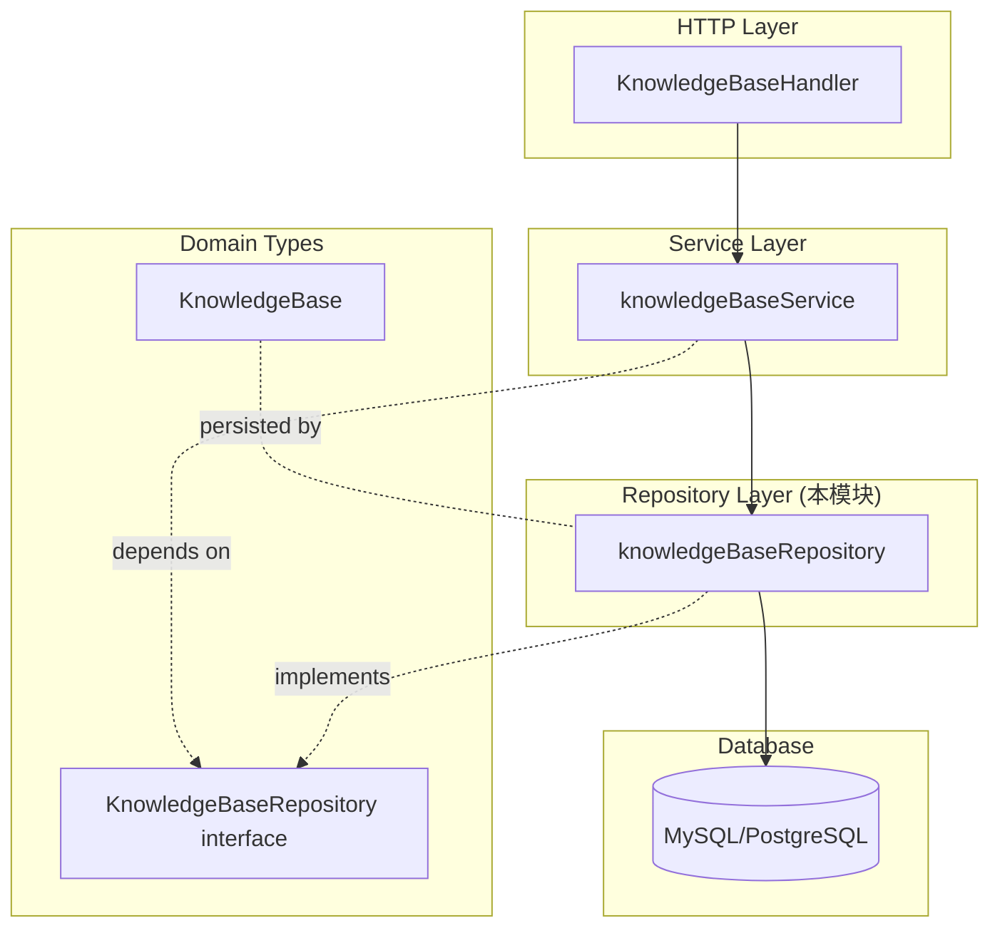
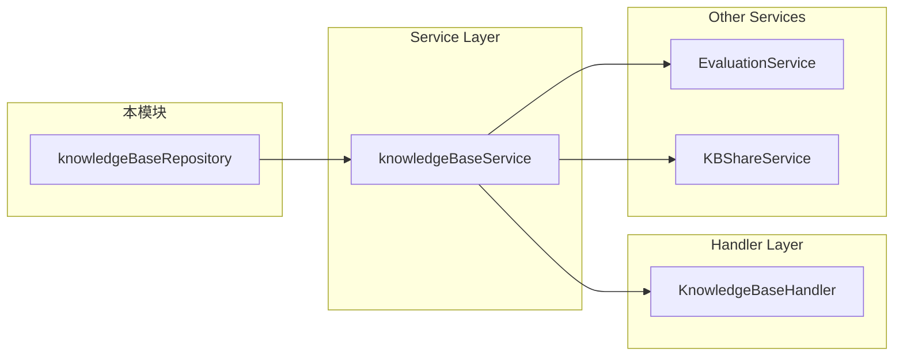

# knowledge_base_metadata_persistence 模块深度解析

## 概述：为什么需要这个模块

想象一下，你正在运营一个多租户的知识管理系统 —— 每个企业客户（tenant）都拥有自己的知识库集合，每个知识库又包含成千上万的文档、FAQ 和向量索引。当用户发起查询时，系统需要在毫秒级内定位到正确的知识库，验证访问权限，并返回配置信息以指导后续的检索流程。

**`knowledge_base_metadata_persistence` 模块解决的核心问题是：如何在一个多租户环境中，高效、安全地持久化和检索知识库的元数据。**

这里的"元数据"不是指知识内容本身，而是知识库的"身份证"和"配置手册"：它的名称、类型（文档型还是 FAQ 型）、所属租户、分块策略、嵌入模型选择、图像处理配置、存储位置等。这些信息决定了系统如何处理知识库中的内容，以及谁有权访问它。

**为什么不能简单地用一个大表查询？**  naive 的方案可能会忽略两个关键挑战：

1. **租户隔离**：租户 A 绝不能看到租户 B 的知识库。这不仅是业务需求，更是安全底线。模块通过提供两套查询接口（`GetKnowledgeBaseByID` 和 `GetKnowledgeBaseByIDAndTenant`）来区分"系统级操作"和"租户级操作"，将隔离责任明确化。

2. **临时知识库的处理**：系统内部会创建一些临时知识库用于中间处理（如 FAQ 导入过程中的暂存），这些知识库不应该出现在用户界面中。模块在 `ListKnowledgeBasesByTenantID` 中显式过滤 `is_temporary = false`，避免污染用户视图。

这个模块采用 **Repository 模式**，将数据库访问逻辑封装在统一的接口背后，使得上层服务（如 [`knowledgeBaseService`](../application_services_and_orchestration/knowledge_base_lifecycle_management.md)）无需关心底层是 MySQL、PostgreSQL 还是其他存储引擎。

---

## 架构与数据流

### 模块在系统中的位置



### 数据流 walkthrough

以"用户查询某租户下的所有知识库"为例，数据流经以下路径：

1. **HTTP Handler** (`internal/handler/knowledgebase/knowledgebase.go`) 接收请求，提取租户 ID
2. **Service Layer** (`knowledgeBaseService.ListKnowledgeBasesByTenantID`) 调用 Repository
3. **Repository** (`knowledgeBaseRepository.ListKnowledgeBasesByTenantID`) 构建 SQL 查询：
   ```sql
   SELECT * FROM knowledge_bases 
   WHERE tenant_id = ? AND is_temporary = false 
   ORDER BY created_at DESC
   ```
4. **GORM** 将结果映射为 `[]*types.KnowledgeBase`
5. **Service Layer** 可能进一步 enrich 数据（如计算 `KnowledgeCount`、`ShareCount` 等非持久化字段）
6. **Handler** 序列化为 JSON 返回给客户端

**关键观察**：Repository 层只做一件事 —— 持久化操作。它不处理业务逻辑（如权限校验、数据增强），这些由 Service 层负责。这种分离使得 Repository 保持简单、可测试，且易于替换存储后端。

---

## 核心组件深度解析

### `knowledgeBaseRepository` 结构体

```go
type knowledgeBaseRepository struct {
    db *gorm.DB
}
```

**设计意图**：这是一个典型的 Repository 模式实现。它只持有一个 GORM DB 句柄，所有方法都通过这个句柄执行数据库操作。结构简单意味着：
- **无状态**：每个方法调用都是独立的，不依赖内部状态
- **线程安全**：GORM 的 `*gorm.DB` 是并发安全的，Repository 实例可以在多个 goroutine 间共享
- **易于测试**：可以通过传入 mock DB 或内存 DB 进行单元测试

**为什么用指针接收者？** 所有方法都使用 `(r *knowledgeBaseRepository)` 而非值接收者。虽然当前结构体只有一个字段，但这是 Go 的最佳实践：
1. 避免不必要的拷贝（未来如果添加字段，不会导致性能问题）
2. 保持与接口的一致性（接口方法通常期望指针实现）

---

### 工厂函数：`NewKnowledgeBaseRepository`

```go
func NewKnowledgeBaseRepository(db *gorm.DB) interfaces.KnowledgeBaseRepository {
    return &knowledgeBaseRepository{db: db}
}
```

**设计模式**：这是依赖注入（Dependency Injection）的体现。调用者（通常是 Service 层或 DI 容器）传入配置好的 GORM DB 实例，Repository 不负责创建连接。这样做的好处：
- **解耦**：Repository 不关心 DB 如何初始化、配置是什么
- **可测试性**：测试时可以传入特殊的 DB 实例（如测试数据库）
- **生命周期管理**：DB 连接池由上层统一管理，避免重复创建

**返回接口类型**：函数返回 `interfaces.KnowledgeBaseRepository` 而非具体类型，这是 Go 中"依赖倒置"的常见模式。调用者只依赖接口，不依赖实现，便于未来替换存储引擎（如从 MySQL 迁移到 PostgreSQL）。

---

### 查询方法：双轨制的租户隔离

模块提供了两套查询方法，这是理解本模块设计的关键：

#### 1. `GetKnowledgeBaseByID` —— 无租户限制

```go
func (r *knowledgeBaseRepository) GetKnowledgeBaseByID(ctx context.Context, id string) (*types.KnowledgeBase, error)
```

**用途**：系统级操作，如后台任务、数据迁移、跨租户的管理功能。

**风险**：调用者必须自行确保不会越权访问其他租户的数据。接口注释明确说明："no tenant scope; caller must enforce isolation where needed"。

**为什么保留这个方法？** 有些场景确实需要跨租户访问：
- 系统管理员查看所有知识库
- 数据一致性检查
- 全局搜索索引构建

#### 2. `GetKnowledgeBaseByIDAndTenant` —— 租户隔离

```go
func (r *knowledgeBaseRepository) GetKnowledgeBaseByIDAndTenant(ctx context.Context, id string, tenantID uint64) (*types.KnowledgeBase, error)
```

**用途**：常规业务操作，如用户查询自己的知识库。

**SQL 语义**：
```sql
SELECT * FROM knowledge_bases WHERE id = ? AND tenant_id = ?
```

**设计洞察**：将租户隔离逻辑下沉到 Repository 层，而不是在 Service 层拼接条件。这样做的好处：
- **防错**：调用者无法"忘记"添加租户条件
- **一致性**：所有租户级查询都遵循相同的隔离规则
- **可审计**：通过代码审查可以轻松识别哪些查询是租户隔离的

**错误处理**：如果 KB 不存在或不属于该租户，统一返回 `ErrKnowledgeBaseNotFound`。这避免了信息泄露（攻击者无法通过错误类型判断是"ID 不存在"还是"权限不足"）。

---

### 列表查询：显式过滤临时知识库

```go
func (r *knowledgeBaseRepository) ListKnowledgeBasesByTenantID(
    ctx context.Context, tenantID uint64,
) ([]*types.KnowledgeBase, error) {
    var kbs []*types.KnowledgeBase
    if err := r.db.WithContext(ctx).Where("tenant_id = ? AND is_temporary = ?", tenantID, false).
        Order("created_at DESC").Find(&kbs).Error; err != nil {
        return nil, err
    }
    return kbs, nil
}
```

**关键设计决策**：为什么硬编码 `is_temporary = false`？

**背景**：系统在导入 FAQ 或处理文档时，会创建临时知识库作为中间状态。这些知识库：
- 对用户不可见（未完成处理）
- 不应计入配额
- 处理完成后可能被删除或标记为正式

**权衡**：这种硬编码牺牲了灵活性（无法列出临时知识库），但换取了安全性（用户永远不会意外看到临时数据）。如果需要访问临时知识库，调用者应使用 `ListKnowledgeBases`（无过滤）并自行处理。

**排序策略**：按 `created_at DESC` 排序，确保最新的知识库排在前面。这是 UI 友好的设计，符合用户"最近创建的更重要"的直觉。

---

### 批量查询：`GetKnowledgeBaseByIDs`

```go
func (r *knowledgeBaseRepository) GetKnowledgeBaseByIDs(ctx context.Context, ids []string) ([]*types.KnowledgeBase, error) {
    if len(ids) == 0 {
        return []*types.KnowledgeBase{}, nil
    }
    var kbs []*types.KnowledgeBase
    if err := r.db.WithContext(ctx).Where("id IN ?", ids).Find(&kbs).Error; err != nil {
        return nil, err
    }
    return kbs, nil
}
```

**边界处理**：当 `ids` 为空时，返回空切片而非 `nil`。这是 Go 的最佳实践：
- 调用者可以安全地 `for range` 结果，无需检查 `nil`
- JSON 序列化时，空切片输出为 `[]` 而非 `null`，前端处理更简单

**SQL 注入防护**：GORM 的 `Where("id IN ?", ids)` 会自动参数化，避免 SQL 注入。但要注意，如果 `ids` 非常大（如上千个），可能导致 SQL 语句过长。调用者应控制批量大小。

---

### 更新与删除

#### `UpdateKnowledgeBase`

```go
func (r *knowledgeBaseRepository) UpdateKnowledgeBase(ctx context.Context, kb *types.KnowledgeBase) error {
    return r.db.WithContext(ctx).Save(kb).Error
}
```

**语义**：GORM 的 `Save` 方法会更新所有字段（而非仅变更字段）。这意味着：
- 调用者必须确保 `kb` 包含完整的最新数据
- 如果只想更新部分字段，应使用 `Updates` 或 `Update` 方法（当前未提供）

**并发控制**：当前实现没有乐观锁或版本号机制。如果两个请求同时更新同一个 KB，后提交的会覆盖先提交的。对于高并发场景，这可能需要在 Service 层添加锁或版本号检查。

#### `DeleteKnowledgeBase`

```go
func (r *knowledgeBaseRepository) DeleteKnowledgeBase(ctx context.Context, id string) error {
    return r.db.WithContext(ctx).Where("id = ?", id).Delete(&types.KnowledgeBase{}).Error
}
```

**软删除**：`types.KnowledgeBase` 包含 `gorm.DeletedAt` 字段，GORM 会自动启用软删除。这意味着：
- 记录不会从数据库物理删除
- 后续查询会自动过滤 `deleted_at IS NOT NULL` 的记录
- 可以通过 `Unscoped()` 强制查询已删除记录

**注意**：删除操作没有租户隔离！调用者必须确保只删除自己租户的 KB。这是一个潜在的安全风险点，建议在 Service 层先调用 `GetKnowledgeBaseByIDAndTenant` 验证所有权。

---

## 依赖分析

### 本模块依赖什么？

| 依赖 | 类型 | 用途 | 耦合度 |
|------|------|------|--------|
| `gorm.io/gorm` | 外部库 | ORM 框架，执行数据库操作 | 高（直接依赖 GORM API） |
| `internal/types.KnowledgeBase` | 内部域模型 | 知识库数据结构 | 中（仅作为数据载体） |
| `internal/types/interfaces.KnowledgeBaseRepository` | 内部接口 | 定义 Repository 契约 | 低（依赖抽象） |
| `context.Context` | 标准库 | 传递超时、取消信号 | 低（标准模式） |

**关键观察**：模块对 GORM 的耦合度较高。如果未来要替换 ORM（如改用 sqlx 或原生 SQL），需要重写所有方法。但这种耦合是 Repository 模式的固有特点 —— 隔离的是"业务逻辑"，而非"ORM 细节"。

### 谁依赖本模块？



**主要调用者**：

1. **[`knowledgeBaseService`](../application_services_and_orchestration/knowledge_base_lifecycle_management.md)**：核心调用者，封装业务逻辑（如创建 KB 时初始化向量索引、删除时清理关联数据）
2. **[`EvaluationService`](../application_services_and_orchestration/evaluation_orchestration_and_state.md)**：评估任务需要访问 KB 配置
3. **[`KBShareService`](../agent_identity_tenant_and_organization_services/knowledge_base_sharing_access_service.md)**：共享功能需要验证 KB 所有权

**契约期望**：调用者期望 Repository：
- 返回的 `*KnowledgeBase` 是完整的（所有字段已填充）
- 错误是明确的（`ErrKnowledgeBaseNotFound` vs 数据库错误）
- 操作是原子的（单个方法内的事务由 GORM 管理）

---

## 设计决策与权衡

### 1. 为什么提供两套 Get 方法？（简单性 vs 灵活性）

**选择**：同时提供 `GetKnowledgeBaseByID` 和 `GetKnowledgeBaseByIDAndTenant`。

**权衡**：
- **优点**：满足不同场景需求（系统级 vs 租户级），避免在 Service 层重复拼接租户条件
- **缺点**：增加了 API 表面积，调用者可能选错方法

**替代方案**：
- 只提供租户隔离版本：会限制系统级操作的灵活性
- 只提供通用版本：调用者容易忘记添加租户条件，导致安全漏洞

**结论**：当前设计是合理的，但需要通过代码审查确保调用者正确使用。

---

### 2. 为什么 `ListKnowledgeBasesByTenantID` 硬编码过滤临时知识库？（安全性 vs 灵活性）

**选择**：在 Repository 层硬编码 `is_temporary = false`。

**权衡**：
- **优点**：防止临时知识库泄露到 UI，减少调用者的认知负担
- **缺点**：如果确实需要列出临时知识库（如调试），需要调用无过滤的 `ListKnowledgeBases` 并手动过滤

**设计洞察**：这是一种"安全默认值"（Secure by Default）的设计。临时知识库是内部实现细节，不应该暴露给常规业务逻辑。

---

### 3. 为什么返回指针切片 `[]*KnowledgeBase` 而非值切片 `[]KnowledgeBase`？（性能 vs 语义）

**选择**：所有列表方法都返回 `[]*KnowledgeBase`。

**原因**：
1. **性能**：避免拷贝大型结构体（`KnowledgeBase` 包含多个嵌套配置结构）
2. **语义**：调用者可能需要修改返回的对象（如填充 `KnowledgeCount`），指针允许原地修改
3. **一致性**：与 GORM 的默认行为一致（GORM 返回指针）

**风险**：调用者可能意外修改 Repository 内部状态（虽然当前实现中每次查询都创建新对象，风险较低）。

---

### 4. 为什么删除操作没有租户隔离？（性能 vs 安全）

**现状**：`DeleteKnowledgeBase` 只根据 ID 删除，不验证租户。

**风险**：如果调用者传入其他租户的 KB ID，会误删数据。

**为什么这样设计？**
- **假设**：删除操作前，Service 层会先验证所有权（通过 `GetKnowledgeBaseByIDAndTenant`）
- **权衡**：在 Repository 层重复验证会增加一次数据库查询

**建议**：在 Service 层实现"先查后删"模式：
```go
kb, err := r.repo.GetKnowledgeBaseByIDAndTenant(ctx, id, tenantID)
if err != nil {
    return err
}
return r.repo.DeleteKnowledgeBase(ctx, id)
```

---

## 使用指南与示例

### 基本使用模式

```go
// 1. 初始化 Repository（通常在应用启动时）
repo := repository.NewKnowledgeBaseRepository(db)

// 2. 创建知识库
kb := &types.KnowledgeBase{
    ID:          uuid.New().String(),
    Name:        "我的知识库",
    TenantID:    123,
    Type:        "document",
    // ... 其他配置
}
err := repo.CreateKnowledgeBase(ctx, kb)

// 3. 查询（租户隔离）
kb, err := repo.GetKnowledgeBaseByIDAndTenant(ctx, kbID, tenantID)
if errors.Is(err, repository.ErrKnowledgeBaseNotFound) {
    // 处理不存在的情况
}

// 4. 列表查询
kbs, err := repo.ListKnowledgeBasesByTenantID(ctx, tenantID)
for _, kb := range kbs {
    // 处理每个知识库
}

// 5. 更新配置
kb.Description = "更新后的描述"
err = repo.UpdateKnowledgeBase(ctx, kb)

// 6. 删除（注意：先验证所有权！）
err = repo.DeleteKnowledgeBase(ctx, kbID)
```

### 常见模式：先查后改

```go
// 安全更新模式
kb, err := repo.GetKnowledgeBaseByIDAndTenant(ctx, id, tenantID)
if err != nil {
    return err
}
// 修改字段
kb.Name = newName
kb.UpdatedAt = time.Now()
// 保存
return repo.UpdateKnowledgeBase(ctx, kb)
```

### 批量操作示例

```go
// 批量查询（注意控制 IDs 数量）
ids := []string{"id1", "id2", "id3"}
kbs, err := repo.GetKnowledgeBaseByIDs(ctx, ids)
if err != nil {
    return err
}
// 构建 ID -> KB 映射
kbMap := make(map[string]*types.KnowledgeBase)
for _, kb := range kbs {
    kbMap[kb.ID] = kb
}
```

---

## 边界情况与陷阱

### 1. 租户隔离的"信任边界"

**陷阱**：调用者可能错误地使用 `GetKnowledgeBaseByID` 而非 `GetKnowledgeBaseByIDAndTenant`，导致越权访问。

**缓解措施**：
- 代码审查时重点关注查询方法的选择
- 在 Service 层添加日志，记录所有非租户隔离的查询
- 考虑在测试中添加"租户隔离验证"用例

---

### 2. 软删除的隐式行为

**陷阱**：GORM 的软删除是隐式的，调用者可能不知道 `DeletedAt` 字段的存在，导致：
- 查询结果不包含已删除记录（预期行为）
- 唯一约束冲突（已删除记录的 ID 仍存在）

**示例**：
```go
// 删除 KB
repo.DeleteKnowledgeBase(ctx, kbID)

// 尝试创建同 ID 的新 KB（会失败！）
newKB := &types.KnowledgeBase{ID: kbID, ...}
repo.CreateKnowledgeBase(ctx, newKB) // 唯一约束冲突
```

**解决方案**：使用 `Unscoped().Delete()` 物理删除，或在创建前检查 `Unscoped().First()`。

---

### 3. JSON 字段的序列化问题

`KnowledgeBase` 包含多个 JSON 类型字段（`ChunkingConfig`、`StorageConfig` 等）。GORM 会自动序列化，但要注意：

**陷阱**：如果配置结构体包含 `time.Time` 或自定义类型，序列化可能不符合预期。

**示例**：
```go
// 时区问题
kb.StorageConfig.CreatedAt = time.Now() // 本地时区
repo.UpdateKnowledgeBase(ctx, kb)
// 读取时可能变成 UTC
```

**建议**：在域模型层统一处理时区转换，确保存储和读取的一致性。

---

### 4. 空切片的处理

**陷阱**：`GetKnowledgeBaseByIDs` 在空输入时返回空切片而非 `nil`。调用者如果依赖 `nil` 检查，可能出错。

**正确模式**：
```go
kbs, err := repo.GetKnowledgeBaseByIDs(ctx, ids)
if err != nil {
    return err
}
// 不要检查 kbs == nil
for _, kb := range kbs { // 空切片也能安全遍历
    // ...
}
```

---

### 5. 并发更新的竞态条件

**陷阱**：两个请求同时更新同一个 KB，后提交的覆盖先提交的。

**场景**：
1. 请求 A 读取 KB（版本 1）
2. 请求 B 读取 KB（版本 1）
3. 请求 A 修改并保存（版本 2）
4. 请求 B 修改并保存（版本 2，覆盖 A 的修改）

**解决方案**：
- 在 Service 层添加分布式锁（如 Redis 锁）
- 添加版本号字段，实现乐观锁
- 使用数据库的行级锁（`SELECT ... FOR UPDATE`）

---

## 扩展点

### 如何添加新的查询方法？

遵循现有模式：

```go
// 1. 在接口中定义（internal/types/interfaces/knowledgebase.go）
GetKnowledgeBaseByName(ctx context.Context, tenantID uint64, name string) (*types.KnowledgeBase, error)

// 2. 在实现中添加（本模块）
func (r *knowledgeBaseRepository) GetKnowledgeBaseByName(ctx context.Context, tenantID uint64, name string) (*types.KnowledgeBase, error) {
    var kb types.KnowledgeBase
    if err := r.db.WithContext(ctx).Where("tenant_id = ? AND name = ?", tenantID, name).First(&kb).Error; err != nil {
        if errors.Is(err, gorm.ErrRecordNotFound) {
            return nil, ErrKnowledgeBaseNotFound
        }
        return nil, err
    }
    return &kb, nil
}
```

---

### 如何替换存储后端？

由于模块依赖 GORM，替换存储引擎需要：

1. **保持接口不变**：`KnowledgeBaseRepository` 接口是契约，调用者依赖它
2. **创建新实现**：如 `knowledgeBaseRepositoryMongo` 使用 MongoDB
3. **修改工厂函数**：根据配置返回不同实现

```go
func NewKnowledgeBaseRepository(config Config) interfaces.KnowledgeBaseRepository {
    switch config.StorageType {
    case "mysql":
        return &knowledgeBaseRepository{db: mysqlDB}
    case "mongo":
        return &knowledgeBaseRepositoryMongo{client: mongoClient}
    }
}
```

---

## 相关模块参考

- **[knowledge_record_persistence](knowledge_record_persistence.md)**：管理知识库中的具体文档/知识记录
- **[chunk_record_persistence](chunk_record_persistence.md)**：管理知识库的分块数据
- **[knowledge_base_lifecycle_management](knowledge_base_lifecycle_management.md)**：知识库的生命周期服务层（调用本模块）
- **[knowledge_base_sharing_access_service](knowledge_base_sharing_access_service.md)**：知识库共享权限管理

---

## 总结

`knowledge_base_metadata_persistence` 模块是一个典型的 Repository 模式实现，负责知识库元数据的持久化。它的核心设计原则是：

1. **职责单一**：只做数据库操作，不处理业务逻辑
2. **租户隔离**：通过双轨制查询接口，明确区分系统级和租户级操作
3. **安全默认值**：列表查询自动过滤临时知识库，防止内部状态泄露
4. **依赖倒置**：依赖接口而非具体实现，便于测试和替换

理解这个模块的关键是把握它的"边界"：它向上提供清晰的持久化接口，向下封装 GORM 的细节，但不涉足业务规则。这种分离使得系统既灵活又安全。
