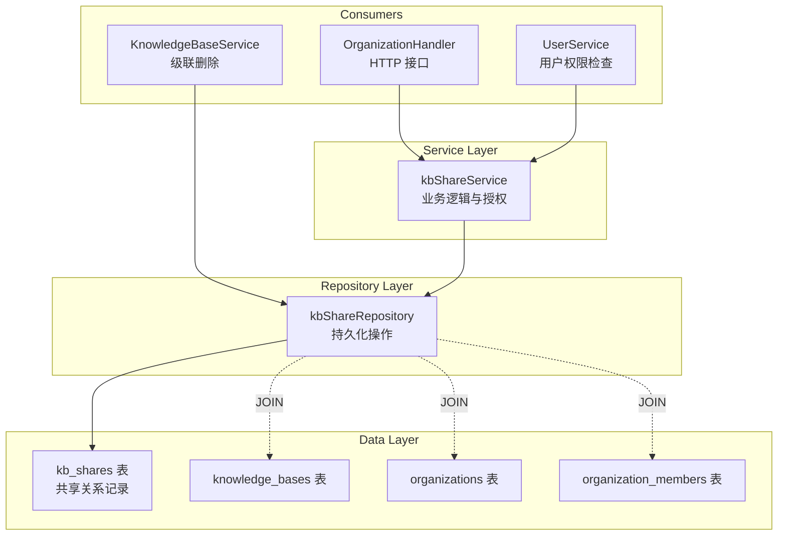

# knowledge_base_share_access_repository 模块深度解析

## 概述：为什么需要这个模块？

想象一个多租户的知识库系统：团队 A 创建了一个高质量的知识库，现在想把它共享给团队 B 使用，但又不希望团队 B 的成员能够修改原始内容。这种"共享但不转移所有权"的场景，正是 `knowledge_base_share_access_repository` 模块要解决的核心问题。

这个模块本质上是一个**访问控制关系存储器**——它不存储知识库本身的内容，而是存储"谁可以把哪个知识库共享给哪个组织、以什么权限级别"这样的关系记录。如果把知识库比作文档，那么这个模块管理的就是文档的"共享链接"及其权限设置。

为什么不能简单地在外键上加个组织 ID？因为一个知识库可能被共享给多个组织，一个组织也可能接收来自多个知识库的共享，这是一个典型的**多对多关系**。更复杂的是，系统需要支持软删除（审计需求）、级联清理（当知识库或删除时自动清理共享记录）、以及高效的批量查询（用户侧边栏需要展示所有可访问的共享知识库）。这个模块通过精心设计的 Repository 模式，将这些复杂性封装在简洁的接口背后。

## 架构定位与数据流



**架构角色**：这是一个典型的 Repository 模式实现，位于 [data_access_repositories](internal/application/repository/kbshare.go) 模块下，处于服务层与数据库层之间。它的核心职责是**将共享关系的 CRUD 操作抽象为领域语义的方法**，而不是暴露原始的 SQL 或 GORM 调用。

**数据流向**：
1. **写入路径**：`OrganizationHandler` → `kbShareService`（业务验证）→ `kbShareRepository.Create()` → `kb_shares` 表
2. **读取路径**：`kbShareService.ListSharedKnowledgeBases()` → `kbShareRepository.ListSharedKBsForUser()` → 多表 JOIN 查询 → 返回带预加载关联的共享记录
3. **清理路径**：`KnowledgeBaseService` 删除知识库时 → `kbShareRepository.DeleteByKnowledgeBaseID()` → 软删除所有相关共享记录

**依赖关系**：
- **被调用方**：[kbShareService](internal/application/service/kbshare/kbShareService.go)（主要调用者）、[KnowledgeBaseService](internal/application/service/knowledge/knowledgeService.go)（级联清理）
- **调用方**：GORM 数据库连接、[KnowledgeBaseShare](internal/types/organization/organization.go) 领域模型
- **接口契约**：实现 [KBShareRepository](internal/types/interfaces/organization/organization.go) 接口

## 核心组件深度解析

### kbShareRepository 结构体

```go
type kbShareRepository struct {
    db *gorm.DB
}
```

这是整个模块的唯一核心结构体，采用**依赖注入**模式接收 GORM 数据库连接。这种设计看似简单，但蕴含了几个关键决策：

**为什么只依赖 `*gorm.DB` 而不是更抽象的接口？** 在 Go 生态中，GORM 的 `*gorm.DB` 本身已经是一个相对稳定的接口层，且 Repository 层的测试通常通过集成测试（使用测试数据库）而非 Mock 来完成。过度抽象反而会增加维护成本。

**为什么是 struct 而不是 interface？** Repository 的实现是单一的，没有多版本切换的需求（不像向量检索可能有 Elasticsearch/Milvus 多种后端）。使用具体类型可以让方法签名更清晰，且不影响接口实现。

### 创建操作：防重复的原子性保障

```go
func (r *kbShareRepository) Create(ctx context.Context, share *types.KnowledgeBaseShare) error {
    // 检查是否已存在
    var count int64
    r.db.WithContext(ctx).Model(&types.KnowledgeBaseShare{}).
        Where("knowledge_base_id = ? AND organization_id = ? AND deleted_at IS NULL", ...).
        Count(&count)
    
    if count > 0 {
        return ErrKBShareAlreadyExists
    }
    
    return r.db.WithContext(ctx).Create(share).Error
}
```

**设计意图**：这里有一个微妙的竞态条件——如果两个请求同时尝试创建相同的共享关系，可能会产生重复记录。当前实现通过"先检查后创建"的方式处理，但这**不是原子操作**。在高并发场景下，应该在数据库层面添加唯一索引 `(knowledge_base_id, organization_id, deleted_at)`，并在 `Create` 失败时捕获唯一约束冲突错误。

**为什么检查 `deleted_at IS NULL`？** 因为系统支持软删除，用户可能先删除了共享关系，又想重新创建。如果只检查 `(kbID, orgID)` 而不考虑删除状态，会错误地拒绝合法的重新共享请求。

### 查询操作：软删除过滤的复杂性

```go
func (r *kbShareRepository) ListByOrganization(ctx context.Context, orgID string) ([]*types.KnowledgeBaseShare, error) {
    var shares []*types.KnowledgeBaseShare
    err := r.db.WithContext(ctx).
        Joins("JOIN knowledge_bases ON knowledge_bases.id = kb_shares.knowledge_base_id AND knowledge_bases.deleted_at IS NULL").
        Preload("KnowledgeBase").
        Preload("Organization").
        Where("kb_shares.organization_id = ? AND kb_shares.deleted_at IS NULL", orgID).
        Order("kb_shares.created_at DESC").
        Find(&shares).Error
    // ...
}
```

**关键洞察**：这个查询展示了 Repository 层的一个核心职责——**隐藏软删除的复杂性**。调用者不需要知道 `kb_shares` 和 `knowledge_bases` 两张表都有 `deleted_at` 字段，只需要得到"有效的共享记录"。

**为什么用 `JOIN` 而不是 `Preload` 过滤？** GORM 的 `Preload` 默认不会应用软删除过滤到关联表的主查询中。通过在 `JOIN` 条件中直接添加 `knowledge_bases.deleted_at IS NULL`，可以确保只返回关联知识库未被删除的记录。这是一种**性能优化**——避免加载无效数据后再在应用层过滤。

**`Preload` 的作用**：预加载 `KnowledgeBase` 和 `Organization` 关联，避免 N+1 查询问题。当服务层需要展示共享知识库的名称或组织的名称时，不需要额外查询。

### 用户维度的查询：多表关联的权限聚合

```go
func (r *kbShareRepository) ListSharedKBsForUser(ctx context.Context, userID string) ([]*types.KnowledgeBaseShare, error) {
    var shares []*types.KnowledgeBaseShare
    err := r.db.WithContext(ctx).
        Joins("JOIN knowledge_bases ON knowledge_bases.id = kb_shares.knowledge_base_id AND knowledge_bases.deleted_at IS NULL").
        Preload("KnowledgeBase").
        Preload("Organization").
        Joins("JOIN organization_members ON organization_members.organization_id = kb_shares.organization_id").
        Joins("JOIN organizations ON organizations.id = kb_shares.organization_id AND organizations.deleted_at IS NULL").
        Where("organization_members.user_id = ?", userID).
        Where("kb_shares.deleted_at IS NULL").
        Order("kb_shares.created_at DESC").
        Find(&shares).Error
    // ...
}
```

**这是整个模块最复杂的查询**，它回答了"一个用户可以看到哪些共享知识库"这个问题。让我们拆解它的逻辑链：

1. 从 `kb_shares` 表出发（共享关系）
2. JOIN `knowledge_bases` 过滤已删除的知识库
3. JOIN `organization_members` 找到用户所属的组织
4. JOIN `organizations` 过滤已删除的组织
5. 最终返回用户通过组织成员身份间接获得访问权限的所有共享知识库

**设计权衡**：这个查询将权限判断逻辑下推到数据库层，而不是在应用层逐个检查。这样做的好处是**单次查询完成权限聚合**，避免了先查用户所属组织、再查每个组织的共享知识库的多轮往返。代价是查询变得复杂，且难以单元测试（需要完整的数据库 schema）。

### 批量计数操作：为 UI 侧边栏优化

```go
func (r *kbShareRepository) CountByOrganizations(ctx context.Context, orgIDs []string) (map[string]int64, error) {
    // ...
    err := r.db.WithContext(ctx).Model(&types.KnowledgeBaseShare{}).
        Joins("JOIN knowledge_bases ON knowledge_bases.id = kb_shares.knowledge_base_id AND knowledge_bases.deleted_at IS NULL").
        Select("kb_shares.organization_id as organization_id, COUNT(*) as count").
        Where("kb_shares.organization_id IN ? AND kb_shares.deleted_at IS NULL", orgIDs).
        Group("kb_shares.organization_id").
        Find(&rows).Error
    // ...
    // 确保所有输入的 orgID 都有对应的计数（包括 0）
    out := make(map[string]int64)
    for _, o := range orgIDs {
        out[o] = 0
    }
    for _, r := range rows {
        out[r.OrgID] = r.Count
    }
    return out, nil
}
```

**使用场景**：前端侧边栏需要展示每个组织下有多少个共享知识库。如果逐个调用 `CountSharesByKnowledgeBaseID`，会产生 N 次数据库查询。这个批量方法通过 `GROUP BY` 单次查询返回所有组织的计数。

**为什么初始化所有 orgID 为 0？** 这是一个**防御性编程**实践。SQL 的 `GROUP BY` 只会返回有匹配记录的组织，但调用者期望得到所有输入组织的计数（包括 0）。通过先初始化再覆盖，确保返回的 map 包含所有输入的 key，避免调用者处理 `key not found` 的边界情况。

### 级联删除：数据一致性的守护者

```go
func (r *kbShareRepository) DeleteByKnowledgeBaseID(ctx context.Context, kbID string) error {
    return r.db.WithContext(ctx).Where("knowledge_base_id = ?", kbID).Delete(&types.KnowledgeBaseShare{}).Error
}

func (r *kbShareRepository) DeleteByOrganizationID(ctx context.Context, orgID string) error {
    return r.db.WithContext(ctx).Where("organization_id = ?", orgID).Delete(&types.KnowledgeBaseShare{}).Error
}
```

**设计意图**：当知识库被删除时，所有指向它的共享记录应该自动清理（否则会产生孤儿记录）。同样，当组织被删除时，它接收的所有共享也应该清理。

**为什么是软删除而不是硬删除？** 审计需求。系统可能需要追溯"这个知识库曾经被共享给哪些组织"，即使共享关系已经解除。软删除保留了历史记录，同时通过 `deleted_at IS NULL` 过滤确保业务逻辑看不到已删除的记录。

**潜在问题**：这里没有使用数据库的外键约束 `ON DELETE CASCADE`，而是在应用层手动调用。这样做的好处是更灵活（可以选择软删除而不是硬删除），但代价是**依赖调用者记得调用这些方法**。如果 `KnowledgeBaseService` 忘记调用 `DeleteByKnowledgeBaseID`，会产生数据不一致。

## 设计决策与权衡

### 1. 软删除 vs 硬删除

**选择**：全量软删除（`kb_shares`、`knowledge_bases`、`organizations` 都使用 `deleted_at`）

**原因**：
- 审计需求：需要追溯历史共享关系
- 可恢复性：误删后可以恢复
- 级联一致性：删除知识库时，共享记录软删除而非消失，保留历史痕迹

**代价**：
- 所有查询都必须添加 `deleted_at IS NULL` 条件，增加了 SQL 复杂度
- 需要定期清理过期软删除记录的后台任务（当前代码未见实现）
- 唯一索引需要考虑 `deleted_at`（否则无法重新创建相同记录）

### 2. Repository 模式 vs Active Record

**选择**：Repository 模式（分离 `kbShareRepository` 和 `KnowledgeBaseShare` 模型）

**原因**：
- 测试友好：可以 Mock Repository 接口进行单元测试
- 职责分离：模型只定义数据结构，Repository 负责持久化逻辑
- 符合项目整体架构：其他模块（如 `chunkRepository`、`messageRepository`）也采用相同模式

**代价**：
- 需要维护接口定义和实现两份代码
- 对于简单 CRUD 显得冗余

### 3. 应用层权限检查 vs 数据库层权限过滤

**选择**：混合模式
- Repository 层：通过 JOIN 过滤已删除的实体（技术权限）
- Service 层：检查用户是否有权执行操作（业务权限）

**原因**：
- 技术权限（如"知识库是否被删除"）适合在数据库层过滤，减少数据传输
- 业务权限（如"用户是否有权共享这个知识库"）需要更复杂的逻辑，适合在 Service 层处理

**风险**：权限逻辑分散在两层，可能导致不一致。例如，Repository 的 `ListSharedKBsForUser` 假设用户属于某个组织就有访问权，但 Service 层可能需要额外的租户隔离检查。

### 4. 批量操作的设计

**观察**：模块提供了多个批量方法（`CountSharesByKnowledgeBaseIDs`、`ListByOrganizations`、`CountByOrganizations`）

**设计意图**：这些方法都是为 UI 展示场景优化的。例如，用户侧边栏需要展示多个组织的共享知识库数量，如果逐个查询会产生 N+1 问题。

**扩展建议**：当前缺少 `ListByKnowledgeBaseIDs` 批量方法。如果需要展示多个知识库的共享列表，可能需要添加类似方法。

## 使用指南与示例

### 基本使用流程

```go
// 1. 创建共享关系（通常在 Service 层）
share := &types.KnowledgeBaseShare{
    ID:             uuid.New().String(),
    KnowledgeBaseID: "kb-123",
    OrganizationID:  "org-456",
    SharedByUserID:  "user-789",
    SourceTenantID:  1001,
    Permission:      types.OrgMemberRoleViewer,
}
err := kbShareRepo.Create(ctx, share)
if errors.Is(err, repository.ErrKBShareAlreadyExists) {
    // 处理重复共享
}

// 2. 查询用户可访问的共享知识库
shares, err := kbShareRepo.ListSharedKBsForUser(ctx, userID)
for _, share := range shares {
    fmt.Printf("KB: %s, Org: %s, Permission: %s\n", 
        share.KnowledgeBase.Name, 
        share.Organization.Name, 
        share.Permission)
}

// 3. 批量计数（用于 UI 侧边栏）
orgIDs := []string{"org-1", "org-2", "org-3"}
counts, err := kbShareRepo.CountByOrganizations(ctx, orgIDs)
// counts = {"org-1": 5, "org-2": 0, "org-3": 12}

// 4. 级联删除（当知识库被删除时）
err = kbShareRepo.DeleteByKnowledgeBaseID(ctx, kbID)
```

### 与 Service 层的协作

Repository 层不包含业务逻辑，以下是典型的 Service 层封装模式：

```go
// kbShareService.ShareKnowledgeBase 的实现逻辑
func (s *kbShareService) ShareKnowledgeBase(ctx context.Context, kbID string, orgID string, userID string, tenantID uint64, permission types.OrgMemberRole) (*types.KnowledgeBaseShare, error) {
    // 1. 验证知识库存在且属于当前租户
    kb, err := s.kbRepo.GetByID(ctx, kbID)
    if err != nil {
        return nil, err
    }
    if kb.TenantID != tenantID {
        return nil, errors.New("无权共享此知识库")
    }
    
    // 2. 验证组织存在且用户有权限
    org, err := s.orgRepo.GetByID(ctx, orgID)
    if err != nil {
        return nil, err
    }
    // ... 检查用户是否有权共享给这个组织
    
    // 3. 调用 Repository 创建
    share := &types.KnowledgeBaseShare{...}
    err = s.shareRepo.Create(ctx, share)
    if err != nil {
        return nil, err
    }
    
    return share, nil
}
```

## 边界情况与陷阱

### 1. 竞态条件：重复共享

**问题**：两个并发请求同时调用 `Create` 相同的 `(kbID, orgID)` 组合，可能都通过检查并创建成功。

**当前行为**：依赖应用层检查，存在竞态窗口。

**建议修复**：
```sql
-- 在数据库层面添加唯一索引
CREATE UNIQUE INDEX idx_kb_org_unique ON kb_shares(knowledge_base_id, organization_id, deleted_at);
```

然后在 `Create` 方法中捕获唯一约束冲突错误并返回 `ErrKBShareAlreadyExists`。

### 2. 软删除的级联一致性

**问题**：如果 `KnowledgeBaseService` 删除知识库时忘记调用 `DeleteByKnowledgeBaseID`，会产生孤儿共享记录。

**当前行为**：依赖调用者手动调用，无自动保障。

**建议修复**：
- 方案 A：使用数据库外键 `ON DELETE CASCADE`（但只能硬删除）
- 方案 B：在 `KnowledgeBase` 模型上使用 GORM 钩子 `AfterDelete` 自动调用
- 方案 C：添加定期清理孤儿记录的后台任务

### 3. 跨租户权限边界

**问题**：`ListSharedKBsForUser` 只检查用户是否属于组织，不检查租户隔离。如果用户属于多个租户的组织，可能看到不应访问的知识库。

**当前行为**：依赖 Service 层在调用前进行租户验证。

**风险**：如果 Service 层忘记检查，Repository 层不会阻止跨租户访问。

**建议**：在 Repository 方法中添加 `tenantID` 参数，在 SQL 中直接过滤：
```go
Joins("JOIN knowledge_bases ON ... AND knowledge_bases.tenant_id = ?", tenantID)
```

### 4. 预加载的 N+1 陷阱

**问题**：`ListByOrganization` 使用 `Preload("KnowledgeBase")`，但如果后续代码访问 `share.KnowledgeBase.SomeNestedField`，可能触发额外查询。

**当前行为**：只预加载直接关联，不预加载嵌套关联。

**建议**：如果需要嵌套预加载，使用 `Preload("KnowledgeBase.NestedField")` 或在 Service 层明确文档化不要访问嵌套字段。

### 5. 批量操作的内存消耗

**问题**：`ListByOrganizations` 和 `ListSharedKBsForUser` 返回所有匹配记录，如果数据量大可能消耗大量内存。

**当前行为**：无分页限制。

**建议**：对于可能返回大量数据的方法，添加 `limit` 和 `offset` 参数，或返回迭代器而非切片。

## 与其他模块的关系

- **[kbShareService](internal/application/service/kbshare/kbShareService.go)**：直接上层，添加业务逻辑和授权检查
- **[KnowledgeBaseService](internal/application/service/knowledge/knowledgeService.go)**：调用 `DeleteByKnowledgeBaseID` 进行级联清理
- **[OrganizationService](internal/application/service/organization/organizationService.go)**：调用 `DeleteByOrganizationID` 和 `ListByOrganization`
- **[KnowledgeBaseShare](internal/types/organization/organization.go)**：领域模型，定义数据结构
- **[KBShareRepository](internal/types/interfaces/organization/organization.go)**：接口定义，解耦实现

## 总结

`knowledge_base_share_access_repository` 模块是一个设计精良的 Repository 实现，它成功地将复杂的多表关联查询、软删除逻辑和批量操作封装在简洁的接口背后。核心设计哲学是**让调用者专注于业务逻辑，而不是 SQL 细节**。

关键成功因素：
1. **清晰的职责边界**：只负责持久化，不包含业务规则
2. **软删除的一致性处理**：所有查询自动过滤已删除记录
3. **批量操作优化**：针对 UI 场景提供高效的批量查询方法
4. **级联清理支持**：提供按知识库和组织清理的方法

主要改进空间：
1. 添加数据库唯一约束防止竞态条件
2. 考虑使用 GORM 钩子自动级联清理
3. 为大数据量查询添加分页支持
4. 在 Repository 层增加租户隔离过滤

对于新加入的开发者，理解这个模块的关键是认识到它不仅仅是一个 CRUD 封装，而是**多租户知识库共享访问控制模型的数据持久化层**。每一次查询都在回答"谁可以访问什么"这个核心问题，而软删除和级联清理机制确保了数据一致性和审计可追溯性。
