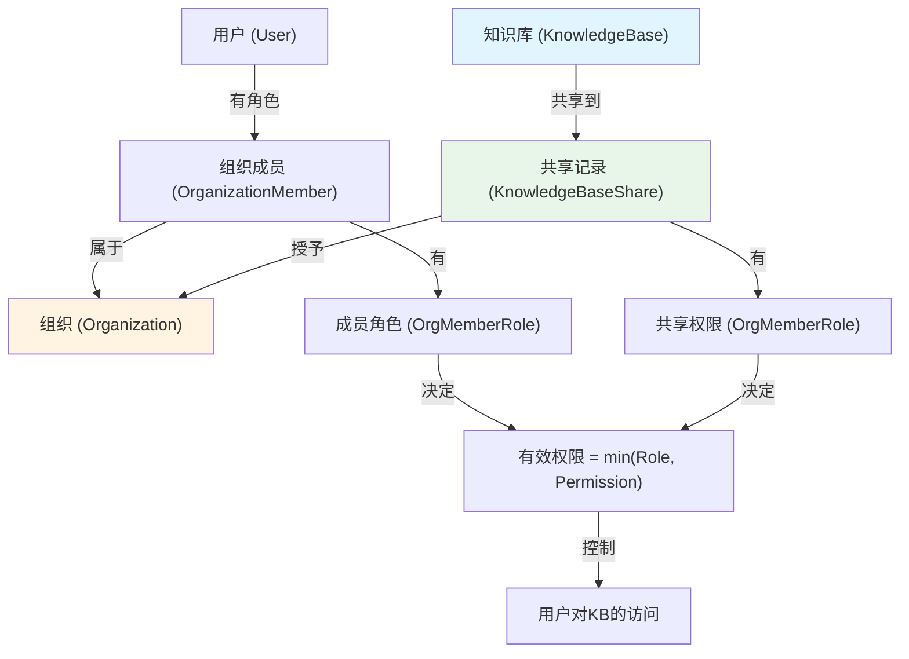
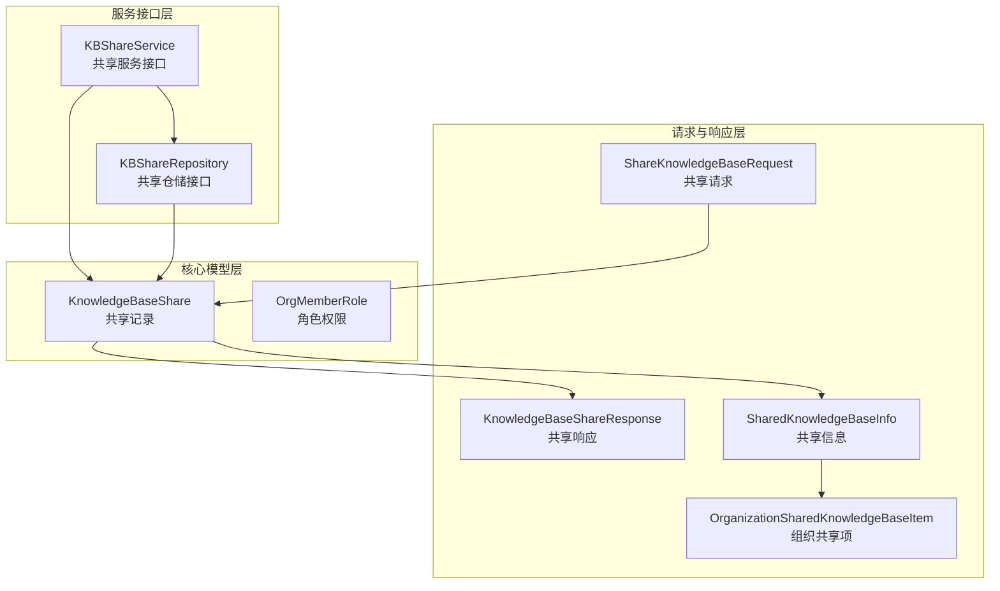
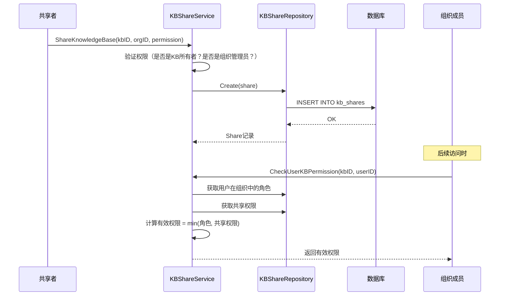
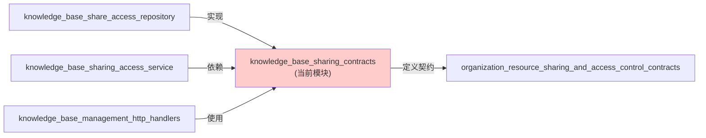

# knowledge_base_sharing_contracts 模块技术文档

## 1. 模块概述

### 1.1 问题空间

在多租户的知识管理系统中，一个常见的挑战是如何安全、灵活地实现跨租户的知识库共享。传统的方案要么是完全隔离（每个租户只能访问自己的资源），要么是完全开放（缺乏细粒度的权限控制）。

`knowledge_base_sharing_contracts` 模块解决了以下核心问题：
- **跨租户协作**：如何让不同租户的用户在受控环境下共享知识库
- **权限分级**：如何提供灵活的权限模型（查看、编辑、管理）
- **组织边界**：如何以"组织"为单位管理共享关系，而非直接用户间共享
- **权限叠加**：如何处理用户在组织中的角色与知识库共享权限的关系
- **审计追踪**：如何记录谁共享了什么、何时共享、权限如何

### 1.2 核心价值

这个模块是整个系统中**资源共享层**的契约定义，它为知识库共享提供了：
- 标准化的数据模型
- 清晰的服务接口边界
- 统一的权限计算逻辑
- API 请求/响应的契约规范

想象一下，你在一家大型企业工作，不同部门有自己独立的知识库。市场部想要共享竞品分析文档给产品团队，产品团队又需要把用户研究文档开放给研发。如果没有共享机制，团队间就只能通过复制粘贴、邮件发送等低效方式传递知识。这个模块就像是一个**知识资源的共享仓库管理员**，它知道谁有权访问什么资源，以什么权限级别访问，并且确保资源的原所有者始终保持控制权。

## 2. 架构与核心抽象

### 2.1 核心概念模型

让我们用一个现实世界的类比来理解这个模块的设计：

> 想象一个**联合办公空间（Organization）**，不同公司（Tenant）的人（User）可以加入这个空间。空间有管理员、编辑、访客三种角色。某个公司可以把自己的会议室（KnowledgeBase）"共享"到这个办公空间，并指定共享权限。最终，某个用户对会议室的实际使用权，取决于**他在空间中的角色**和**会议室共享时设定的权限**两者中较低的那一个。

这个模型的核心洞察力是：**共享关系不是用户与资源的直接关联，而是通过组织这个中介来实现的**。

### 2.2 核心组件关系图



### 2.3 架构分层设计



这个模块的架构采用了清晰的分层设计：

1. **请求与响应层**：定义了 API 交互的数据结构，包括共享请求、响应和展示信息
2. **核心模型层**：包含知识库共享记录和角色权限的核心数据模型
3. **服务接口层**：定义了业务逻辑和数据持久化的抽象接口

数据流向通常是：用户通过 `ShareKnowledgeBaseRequest` 发起共享请求 → 系统创建 `KnowledgeBaseShare` 记录 → 服务层通过 `KBShareService` 处理业务逻辑 → 仓储层通过 `KBShareRepository` 持久化数据 → 最终返回 `KnowledgeBaseShareResponse` 给用户。

### 2.4 关键数据结构

#### 2.4.1 权限模型 (OrgMemberRole)

这是整个模块的基石，采用了**三级权限体系**：

```go
type OrgMemberRole string

const (
    OrgRoleAdmin  OrgMemberRole = "admin"  // 3级 - 完全控制
    OrgRoleEditor OrgMemberRole = "editor" // 2级 - 编辑内容
    OrgRoleViewer OrgMemberRole = "viewer" // 1级 - 只读访问
)
```

**设计决策分析**：
- 为什么是三级而不是更多？因为三级（读/写/管）覆盖了 99% 的协作场景，避免权限爆炸
- 为什么用字符串而不是枚举？为了数据库存储的可读性和 API 的兼容性
- `HasPermission()` 方法采用数值比较：`admin(3) > editor(2) > viewer(1)`，这是一个简洁而强大的权限计算方式

#### 2.4.2 共享记录 (KnowledgeBaseShare)

这是连接知识库、组织和权限的核心实体：

```go
type KnowledgeBaseShare struct {
    ID              string         `json:"id"`
    KnowledgeBaseID string         `json:"knowledge_base_id"`  // 被共享的知识库
    OrganizationID  string         `json:"organization_id"`    // 接收共享的组织
    SharedByUserID  string         `json:"shared_by_user_id"`  // 谁执行的共享
    SourceTenantID  uint64         `json:"source_tenant_id"`   // 知识库的原始租户（关键！）
    Permission      OrgMemberRole  `json:"permission"`          // 共享权限
    CreatedAt       time.Time      `json:"created_at"`
    UpdatedAt       time.Time      `json:"updated_at"`
    DeletedAt       gorm.DeletedAt `json:"deleted_at"`
}
```

**关键点**：
- `SourceTenantID` 字段是跨租户访问的关键——它允许系统在访问共享知识库时，知道去哪个租户的嵌入模型空间进行查询
- 软删除 (`DeletedAt`) 支持共享关系的撤销和审计
- 这个结构是**多对多关系**的显式化：知识库 ↔ 组织

#### 2.4.3 权限计算模型

模块中最精妙的设计之一是**有效权限的计算**：

```go
// 在 KnowledgeBaseShareResponse 中：
MyRoleInOrg  string // 用户在组织中的角色
MyPermission string // 有效权限 = min(Permission, MyRoleInOrg)
```

**设计意图**：
- 用户不能获得超出组织角色的权限（即便知识库共享了更高权限）
- 用户也不能获得超出共享权限的权限（即便他是组织管理员）
- 这是一个**双重保险**的权限模型，确保安全

## 3. 数据流程与交互

### 3.1 知识库共享流程

让我们跟踪一个典型的知识库共享场景：



### 3.2 核心服务接口 (KBShareService)

这个接口定义了知识库共享的所有业务操作，分为几个清晰的职责组：

#### 3.2.1 共享管理
```go
ShareKnowledgeBase(...)     // 创建共享
UpdateSharePermission(...)  // 修改权限
RemoveShare(...)            // 移除共享
```

#### 3.2.2 查询接口
```go
ListSharesByKnowledgeBase(...)       // 知识库视角：谁共享了我
ListSharesByOrganization(...)         // 组织视角：我收到了哪些共享
ListSharedKnowledgeBases(...)         // 用户视角：我能访问哪些共享知识库
ListSharedKnowledgeBasesInOrganization(...)  // 组织内的共享列表
```

#### 3.2.3 权限检查（核心）
```go
CheckUserKBPermission(...)  // 获取用户对KB的权限
HasKBPermission(...)         // 检查是否有足够权限
GetKBSourceTenant(...)       // 获取KB的源租户（跨租户关键）
```

### 3.3 仓储接口 (KBShareRepository)

仓储接口关注数据持久化，与服务接口形成清晰的分离：

```go
// CRUD 操作
Create(...)
GetByID(...)
GetByKBAndOrg(...)
Update(...)
Delete(...)

// 级联删除（重要！）
DeleteByKnowledgeBaseID(...)   // 删除KB时，级联删除所有共享
DeleteByOrganizationID(...)    // 删除组织时，级联删除所有共享

// 查询操作
ListByKnowledgeBase(...)
ListByOrganization(...)
ListSharedKBsForUser(...)      // 用户可见的所有共享KB

// 统计
CountSharesByKnowledgeBaseIDs(...)
CountByOrganizations(...)
```

**设计决策**：
- 仓储接口不包含权限逻辑——那是服务层的职责
- 明确的级联删除方法，避免数据库级联删除带来的隐式行为
- 批量查询方法支持性能优化

---

## 4. 设计决策与权衡

### 4.1 组织作为共享中介

**选择**：不直接用户→用户共享，而是用户→组织→用户共享

**原因**：
- 更符合现实世界的协作模式（团队、部门、公司）
- 便于批量管理权限（修改组织角色自动影响所有共享资源）
- 支持成员流动时的权限自动调整

**权衡**：
- ✅ 优点：权限管理规模化、可审计
- ❌ 缺点：增加了一层抽象，简单场景下略显复杂

### 4.2 有效权限 = min(用户角色, 共享权限)

**选择**：双重权限约束，取较小值

**替代方案**：
1. 只看共享权限（但组织管理员可能越权）
2. 只看用户角色（但共享者可能想限制权限）
3. 权限叠加（太复杂，难以推理）

**原因**：
- 安全第一：宁可权限不足，不可权限溢出
- 易于理解："两个约束都要满足"
- 易于实现：数值比较即可

### 4.3 SourceTenantID 的显式存储

**选择**：在共享记录中冗余存储源租户 ID

**原因**：
- 跨租户访问时需要知道去哪里找嵌入模型
- 避免每次访问都 JOIN 知识库表查询租户
- 即使知识库被删除，共享记录仍然保留审计信息

**权衡**：
- ✅ 优点：查询性能好、数据自包含
- ❌ 缺点：数据冗余，需要确保一致性（通过应用层逻辑）

### 4.4 软删除而非硬删除

**选择**：使用 `gorm.DeletedAt` 进行软删除

**原因**：
- 审计需求：需要知道"曾经共享过"
- 可恢复：误操作可以恢复
- 用户体验：显示"已撤销的共享"比凭空消失更好

**权衡**：
- ✅ 优点：可审计、可恢复
- ❌ 缺点：数据库会累积历史数据，查询需要过滤软删除记录

## 5. 与其他模块的关系

### 5.1 依赖关系



### 5.2 关键交互点

1. **与组织模块**：共享的组织上下文来自 `Organization` 和 `OrganizationMember`
2. **与知识库模块**：共享的主体是 `KnowledgeBase`，需要知识库的元数据
3. **与租户模块**：`SourceTenantID` 连接到租户的嵌入模型配置
4. **与 HTTP 层**：`ShareKnowledgeBaseRequest` 和 `KnowledgeBaseShareResponse` 直接用于 API

### 5.3 模块依赖说明

此模块依赖于：
- [organization_resource_sharing_and_access_control_contracts](organization_resource_sharing_and_access_control_contracts.md)：提供组织和成员信息
- 知识库管理模块（提供知识库元数据）
- 用户认证模块（提供用户身份信息）

被以下模块依赖：
- [knowledge_base_share_access_repository](knowledge_base_share_access_repository.md)：实现共享数据的持久化
- [knowledge_base_sharing_access_service](knowledge_base_sharing_access_service.md)：实现共享业务逻辑
- HTTP 处理层（处理共享相关的 API 请求）

---

## 6. 使用指南与注意事项

### 6.1 典型使用场景

#### 场景 1：共享知识库到组织

```go
// 1. 准备请求
req := &types.ShareKnowledgeBaseRequest{
    OrganizationID: "org-123",
    Permission:     types.OrgRoleEditor,
}

// 2. 调用服务
share, err := kbShareService.ShareKnowledgeBase(
    ctx,
    "kb-456",      // 知识库 ID
    req.OrganizationID,
    "user-789",    // 共享者用户 ID
    123,           // 共享者租户 ID
    req.Permission,
)
```

#### 场景 2：检查用户权限

```go
// 检查用户是否有编辑权限
hasPermission, err := kbShareService.HasKBPermission(
    ctx,
    "kb-456",
    "user-789",
    types.OrgRoleEditor,  // 要求的权限
)

if hasPermission {
    // 允许编辑
}
```

### 6.2 注意事项与陷阱

#### 6.2.1 权限计算的隐含逻辑

⚠️ **重要**：有效权限是双重约束的结果，不要只检查单一条件

```go
// ❌ 错误：只检查共享权限
share, _ := repository.GetByKBAndOrg(ctx, kbID, orgID)
if share.Permission.HasPermission(required) { ... }

// ❌ 错误：只检查用户角色
member, _ := repository.GetMember(ctx, orgID, userID)
if member.Role.HasPermission(required) { ... }

// ✅ 正确：使用服务层的 CheckUserKBPermission
permission, hasAccess, _ := service.CheckUserKBPermission(ctx, kbID, userID)
if hasAccess && permission.HasPermission(required) { ... }
```

#### 6.2.2 SourceTenantID 的重要性

⚠️ **跨租户嵌入查询时必须使用源租户**

```go
// ✅ 正确：从共享记录获取源租户
sourceTenantID, err := service.GetKBSourceTenant(ctx, kbID)
// 使用 sourceTenantID 的嵌入模型进行查询
```

#### 6.2.3 软删除的过滤

⚠️ **查询时记得过滤软删除记录**

GORM 会自动处理，但如果你手写 SQL：

```sql
-- ❌ 错误：包含已删除的共享
SELECT * FROM kb_shares WHERE knowledge_base_id = ?

-- ✅ 正确：过滤软删除
SELECT * FROM kb_shares WHERE knowledge_base_id = ? AND deleted_at IS NULL
```

#### 6.2.4 避免循环依赖

这个模块只定义契约，不要在其中引入业务逻辑实现：

```go
// ❌ 错误：在契约包中实现服务
func (s *KBShareServiceImpl) ShareKnowledgeBase(...) { ... }

// ✅ 正确：契约包只定义接口，实现在其他包
// internal/services/organization/kb_share_service.go
```

### 6.3 扩展点

#### 6.3.1 自定义权限计算

如果你需要修改权限计算逻辑，应该在服务层实现，而不是修改契约：

```go
// 保持契约不变
type KBShareService interface {
    CheckUserKBPermission(ctx context.Context, kbID string, userID string) (types.OrgMemberRole, bool, error)
}

// 在实现中自定义逻辑
func (s *customKBShareService) CheckUserKBPermission(...) {
    // 你的自定义权限逻辑
}
```

#### 6.3.2 新增共享状态

如果需要"待审批的共享"等状态，可以扩展模型：

```go
type KnowledgeBaseShare struct {
    // ... 现有字段 ...
    Status ShareStatus `json:"status"`  // 新增：pending/active/revoked
}
```

但要注意：保持向后兼容性，给旧数据默认值。

---

## 7. 总结

`knowledge_base_sharing_contracts` 模块是一个**精心设计的契约层**，它解决了多租户环境下知识库共享的复杂问题。其核心智慧在于：

1. **组织作为中介**：规模化的权限管理
2. **双重权限约束**：安全且易于理解
3. **显式的源租户追踪**：支持跨租户访问
4. **清晰的接口分离**：契约与实现解耦

这个模块不是"业务逻辑"，而是"业务逻辑的骨架"——它定义了游戏规则，让其他模块在这个框架内运行。对于新加入的开发者来说，理解这个模块的设计意图，是理解整个系统资源共享机制的关键。

## 子模块

本模块包含以下子模块，详细信息请参考各自的文档：

- [knowledge_base_sharing_service_and_repository_interfaces](knowledge_base_sharing_contracts-knowledge_base_sharing_service_and_repository_interfaces.md)：共享服务和仓储接口的详细说明
- [knowledge_base_sharing_request_contracts](knowledge_base_sharing_contracts-knowledge_base_sharing_request_contracts.md)：共享请求合约的详细说明
- [knowledge_base_sharing_domain_and_response_models](knowledge_base_sharing_contracts-knowledge_base_sharing_domain_and_response_models.md)：领域模型和响应模型的详细说明
