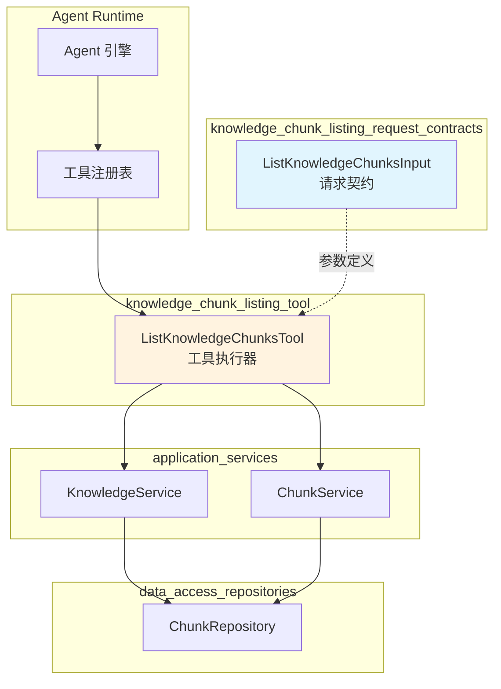

# knowledge_chunk_listing_request_contracts

## 模块概述

想象一下，你正在阅读一本厚厚的技术手册——你不可能一口气读完所有内容，而是需要**按章节翻阅**，每次只看几页。`knowledge_chunk_listing_request_contracts` 模块扮演的就是"目录页码"的角色：它定义了 Agent 如何向系统请求"请给我某份文档的第 X 到第 Y 个分块"。

这个模块的核心使命是**标准化 Agent 对知识库文档分块内容的分页读取请求**。当 Agent 通过 `grep_chunks` 或 `knowledge_search` 找到感兴趣的文档后，它需要一种结构化的方式来获取该文档的完整分块内容。本模块定义的 `ListKnowledgeChunksInput` 就是这个请求的契约——它告诉系统：我要哪个文档、每次要多少块、从哪开始。

为什么不能简单地返回整个文档？因为知识库中的文档可能包含数十甚至上百个分块，一次性返回会超出 LLM 的上下文窗口限制，也会造成不必要的网络传输开销。分页读取让 Agent 可以**按需获取**，先预览前几块，再决定是否继续深入。

## 架构定位与数据流



### 组件角色说明

**`ListKnowledgeChunksInput`**（本模块核心）  
这是请求参数的数据契约，定义了三个字段：`knowledge_id`（文档 ID）、`limit`（每页数量）、`offset`（起始偏移）。它本身不包含任何逻辑，只是一个**纯数据结构**，确保所有调用方使用统一的参数格式。

**`ListKnowledgeChunksTool`**（调用方）  
这是实际执行工具逻辑的组件。它接收 `ListKnowledgeChunksInput` 定义的参数，然后：
1. 验证 `knowledge_id` 是否有效
2. 通过 `KnowledgeService` 获取文档元信息（包括所属知识库和租户 ID）
3. 检查当前 Agent 是否有权限访问该知识库（通过 `searchTargets`）
4. 使用文档的实际租户 ID 调用 `ChunkService` 获取分块列表
5. 构建人类可读的输出和结构化数据返回给 Agent

**`KnowledgeService` / `ChunkService`**（被调用方）  
这两个服务分别负责文档元数据查询和分块内容查询。注意一个关键设计：`ListKnowledgeChunksTool` 使用 `GetKnowledgeByIDOnly` 方法（不带租户过滤）来获取文档信息，然后**使用文档自身的租户 ID** 去查询分块。这种设计支持**跨租户共享知识库**的场景——即使文档属于另一个租户，只要当前 Agent 有访问权限，就能正确获取分块。

### 数据流追踪

一次典型的分块列表请求经历以下阶段：

```
Agent 决定读取文档分块
       ↓
构造 ListKnowledgeChunksInput{knowledge_id, limit, offset}
       ↓
ListKnowledgeChunksTool.Execute() 解析 JSON 参数
       ↓
验证 knowledge_id 非空
       ↓
KnowledgeService.GetKnowledgeByIDOnly() → 获取 knowledge 对象
       ↓
检查 knowledge.KnowledgeBaseID 是否在 searchTargets 中（权限验证）
       ↓
ChunkService.ListPagedChunksByKnowledgeID(tenant_id, knowledge_id, pagination)
       ↓
返回 []*Chunk + total count
       ↓
构建 ToolResult{Success, Output(人类可读), Data(结构化)}
       ↓
Agent 引擎接收结果，决定下一步行动
```

## 核心组件深度解析

### ListKnowledgeChunksInput

**设计意图**  
这个结构体是整个模块的唯一导出类型，它的存在是为了**解耦工具实现与参数定义**。通过将参数定义独立出来，其他模块（如前端、测试代码、文档生成器）可以在不依赖工具实现的情况下了解工具的输入格式。

**字段语义**

| 字段 | 类型 | 必填 | 默认值 | 约束 | 含义 |
|------|------|------|--------|------|------|
| `KnowledgeID` | `string` | 是 | - | 非空 | 要读取分块的文档 ID |
| `Limit` | `int` | 否 | 20 | 1-100 | 每页返回的分块数量 |
| `Offset` | `int` | 否 | 0 | ≥0 | 起始偏移量（从 0 开始） |

**为什么使用 offset/limit 而不是 page/page_size？**  
这是一个值得注意的设计选择。JSON Schema 中定义的是 `offset` 和 `limit`，但工具内部执行时会将其转换为 `page` 和 `page_size`：

```go
pagination := &types.Pagination{
    Page:     offset/chunkLimit + 1,
    PageSize: chunkLimit,
}
```

这种转换的原因是：底层 `ChunkRepository.ListPagedChunksByKnowledgeID` 接口使用 `Page/PageSize` 语义，而工具对外暴露 `Offset/Limit` 语义。这样做的好处是**对外接口更符合 RESTful 分页习惯**（offset/limit 是常见的 API 设计），同时内部可以复用已有的分页逻辑。

**边界情况处理**
- `Limit <= 0`：自动回退到默认值 20
- `Offset < 0`：自动修正为 0
- `Limit > 100`：Schema 中有 `maximum: 100` 约束，但代码层面没有强制截断（依赖调用方遵守）

### 工具执行流程中的关键决策

**1. 跨租户共享知识库的支持**

```go
// 获取 knowledge 时不使用租户过滤
knowledge, err := t.knowledgeService.GetKnowledgeByIDOnly(ctx, knowledgeID)

// 但使用 knowledge 自身的 tenant_id 查询分块
effectiveTenantID := knowledge.TenantID
chunks, total, err := t.chunkService.GetRepository().ListPagedChunksByKnowledgeID(
    ctx, effectiveTenantID, knowledgeID, pagination, ...)
```

这个设计解决了一个微妙的问题：当知识库被共享给其他租户时，Agent 可能以"访客"身份访问不属于自己的文档。如果直接用当前会话的租户 ID 查询分块，会查不到数据。正确做法是**先获取文档的元信息（包括它实际属于哪个租户），然后用那个租户 ID 去查分块**。

**2. 权限验证的双层检查**

```go
// 第一层：knowledge 是否存在
if err != nil { /* 文档不存在 */ }

// 第二层：当前 Agent 是否有权限访问该知识库
if !t.searchTargets.ContainsKB(knowledge.KnowledgeBaseID) {
    return &types.ToolResult{Success: false, Error: "Knowledge base not accessible"}
}
```

`searchTargets` 是在工具初始化时传入的预计算结果，包含了当前 Agent 有权访问的所有知识库 ID 列表。这种设计将**权限检查前置**——工具执行前就已经确定了可访问范围，避免每次调用都重新计算权限。

**3. 输出格式的双轨设计**

工具返回的 `ToolResult` 包含两个部分：
- `Output`（字符串）：人类可读的格式化文本，适合直接展示给用户或在对话中引用
- `Data`（map）：结构化数据，适合程序化处理或进一步分析

```go
return &types.ToolResult{
    Success: true,
    Output:  output,      // 格式化文本，包含分块预览
    Data: map[string]interface{}{
        "knowledge_id":    knowledgeID,
        "knowledge_title": knowledgeTitle,
        "total_chunks":    totalChunks,
        "fetched_chunks":  fetched,
        "chunks":          formattedChunks,  // 完整分块数组
    },
}
```

这种设计让 Agent 可以灵活选择：如果需要快速预览，可以读取 `Output`；如果需要精确处理某个分块，可以解析 `Data.chunks` 数组。

**4. 图片信息的增强处理**

分块可能关联多模态信息（图片 URL、描述、OCR 文本）。工具会解析 `Chunk.ImageInfo` 字段（JSON 字符串），将其转换为结构化数组：

```go
if c.ImageInfo != "" {
    var imageInfos []types.ImageInfo
    if err := json.Unmarshal([]byte(c.ImageInfo), &imageInfos); err == nil {
        // 提取 url, caption, ocr_text 到 chunkData["images"]
    }
}
```

这个处理是**可选且容错**的——如果解析失败，不会影响主流程，只是不返回图片信息。

## 依赖关系分析

### 本模块调用的组件

| 依赖组件 | 调用目的 | 耦合程度 |
|---------|---------|---------|
| `types.Chunk` | 分块数据模型 | 紧耦合（数据结构依赖） |
| `types.Pagination` | 分页参数模型 | 紧耦合 |
| `types.ToolResult` | 工具执行结果模型 | 紧耦合 |
| `types.ImageInfo` | 图片信息模型 | 松耦合（可选字段） |
| `interfaces.ChunkService` | 分块查询服务 | 紧耦合（核心依赖） |
| `interfaces.KnowledgeService` | 文档元数据查询 | 紧耦合（核心依赖） |
| `types.SearchTargets` | 权限范围检查 | 中耦合（初始化时注入） |

### 调用本模块的组件

| 调用方 | 调用场景 | 期望行为 |
|-------|---------|---------|
| `ListKnowledgeChunksTool` | 工具执行时解析参数 | 参数符合 JSON Schema 约束 |
| Agent 引擎（间接） | Agent 决定调用工具时构造参数 | 参数语义清晰，易于 LLM 理解 |

### 数据契约边界

**输入契约**（由本模块定义）
```json
{
  "knowledge_id": "kb_123_doc_456",
  "limit": 20,
  "offset": 0
}
```

**输出契约**（由 `ListKnowledgeChunksTool` 定义，但依赖本模块的输入结构）
```json
{
  "success": true,
  "data": {
    "knowledge_id": "kb_123_doc_456",
    "knowledge_title": "产品手册 v2.0",
    "total_chunks": 150,
    "fetched_chunks": 20,
    "page": 1,
    "page_size": 20,
    "chunks": [
      {
        "seq": 1,
        "chunk_id": "chunk_001",
        "chunk_index": 0,
        "content": "...",
        "chunk_type": "text",
        "images": [...]
      }
    ]
  }
}
```

## 设计决策与权衡

### 1. 为什么将请求参数独立成模块？

**选择**：将 `ListKnowledgeChunksInput` 独立为单独的模块，而不是内嵌在工具文件中。

**权衡**：
- ✅ **优点**：参数定义可被其他模块引用（如前端表单验证、API 文档生成、测试用例构造），无需导入整个工具实现
- ❌ **缺点**：增加了一个小模块的维护成本，对于只有 3 个字段的结构体可能显得过度设计

**为什么这样选**：在大型代码库中，**契约优先**的设计有助于保持接口稳定性。即使工具实现发生变化，只要输入契约不变，调用方就不需要修改。

### 2. 为什么同时返回人类可读文本和结构化数据？

**选择**：`ToolResult` 同时包含 `Output`（字符串）和 `Data`（map）。

**权衡**：
- ✅ **优点**：兼顾两种使用场景——直接展示给用户看 vs 程序化处理
- ❌ **缺点**：数据冗余，同样的信息存储了两份

**为什么这样选**：Agent 场景的特殊性决定了这种设计。LLM 更擅长处理自然语言文本，但某些精确操作（如"获取第 3 个分块的 chunk_id"）需要结构化数据。双轨输出让 Agent 可以**根据任务类型选择合适的数据格式**。

### 3. 为什么权限检查使用预计算的 searchTargets 而不是实时查询？

**选择**：工具初始化时注入 `searchTargets`，执行时直接检查 `ContainsKB()`。

**权衡**：
- ✅ **优点**：避免每次工具调用都查询数据库，减少延迟；权限范围在会话级别是相对稳定的
- ❌ **缺点**：如果权限在会话中途发生变化，工具不会感知（需要重新初始化工具）

**为什么这样选**：在 Agent 会话的生命周期内（通常几分钟到几小时），权限配置极少变化。**性能优化优先于实时性**是合理的选择。如果需要支持动态权限变更，可以在会话级别添加权限刷新机制。

### 4. 为什么使用 GetKnowledgeByIDOnly 而不是带租户过滤的方法？

**选择**：使用 `GetKnowledgeByIDOnly` 获取文档，然后手动检查 `searchTargets`。

**权衡**：
- ✅ **优点**：支持跨租户共享知识库场景；权限逻辑集中在工具层，更透明
- ❌ **缺点**：如果忘记检查 `searchTargets`，可能泄露数据

**为什么这样选**：这是一个**显式优于隐式**的设计。带租户过滤的方法会隐式地排除非本租户的文档，但共享知识库场景需要显式地允许跨租户访问。将权限检查放在工具层，代码意图更清晰。

## 使用指南与示例

### 基本使用模式

```go
// 1. 构造请求参数
input := ListKnowledgeChunksInput{
    KnowledgeID: "kb_abc123_doc_xyz789",
    Limit:       20,
    Offset:      0,
}

// 2. 序列化为 JSON（工具内部会做这一步）
argsJSON, _ := json.Marshal(input)

// 3. 工具执行（通常由 Agent 引擎自动调用）
tool := NewListKnowledgeChunksTool(knowledgeService, chunkService, searchTargets)
result, err := tool.Execute(ctx, argsJSON)

// 4. 处理结果
if result.Success {
    // 人类可读输出
    fmt.Println(result.Output)
    
    // 结构化数据
    chunks := result.Data["chunks"].([]map[string]interface{})
    for _, chunk := range chunks {
        fmt.Printf("Chunk %d: %s\n", chunk["chunk_index"], chunk["content"])
    }
}
```

### 典型 Agent 工作流

```
用户：帮我查找关于"变体"的内容

Agent:
  1. 调用 grep_chunks(["变体"])
     → 返回匹配的知识库和文档列表
  
  2. 发现文档 "kb_123_doc_456" 有 3 个匹配
  
  3. 调用 list_knowledge_chunks(knowledge_id="kb_123_doc_456", limit=20, offset=0)
     → 获取该文档的前 20 个分块
  
  4. 分析分块内容，找到相关段落
  
  5. 如果内容超过 20 块，继续调用 offset=20, 40, ... 获取剩余内容
  
  6. 综合所有信息，回答用户问题
```

### 分页遍历完整文档

```go
func fetchAllChunks(tool *ListKnowledgeChunksTool, knowledgeID string) ([]map[string]interface{}, error) {
    var allChunks []map[string]interface{}
    offset := 0
    limit := 100  // 使用最大限制减少调用次数
    
    for {
        input := ListKnowledgeChunksInput{
            KnowledgeID: knowledgeID,
            Limit:       limit,
            Offset:      offset,
        }
        argsJSON, _ := json.Marshal(input)
        result, err := tool.Execute(ctx, argsJSON)
        if err != nil || !result.Success {
            return nil, err
        }
        
        chunks := result.Data["chunks"].([]map[string]interface{})
        allChunks = append(allChunks, chunks...)
        
        if len(chunks) < limit {
            break  // 已获取全部
        }
        offset += limit
    }
    
    return allChunks, nil
}
```

## 边界情况与注意事项

### 1. 空文档处理

当文档存在但没有任何分块时（可能解析失败或尚未完成），工具会返回：
```
总分块数：0
未找到任何分块，请确认文档是否已完成解析。
```

**注意**：这不是错误，`Success` 仍为 `true`。调用方需要检查 `total_chunks` 字段判断是否有数据。

### 2. 分页越界

如果 `offset` 超过总分块数，返回空数组，但 `Success` 为 `true`：
```
总分块数：50
本次拉取：0 条，检索范围：N/A
```

**建议**：调用方应在循环中检查 `fetched_chunks < page_size` 作为终止条件。

### 3. 跨租户访问失败场景

当 `searchTargets` 不包含文档所属知识库时：
```go
Success: false
Error: "Knowledge base kb_xyz is not accessible"
```

这是**权限错误**，不是文档不存在。调用方应区分这两种情况：
- 文档不存在：可能需要检查 ID 是否正确
- 无权限：需要申请访问权限或切换身份

### 4. 图片信息解析失败

`ImageInfo` 字段是 JSON 字符串，解析失败不会导致工具执行失败，只是 `images` 字段不会出现在返回数据中。

**潜在问题**：如果 `ImageInfo` 格式损坏，调试较困难（没有错误日志）。建议在生产环境中添加日志记录解析失败的情况。

### 5. 并发读取同一文档

多个 Agent 同时读取同一文档的分块是安全的——底层 `ChunkRepository` 是只读操作。但需要注意：
- 如果文档正在被更新（分块数量变化），不同调用可能看到不一致的 `total_chunks`
- 这种不一致是**最终一致性**的体现，通常可以接受

### 6. 性能考虑

| 场景 | 建议 |
|------|------|
| 大文档（>1000 分块） | 使用 `limit=100` 减少调用次数；考虑是否需要读取全量 |
| 高频调用 | `searchTargets` 应缓存，避免重复计算 |
| 跨租户访问 | 确保 `GetKnowledgeByIDOnly` 有适当的索引 |

## 扩展点

### 添加新的过滤条件

如果需要支持按分块类型过滤，可以扩展 `ListKnowledgeChunksInput`：

```go
type ListKnowledgeChunksInput struct {
    KnowledgeID string     `json:"knowledge_id"`
    Limit       int        `json:"limit"`
    Offset      int        `json:"offset"`
    ChunkTypes  []string   `json:"chunk_types,omitempty"`  // 新增
}
```

然后在工具执行时传递给 `ListPagedChunksByKnowledgeID`。

### 支持全文搜索 within 文档

当前设计是先 `grep_chunks` 找到文档，再 `list_knowledge_chunks` 获取内容。如果需要直接在文档内搜索，可以添加 `keyword` 参数：

```go
type ListKnowledgeChunksInput struct {
    // ... 现有字段
    Keyword     string   `json:"keyword,omitempty"`  // 新增
}
```

但这会模糊与 `grep_chunks` 的职责边界，需要谨慎设计。

## 相关模块参考

- [knowledge_chunk_listing_tool](knowledge_chunk_listing_tool.md) — 使用本模块定义的工具执行器
- [document_metadata_retrieval_request_contracts](document_metadata_retrieval_request_contracts.md) — 同级的文档元数据请求契约
- [chunk_management_api](chunk_management_api.md) — 底层分块管理 API
- [corpus_browsing_request_contracts](corpus_browsing_request_contracts.md) — 父级语料浏览请求契约模块
