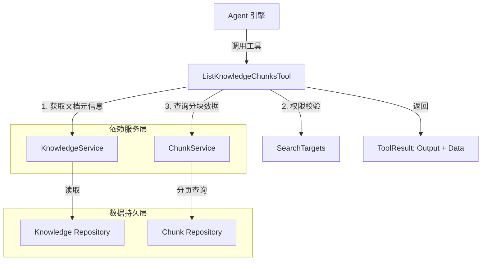

# knowledge_chunk_listing_tool 模块深度解析

## 模块概述

想象一下，你正在使用一个智能助手来搜索公司内部的知识库。助手先帮你做了一轮关键词搜索（`grep_chunks`），找到了一些相关的文档片段，但每个片段只有几行摘要。现在你想知道某篇文档的**完整内容结构**——它被切成了多少块？每一块具体讲了什么？块与块之间如何衔接？

这就是 `knowledge_chunk_listing_tool` 存在的意义。它是一个**文档分块浏览工具**，让 Agent 能够按分页方式获取某个知识文档的所有分块内容。与语义搜索工具不同，它不做相关性排序，而是提供**确定性的、完整的文档结构视图**——就像你打开一本书的目录，然后逐页翻阅。

该模块的核心设计洞察是：**搜索和浏览是两种不同的认知模式**。搜索帮你找到"可能相关"的内容，而浏览帮你理解"已知文档"的全貌。这个工具服务于后者，是 Agent 工作流中"从发现到理解"的关键一环。

---

## 架构与数据流

### 组件关系图



### 数据流 walkthrough

当一个 Agent 决定调用 `list_knowledge_chunks` 工具时，数据经历以下流转：

1. **请求解析阶段**：Agent 引擎将工具的 JSON 参数反序列化为 `ListKnowledgeChunksInput` 结构体
2. **文档定位阶段**：通过 `KnowledgeService.GetKnowledgeByIDOnly` 获取文档元信息（包括 `KnowledgeBaseID` 和 `TenantID`）
3. **权限验证阶段**：使用 `searchTargets.ContainsKB` 检查当前会话是否有权访问该知识库（支持跨租户共享场景）
4. **分块查询阶段**：调用 `ChunkService.ListPagedChunksByKnowledgeID` 进行分页查询，返回文本和 FAQ 类型的分块
5. **结果组装阶段**：构建双层输出——人类可读的文本摘要（`Output`）+ 结构化数据（`Data`）
6. **返回阶段**：将 `ToolResult` 返回给 Agent 引擎，供后续推理使用

这个流程的关键在于**权限与数据的分离**：工具本身不直接处理租户隔离逻辑，而是依赖上游传入的 `searchTargets` 进行访问控制，这体现了关注点分离的设计原则。

---

## 核心组件深度解析

### ListKnowledgeChunksTool

**设计目的**：提供一个类型安全、权限感知、分页友好的文档分块查询接口。

**内部机制**：

该工具继承自 `BaseTool`，遵循工具注册模式。它的核心方法是 `Execute(ctx, args)`，接收原始 JSON 参数并返回 `ToolResult`。执行流程可分为三个逻辑层：

```
┌─────────────────────────────────────────┐
│           输入验证层                      │
│  - JSON 反序列化                         │
│  - knowledge_id 非空校验                  │
│  - 参数默认值填充 (limit=20, offset=0)    │
└─────────────────────────────────────────┘
                    ↓
┌─────────────────────────────────────────┐
│           权限与元数据层                   │
│  - 获取 Knowledge 元信息                  │
│  - 验证 KB 在 searchTargets 中             │
│  - 提取 effectiveTenantID                │
└─────────────────────────────────────────┘
                    ↓
┌─────────────────────────────────────────┐
│           数据查询与格式化层               │
│  - 分页查询 Chunks                       │
│  - 解析 ImageInfo 元数据                  │
│  - 构建 Output 文本 + Data 结构化数据      │
└─────────────────────────────────────────┘
```

**关键参数**：

| 参数 | 类型 | 必填 | 说明 |
|------|------|------|------|
| `knowledge_id` | string | 是 | 文档唯一标识符 |
| `limit` | int | 否 | 每页分块数，默认 20，最大 100 |
| `offset` | int | 否 | 起始偏移量，默认 0 |

**返回值**：`*types.ToolResult`，包含三个关键字段：
- `Success`: 布尔值，标识操作是否成功
- `Output`: 人类可读的文本摘要，适合直接展示给用户
- `Data`: 结构化数据，包含 `chunks` 数组及分页元信息，供 Agent 进一步处理

**副作用**：无直接副作用（只读操作），但会触发底层 Repository 的数据库查询。

**设计 reasoning**：

为什么 `Output` 和 `Data` 要分开？这是为了支持**双模消费**：
- 当 Agent 需要将结果展示给人类用户时，使用 `Output`（已格式化的文本）
- 当 Agent 需要编程式处理结果时（如遍历 chunks、提取特定字段），使用 `Data`

这种设计避免了 Agent 重复解析文本，提升了效率。

### ListKnowledgeChunksInput

**设计目的**：定义工具的输入契约，确保类型安全。

这是一个简单的 DTO（Data Transfer Object），使用 JSON tag 进行序列化映射。注意 `limit` 和 `offset` 没有默认值 tag，默认值逻辑在 `Execute` 方法中显式处理——这是为了保持输入结构的纯净，将业务逻辑集中在工具实现层。

### 辅助方法

#### lookupKnowledgeTitle

**作用**：根据 `knowledge_id` 查找文档标题，用于构建友好的输出文本。

**设计细节**：使用 `GetKnowledgeByIDOnly` 而非普通的 `GetKnowledgeByID`，关键区别在于**不进行租户过滤**。这支持了跨租户共享知识库的场景——只要 `searchTargets` 验证通过，即使文档属于其他租户也能访问。

#### buildOutput

**作用**：构建人类可读的文本摘要。

**输出结构**：
```
=== 知识文档分块 ===

文档: [标题] ([knowledge_id])
总分块数：[total]
本次拉取：[fetched] 条，检索范围：[start_index] - [end_index]

=== 分块内容预览 ===

Chunk #1 (Index 1)
  chunk_id: [id]
  类型：[type]
  内容：[summarized_content]
  关联图片 (n):
    图片 1:
      URL: ...
      描述：...
      OCR 文本：...
```

**设计 reasoning**：为什么需要这个文本摘要？因为 LLM 的上下文窗口有限，直接塞入所有结构化数据可能超出限制。文本摘要提供了**信息密度更高的压缩表示**，同时保留了关键字段（chunk_id、类型、内容预览）。

#### summarizeContent

**作用**：对分块内容进行简单的清理和截断（当前实现仅去除首尾空格）。

**扩展点**：这是一个潜在的优化点。未来可以在此添加智能截断逻辑（如按句子边界截断、保留关键实体等）。

---

## 依赖分析

### 上游调用者

| 调用者 | 调用场景 | 期望行为 |
|--------|----------|----------|
| `AgentEngine` | Agent 决定浏览某个文档的完整分块 | 返回分页的分块列表，支持后续推理 |
| `ToolRegistry` | 工具注册与发现 | 提供工具元数据（name、schema、description） |

### 下游被调用者

| 被调用者 | 调用方法 | 依赖契约 |
|----------|----------|----------|
| `KnowledgeService` | `GetKnowledgeByIDOnly(ctx, knowledge_id)` | 返回 `*Knowledge`，包含 `KnowledgeBaseID` 和 `TenantID` |
| `ChunkService` | `GetRepository().ListPagedChunksByKnowledgeID(...)` | 返回 `[]*Chunk`、`total` 计数、`error` |
| `SearchTargets` | `ContainsKB(kb_id)` | 返回布尔值，标识当前会话是否有权访问该 KB |

### 数据契约

**输入契约**（来自 Agent）：
```json
{
  "knowledge_id": "kb_123_doc_456",
  "limit": 20,
  "offset": 0
}
```

**输出契约**（返回给 Agent）：
```json
{
  "success": true,
  "output": "=== 知识文档分块 ===\n...",
  "data": {
    "knowledge_id": "kb_123_doc_456",
    "knowledge_title": "产品手册 v2.0",
    "total_chunks": 150,
    "fetched_chunks": 20,
    "page": 1,
    "page_size": 20,
    "chunks": [
      {
        "seq": 1,
        "chunk_id": "chunk_001",
        "chunk_index": 0,
        "content": "...",
        "chunk_type": "text",
        "images": [...]
      }
    ]
  }
}
```

**关键依赖假设**：
1. `KnowledgeService` 必须能处理跨租户查询（`GetKnowledgeByIDOnly` 不加租户过滤）
2. `ChunkService` 的分页逻辑必须与 `limit/offset` 语义一致
3. `searchTargets` 必须在工具创建时正确初始化，反映当前会话的访问权限

---

## 设计决策与权衡

### 1. 分页策略：offset-based vs cursor-based

**选择**：使用 `offset/limit` 分页。

**权衡**：
- **优点**：语义直观，Agent 可以轻松计算"下一页"（offset += limit）
- **缺点**：深分页性能较差（数据库需要扫描前 N 条记录）

**为什么这样选**：知识文档的分块数量通常在几十到几百之间，深分页场景罕见。且 offset 分页对 Agent 更友好——它可以用自然语言告诉用户"正在查看第 3 页，共 8 页"。

**扩展点**：如果未来遇到性能瓶颈，可以在 `ChunkService` 层引入游标分页，而工具层接口保持不变。

### 2. 权限模型：searchTargets 注入 vs 运行时查询

**选择**：在工具创建时注入 `searchTargets`，执行时直接调用 `ContainsKB`。

**权衡**：
- **优点**：权限逻辑与工具解耦，工具本身不关心租户细节；避免每次执行都查询权限
- **缺点**：如果会话权限在工具生命周期内变化，工具不会感知

**为什么这样选**：会话级别的权限在单次对话中通常是稳定的，且 `searchTargets` 由上游 `AgentEngine` 统一管理，符合单一职责原则。

### 3. 双模输出：Output + Data

**选择**：同时提供文本摘要和结构化数据。

**权衡**：
- **优点**：支持双模消费，减少 Agent 的解析负担
- **缺点**：响应体积增大，内存占用翻倍

**为什么这样选**：LLM 的 token 成本通常高于内存成本，且结构化数据对后续工具调用至关重要。这是一个"用空间换灵活性"的权衡。

### 4. 跨租户支持：GetKnowledgeByIDOnly

**选择**：使用不带租户过滤的方法获取知识文档。

**权衡**：
- **优点**：支持共享知识库场景，代码复用现有服务
- **缺点**：依赖 `searchTargets` 进行权限兜底，若忘记校验会导致越权

**为什么这样选**：共享知识库是核心业务场景，且权限校验已集中在 `searchTargets.ContainsKB`，风险可控。

---

## 使用指南与示例

### 基本用法

```go
// 1. 创建工具实例（通常在 Agent 初始化时）
tool := NewListKnowledgeChunksTool(
    knowledgeService,
    chunkService,
    searchTargets, // 从当前会话上下文获取
)

// 2. 构造输入参数
input := ListKnowledgeChunksInput{
    KnowledgeID: "kb_123_doc_456",
    Limit:       20,
    Offset:      0,
}
inputJSON, _ := json.Marshal(input)

// 3. 执行工具
ctx := context.Background()
result, err := tool.Execute(ctx, inputJSON)

// 4. 处理结果
if result.Success {
    // 访问结构化数据
    chunks := result.Data["chunks"].([]map[string]interface{})
    for _, chunk := range chunks {
        fmt.Printf("Chunk %s: %s\n", chunk["chunk_id"], chunk["content"])
    }
    
    // 或访问文本摘要
    fmt.Println(result.Output)
} else {
    fmt.Printf("工具执行失败：%s\n", result.Error)
}
```

### 典型工作流

```
Agent 对话流程：
1. 用户："帮我找一下关于'变体'的文档"
2. Agent 调用 grep_chunks(["变体"]) → 返回匹配的 knowledge_id 列表
3. Agent 调用 list_knowledge_chunks(knowledge_id="kb_123") → 获取完整分块
4. Agent 分析分块内容，生成回答
5. 用户："我想看第 2 页"
6. Agent 调用 list_knowledge_chunks(knowledge_id="kb_123", offset=20) → 获取下一页
```

### 配置选项

| 配置项 | 默认值 | 说明 |
|--------|--------|------|
| `limit` | 20 | 每页分块数，最大 100 |
| `offset` | 0 | 起始偏移量 |
| `ChunkType` 过滤 | text, FAQ | 硬编码在工具中，暂不支持自定义 |

---

## 边界情况与注意事项

### 1. 空文档处理

**场景**：文档存在但尚未完成解析，分块数为 0。

**行为**：工具返回 `Success: true`，但 `Output` 中包含提示文本："未找到任何分块，请确认文档是否已完成解析。"

**注意事项**：调用方需要检查 `fetched_chunks` 字段，而非仅依赖 `Success`。

### 2. 分页越界

**场景**：`offset` 超过总分块数。

**行为**：返回空列表，`fetched_chunks = 0`，`Output` 提示"文档存在但当前页数据为空，请检查分页参数。"

**注意事项**：工具不主动校验 `offset` 是否越界（依赖底层服务返回空列表），调用方应根据 `total_chunks` 自行判断。

### 3. 跨租户权限

**场景**：尝试访问不属于当前租户且未共享的知识库。

**行为**：在 `searchTargets.ContainsKB` 校验阶段失败，返回 `Success: false`，错误信息："Knowledge base [id] is not accessible"。

**注意事项**：这是**唯一**的权限校验点。若 `searchTargets` 初始化错误，可能导致越权访问。

### 4. 图片元数据解析失败

**场景**：`Chunk.ImageInfo` 字段包含无效的 JSON。

**行为**：静默忽略（`if err := json.Unmarshal(...) ; err == nil`），不影响主流程。

**注意事项**：这是防御性编程的体现，但可能导致图片信息丢失而无告警。建议在生产环境添加日志记录。

### 5. 性能考虑

**场景**：文档分块数超过 1000。

**行为**：工具限制 `limit` 最大为 100，Agent 需要多次调用才能获取全部内容。

**注意事项**：这是有意为之的设计，防止单次响应过大超出 LLM 上下文窗口。调用方应实现分页迭代逻辑。

### 6. 并发安全

**场景**：同一工具实例被多个 goroutine 并发调用。

**行为**：工具本身是无状态的（所有状态在 `Execute` 方法内局部变量），但依赖的 `KnowledgeService` 和 `ChunkService` 需要保证并发安全。

**注意事项**：确保下游服务是并发安全的，或在工具层加锁（当前未实现）。

---

## 相关模块参考

- [grep_chunks_tool](grep_chunks_tool.md)：关键词搜索工具，通常在本工具之前调用
- [knowledge_search_tool](knowledge_search_tool.md)：语义搜索工具，另一种文档发现方式
- [chunk_management_api](chunk_management_api.md)：底层分块管理 API，本工具的数据来源
- [agent_core_orchestration_and_tooling_foundation](agent_core_orchestration_and_tooling_foundation.md)：Agent 工具注册与执行框架

---

## 扩展点与未来方向

### 潜在扩展点

1. **分块类型过滤**：当前硬编码为 `text` 和 `FAQ`，可开放为输入参数
2. **内容摘要策略**：`summarizeContent` 可升级为智能截断（按句子、保留实体）
3. **游标分页**：针对超大型文档，支持基于 `chunk_id` 的游标分页
4. **批量预取**：支持一次请求多个 `knowledge_id` 的分块（减少往返次数）

### 已知限制

1. **不支持全文搜索**：本工具仅按 `knowledge_id` 精确查询，不支持在文档内搜索关键词
2. **不支持排序**：分块按 `chunk_index` 升序返回，不支持自定义排序
3. **不支持增量更新**：若文档在查询过程中被修改，可能返回不一致的快照

---

## 总结

`knowledge_chunk_listing_tool` 是一个设计精良的**文档浏览工具**，它在 Agent 工作流中扮演"从发现到理解"的桥梁角色。其核心设计原则包括：

- **关注点分离**：权限校验、数据查询、结果格式化各司其职
- **双模输出**：同时支持人类阅读和机器处理
- **防御性编程**：对空值、解析错误、越界访问有完善的处理
- **扩展友好**：辅助方法（如 `summarizeContent`）为未来优化预留空间

理解这个模块的关键在于把握它的**架构定位**：它不是搜索工具，而是浏览工具；它不追求"找到最相关的"，而是追求"展示最完整的"。这种定位决定了它的设计选择——分页而非排序、确定性而非概率性、结构化而非模糊匹配。
