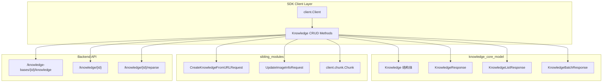

# knowledge_core_model 模块深度解析

## 模块概述：知识条目的核心数据契约

想象一下，你正在构建一个企业级知识库系统 —— 用户上传 PDF、Word 文档，或者提供一个 URL，系统需要将这些内容"消化"成可检索、可管理的知识条目。`knowledge_core_model` 模块就是这个系统中的**核心数据契约层**，它定义了"知识"在这个系统中的完整形态。

这个模块存在的根本原因是：**知识条目不是简单的文件引用，而是一个具有完整生命周期的领域实体**。它需要追踪从上传、解析、向量化到最终可用的每一个状态，需要承载丰富的元数据（文件大小、哈希值、处理状态、错误信息），还需要支持扩展（通过 `Metadata` 字段存储机器信息、路径等动态数据）。如果只用一个简单的文件路径字符串来表示知识，后续的状态追踪、错误诊断、批量操作都会变得极其困难。

`client.knowledge.Knowledge` 结构体就是这个领域实质的具象化 —— 它不仅仅是一个数据容器，更是整个知识入库流水线的**状态机载体**。从 `ParseStatus` 到 `SummaryStatus` 再到 `EnableStatus`，每一个状态字段都对应着后端处理流水线的一个阶段，这种设计让前端和 SDK 调用方能够精确地知道"我的文档现在卡在哪一步"。

---

## 架构定位与数据流



### 架构角色解析

`knowledge_core_model` 在整个 SDK 架构中扮演**领域模型层**的角色：

1. **向上游（调用方）**：提供清晰、稳定的数据结构，调用方不需要关心 HTTP 细节，只需要操作 `Knowledge` 对象
2. **向下游（HTTP 客户端）**：与 `client.client.Client` 的 `doRequest` 方法配合，将 Go 结构体序列化为 JSON，解析 API 响应
3. **横向协作**：与 `knowledge_requests_and_responses` 模块的请求结构体配合，与 `chunk_management_api` 的 `Chunk` 模型形成"文档 - 分片"的层级关系

### 数据流追踪

以创建一个知识条目为例，数据的完整流动路径是：

```
调用方 → CreateKnowledgeFromURLRequest → Client.doRequest → HTTP POST → 
后端 API → KnowledgeResponse JSON → parseResponse → Knowledge 结构体 → 调用方
```

这个过程中，`Knowledge` 结构体在两个方向上流动：
- **请求方向**：作为 `UpdateKnowledge` 方法的参数，被序列化为 JSON 发送给后端
- **响应方向**：从 `KnowledgeResponse.Data` 中反序列化出来，返回给调用方

---

## 核心组件深度解析

### Knowledge 结构体：知识条目的完整状态机

```go
type Knowledge struct {
    ID               string          `json:"id"`
    TenantID         uint64          `json:"tenant_id"`
    KnowledgeBaseID  string          `json:"knowledge_base_id"`
    TagID            string          `json:"tag_id"`
    Type             string          `json:"type"`
    Title            string          `json:"title"`
    Description      string          `json:"description"`
    Source           string          `json:"source"`
    ParseStatus      string          `json:"parse_status"`
    SummaryStatus    string          `json:"summary_status"`
    EnableStatus     string          `json:"enable_status"`
    EmbeddingModelID string          `json:"embedding_model_id"`
    FileName         string          `json:"file_name"`
    FileType         string          `json:"file_type"`
    FileSize         int64           `json:"file_size"`
    FileHash         string          `json:"file_hash"`
    FilePath         string          `json:"file_path"`
    StorageSize      int64           `json:"storage_size"`
    Metadata         json.RawMessage `json:"metadata"`
    CreatedAt        time.Time       `json:"created_at"`
    UpdatedAt        time.Time       `json:"updated_at"`
    ProcessedAt      *time.Time      `json:"processed_at"`
    ErrorMessage     string          `json:"error_message"`
}
```

#### 设计意图分析

这个结构体的字段组织遵循了**领域驱动设计**的原则，可以分为五个逻辑组：

**1. 身份与归属标识（Identity & Ownership）**
- `ID`、`TenantID`、`KnowledgeBaseID`、`TagID` 构成了知识条目的完整定位系统
- 多租户设计通过 `TenantID` 实现数据隔离，这是 SaaS 系统的标准实践
- `TagID` 的存在表明知识条目支持标签分类，但注意这里是单标签设计（不是数组），这是一个**设计约束**——如果需要多标签，需要在 `Metadata` 中扩展

**2. 内容元数据（Content Metadata）**
- `Type`、`Title`、`Description`、`Source` 描述知识的业务属性
- `FileName`、`FileType`、`FileSize`、`FileHash`、`FilePath`、`StorageSize` 描述物理文件属性
- `FileHash` 是关键设计——它用于**去重检测**，当用户上传相同文件时，后端通过哈希值判断是否已存在，返回 `ErrDuplicateFile`

**3. 处理状态机（Processing State Machine）**
- `ParseStatus`：文档解析状态（pending → processing → completed/failed）
- `SummaryStatus`：摘要生成状态（独立于解析，因为摘要是可选的后处理步骤）
- `EnableStatus`：启用状态（控制知识是否参与检索）
- `ProcessedAt`：处理完成时间（指针类型，`nil` 表示尚未处理完成）
- `ErrorMessage`：错误信息（当状态为 failed 时提供诊断信息）

这种**状态分离设计**的深层原因是：知识入库是一个多阶段异步流水线。上传完成后，后端先解析文档（提取文本、分片），然后可能生成摘要，最后进行向量化索引。每个阶段都可能失败，需要独立追踪。如果合并成一个状态字段，就无法精确诊断"解析成功了但向量化失败了"这类问题。

**4. 模型绑定（Model Binding）**
- `EmbeddingModelID` 指定用于向量化的嵌入模型
- 这个设计支持**多模型策略**——不同知识库可以使用不同的嵌入模型，便于 A/B 测试或迁移

**5. 扩展元数据（Extensible Metadata）**
- `Metadata json.RawMessage` 是最值得玩味的设计
- 使用 `json.RawMessage` 而不是 `map[string]string` 的原因是：**延迟反序列化**和**模式灵活性**
- 调用方只有在需要访问特定字段时才反序列化，避免不必要的性能开销
- 后端可以动态添加新字段而不破坏 SDK 的兼容性
- 典型用途：存储 OCR 识别的机器信息、图片路径、自定义处理参数等

#### 关键设计决策

**为什么 `ProcessedAt` 是指针类型？**

这是一个经典的"三值逻辑"设计：
- `nil`：尚未处理完成（无法区分是"正在处理"还是"从未开始"，需要结合 `ParseStatus` 判断）
- `非 nil`：处理完成的时间点

如果改用 `time.Time` 零值，就无法区分"1970-01-01 00:00:00 这个真实时间"和"未设置"。指针类型虽然增加了空指针检查的负担，但语义更清晰。

**为什么 `Metadata` 使用 `json.RawMessage`？**

这是一个**性能与灵活性的权衡**：
- 优点：避免每次访问都反序列化整个 JSON；支持任意嵌套结构；后端扩展字段不影响前端
- 缺点：调用方需要手动反序列化；类型安全性降低

替代方案对比：
| 方案 | 优点 | 缺点 |
|------|------|------|
| `map[string]string` | 类型安全，易用 | 只能存储扁平字符串；每次访问都要反序列化 |
| `map[string]interface{}` | 支持嵌套 | 类型断言繁琐；仍有反序列化开销 |
| `json.RawMessage`（当前方案） | 延迟反序列化；最大灵活性 | 需要手动处理；类型不安全 |

选择 `json.RawMessage` 反映了这个模块的设计哲学：**元数据是高度可变的，SDK 不应该对其结构做假设**。

---

### 响应结构体：统一 API 契约

```go
type KnowledgeResponse struct {
    Success bool      `json:"success"`
    Data    Knowledge `json:"data"`
    Code    string    `json:"code"`
    Message string    `json:"message"`
}

type KnowledgeListResponse struct {
    Success  bool        `json:"success"`
    Data     []Knowledge `json:"data"`
    Total    int64       `json:"total"`
    Page     int         `json:"page"`
    PageSize int         `json:"page_size"`
}

type KnowledgeBatchResponse struct {
    Success bool        `json:"success"`
    Data    []Knowledge `json:"data"`
}
```

#### 设计模式分析

这三个响应结构体遵循了**统一响应契约模式**（Uniform Response Contract），这是 RESTful API 设计的最佳实践：

1. **`Success` 字段**：快速判断请求是否成功，无需解析错误信息
2. **`Data` 字段**：承载实际业务数据，类型随操作而变化
3. **`Code` 和 `Message`**：提供机器可读和人类可读的错误信息

`KnowledgeListResponse` 额外包含分页信息（`Total`、`Page`、`PageSize`），这是列表查询的标准设计。调用方可以根据 `Total` 和 `PageSize` 计算总页数，实现前端分页控件。

**值得注意的设计细节**：`KnowledgeBatchResponse` 没有分页信息，因为批量查询是"按 ID 列表获取"，结果数量由输入决定，不需要分页。这反映了设计者对两种操作语义的清晰区分：
- `ListKnowledge`：探索性查询（我不知道有哪些知识，需要分页浏览）
- `GetKnowledgeBatch`：确定性查询（我知道要哪些 ID，直接返回）

---

### 客户端方法：领域操作的封装

#### CreateKnowledgeFromFile：文件上传的复杂性封装

```go
func (c *Client) CreateKnowledgeFromFile(ctx context.Context,
    knowledgeBaseID string, filePath string, metadata map[string]string, 
    enableMultimodel *bool, customFileName string,
) (*Knowledge, error)
```

这个方法看似简单，实则封装了多个复杂点：

**1. Multipart 表单构建**
文件上传不能使用普通的 JSON 序列化，必须使用 `multipart/form-data`。方法内部手动构建了 `multipart.Writer`，将文件和元数据字段打包。这种设计的原因是：
- 文件是二进制数据，不能直接放入 JSON
- 元数据需要序列化为 JSON 字符串后作为表单字段
- `enableMultimodel` 需要转换为字符串（`strconv.FormatBool`）

**2. 自定义文件名的支持**
`customFileName` 参数解决了**文件夹上传**的场景问题。当用户上传整个文件夹时，文件路径可能是 `/tmp/upload/doc.pdf`，但知识库中希望显示为 `folder1/folder2/doc.pdf`。通过自定义文件名，可以保留原始路径结构。

**3. 冲突处理的语义化**
```go
if resp.StatusCode == http.StatusConflict {
    // ... 解析响应
    return &response.Data, ErrDuplicateFile
}
```

这里的设计非常精妙：即使文件重复（冲突），方法仍然返回已存在的 `Knowledge` 对象，同时返回 `ErrDuplicateFile` 错误。这样做的好处是：
- 调用方可以捕获错误知道是重复文件
- 但仍然可以获取到已存在的知识条目信息（比如 ID、状态等）
- 避免了"先检查是否存在，再创建"的竞态条件

**4. 上下文传递**
方法接受 `context.Context`，支持请求超时和取消。这对于大文件上传尤其重要——调用方可以设置超时，避免无限期等待。

#### CreateKnowledgeFromURL：智能模式切换

```go
type CreateKnowledgeFromURLRequest struct {
    URL            string `json:"url"`
    FileName       string `json:"file_name,omitempty"`
    FileType       string `json:"file_type,omitempty"`
    EnableMultimodel *bool `json:"enable_multimodel,omitempty"`
    Title          string `json:"title,omitempty"`
    TagID          string `json:"tag_id,omitempty"`
}
```

这个请求结构体的设计体现了一个**智能模式切换**的架构决策：

> 当 `FileName` 或 `FileType` 被提供（或 URL 路径有已知文件扩展名如 .pdf/.docx/.doc/.txt/.md）时，服务器自动切换到文件下载模式，而不是网页爬取模式。

这意味着同一个 API 端点可以处理两种完全不同的场景：
1. **网页爬取**：URL 指向 HTML 页面，后端爬取并提取内容
2. **文件下载**：URL 指向直接可下载的文件，后端下载并解析

这种设计的优势是**API 简洁性**——调用方不需要根据 URL 类型选择不同的端点。但代价是**隐式行为**——调用方可能不知道模式切换的发生，需要阅读文档才能理解。

#### ReparseKnowledge：异步任务的触发器

```go
func (c *Client) ReparseKnowledge(ctx context.Context, knowledgeID string) (*Knowledge, error)
```

这个方法的设计揭示了一个重要的架构模式：**异步任务提交**。

方法注释明确说明："此方法删除现有文档内容并异步重新解析知识"。这意味着：
- 方法返回时，重新解析**尚未完成**
- 返回的 `Knowledge` 对象中，`ParseStatus` 会被设置为 `"pending"`
- 调用方需要轮询 `GetKnowledge` 来检查处理进度

这种设计的原因是：文档解析是耗时操作（尤其是大 PDF 或 OCR 场景），不能阻塞 HTTP 请求。使用异步任务模式，API 可以快速响应，后端在后台处理。

**调用方需要注意的隐式契约**：
```go
knowledge, err := client.ReparseKnowledge(ctx, "knowledge-id-123")
// 此时 knowledge.ParseStatus == "pending"，不是 "completed"
// 需要轮询直到状态变为 "completed" 或 "failed"
```

---

## 依赖关系分析

### 上游依赖：谁在使用这个模块

`knowledge_core_model` 是 `knowledge_and_chunk_api` 模块的核心子模块，被以下模块依赖：

1. **`knowledge_requests_and_responses`**：使用 `Knowledge` 结构体作为响应数据类型
2. **`chunk_management_api`**：`Chunk` 结构体与 `Knowledge` 形成"分片 - 文档"的层级关系
3. **`knowledge_base_api`**：知识库管理操作需要返回 `Knowledge` 列表
4. **`agent_runtime_and_tools`**：Agent 工具（如 `KnowledgeSearchTool`）需要理解知识条目的结构

### 下游依赖：这个模块依赖什么

1. **`core_client_runtime`（`client.client.Client`）**：所有方法都依赖 `Client` 的 `doRequest` 方法进行 HTTP 通信
2. **Go 标准库**：`encoding/json`、`mime/multipart`、`net/http` 等
3. **`client.chunk`**：`UpdateImageInfo` 方法操作分片级别的数据

### 数据契约

**与后端的契约**：
- 请求格式：JSON 或 `multipart/form-data`
- 响应格式：统一的 `{success, data, code, message}` 结构
- 错误码：HTTP 409 表示重复（文件/URL）

**与调用方的契约**：
- 成功时返回 `*Knowledge` 和 `nil` 错误
- 重复时返回 `*Knowledge`（已存在的条目）和 `ErrDuplicateFile`/`ErrDuplicateURL`
- 其他错误时返回 `nil` 和错误信息

---

## 设计权衡与决策

### 权衡 1：状态字段的粒度

**选择**：使用三个独立的状态字段（`ParseStatus`、`SummaryStatus`、`EnableStatus`）

**替代方案**：使用单一状态字段（如 `Status: "parsing" | "summarizing" | "enabled" | "disabled"`）

**权衡分析**：
- 当前方案的优势：可以精确表达"解析完成但摘要失败"、"解析完成但被禁用"等复合状态
- 当前方案的劣势：状态组合爆炸（3 个字段 × N 个可能值），调用方需要理解状态之间的依赖关系
- 单一状态方案的优势：简单直观
- 单一状态方案的劣势：无法表达并行处理的状态（解析和摘要可能同时进行）

**决策理由**：知识入库流水线是**多阶段且部分并行**的，独立状态字段更准确地反映了系统架构。

### 权衡 2：元数据的存储方式

**选择**：`Metadata json.RawMessage`

**替代方案**：定义具体的结构体（如 `Metadata struct { MachineInfo string; ImagePaths []string }`）

**权衡分析**：
- 当前方案的优势：后端可以动态扩展字段；SDK 不需要频繁更新
- 当前方案的劣势：类型不安全；调用方需要手动反序列化
- 具体结构体方案的优势：类型安全；IDE 自动补全
- 具体结构体方案劣势：每次新增字段都需要 SDK 更新；无法存储未知字段

**决策理由**：元数据是**高度可变且不可预测**的，使用 `json.RawMessage` 提供了最大的扩展性。

### 权衡 3：冲突处理的返回值

**选择**：冲突时返回已存在的对象 + 错误

**替代方案**：冲突时只返回错误，不返回数据

**权衡分析**：
- 当前方案的优势：调用方可以获取已存在条目的信息；避免额外的查询
- 当前方案的劣势：违反"错误时返回 nil"的 Go 惯例；调用方需要同时检查返回值和错误
- 替代方案的优势：符合 Go 惯例
- 替代方案的劣势：调用方需要再次查询获取已存在条目

**决策理由**：这是一个**实用性优先于惯例**的决策。在文件上传场景中，"获取已存在条目信息"是常见需求，避免额外查询提升了效率。

---

## 使用指南与示例

### 基本 CRUD 操作

```go
// 创建知识条目（从文件）
knowledge, err := client.CreateKnowledgeFromFile(ctx, 
    "kb-123", 
    "/path/to/doc.pdf", 
    map[string]string{"source": "manual"}, 
    nil, 
    "",
)
if errors.Is(err, client.ErrDuplicateFile) {
    // 文件已存在，knowledge 包含已存在的条目信息
    log.Printf("File exists, knowledge ID: %s", knowledge.ID)
} else if err != nil {
    log.Fatalf("Failed to create knowledge: %v", err)
}

// 创建知识条目（从 URL）
req := client.CreateKnowledgeFromURLRequest{
    URL:      "https://example.com/doc.pdf",
    FileName: "document.pdf",  // 提示后端使用文件下载模式
}
knowledge, err = client.CreateKnowledgeFromURL(ctx, "kb-123", req)

// 获取单个知识条目
knowledge, err = client.GetKnowledge(ctx, "knowledge-123")

// 批量获取
knowledges, err := client.GetKnowledgeBatch(ctx, []string{"k1", "k2", "k3"})

// 列表查询（带分页）
knowledges, total, err := client.ListKnowledge(ctx, "kb-123", 1, 20, "")

// 更新知识条目
knowledge.Title = "Updated Title"
err = client.UpdateKnowledge(ctx, knowledge)

// 删除知识条目
err = client.DeleteKnowledge(ctx, "knowledge-123")

// 重新解析
knowledge, err = client.ReparseKnowledge(ctx, "knowledge-123")
// 注意：此时知识处于 pending 状态，需要轮询
```

### 处理异步任务

```go
// 重新解析后轮询状态
knowledge, err := client.ReparseKnowledge(ctx, "knowledge-123")
if err != nil {
    log.Fatalf("Failed to submit reparse task: %v", err)
}

// 轮询直到处理完成
for knowledge.ParseStatus != "completed" && knowledge.ParseStatus != "failed" {
    time.Sleep(5 * time.Second)
    knowledge, err = client.GetKnowledge(ctx, "knowledge-123")
    if err != nil {
        log.Fatalf("Failed to get knowledge status: %v", err)
    }
}

if knowledge.ParseStatus == "failed" {
    log.Fatalf("Parse failed: %s", knowledge.ErrorMessage)
}
```

### 使用扩展元数据

```go
// 创建时设置元数据
metadata := map[string]string{
    "department": "engineering",
    "project":    "weknora",
}
knowledge, err := client.CreateKnowledgeFromFile(ctx, 
    "kb-123", "/path/to/doc.pdf", metadata, nil, "",
)

// 读取时反序列化元数据
var meta map[string]string
if err := json.Unmarshal(knowledge.Metadata, &meta); err != nil {
    log.Printf("Failed to unmarshal metadata: %v", err)
} else {
    log.Printf("Department: %s", meta["department"])
}
```

---

## 边界情况与注意事项

### 1. 文件去重的竞态条件

**问题**：两个并发请求上传相同文件，可能都通过去重检查，导致重复条目。

**现状**：后端通过 `FileHash` 检测重复，返回 409 冲突。但高并发下仍可能产生竞态。

**建议**：调用方应始终处理 `ErrDuplicateFile` 错误，不要假设上传一定成功。

### 2. 状态字段的隐式依赖

**问题**：`ParseStatus`、`SummaryStatus`、`EnableStatus` 之间存在隐式依赖关系。

**示例**：`SummaryStatus` 只有在 `ParseStatus == "completed"` 时才有意义；`EnableStatus` 只有在解析完成后才能设置为 `"enabled"`。

**建议**：调用方在检查状态时，应遵循状态依赖顺序，先检查 `ParseStatus`，再检查其他状态。

### 3. ProcessedAt 的空指针陷阱

**问题**：`ProcessedAt` 是指针类型，直接访问会导致空指针异常。

**错误示例**：
```go
// 危险！如果 ProcessedAt 为 nil 会 panic
fmt.Println(knowledge.ProcessedAt.Format(time.RFC3339))
```

**正确做法**：
```go
if knowledge.ProcessedAt != nil {
    fmt.Println(knowledge.ProcessedAt.Format(time.RFC3339))
} else {
    fmt.Println("Not processed yet")
}
```

### 4. Metadata 的反序列化责任

**问题**：`Metadata` 是 `json.RawMessage`，SDK 不负责反序列化，调用方需要自行处理。

**建议**：定义自己的元数据结构体，统一反序列化逻辑：
```go
type KnowledgeMetadata struct {
    Department string   `json:"department"`
    Project    string   `json:"project"`
    Tags       []string `json:"tags"`
}

func (k *Knowledge) GetMetadata() (*KnowledgeMetadata, error) {
    var meta KnowledgeMetadata
    if err := json.Unmarshal(k.Metadata, &meta); err != nil {
        return nil, err
    }
    return &meta, nil
}
```

### 5. 大文件上传的超时处理

**问题**：大文件上传可能耗时较长，默认超时可能不足。

**建议**：调用方应设置合适的上下文超时：
```go
ctx, cancel := context.WithTimeout(context.Background(), 30*time.Minute)
defer cancel()
knowledge, err := client.CreateKnowledgeFromFile(ctx, ...)
```

### 6. ReparseKnowledge 的异步语义

**问题**：`ReparseKnowledge` 是异步操作，返回时处理尚未完成。

**隐式契约**：
- 返回的 `Knowledge.ParseStatus` 一定是 `"pending"`
- 原有分片会被删除，重新解析完成前知识不可检索
- 如果解析失败，`ParseStatus` 变为 `"failed"`，`ErrorMessage` 包含错误信息

**建议**：始终在调用后轮询状态，不要假设重新解析会成功。

---

## 相关模块参考

- **[knowledge_requests_and_responses](knowledge_requests_and_responses.md)**：知识创建和更新的请求结构体
- **[chunk_management_api](chunk_management_api.md)**：知识分片（Chunk）的管理接口
- **[knowledge_base_api](knowledge_base_api.md)**：知识库（KnowledgeBase）的配置和管理
- **[core_client_runtime](core_client_runtime.md)**：SDK 客户端运行时，提供 `doRequest` 等基础 HTTP 功能

---

## 总结

`knowledge_core_model` 模块是整个知识管理系统的**数据契约核心**。它通过精心设计的 `Knowledge` 结构体，将复杂的知识入库流水线抽象为可操作的状态机，同时通过灵活的元数据设计支持未来的扩展。

理解这个模块的关键在于把握三个核心设计思想：
1. **状态分离**：解析、摘要、启用是独立的处理阶段，需要独立追踪
2. **延迟反序列化**：元数据使用 `json.RawMessage`，将反序列化责任交给调用方，换取最大的灵活性
3. **实用主义错误处理**：冲突时返回已存在对象，牺牲 Go 惯例换取调用方的便利

对于新加入的开发者，建议先理解 `Knowledge` 结构体的每个字段含义，再阅读客户端方法的实现，最后通过实际调用熟悉异步任务的轮询模式。
