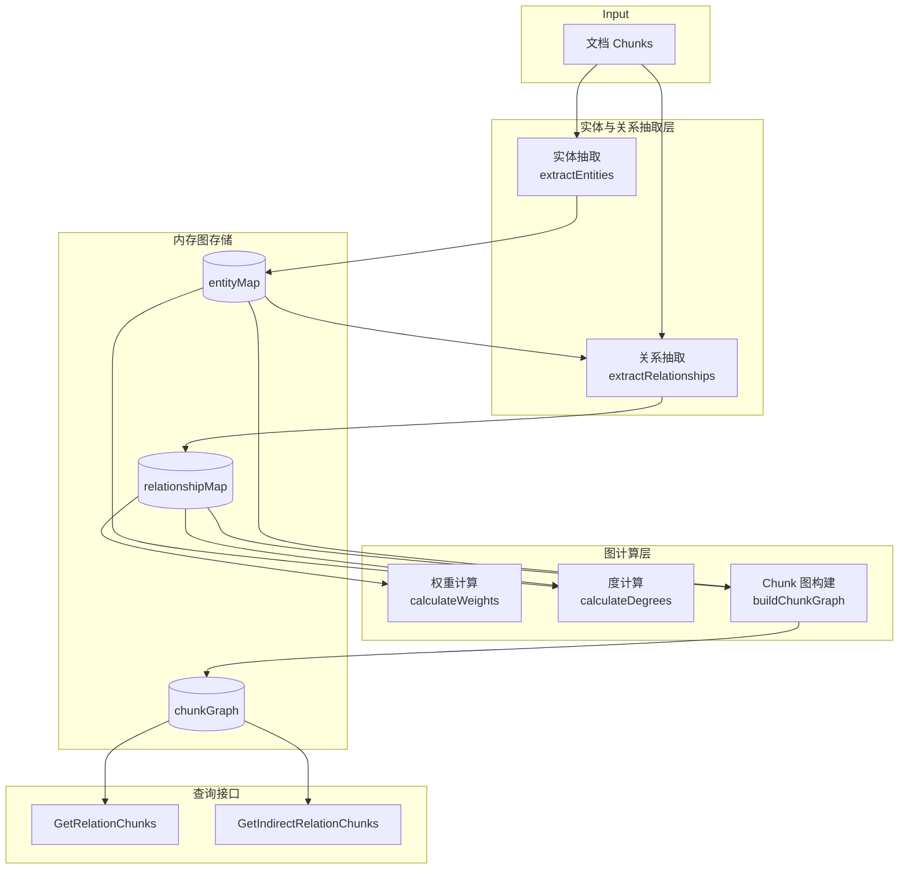

# Knowledge Graph Construction 模块深度解析

## 模块概述：为什么需要知识图谱？

想象你有一个巨大的文档库——成百上千的技术文档、产品手册、FAQ 条目。当用户问"如何配置数据库连接池"时，传统的向量检索只能找到语义相似的片段，但**无法理解文档之间的逻辑关联**。知识图谱模块解决的就是这个问题：它从非结构化文本中自动抽取**实体**（Entity）和**关系**（Relationship），构建一个结构化的语义网络，让系统能够回答"哪些文档与这个概念相关"、"这两个主题之间有什么联系"这类需要推理的问题。

这个模块的核心洞察是：**文档片段之间的关联可以通过它们共享的实体来推断**。如果两个 chunk 都提到了"Redis"和"缓存失效"这两个实体，那么它们之间很可能存在语义关联。模块通过 LLM 抽取实体和关系，然后用统计方法（PMI，点互信息）量化关系强度，最终构建出一个可用于增强检索的 chunk 级关系图。

**关键设计约束**：
- 必须处理大规模文档（并发抽取是关键）
- 关系权重需要可解释（不能是黑盒分数）
- 图结构要支持高效查询（直接关联和间接关联）

---

## 架构与数据流



### 数据流详解

1. **输入**：`[]*types.Chunk` —— 经过文档解析和分块后的文本片段，每个 chunk 包含 `ID`、`Content`、`StartAt`、`EndAt` 等元数据

2. **实体抽取阶段**（`extractEntities`）：
   - 对每个 chunk 并发调用 LLM，使用 `ExtractEntitiesPrompt` 提示模型识别文本中的关键实体
   - LLM 返回 JSON 格式的实体列表（`Title`、`Description`）
   - 模块维护 `entityMap`（按 ID 索引）和 `entityMapByTitle`（按标题去重），同一实体出现在多个 chunk 中时会累加 `Frequency` 并记录所有相关的 `ChunkIDs`

3. **关系抽取阶段**（`extractRelationships`）：
   - 将 chunk 分批（默认每批 5 个 chunk），合并批次内的实体列表
   - 调用 LLM 分析实体之间的语义关系，返回 `Source`、`Target`、`Description`、`Strength`（1-10 的强度评分）
   - 关键校验：关系两端的实体必须有**共同的 chunk** 才能建立关系（通过 `findRelationChunkIDs` 验证）
   - 关系去重：同一对实体可能在不同批次中被多次抽取，模块会合并 `ChunkIDs` 并对 `Strength` 做加权平均

4. **图计算阶段**：
   - `calculateWeights`：用 PMI + Strength 计算最终权重（详见下文设计决策）
   - `calculateDegrees`：计算每个实体的入度 + 出度，用于后续排序
   - `buildChunkGraph`：将实体级关系**投影**到 chunk 级——如果实体 A 和 B 有关系，那么所有包含 A 的 chunk 都与所有包含 B 的 chunk 建立连接

5. **查询接口**：
   - `GetRelationChunks(chunkID, topK)`：返回与给定 chunk 直接相连的 topK 个 chunk，按权重和度排序
   - `GetIndirectRelationChunks(chunkID, topK)`：返回二阶关联的 chunk（A→B→C 路径），权重会衰减

---

## 核心组件深度解析

### `graphBuilder` 结构体

```go
type graphBuilder struct {
    config           *config.Config
    entityMap        map[string]*types.Entity       // 按 ID 索引
    entityMapByTitle map[string]*types.Entity       // 按 Title 去重
    relationshipMap  map[string]*types.Relationship // Key: "Source#Target"
    chunkGraph       map[string]map[string]*ChunkRelation
    mutex            sync.RWMutex
}
```

**设计意图**：这是一个**有状态的构建器**，在单次 `BuildGraph` 调用生命周期内累积实体和关系。注意它不是线程安全的单例——每次构建新知识图谱时都会创建新的 `graphBuilder` 实例。

**关键设计点**：
- **双索引策略**：`entityMap` 用于快速 ID 查找，`entityMapByTitle` 用于去重（同一实体名称不应重复创建）
- **关系 Key 设计**：`Source#Target` 组合作为 map key，意味着关系是**有向的**（A→B 和 B→A 被视为不同关系）
- **读写锁**：实体和关系抽取是并发的，`mutex` 保护共享状态

---

### `extractEntities`：LLM 驱动的实体抽取

**方法签名**：
```go
func (b *graphBuilder) extractEntities(ctx context.Context, chunk *types.Chunk) ([]*types.Entity, error)
```

**内部机制**：
1. 构造两消息对话：system prompt（从配置加载）+ user message（chunk 内容）
2. 调用 `chatModel.Chat()`，温度设为 `0.1`（低温度保证输出稳定性）
3. 解析 JSON 响应，验证 `Title` 和 `Description` 非空
4. 加锁更新 `entityMap`：
   - 新实体：生成 UUID，`Frequency=1`，`ChunkIDs=[当前 chunk]`
   - 已存在实体：追加 `ChunkIDs`（去重），`Frequency++`

**为什么用低温度**：实体抽取需要**确定性**——同一段文本多次抽取应该得到相同的实体列表。高温度会导致实体名称不一致（如"Redis"vs"redis 缓存"），破坏后续的去重和关系构建逻辑。

**潜在问题**：
- 如果 LLM 返回的实体标题格式不一致（大小写、空格、标点），会被视为不同实体
- 空 chunk 会直接返回空列表，但不会报错（静默跳过）

---

### `extractRelationships`：关系抽取的批处理策略

**方法签名**：
```go
func (b *graphBuilder) extractRelationships(ctx context.Context, 
    chunks []*types.Chunk, entities []*types.Entity) error
```

**为什么需要批处理**：
1. **上下文窗口限制**：一次性把所有实体塞进 prompt 会超出 token 限制
2. **关系局部性**：同一批 chunk 内的实体更可能有语义关联
3. **并发效率**：多个批次可以并行处理

**关键校验逻辑**（`findRelationChunkIDs`）：
```go
// 关系两端的实体必须有共同的 chunk
relationChunkIDs := b.findRelationChunkIDs(relationship.Source, relationship.Target, entities)
if len(relationChunkIDs) == 0 {
    // 跳过这个关系
}
```

**设计权衡**：这个校验防止了"幻觉关系"——LLM 可能凭空捏造两个实体的关系，但如果它们从未在同一上下文中出现，这种关系很可能是错误的。代价是可能漏掉一些跨文档的隐含关系。

**关系合并策略**：
```go
// 加权平均更新 Strength
existingRel.Strength = (existingRel.Strength*len(existingRel.ChunkIDs) + relationship.Strength) /
    (len(existingRel.ChunkIDs) + 1)
```
这保证了多次抽取的关系强度是**可信度加权**的——在更多 chunk 中出现的关系更可靠。

---

### `calculateWeights`：PMI + Strength 的混合权重

**核心公式**：
$$
\text{PMI}(x,y) = \log_2\left(\frac{P(x,y)}{P(x) \cdot P(y)}\right)
$$

其中：
- $P(x)$ = 实体 x 出现的 chunk 数 / 总实体出现次数
- $P(x,y)$ = 关系 (x,y) 出现的 chunk 数 / 总关系出现次数

**代码实现**：
```go
pmi := math.Max(math.Log2(relProbability/(sourceProbability*targetProbability)), 0)
```

**为什么用 PMI**：
- PMI 衡量两个实体**共现的意外程度**——如果两个实体经常一起出现，PMI 值高
- 与简单共现计数相比，PMI 会**惩罚高频实体**（如"系统"、"配置"这种泛词）
- `math.Max(..., 0)` 确保 PMI 非负（负 PMI 表示两个实体倾向于不共现）

**最终权重计算**：
```go
normalizedPMI := pmi / maxPMI
normalizedStrength := float64(rel.Strength) / maxStrength
combinedWeight := normalizedPMI*PMIWeight + normalizedStrength*StrengthWeight
scaledWeight := 1.0 + WeightScaleFactor*combinedWeight  // 缩放到 1-10 范围
```

**常量定义**：
```go
PMIWeight = 0.6      // PMI 占 60%
StrengthWeight = 0.4 // LLM 评分占 40%
WeightScaleFactor = 9.0  // 将 0-1 映射到 1-10
```

**设计权衡**：
- **PMI vs Strength**：PMI 是统计信号（客观），Strength 是语义信号（主观）。60/40 的权重分配反映了对统计证据的偏好
- **缩放因子**：1-10 的范围便于人类理解和调试，但不是必须的
- **潜在问题**：PMI 对低频实体敏感——如果某个实体只出现 1-2 次，PMI 可能异常高

---

### `buildChunkGraph`：从实体图到 Chunk 图的投影

**核心逻辑**：
```go
for _, rel := range b.relationshipMap {
    sourceEntity := b.entityMapByTitle[rel.Source]
    targetEntity := b.entityMapByTitle[rel.Target]
    
    // 实体 A 的所有 chunk 与实体 B 的所有 chunk 建立连接
    for _, sourceChunkID := range sourceEntity.ChunkIDs {
        for _, targetChunkID := range targetEntity.ChunkIDs {
            b.chunkGraph[sourceChunkID][targetChunkID] = &ChunkRelation{
                Weight: rel.Weight,
                Degree: rel.CombinedDegree,
            }
        }
    }
}
```

**为什么需要 Chunk 图**：
- 检索的最小单位是 chunk，不是实体
- 用户查询"Redis 缓存配置"时，系统需要找到相关的 chunk，然后通过图找到**语义相邻**的 chunk 作为补充上下文

**图结构特点**：
- **无向图**：`chunkGraph[A][B]` 和 `chunkGraph[B][A]` 指向同一个 `ChunkRelation` 对象
- **稠密连接**：如果实体 A 出现在 5 个 chunk 中，实体 B 出现在 3 个 chunk 中，会建立 15 条边（5×3）

**潜在性能问题**：对于高频实体（如"系统"出现在 100 个 chunk 中），会产生大量边。实际应用中可能需要设置实体频率阈值来过滤泛词。

---

### `GetIndirectRelationChunks`：二阶关联查询

**算法思路**：
1. 找到所有直接关联的 chunk（一阶邻居）
2. 对每个一阶邻居，找到它的直接关联 chunk（二阶邻居）
3. 排除原始 chunk 和所有一阶邻居
4. 权重衰减：`combinedWeight = weight1 * weight2 * IndirectRelationWeightDecay`

**权重衰减的意义**：
```go
IndirectRelationWeightDecay = 0.5
```
二阶关系的可信度应该低于一阶关系——A→B→C 的关联强度天然弱于 A→B。0.5 的衰减系数是经验值，意味着二阶关系的权重最多是一阶关系的 50%（假设两条边的权重都是 10，则 10×10×0.5 = 50，归一化后约为 5）。

**应用场景**：
- 用户查询的 chunk 没有直接答案，但二阶关联的 chunk 可能包含相关信息
- 用于扩展检索结果的多样性

---

## 依赖关系分析

### 上游依赖（谁调用它）

根据模块树，`graphBuilder` 被以下模块使用：

1. **[knowledge_ingestion_orchestration](knowledge_ingestion_orchestration.md)** —— `knowledgeService` 在文档导入流程中调用 `BuildGraph` 构建知识图谱
2. **[retrieval_and_web_search_services](retrieval_and_web_search_services.md)** —— 检索引擎可能调用 `GetRelationChunks` 获取相关 chunk 增强检索结果

### 下游依赖（它调用谁）

1. **[chat_completion_backends_and_streaming](chat_completion_backends_and_streaming.md)** —— `chatModel.Chat()` 用于实体和关系抽取
2. **[config](config.md)** —— 从 `config.Conversation.ExtractEntitiesPrompt` 和 `ExtractRelationshipsPrompt` 加载提示词
3. **[types](types.md)** —— 依赖 `Entity`、`Relationship`、`Chunk` 等核心数据类型

### 数据契约

**输入契约**（`BuildGraph` 参数）：
```go
func BuildGraph(ctx context.Context, chunks []*types.Chunk) error
```
- `chunks` 必须是非空切片
- 每个 chunk 的 `Content` 字段应有实际文本（空内容会静默跳过）
- `StartAt` 和 `EndAt` 用于 chunk 内容合并时的重叠检测

**输出契约**（图状态）：
- 调用 `GetAllEntities()` 和 `GetAllRelationships()` 可获取构建结果
- 图状态存储在内存中，**不会持久化**——每次服务重启需要重新构建

---

## 设计决策与权衡

### 1. 内存图 vs 持久化图

**当前选择**：图结构完全存储在内存（`map[string]...`）

**优点**：
- 查询速度快（无 I/O 开销）
- 实现简单（无需考虑图数据库的 schema 和查询语言）

**缺点**：
- 服务重启后图丢失，需要重新构建
- 内存占用随文档量增长（大规模场景可能成为瓶颈）

**扩展建议**：如果需要持久化，可考虑：
- 将实体和关系写入 Neo4j（已有 `Neo4jRepository` 可用）
- 使用 Redis Graph 做缓存层

### 2. 有向关系 vs 无向关系

**当前选择**：关系是有向的（`Source#Target` 作为 key），但 chunk 图是无向的

**原因**：
- 实体关系有语义方向（如"Redis **用于** 缓存"vs"缓存 **依赖** Redis"）
- chunk 关联不需要方向——如果 chunk A 和 B 共享实体，它们就是相关的

### 3. 并发策略

**实体抽取**：`MaxConcurrentEntityExtractions = 4`
**关系抽取**：`MaxConcurrentRelationExtractions = 4`

**为什么限制并发**：
- 避免同时发送太多 LLM 请求导致速率限制
- 控制内存占用（每个 goroutine 持有 chunk 和实体数据）

**调优建议**：
- 如果 LLM 服务支持高并发，可提高限制
- 如果 chunk 很大（>10KB），应降低并发避免 OOM

### 4. 批处理大小

**当前选择**：`DefaultRelationBatchSize = 5`

**权衡**：
- 批次太小：LLM 调用次数多，开销大
- 批次太大：prompt 可能超出 token 限制，且关系抽取质量下降（实体太多导致注意力分散）

**经验法则**：每个 batch 的实体数控制在 20-50 个之间效果较好

---

## 使用示例与配置

### 基本使用流程

```go
// 1. 创建 graphBuilder
builder := NewGraphBuilder(config, chatModel)

// 2. 构建图谱
chunks := getChunksFromKnowledgeBase(kbID)
err := builder.BuildGraph(ctx, chunks)
if err != nil {
    log.Error("Graph build failed", err)
}

// 3. 查询相关 chunk
relatedChunks := builder.GetRelationChunks(targetChunkID, 10)
indirectChunks := builder.GetIndirectRelationChunks(targetChunkID, 5)

// 4. 获取实体和关系（用于调试或展示）
entities := builder.GetAllEntities()
relationships := builder.GetAllRelationships()
```

### 配置项

在 `config.Config.Conversation` 中配置：

```go
type ConversationConfig struct {
    ExtractEntitiesPrompt     string  // 实体抽取 system prompt
    ExtractRelationshipsPrompt string // 关系抽取 system prompt
}
```

**实体抽取 Prompt 示例**：
```
你是一个知识图谱构建助手。请从以下文本中提取关键实体。
每个实体应包含：
- title: 实体名称（简洁、标准化）
- description: 实体描述（1-2 句话）

以 JSON 数组格式返回，例如：
[{"title": "Redis", "description": "内存数据库，用于缓存"}, ...]
```

**关系抽取 Prompt 示例**：
```
给定以下实体列表和文本，请识别实体之间的语义关系。
每个关系应包含：
- source: 源实体标题
- target: 目标实体标题
- description: 关系描述
- strength: 关系强度（1-10，10 表示最强）

以 JSON 数组格式返回。
```

---

## 边界情况与注意事项

### 1. 空 chunk 处理

```go
if chunk.Content == "" {
    log.Warn("Empty chunk content, skipping entity extraction")
    return []*types.Entity{}, nil
}
```
**行为**：静默跳过，不报错
**影响**：如果大量 chunk 为空，图谱会稀疏
**建议**：在调用 `BuildGraph` 前过滤空 chunk

### 2. 实体去重的局限性

当前去重仅基于 `Title` 精确匹配：
```go
if existEntity, exists := b.entityMapByTitle[entity.Title]; !exists {
    // 新实体
}
```

**问题**：
- "Redis" 和 "redis" 会被视为不同实体
- "Redis 缓存" 和 "Redis-缓存" 会被视为不同实体

**改进方向**：
- 归一化实体标题（转小写、去空格、去标点）
- 使用嵌入相似度做模糊去重

### 3. 关系抽取失败的处理

```go
err := b.extractRelationships(relGctx, batch.batchChunks, batch.relationUseEntities)
if err != nil {
    log.WithError(err).Errorf("Failed to extract relationships for batch %d", batch.batchIndex+1)
}
return nil // 即使失败也继续处理其他批次
```

**设计意图**：单个批次失败不影响整体流程
**风险**：可能丢失重要关系
**建议**：监控失败率，如果超过阈值应告警

### 4. 内存泄漏风险

`graphBuilder` 持有所有实体和关系的引用，如果长时间不释放会导致内存增长。

**最佳实践**：
- `BuildGraph` 完成后，如不再需要图，应让 `builder` 超出作用域
- 不要在全局变量中长期持有 `graphBuilder` 引用

### 5. 可视化输出的用途

```go
mermaidDiagram := b.generateKnowledgeGraphDiagram(ctx)
log.Info(mermaidDiagram)
```

**用途**：调试和人工审核
**注意**：Mermaid 图仅包含实体和关系，不包含 chunk 信息
**限制**：实体数量过多时图会过于复杂，建议限制在 50 个实体以内

---

## 性能优化建议

### 1. 实体频率过滤

在 `extractEntities` 后添加：
```go
// 过滤低频实体（只出现 1 次的实体可能是噪声）
if entity.Frequency < 2 {
    continue
}
```

### 2. 关系权重缓存

如果图谱不频繁更新，可缓存 `calculateWeights` 的结果：
```go
type CachedRelation struct {
    ID     string
    Weight float64
}
```

### 3. Chunk 图稀疏化

对于高频实体，限制其连接的 chunk 数量：
```go
const MaxChunkConnectionsPerEntity = 20
// 只连接最近的 20 个 chunk（按位置或相关性排序）
```

---

## 相关模块参考

- [knowledge_ingestion_orchestration](knowledge_ingestion_orchestration.md) —— 文档导入流程，调用 `BuildGraph`
- [retrieval_and_web_search_services](retrieval_and_web_search_services.md) —— 检索服务，可能使用图增强检索
- [chat_completion_backends_and_streaming](chat_completion_backends_and_streaming.md) —— LLM 后端，提供实体/关系抽取能力
- [types](types.md) —— 核心数据类型定义（`Entity`、`Relationship`、`Chunk`）
