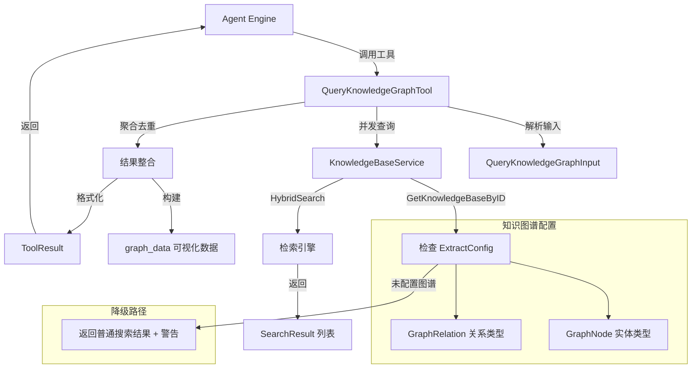

# knowledge_graph_navigation_querying 模块技术深度解析

## 模块概述：为什么需要知识图谱查询工具

想象一下，你正在构建一个智能问答系统，用户问的是"Docker 和 Kubernetes 之间有什么关系？"。如果只用传统的关键词搜索或向量检索，你得到的可能是一堆提到这两个词的文档片段，但**关系本身**是隐含的、需要读者自己拼凑的。

`knowledge_graph_navigation_querying` 模块的核心价值在于：它让 Agent 能够**显式地探索实体之间的关系网络**，而不仅仅是检索包含某些关键词的文本。这个模块实现了 `QueryKnowledgeGraphTool` —— 一个专门用于查询知识图谱的工具，它使 Agent 能够理解概念之间的关联结构，而不仅仅是语义相似性。

**关键设计洞察**：这个工具的独特之处在于它采用了**渐进式降级策略**。如果知识库没有配置图谱抽取，它不会直接报错，而是退化为普通混合搜索并明确告知用户这一限制。这种设计体现了"可用优先"的工程哲学 —— 在理想功能不可用时，提供一个有用的降级方案，而不是直接失败。

---

## 架构与数据流



### 架构角色定位

这个模块在系统中扮演**图谱查询网关**的角色：

1. **输入层**：接收 Agent 的查询请求（知识库 ID 列表 + 查询文本）
2. **验证层**：并发检查每个知识库的图谱配置状态
3. **执行层**：对已配置图谱的知识库执行混合搜索
4. **聚合层**：跨知识库去重、排序、格式化
5. **输出层**：同时生成人类可读文本和结构化数据（供前端可视化）

### 数据流追踪

以一次典型的图谱查询为例：

1. **Agent 发起调用**：Agent Engine 调用 `QueryKnowledgeGraphTool.Execute()`，传入 JSON 编码的参数
2. **参数解析**：工具解析出 `QueryKnowledgeGraphInput`，包含 `KnowledgeBaseIDs`（最多 10 个）和 `Query`
3. **并发检查**：为每个 KB 启动一个 goroutine，调用 `KnowledgeBaseService.GetKnowledgeBaseByID()` 获取配置
4. **图谱验证**：检查 `ExtractConfig.Nodes` 和 `ExtractConfig.Relations` 是否非空
5. **执行搜索**：对已配置图谱的 KB 调用 `HybridSearch()`（向量 + 关键词混合检索）
6. **结果聚合**：使用 `sync.Mutex` 保护共享 map，收集所有结果
7. **去重排序**：按 `SearchResult.ID` 去重，按 `Score` 降序排序
8. **构建输出**：生成格式化文本和 `graph_data` 结构
9. **返回 ToolResult**：包含 `Success`、`Output`（文本）、`Data`（结构化数据）

---

## 核心组件深度解析

### QueryKnowledgeGraphInput：查询契约

```go
type QueryKnowledgeGraphInput struct {
    KnowledgeBaseIDs []string `json:"knowledge_base_ids"`
    Query            string   `json:"query"`
}
```

**设计意图**：这个结构体定义了工具与调用者之间的**最小契约**。它刻意保持简单，只包含两个必填字段：

- `KnowledgeBaseIDs`：数组形式，支持跨知识库查询，但限制最多 10 个（防止资源耗尽）
- `Query`：可以是实体名称、关系查询或概念描述，工具不做语法限制

**为什么没有图查询语言（如 Cypher）？** 代码注释明确说明"完整的图查询语言（Cypher）支持开发中"。当前设计选择了一个务实的中间方案：用自然语言查询，后端通过混合搜索近似图查询。这降低了使用门槛，但牺牲了查询的精确性 —— 这是一个典型的**易用性 vs. 表达能力**的权衡。

### QueryKnowledgeGraphTool：执行引擎

```go
type QueryKnowledgeGraphTool struct {
    BaseTool
    knowledgeService interfaces.KnowledgeBaseService
}
```

#### 核心方法：Execute

`Execute` 方法是工具的执行入口，遵循标准的工具执行协议：接收 `context.Context` 和 `json.RawMessage`，返回 `*types.ToolResult`。

**关键执行逻辑**：

1. **参数验证**：
   - 检查 `KnowledgeBaseIDs` 非空且不超过 10 个
   - 检查 `Query` 非空
   - 验证失败时返回 `Success: false` 并附带错误信息

2. **并发查询模式**：
   ```go
   type graphQueryResult struct {
       kbID    string
       kb      *types.KnowledgeBase
       results []*types.SearchResult
       err     error
   }
   ```
   使用 `sync.WaitGroup` + `sync.Mutex` 的经典并发模式。每个 KB 独立查询，结果存入受保护的 map。这种设计**最大化吞吐量**，但增加了错误处理的复杂度 —— 部分 KB 可能失败，而其他成功。

3. **图谱配置检查**：
   ```go
   if kb.ExtractConfig == nil || (len(kb.ExtractConfig.Nodes) == 0 && len(kb.ExtractConfig.Relations) == 0) {
       // 未配置图谱
   }
   ```
   这是模块的**核心判断逻辑**。只有当 `ExtractConfig` 包含至少一个节点类型或关系类型时，才认为 KB 支持图谱查询。否则，记录错误但继续处理其他 KB。

4. **混合搜索调用**：
   ```go
   searchParams := types.SearchParams{
       QueryText:  query,
       MatchCount: 10,
   }
   results, err := t.knowledgeService.HybridSearch(ctx, id, searchParams)
   ```
   注意这里调用的是 `HybridSearch` 而非专门的图查询接口。这意味着**当前实现实际上是语义搜索，而非真正的图遍历**。图谱配置的作用更多是"标记"哪些 KB 经过了实体关系抽取，而非启用不同的查询算法。

5. **结果去重与排序**：
   ```go
   seenChunks := make(map[string]*types.SearchResult)
   // ... 按 ID 去重
   sort.Slice(allResults, func(i, j int) bool {
       return allResults[i].Score > allResults[j].Score
   })
   ```
   跨 KB 去重基于 `SearchResult.ID`（即 chunk ID），因为同一文档可能被导入到多个 KB。排序确保最相关的结果优先展示。

6. **输出格式化**：
   - 生成人类可读的文本报告（包含图谱配置状态、结果计数、详细内容）
   - 构建 `graph_data` 结构化数据（节点列表、边列表，供前端可视化）
   - 返回 `ToolResult`，同时包含 `Output` 和 `Data`

#### 依赖注入模式

```go
func NewQueryKnowledgeGraphTool(knowledgeService interfaces.KnowledgeBaseService) *QueryKnowledgeGraphTool
```

构造函数采用**依赖注入**，将 `KnowledgeBaseService` 作为参数传入。这种设计：
- **便于测试**：可以传入 mock 实现
- **解耦**：工具不直接依赖具体实现，只依赖接口
- **灵活**：未来可以轻松替换底层服务实现

---

## 依赖关系分析

### 上游调用者

| 调用者 | 依赖关系 | 期望行为 |
|--------|----------|----------|
| `AgentEngine` | 直接调用 `Execute()` | 返回结构化的 `ToolResult`，包含查询结果和图谱元数据 |
| `ToolRegistry` | 注册工具实例 | 工具符合 `BaseTool` 协议，有名称、描述、Schema |

### 下游被调用者

| 被调用者 | 调用方式 | 数据契约 |
|----------|----------|----------|
| `KnowledgeBaseService.GetKnowledgeBaseByID()` | 并发调用 | 返回 `*KnowledgeBase`，包含 `ExtractConfig` |
| `KnowledgeBaseService.HybridSearch()` | 并发调用 | 返回 `[]*SearchResult`，按相关性排序 |
| `BaseTool` | 嵌入 | 提供 `name`、`description`、`schema` 元数据 |

### 关键数据契约

**输入契约**（`QueryKnowledgeGraphInput`）：
```json
{
  "knowledge_base_ids": ["kb-123", "kb-456"],
  "query": "Docker 和 Kubernetes 的关系"
}
```

**输出契约**（`ToolResult.Data`）：
```json
{
  "knowledge_base_ids": ["kb-123", "kb-456"],
  "query": "Docker 和 Kubernetes 的关系",
  "results": [...],
  "count": 15,
  "kb_counts": {"kb-123": 10, "kb-456": 5},
  "graph_configs": {...},
  "graph_data": {"nodes": [...], "edges": []},
  "has_graph_config": true,
  "errors": [],
  "display_type": "graph_query_results"
}
```

**隐式契约**：
- `KnowledgeBaseService` 必须保证 `GetKnowledgeBaseByID` 在 KB 不存在时返回错误
- `HybridSearch` 返回的结果必须包含有效的 `Score` 和 `ID` 字段
- 调用者必须处理部分失败的情况（某些 KB 可能未配置图谱）

---

## 设计决策与权衡

### 1. 混合搜索 vs. 真正图查询

**选择**：当前实现使用 `HybridSearch`（向量 + 关键词）而非图数据库的原生查询语言（如 Cypher）。

**原因**：
- **开发进度**：注释明确说明"完整的图查询语言（Cypher）支持开发中"
- **基础设施依赖**：真正的图查询需要 Neo4j 等图数据库支持，而当前系统可能使用向量数据库模拟
- **使用门槛**：自然语言查询比 Cypher 更易用，适合非技术用户

**代价**：
- **查询精度**：无法表达复杂的图模式（如"找出所有与 A 有 2 度关系的节点"）
- **性能**：混合搜索可能扫描更多数据，而图遍历可以精确定位

**未来演进**：当 `RetrieveGraphRepository` 接口成熟后，可以在此工具中增加图查询分支，根据 KB 配置选择查询策略。

### 2. 并发查询 vs. 顺序查询

**选择**：使用 goroutine 并发查询所有 KB。

**原因**：
- **延迟优化**：10 个 KB 的查询可以并行执行，总延迟接近单个查询的延迟
- **用户体验**：Agent 响应更快，减少等待时间

**代价**：
- **资源消耗**：同时打开多个数据库连接，可能增加系统负载
- **错误处理复杂度**：需要收集所有错误并在最终输出中报告，而不是遇到第一个错误就失败

**限制**：通过限制最多 10 个 KB 来控制并发度，防止资源耗尽。

### 3. 降级策略 vs. 严格失败

**选择**：当 KB 未配置图谱时，返回普通搜索结果并附带警告，而非直接报错。

**原因**：
- **用户体验**：用户仍然获得相关信息，只是图谱功能不可用
- **渐进式增强**：系统可以在不破坏现有功能的前提下逐步启用图谱功能

**代价**：
- **语义模糊**：调用者需要检查 `has_graph_config` 字段来判断结果质量
- **调试困难**：部分失败的情况比完全失败更难排查

### 4. 双重输出格式

**选择**：同时生成 `Output`（人类可读文本）和 `Data`（结构化数据）。

**原因**：
- **多场景支持**：文本用于直接展示，结构化数据用于前端可视化或进一步处理
- **关注点分离**：Agent 可以选择直接使用文本，或解析 `Data` 自定义展示

**代价**：
- **代码重复**：格式化逻辑需要维护两份（文本和结构化）
- **一致性风险**：如果修改输出格式，需要同步更新两处

---

## 使用指南与示例

### 基本使用

```go
// 创建工具实例
tool := NewQueryKnowledgeGraphTool(knowledgeBaseService)

// 准备输入
input := QueryKnowledgeGraphInput{
    KnowledgeBaseIDs: []string{"kb-123", "kb-456"},
    Query: "微服务架构中的服务发现机制",
}

// 执行查询
inputJSON, _ := json.Marshal(input)
result, err := tool.Execute(ctx, inputJSON)

// 处理结果
if result.Success {
    fmt.Println(result.Output)  // 人类可读文本
    graphData := result.Data["graph_data"]  // 结构化数据
}
```

### Agent 工具调用示例

在 Agent 的对话流程中，工具调用是自动的：

```
用户：帮我分析一下 Docker 和 Kubernetes 的关系

Agent（思考）：我需要查询知识图谱来了解这两个实体之间的关系
Agent（工具调用）：query_knowledge_graph({
  "knowledge_base_ids": ["kb-tech-001"],
  "query": "Docker Kubernetes 关系"
})

工具返回：=== 知识图谱查询 ===
📊 查询：Docker Kubernetes 关系
🎯 目标知识库：[kb-tech-001]
✓ 找到 8 条相关结果（已去重）
...

Agent（回答）：根据知识图谱，Docker 和 Kubernetes 的关系是...
```

### 配置要求

要使图谱查询生效，知识库必须配置 `ExtractConfig`：

```json
{
  "extract_config": {
    "enabled": true,
    "nodes": [
      {"name": "Technology", "attributes": ["description", "version"]},
      {"name": "Tool", "attributes": ["purpose"]}
    ],
    "relations": [
      {"node1": "Technology", "node2": "Tool", "type": "uses"}
    ]
  }
}
```

---

## 边界情况与注意事项

### 1. 部分失败的 KB 查询

**场景**：查询 5 个 KB，其中 2 个未配置图谱，1 个不存在，2 个成功。

**行为**：工具返回 `Success: true`，但在 `Output` 和 `Data.errors` 中列出失败的 KB。

**处理建议**：调用者应检查 `errors` 数组，而不是仅依赖 `Success` 字段。

### 2. 空结果处理

**场景**：所有 KB 都配置了图谱，但没有匹配的结果。

**行为**：返回 `Success: true`，`Output` 为"未找到相关的图谱信息。"，`results` 为空数组。

**注意**：这不是错误，而是正常的"无结果"状态。

### 3. 跨 KB 去重逻辑

**场景**：同一文档被导入到多个 KB，产生相同的 chunk ID。

**行为**：按 `SearchResult.ID` 去重，只保留第一次出现的结果。

**潜在问题**：如果不同 KB 对同一文档有不同的处理（如不同的 chunking 策略），可能丢失信息。

### 4. 并发安全性

**实现**：使用 `sync.Mutex` 保护 `kbResults` map。

**注意**：不要移除 Mutex，即使看起来每个 goroutine 写入不同的 key —— Go 的 map 在并发读写时可能 panic。

### 5. 性能考虑

**限制**：最多 10 个 KB，每个 KB 最多 10 条结果（`MatchCount: 10`）。

**原因**：防止单次查询消耗过多资源。

**扩展建议**：如果需要支持更多 KB，考虑分页或流式处理。

### 6. 图谱配置检查的局限性

**当前逻辑**：只检查 `ExtractConfig.Nodes` 和 `Relations` 是否非空。

**潜在问题**：配置了节点类型，但实际数据中没有抽取到任何实体，查询结果与普通搜索无异。

**改进方向**：可以检查图谱中实际存在的实体数量，而不仅仅是配置。

---

## 相关模块参考

- [agent_core_orchestration_and_tooling_foundation](agent_core_orchestration_and_tooling_foundation.md)：Agent 引擎和工具注册机制
- [knowledge_access_and_corpus_navigation_tools](knowledge_access_and_corpus_navigation_tools.md)：其他知识访问工具（如 `knowledge_search`、`list_knowledge_chunks`）
- [knowledge_ingestion_extraction_and_graph_services](knowledge_ingestion_extraction_and_graph_services.md)：知识图谱构建和抽取服务
- [retrieval_and_web_search_services](retrieval_and_web_search_services.md)：混合搜索引擎实现

---

## 总结

`knowledge_graph_navigation_querying` 模块是一个**务实的图谱查询工具实现**。它在理想（真正的图查询）和现实（混合搜索降级）之间找到了平衡点，通过并发处理、优雅降级和双重输出格式，为 Agent 提供了一个可用的关系探索能力。

**核心设计哲学**：
1. **可用优先**：即使图谱未配置，也提供有用的降级结果
2. **并发优化**：最大化查询吞吐量，限制并发度防止资源耗尽
3. **双重输出**：同时服务人类用户和程序化处理
4. **渐进增强**：为未来的真正图查询预留演进空间

对于新贡献者，理解这个模块的关键是认识到它**当前是语义搜索的封装，而非真正的图遍历** —— 这是一个过渡性设计，为未来的图查询能力奠定基础。
