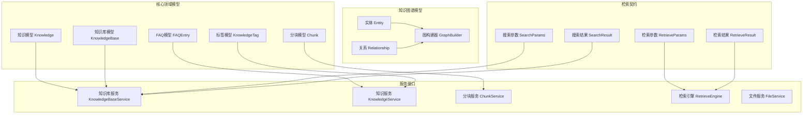

# 知识图谱检索与内容契约模块

## 模块概述

这个模块是整个系统的**核心数据契约层**，它定义了知识管理、检索和内容处理的所有核心数据结构和接口协议。想象它是系统的"通用语言词典"——所有其他模块都通过这些定义进行对话，确保数据在整个系统中保持一致和可理解。

**核心价值**：
- 提供统一的领域模型，避免数据结构碎片化
- 定义清晰的服务接口契约，实现模块间的松耦合
- 封装知识图谱、文档分块、FAQ管理等核心概念的抽象

## 架构概览

这个模块的架构遵循**领域驱动设计（DDD）**的思想，将核心概念清晰地划分为：
1. **领域模型**：表示核心业务实体
2. **服务接口**：定义对这些实体的操作契约
3. **数据传输对象**：用于模块间通信的 payload 结构

## 核心设计决策

### 1. 统一的数据契约 vs 分散的定义
**决策**：将所有核心数据结构集中在一个模块中定义。
**原因**：避免"数据结构方言"问题——如果每个模块都定义自己的版本，数据转换和同步将成为噩梦。
**权衡**：这个模块会被许多其他模块依赖，因此需要保持API稳定性，变更时要格外谨慎。

### 2. 接口优先的设计
**决策**：使用 Go 接口定义服务契约，而不是直接暴露实现。
**原因**：这使得我们可以轻松地替换实现（例如从 PostgreSQL 切换到 Elasticsearch）而不影响上层业务逻辑。
**示例**：`KnowledgeBaseRepository` 接口允许多种存储后端实现。

### 3. 多租户隔离的设计
**决策**：几乎所有数据结构都包含 `TenantID` 字段。
**原因**：这是一个 SaaS 系统，多租户隔离是核心需求。在数据结构层面强制要求 TenantID 可以防止数据泄漏。
**权衡**：这增加了查询的复杂性，但安全性收益大于成本。

### 4. 分块（Chunk）作为检索原子单位
**决策**：将文档分割为 Chunk 作为最小的检索和索引单元。
**原因**：完整文档通常太长，不适合语义检索。Chunk 提供了粒度适中的内容片段，可以精确定位信息。
**设计细节**：
- 每个 Chunk 维护与原始文档的位置关系（`StartAt`、`EndAt`）
- Chunk 之间通过 `PreChunkID`、`NextChunkID` 保持上下文连续性
- 支持多种 Chunk 类型（文本、摘要、实体、关系、FAQ等）

### 5. FAQ 内容的特殊处理
**决策**：FAQ 内容被建模为特殊类型的 Chunk，有自己的元数据结构。
**原因**：FAQ 有独特的语义结构（标准问题+相似问题+答案），需要专门的索引和检索策略。
**设计亮点**：
- `FAQChunkMetadata` 封装了 FAQ 的语义结构
- `CalculateFAQContentHash` 用于内容去重和变更检测
- 支持多种索引模式（仅索引问题 vs 索引问题+答案）

## 子模块概览

本模块包含以下子模块，每个子模块负责特定的功能领域：

### 1. [文档提取与图谱管道契约](core_domain_types_and_interfaces-knowledge_graph_retrieval_and_content_contracts-document_extraction_and_graph_pipeline_contracts.md)
负责知识提取、图谱构建和异步任务的 payload 定义。包含图数据结构、异步任务契约和知识提取管道的核心抽象。

### 2. [知识与知识库领域模型](knowledge_and_knowledgebase_domain_models.md)
定义知识和知识库的核心数据结构，包括配置管理、多模态处理配置、存储配置等。这是整个系统知识管理的基础。

### 3. [FAQ 内容与导入契约](core_domain_types_and_interfaces-knowledge_graph_retrieval_and_content_contracts-faq_content_and_import_contracts.md)
专门处理 FAQ 内容的导入、验证和管理。包含 FAQ 条目的数据结构、导入流程、去重机制和批量操作支持。

### 4. [检索引擎与搜索契约](retrieval_engine_and_search_contracts.md)
定义检索引擎的接口和数据交换格式。支持多种检索类型（向量、关键词、混合），并提供统一的检索结果抽象。

### 5. [知识标签契约](knowledge_tagging_contracts.md)
处理知识分类和标签管理。标签是知识库范围内的分类系统，用于组织和过滤知识内容。

### 6. [内容服务与仓储接口](content_service_and_repository_interfaces.md)
定义所有内容相关的服务和仓储接口。这是业务逻辑和数据持久化之间的契约层，支持多种实现替换。

## 跨模块依赖

这个模块是整个系统的**基础设施层**，它被几乎所有其他模块依赖：

### 被依赖模块
- **[data_access_repositories](../data_access_repositories.md)**：实现本模块定义的仓储接口
- **[application_services_and_orchestration](../application_services_and_orchestration.md)**：使用本模块的服务接口执行业务逻辑
- **[http_handlers_and_routing](../http_handlers_and_routing.md)**：使用本模块的数据结构进行 API 输入输出
- **[agent_runtime_and_tools](../agent_runtime_and_tools.md)**：通过本模块的接口访问知识库内容

### 依赖关系特点
- **单向依赖**：其他模块依赖本模块，但本模块不依赖任何其他业务模块
- **接口隔离**：依赖方只依赖接口，不依赖具体实现
- **数据一致性**：全系统使用相同的数据结构定义

## 新贡献者指南

### 常见陷阱
1. **不要随意修改核心数据结构**：`Knowledge`、`Chunk`、`KnowledgeBase` 等结构体被广泛使用，变更可能导致连锁反应。
2. **注意多租户隔离**：任何查询操作都应该包含 `TenantID` 过滤。
3. **JSON 字段的兼容性**：当修改 `Metadata` 等 JSON 字段的结构时，要确保向前和向后兼容性。
4. **Chunk 类型的语义**：不同 Chunk 类型有不同的语义，不要混用。

### 扩展点
1. **实现新的检索引擎**：通过实现 `RetrieveEngine` 接口可以添加新的检索后端。
2. **添加新的 Chunk 类型**：通过扩展 `ChunkType` 常量和相应的处理逻辑可以支持新的内容类型。
3. **自定义图构建策略**：通过实现 `GraphBuilder` 接口可以自定义知识图谱的构建方式。

### 调试技巧
1. **检查 ContentHash**：FAQ 去重问题通常与 `ContentHash` 计算有关。
2. **验证 Chunk 链接**：检索结果不连贯时，检查 `PreChunkID` 和 `NextChunkID` 是否正确设置。
3. **查看元数据**：许多行为是由 `Metadata` 字段控制的，检查其内容可以解释很多"奇怪"行为。
