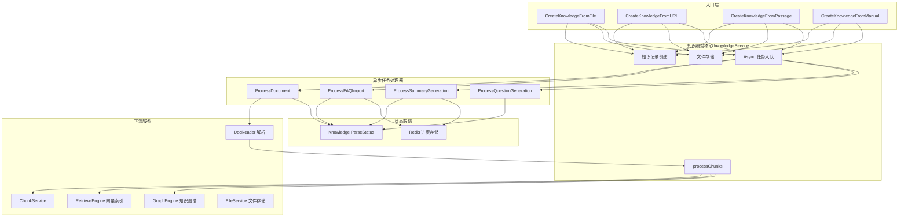

# knowledge_ingestion_orchestration 模块深度解析

## 模块概述：知识工厂的中央调度器

想象一个现代化的物流分拣中心：包裹（原始文档）从四面八方涌入，经过扫描、分类、拆包、贴标，最终被整齐地码放到货架上供后续检索。`knowledge_ingestion_orchestration` 模块正是这样一个**知识工厂的中央调度器**——它负责将各种来源的原始内容（文件、URL、文本段落、手工录入）转化为可检索、可向量化、可推理的结构化知识。

这个模块存在的根本原因是：**知识入库不是简单的"存储"，而是一条复杂的多阶段流水线**。 naive 的方案可能是"上传文件 → 存数据库 → 完成"，但这无法满足 RAG 系统的需求。实际需要考虑：
- 文档解析（PDF/Word/Excel 等不同格式需要不同解析器）
- 内容分块（chunking，影响后续检索粒度）
- 向量化（embedding，需要调用模型服务）
- 索引构建（写入向量数据库）
- 知识图谱抽取（实体关系提取）
- 问答对生成（FAQ 场景）
- 异步处理（大文件不能阻塞 HTTP 请求）
- 幂等性（网络故障重试不能产生重复数据）
- 资源清理（删除时需要清理向量、图谱、文件等多处数据）

本模块的核心设计洞察是：**将知识入库建模为一个状态机驱动的多阶段异步流水线**，通过 Asynq 任务队列解耦 HTTP 请求与耗时处理，通过 Redis 跟踪长任务进度，通过状态检查保证并发安全。

---

## 架构与数据流



### 数据流详解

#### 1. 知识创建流程（以文件上传为例）

```
用户上传文件 
  ↓
CreateKnowledgeFromFile (HTTP  handler 调用)
  ↓
① 验证文件类型、SSRF 检查、存储配额检查
  ↓
② 计算文件 hash（用于去重）
  ↓
③ 创建 Knowledge 记录（ParseStatus=pending）
  ↓
④ 保存文件到对象存储（FileService）
  ↓
⑤ 入队 DocumentProcess 任务（Asynq）
  ↓
立即返回 Knowledge 记录（异步处理开始）
```

#### 2. 文档异步处理流程

```
Asynq  worker 拾取任务
  ↓
ProcessDocument
  ↓
① 幂等性检查（是否已处理完成/正在删除）
  ↓
② 调用 DocReader 解析文档 → 得到 Chunks
  ↓
③ processChunks 处理每个 chunk
  ↓
   ├─ 清理旧数据（支持重解析）
   ├─ 创建 Chunk 记录（ChunkService）
   ├─ 批量索引向量（RetrieveEngine.BatchIndex）
   ├─ 触发知识图谱抽取（ChunkExtractTask）
   ├─ 触发问答生成（QuestionGenerationTask）
   └─ 触发摘要生成（SummaryGenerationTask）
  ↓
④ 更新 Knowledge 状态（ParseStatus=completed）
```

#### 3. FAQ 批量导入流程

```
UpsertFAQEntries (支持 Append/Replace 模式)
  ↓
① 验证条目格式、去重检查
  ↓
② 入队 FAQImport 任务（大 payload 存对象存储）
  ↓
③ Redis 记录运行中任务（防重复提交）
  ↓
ProcessFAQImport (异步执行)
  ↓
   ├─ Dry Run 模式：仅验证，生成失败条目 CSV
   └─ Import 模式：分批创建 chunks + 索引向量
  ↓
④ Redis 更新进度（前端轮询查询）
  ↓
⑤ 完成时清理临时文件、保存统计到数据库
```

---

## 核心组件深度解析

### 1. `knowledgeService` 结构体

**设计意图**：作为知识入库的**协调者（Orchestrator）**，聚合了所有下游服务的依赖，统一编排知识生命周期。

```go
type knowledgeService struct {
    config          *config.Config
    retrieveEngine  interfaces.RetrieveEngineRegistry  // 向量检索引擎注册表
    repo            interfaces.KnowledgeRepository     // 知识记录持久化
    kbService       interfaces.KnowledgeBaseService    // 知识库配置服务
    docReaderClient *client.Client                     // 文档解析客户端
    chunkService    interfaces.ChunkService            // Chunk 管理服务
    chunkRepo       interfaces.ChunkRepository         // Chunk 持久化
    fileSvc         interfaces.FileService             // 文件存储服务
    modelService    interfaces.ModelService            // 模型服务（embedding/chat）
    task            *asynq.Client                      // 异步任务客户端
    graphEngine     interfaces.RetrieveGraphRepository // 知识图谱引擎
    redisClient     *redis.Client                      // Redis（进度跟踪）
    // ... 其他依赖
}
```

**关键设计决策**：
- **依赖注入**：所有下游服务通过接口注入，便于测试和替换实现
- **职责分离**：`knowledgeService` 只负责编排，具体操作委托给下游服务
- **状态集中**：Knowledge 记录的 `ParseStatus` 是核心状态机，所有异步任务都检查此状态

---

### 2. 知识创建方法族

#### `CreateKnowledgeFromFile` / `CreateKnowledgeFromURL` / `CreateKnowledgeFromPassage` / `CreateKnowledgeFromManual`

**设计模式**：策略模式的变体——根据内容来源不同，走不同的前置处理逻辑，但最终都收敛到统一的 `DocumentProcessPayload` 任务入队。

**共同流程**：
1. 获取知识库配置（检查多模态、分块、问答生成等配置）
2. 验证输入（文件类型、URL 安全性、内容长度）
3. 去重检查（文件 hash、URL hash）
4. 创建 Knowledge 记录（状态=pending）
5. 入队异步任务

**差异点**：
| 方法 | 输入来源 | 存储方式 | 特殊处理 |
|------|----------|----------|----------|
| `FromFile` | multipart 文件 | 对象存储 | 计算文件 hash、检查存储配额 |
| `FromURL` | HTTP URL | 不存储（运行时下载） | SSRF 保护、Content-Length 检查 |
| `FromPassage` | 文本数组 | 不存储 | 直接传入 DocReader |
| `FromManual` | Markdown 文本 | 存 Knowledge.Metadata | 支持草稿/发布状态 |

**关键代码片段**（去重逻辑）：
```go
// 计算文件 hash 用于去重
hash, err := calculateFileHash(file)
// 检查是否已存在相同文件
exists, existingKnowledge, err := s.repo.CheckKnowledgeExists(ctx, tenantID, kbID, &types.KnowledgeCheckParams{
    Type:     "file",
    FileName: fileName,
    FileSize: file.Size,
    FileHash: hash,
})
if exists {
    // 更新创建时间，返回已有记录
    return existingKnowledge, types.NewDuplicateFileError(existingKnowledge)
}
```

**设计权衡**：
- **去重策略**：使用 hash 而非文件名，避免同名不同内容被误判为重复
- **错误处理**：即使任务入队失败，也返回已创建的 Knowledge 记录（文件已保存，可手动重试）
- **安全校验**：URL 导入在创建时和异步处理时**两次**进行 SSRF 检查（防 DNS 重绑定攻击）

---

### 3. `processChunks` 方法

**核心职责**：将 DocReader 解析得到的原始 chunks 转化为可检索的知识单元，是整个流水线的**核心转换阶段**。

**内部流程**：
```go
func (s *knowledgeService) processChunks(ctx, kb, knowledge, chunks, opts) {
    // ① 检查是否正在删除（防并发冲突）
    if s.isKnowledgeDeleting(ctx, knowledge.TenantID, knowledge.ID) {
        return // 中止处理
    }

    // ② 幂等性清理：删除旧 chunks 和索引（支持重解析）
    s.chunkService.DeleteChunksByKnowledgeID(ctx, knowledge.ID)
    retrieveEngine.DeleteByKnowledgeIDList(ctx, ...)
    graphEngine.DelGraph(ctx, ...)

    // ③ 构建 Chunk 对象（支持多模态：OCR/Caption 子 chunk）
    insertChunks := buildChunksWithImages(chunks)

    // ④ 设置文本 chunk 的前后关系（PreChunkID/NextChunkID）
    linkTextChunks(insertChunks)

    // ⑤ 构建索引信息（IndexInfo）
    indexInfoList := buildIndexInfo(insertChunks)

    // ⑥ 估算存储配额
    totalStorageSize := retrieveEngine.EstimateStorageSize(...)
    if tenantInfo.StorageUsed+totalStorageSize > tenantInfo.StorageQuota {
        knowledge.ParseStatus = "failed"
        return
    }

    // ⑦ 再次检查删除状态（防长耗时操作期间被删除）
    if s.isKnowledgeDeleting(...) {
        s.chunkService.DeleteChunksByKnowledgeID(...) // 清理已创建数据
        return
    }

    // ⑧ 保存 chunks 到数据库
    s.chunkService.CreateChunks(ctx, insertChunks)

    // ⑨ 批量索引向量（最耗时操作）
    retrieveEngine.BatchIndex(ctx, embeddingModel, indexInfoList)

    // ⑩ 触发后续任务（图谱抽取、问答生成、摘要生成）
    if kb.ExtractConfig.Enabled {
        NewChunkExtractTask(...)
    }
    if opts.EnableQuestionGeneration {
        s.enqueueQuestionGenerationTask(...)
    }
    s.enqueueSummaryGenerationTask(...)

    // ⑪ 更新 Knowledge 状态为 completed
    knowledge.ParseStatus = "completed"
    knowledge.EnableStatus = "enabled"
    s.repo.UpdateKnowledge(ctx, knowledge)
}
```

**设计亮点**：
1. **多次删除检查**：在关键节点（开始前、保存前、索引前、完成前）检查 `isKnowledgeDeleting`，确保删除操作能中断正在进行的处理
2. **幂等性清理**：处理前先清理旧数据，支持"重解析"场景（用户修改配置后重新处理）
3. **多模态支持**：为图片的 OCR 文本和 Caption 分别创建子 chunk，通过 `ParentChunkID` 关联
4. **存储配额保护**：在写入前估算向量存储大小，避免超额

**性能优化**：
- 批量索引：所有 chunks 的向量一次性 `BatchIndex`，而非逐个插入
- 并发安全：使用 `errgroup` 并行删除向量/chunks/文件/图谱

---

### 4. 异步任务处理器

#### `ProcessDocument`

**职责**：Asynq worker 入口，处理文档解析任务。

**关键逻辑**：
```go
func (s *knowledgeService) ProcessDocument(ctx context.Context, t *asynq.Task) error {
    var payload types.DocumentProcessPayload
    json.Unmarshal(t.Payload(), &payload)

    // ① 获取重试信息
    retryCount, _ := asynq.GetRetryCount(ctx)
    maxRetry, _ := asynq.GetMaxRetry(ctx)
    isLastRetry := retryCount >= maxRetry

    // ② 幂等性检查
    knowledge, _ := s.repo.GetKnowledgeByID(...)
    if knowledge.ParseStatus == "completed" {
        return nil // 已完成，跳过
    }
    if knowledge.ParseStatus == "deleting" {
        return nil // 正在删除，中止
    }

    // ③ 根据来源类型调用 DocReader
    if payload.FileURL != "" {
        // file_url: 下载到临时文件 → DocReader
        contentBytes, _ := downloadFileFromURL(...)
        chunks, _ := s.docReaderClient.ReadFromFile(...)
    } else if payload.URL != "" {
        // url: 直接解析网页
        chunks, _ := s.docReaderClient.ReadFromURL(...)
    } else if payload.FilePath != "" {
        // file: 从对象存储读取
        fileReader, _ := s.fileSvc.GetFile(...)
        chunks, _ := s.docReaderClient.ReadFromFile(...)
    }

    // ④ 处理 chunks
    s.processChunks(ctx, kb, knowledge, chunks, opts)
}
```

**设计权衡**：
- **重试策略**：非最后一次重试时不更新状态为 failed，允许 Asynq 自动重试
- **SSRF 二次检查**：在 `ProcessDocument` 中再次验证 URL 安全性（防 DNS 重绑定）
- **临时文件清理**：file_url 下载到临时文件，处理完成后自动删除

---

#### `ProcessFAQImport`

**职责**：处理 FAQ 批量导入任务，支持 Dry Run（预验证）和 Import 模式。

**核心流程**：
```go
func (s *knowledgeService) ProcessFAQImport(ctx context.Context, t *asynq.Task) error {
    // ① 下载对象存储中的 entries（如果 payload 太大）
    if payload.EntriesURL != "" {
        entriesData, _ := s.fileSvc.GetFile(...)
        json.Unmarshal(entriesData, &payload.Entries)
    }

    // ② 验证阶段（Dry Run 也执行）
    validEntryIndices := s.executeFAQDryRunValidation(ctx, &payload, progress)
    
    // ③ Dry Run 模式：生成失败条目 CSV，直接返回
    if payload.DryRun {
        return s.finalizeFAQValidation(...)
    }

    // ④ Import 模式：幂等性清理未索引 chunks
    s.chunkRepo.DeleteUnindexedChunks(...)

    // ⑤ 分批处理有效条目
    for i := 0; i < len(validEntries); i += faqImportBatchSize {
        batch := validEntries[i:end]
        chunks := buildChunks(batch)
        s.chunkService.CreateChunks(ctx, chunks)
        s.indexFAQChunks(ctx, chunks) // 索引向量
        更新 Redis 进度
    }

    // ⑥ 完成处理：生成 CSV、保存统计到数据库
    return s.finalizeFAQValidation(...)
}
```

**设计亮点**：
1. **两阶段处理**：验证阶段（所有条目）→ 导入阶段（仅有效条目），Dry Run 只执行第一阶段
2. **大 payload 处理**：超过 200 条或 50KB 时，entries 存对象存储而非任务 payload
3. **进度跟踪**：Redis 存储 `FAQImportProgress`，前端轮询查询
4. **防重复提交**：Redis 记录 `runningFAQImportInfo`，同一 KB 同时只能有一个导入任务
5. **增量更新**：Append 模式跳过已存在的条目（基于 content_hash），Replace 模式计算 diff

**FAQ 去重逻辑**：
```go
// 检查标准问和相似问是否与已有条目重复
func (s *knowledgeService) checkFAQQuestionDuplicate(...) {
    existingChunks, _ := s.chunkRepo.ListAllFAQChunksWithMetadataByKnowledgeBaseID(...)
    for _, chunk := range existingChunks {
        meta, _ := chunk.FAQMetadata()
        if meta.StandardQuestion == newMeta.StandardQuestion {
            return error("标准问已存在")
        }
        // 检查相似问与标准问/相似问的交叉重复
    }
}
```

---

### 5. 辅助数据结构

#### `ProcessChunksOptions`
```go
type ProcessChunksOptions struct {
    EnableQuestionGeneration bool  // 是否触发问答生成
    QuestionCount            int   // 生成问题数量
}
```
**用途**：控制 `processChunks` 的后续行为，避免硬编码配置。

#### `runningFAQImportInfo`
```go
type runningFAQImportInfo struct {
    TaskID     string `json:"task_id"`
    EnqueuedAt int64  `json:"enqueued_at"`
}
```
**用途**：唯一标识一个 FAQ 导入任务实例（同一 TaskID 可能多次提交），用于防重复提交和清理临时文件。

---

## 依赖关系分析

### 上游调用者

| 调用方 | 调用方法 | 期望行为 |
|--------|----------|----------|
| `http_handlers_and_routing` | `CreateKnowledgeFromFile` 等 | 立即返回 Knowledge 记录，异步处理 |
| `agent_runtime_and_tools` | `GetKnowledgeByID` | 获取知识元数据 |
| `application_services_and_orchestration` | `ReparseKnowledge` | 触发重新解析 |

### 下游被调用方

| 被调用方 | 调用方法 | 用途 |
|----------|----------|------|
| `docreader_pipeline` | `ReadFromFile`/`ReadFromURL` | 文档解析为 chunks |
| `data_access_repositories` | `KnowledgeRepository`/`ChunkRepository` | 持久化知识/chunk 记录 |
| `application_services_and_orchestration` | `ChunkService`/`RetrieveEngine` | 管理 chunks 和向量索引 |
| `platform_infrastructure_and_runtime` | `asynq.Client`/`redis.Client` | 异步任务和进度跟踪 |

### 数据契约

#### `DocumentProcessPayload`
```go
type DocumentProcessPayload struct {
    TenantID        uint64
    KnowledgeID     string
    KnowledgeBaseID string
    FilePath        string  // 文件导入
    FileURL         string  // file_url 导入
    URL             string  // url 导入
    Passages        []string // 文本段落
    EnableMultimodel         bool
    EnableQuestionGeneration bool
    QuestionCount            int
}
```
**用途**：Asynq 任务 payload，携带所有必要信息供 worker 处理。

#### `FAQImportProgress`
```go
type FAQImportProgress struct {
    TaskID        string
    Status        FAQImportTaskStatus  // pending/processing/completed/failed
    Progress      int                  // 百分比
    Total         int
    Processed     int
    SuccessCount  int
    FailedCount   int
    FailedEntries []FAQFailedEntry
    Message       string
}
```
**用途**：Redis 存储，前端轮询查询导入进度。

---

## 设计决策与权衡

### 1. 异步 vs 同步处理

**选择**：默认异步（Asynq），部分方法提供同步变体（如 `CreateKnowledgeFromPassageSync`）。

**理由**：
- 文档解析和向量索引是 I/O 密集型操作，可能耗时数秒到数分钟
- HTTP 请求超时限制（通常 30-60 秒）无法容纳长耗时操作
- 异步支持重试、进度跟踪、断点续传

**代价**：
- 状态一致性复杂化（需要检查 `ParseStatus`）
- 用户无法立即得到处理结果（需轮询或 WebSocket）

### 2. 幂等性设计

**策略**：所有异步任务都支持重复执行而不产生副作用。

**实现手段**：
- 处理前检查 `ParseStatus`（completed/deleting 时跳过）
- 处理前清理旧数据（支持重解析）
- FAQ 导入基于 `content_hash` 跳过未变化条目

**权衡**：
- 增加了每次处理的开销（需要先查询状态、清理旧数据）
- 但保证了网络故障重试、手动重解析等场景的正确性

### 3. 删除与处理的并发控制

**问题**：用户可能在异步处理过程中点击删除，如何避免数据不一致？

**解决方案**：
```go
// 删除时先标记状态
knowledge.ParseStatus = types.ParseStatusDeleting
s.repo.UpdateKnowledge(ctx, knowledge)

// 处理时多次检查状态
if s.isKnowledgeDeleting(ctx, knowledge.TenantID, knowledge.ID) {
    // 清理已创建的数据，中止处理
    s.chunkService.DeleteChunksByKnowledgeID(ctx, knowledge.ID)
    return
}
```

**权衡**：
- 删除操作需要等待处理中的任务检测到状态变更（可能有几秒延迟）
- 但避免了"删除后任务继续写入"的数据不一致问题

### 4. FAQ 导入的两种模式

**Append 模式**：追加新条目，跳过已存在的（基于标准问/相似问去重）。

**Replace 模式**：全量替换，删除旧条目后导入新条目（基于 `content_hash` 计算 diff）。

**设计洞察**：
- Append 适合日常增量更新
- Replace 适合批量修正（如修正答案后重新导入）
- Replace 模式在重试时自动切换为 Append（避免重复删除已导入数据）

---

## 使用示例

### 1. 上传文件创建知识

```go
// HTTP handler 调用
knowledge, err := knowledgeService.CreateKnowledgeFromFile(
    ctx,
    kbID,
    fileHeader,
    map[string]string{"source": "upload"},
    &enableMultimodel,
    "",  // customFileName
    tagID,
)
// 立即返回，异步处理开始
// 前端轮询 Knowledge.ParseStatus 直到 completed
```

### 2. FAQ 批量导入（Dry Run）

```go
// 第一步：Dry Run 验证
taskID, err := knowledgeService.UpsertFAQEntries(ctx, kbID, &types.FAQBatchUpsertPayload{
    Entries: entries,
    Mode:    types.FAQBatchModeAppend,
    DryRun:  true,  // 仅验证，不导入
})

// 轮询进度
for {
    progress, _ := knowledgeService.GetFAQImportProgress(ctx, taskID)
    if progress.Status == types.FAQImportStatusCompleted {
        if progress.FailedCount > 0 {
            // 下载失败条目 CSV 修正后重新提交
            downloadCSV(progress.FailedEntriesURL)
        }
        break
    }
    time.Sleep(2 * time.Second)
}
```

### 3. 重解析知识

```go
// 用户修改了知识库的分块配置后，触发重解析
knowledge, err := knowledgeService.ReparseKnowledge(ctx, knowledgeID)
// 内部流程：
// 1. 清理旧 chunks 和索引
// 2. 更新 ParseStatus=pending
// 3. 入队 DocumentProcess 任务（使用新配置）
```

---

## 边界情况与注意事项

### 1. 存储配额检查

**位置**：创建知识时、`processChunks` 索引前。

**风险**：如果两个大文件同时上传，可能都通过初次检查，但第二个在索引时发现配额不足。

**缓解**：`processChunks` 中再次检查配额，失败时删除已创建的 chunks。

### 2. SSRF 保护

**两次检查**：
1. `CreateKnowledgeFromURL` 创建时（静态检查）
2. `ProcessDocument` 处理时（防 DNS 重绑定）

**注意**：file_url 下载时使用 `io.LimitedReader` 限制最大 10MB，防大文件攻击。

### 3. FAQ 导入的标签映射

**问题**：克隆知识库时，源 KB 的 TagID 在目标 KB 中不存在。

**解决**：`getOrCreateTagInTarget` 根据标签名查找或创建，缓存映射关系。

### 4. 多模态图片处理

**流程**：
```
DocReader 解析图片 
  ↓
创建主文本 Chunk（ChunkType=Text）
  ↓
为每个图片创建子 Chunk：
  ├─ OCR Chunk（ChunkType=ImageOCR，Content=OCR 文本）
  └─ Caption Chunk（ChunkType=ImageCaption，Content=描述文本）
  ↓
子 Chunk 通过 ParentChunkID 关联到主 Chunk
```

**注意**：图片信息同时序列化到主 Chunk 的 `ImageInfo` 字段（JSON），便于快速访问。

### 5. 任务重试与临时文件清理

**场景**：FAQ 导入任务失败重试时，对象存储中的 entries 文件需要保留；最终失败时才清理。

**实现**：
```go
func (s *knowledgeService) cleanupFAQEntriesFileOnFinalFailure(...) {
    if entriesURL == "" || retryCount < maxRetry {
        return  // 重试时保留文件
    }
    s.fileSvc.DeleteFile(ctx, entriesURL)  // 最终失败才清理
}
```

---

## 相关模块参考

- [docreader_pipeline](docreader_pipeline.md)：文档解析为 chunks 的详细实现
- [application_services_and_orchestration](application_services_and_orchestration.md)：ChunkService、RetrieveEngine 等下游服务
- [data_access_repositories](data_access_repositories.md)：KnowledgeRepository、ChunkRepository 持久化层
- [platform_infrastructure_and_runtime](platform_infrastructure_and_runtime.md)：Asynq 任务队列、Redis 配置

---

## 总结

`knowledge_ingestion_orchestration` 模块是知识管理系统的**中枢神经**，它协调了从原始内容到可检索知识的完整转化流程。其核心设计哲学是：

1. **异步优先**：通过 Asynq 解耦请求与处理，支持长耗时操作
2. **状态驱动**：`ParseStatus` 状态机控制所有异步任务的生命周期
3. **幂等安全**：所有操作支持重复执行，适应网络故障和重试场景
4. **进度可观测**：Redis 跟踪长任务进度，支持前端轮询
5. **资源清理**：删除操作级联清理向量、图谱、文件等多处数据

理解这个模块的关键是把握"**流水线 + 状态机**"的 mental model：每个知识条目都经历 pending → processing → completed/failed 的状态变迁，每个阶段都有对应的检查点和回滚机制。
