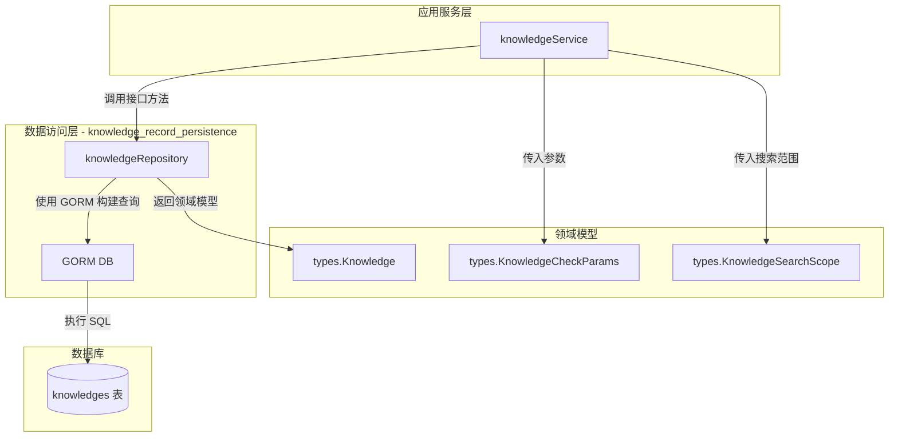

# knowledge_record_persistence 模块深度解析

## 模块概述

想象一下你正在管理一个大型图书馆：每本书（知识记录）都属于某个特定的分馆（知识库），而整个图书馆系统又服务于多个独立的企业客户（租户）。`knowledge_record_persistence` 模块就是这个图书馆的**藏书登记系统**——它负责将每一本"书"的元数据持久化到数据库中，并确保在查询时能够快速定位、过滤和检索。

这个模块的核心挑战在于：**如何在保证多租户数据隔离的前提下，提供灵活高效的查询能力，同时处理知识记录从上传、解析到检索的完整生命周期状态？**  naive 的方案可能会为每个操作写独立的 SQL 查询，但这会导致代码重复、难以维护，且容易在多租户过滤上出现安全漏洞。本模块采用**Repository 模式**，将所有数据访问逻辑封装在一个统一的接口背后，通过 GORM ORM 提供类型安全的查询构建，确保每个查询都自动携带租户隔离条件。

模块位于 `internal/application/repository/knowledge.go`，核心组件是 `knowledgeRepository` 结构体，它实现了 `interfaces.KnowledgeRepository` 接口。作为数据访问层，它不关心业务逻辑，只专注于**如何高效、安全地将 Knowledge 领域模型持久化到关系型数据库**。

---

## 架构定位与数据流

### 架构角色



### 依赖关系分析

**上游调用者**（依赖本模块）：
- [`knowledgeService`](internal.application.service.knowledge.knowledgeService.md)：知识 ingestion 编排的核心服务，调用本模块进行知识记录的 CRUD、状态更新、批量操作等
- 其他需要直接访问知识元数据的服务（如权限解析、跨租户搜索等）

**下游依赖**（本模块依赖）：
- `types.Knowledge`：领域模型，定义知识记录的所有字段和结构
- `interfaces.KnowledgeRepository`：接口契约，定义本模块必须实现的方法签名
- `gorm.DB`：数据库连接和查询构建器
- `types.KnowledgeCheckParams` / `types.KnowledgeSearchScope`：查询参数 DTO

**数据流示例**（知识上传流程）：
1. HTTP Handler 接收文件上传请求
2. `knowledgeService` 调用 `CheckKnowledgeExists` 判断是否重复
3. 若不重复，`knowledgeService` 创建 `Knowledge` 实例并调用 `CreateKnowledge`
4. `knowledgeRepository` 使用 GORM 将记录插入 `knowledges` 表
5. 返回后，`knowledgeService` 触发异步解析任务（通过 docreader 和 chunk 服务）

---

## 核心组件深度解析

### knowledgeRepository 结构体

```go
type knowledgeRepository struct {
    db *gorm.DB
}
```

这是典型的 Repository 模式实现：一个无状态的结构体，仅持有数据库连接。所有方法都是接收者方法，通过 `*gorm.DB` 构建查询。这种设计的**关键优势**在于：
- **可测试性**：可以通过 mock `*gorm.DB` 或替换为测试数据库进行单元测试
- **事务支持**：GORM 的 `WithContext` 和事务方法可以无缝集成
- **单一职责**：只关心数据持久化，不处理业务规则

### 创建与初始化

```go
func NewKnowledgeRepository(db *gorm.DB) interfaces.KnowledgeRepository {
    return &knowledgeRepository{db: db}
}
```

工厂函数返回接口类型而非具体实现，这是**依赖倒置**的体现：上层服务依赖抽象接口，而非具体实现。这使得未来可以替换底层存储（如从 MySQL 迁移到 PostgreSQL）而不影响调用方。

---

## 关键操作与内部机制

### 1. 单条记录查询：租户隔离的双重策略

模块提供了两个看似重复的查询方法，但设计意图不同：

```go
// 标准查询：强制租户隔离
func (r *knowledgeRepository) GetKnowledgeByID(
    ctx context.Context,
    tenantID uint64,
    id string,
) (*types.Knowledge, error)

// 权限解析专用：跳过租户过滤
func (r *knowledgeRepository) GetKnowledgeByIDOnly(
    ctx context.Context,
    id string,
) (*types.Knowledge, error)
```

**为什么需要 `GetKnowledgeByIDOnly`？** 这是一个微妙但重要的设计决策。在跨租户共享场景中（如组织间共享知识库），权限判断逻辑可能需要先获取知识记录，再根据共享关系判断当前用户是否有权访问。如果强制在查询时过滤租户 ID，会导致无法查询到"属于其他租户但已共享给我"的记录。因此，`GetKnowledgeByIDOnly` 的存在是为了**将权限判断逻辑从数据访问层上移到服务层**，Repository 层只负责"按 ID 取数据"，而服务层负责"判断是否能取"。

**Gotcha**：调用 `GetKnowledgeByIDOnly` 后，**必须**在服务层进行权限校验，否则会导致数据泄露。这是一个隐式契约，代码中没有强制机制保证。

### 2. 分页查询：查询分离优化

```go
func (r *knowledgeRepository) ListPagedKnowledgeByKnowledgeBaseID(
    ctx context.Context,
    tenantID uint64,
    kbID string,
    page *types.Pagination,
    tagID string,
    keyword string,
    fileType string,
) ([]*types.Knowledge, int64, error)
```

这个方法展示了**查询分离**的优化策略：先执行 `COUNT` 查询获取总数，再执行数据查询。为什么不分页查询时直接用 `Find` 然后取 `len`？因为 MySQL 的 `COUNT` 可以使用索引快速统计，而 `Find` 需要加载数据。对于大数据集，这种分离能显著减少内存占用。

**过滤逻辑的微妙之处**：
- `tagID`：直接匹配 `tag_id` 字段
- `keyword`：使用 `LIKE '%keyword%'` 模糊匹配 `file_name`
- `fileType`：特殊处理 `"manual"` 和 `"url"` 类型，它们匹配 `type` 字段而非 `file_type`

这里有一个**潜在的混淆点**：`type` 和 `file_type` 是两个不同的字段。`type` 表示知识来源类型（file/url/manual），而 `file_type` 表示文件格式（pdf/docx/xlsx 等）。调用方需要清楚这个区别，否则过滤结果会不符合预期。

### 3. 重复检测：多策略匹配

```go
func (r *knowledgeRepository) CheckKnowledgeExists(
    ctx context.Context,
    tenantID uint64,
    kbID string,
    params *types.KnowledgeCheckParams,
) (bool, *types.Knowledge, error)
```

这是知识上传流程中的**关键守门员**。它的设计体现了**渐进式匹配**的思想：

**对于文件类型**：
1. 优先使用 `file_hash` 精确匹配（最快、最准确）
2. 如果 hash 不匹配或不存在，降级到 `(file_name, file_size)` 组合匹配

**对于 URL 类型**：
1. 优先使用 `file_hash`（URL 内容的 hash）
2. 降级到 `source`（URL 地址）匹配

**设计权衡**：为什么不只用 hash？因为 hash 计算需要读取文件内容，对于大文件可能耗时。如果调用方已经提供了 hash，优先使用；否则用文件名 + 大小作为"足够好"的近似判断。这种设计**将效率决策权交给调用方**：如果调用方能预先计算 hash，就能获得更准确的去重；如果不能，系统仍能提供基本的去重保护。

**返回值的微妙之处**：方法返回 `(exists, existingKnowledge, error)` 三元组。当 `exists=false` 时，`existingKnowledge` 为 `nil`；当 `exists=true` 时，调用方可以直接复用已有记录的 ID，避免重复创建。这种设计减少了调用方的判断逻辑。

### 4. 跨知识库差异计算：AminusB

```go
func (r *knowledgeRepository) AminusB(
    ctx context.Context,
    Atenant uint64, A string,
    Btenant uint64, B string,
) ([]string, error)
```

这个方法的名字可能让人困惑——它实际上是**集合差集运算**：返回在知识库 A 中存在但在知识库 B 中不存在的知识记录 ID 列表（基于 `file_hash` 比较）。

**使用场景**：知识库克隆或同步时，需要判断哪些文件是新增的、哪些是已有的。通过 `AminusB`，可以快速找出"需要处理的新文件"。

**实现细节**：使用 SQL 子查询和 `NOT IN`：
```sql
SELECT id FROM knowledges 
WHERE tenant_id = A_tenant AND knowledge_base_id = A
AND file_hash NOT IN (
    SELECT file_hash FROM knowledges 
    WHERE tenant_id = B_tenant AND knowledge_base_id = B
)
```

**性能注意**：`NOT IN` 子查询在大数据集上可能较慢。如果知识库 B 有大量记录，子查询会返回大量 hash 值，导致主查询效率下降。这是一个已知的**性能瓶颈**，未来可以考虑使用 `LEFT JOIN ... WHERE NULL` 或临时表优化。

### 5. 全局搜索：跨知识库检索

```go
func (r *knowledgeRepository) SearchKnowledge(
    ctx context.Context,
    tenantID uint64,
    keyword string,
    offset, limit int,
    fileTypes []string,
) ([]*types.Knowledge, bool, error)
```

这个方法支持**跨知识库的全局搜索**，返回结果包含关联的 `knowledge_base_name`（通过 JOIN 获取）。

**关键设计点**：
1. **只搜索文档型知识库**：`WHERE knowledge_bases.type = 'document'`，排除 FAQ 类型
2. **软删除过滤**：`WHERE knowledges.deleted_at IS NULL`
3. **文件类型别名处理**：搜索 `xlsx` 时自动包含 `xls`，搜索 `jpg` 时包含 `jpeg/png`

**hasMore 标志**：方法返回 `(results, hasMore, error)` 而非 `(results, total, error)`。这是为了**避免全量计数**：查询时取 `limit+1` 条，如果超过 limit 则说明还有更多。对于深层分页（如 offset=10000），全量 `COUNT` 会非常慢，而 `hasMore` 策略只需多查 1 条。

**SearchKnowledgeInScopes**：这是 `SearchKnowledge` 的增强版，支持在多个 `(tenant_id, kb_id)` 范围内搜索。用于实现"我的知识库 + 共享给我的知识库"的联合搜索。实现上使用元组 `IN` 查询：
```sql
WHERE (tenant_id, knowledge_base_id) IN ((t1, kb1), (t2, kb2), ...)
```

### 6. 批量更新与列更新

```go
// 批量更新完整记录
func (r *knowledgeRepository) UpdateKnowledgeBatch(
    ctx context.Context, 
    knowledgeList []*types.Knowledge,
) error

// 单列更新
func (r *knowledgeRepository) UpdateKnowledgeColumn(
    ctx context.Context,
    id string,
    column string,
    value interface{},
) error
```

**`UpdateKnowledgeBatch` 的使用场景**：知识解析完成后，批量更新多条记录的 `parse_status`、`processed_at` 等字段。GORM 的 `Save` 方法会根据主键自动生成 `UPDATE` 语句。

**`UpdateKnowledgeColumn` 的设计风险**：这个方法接受 `column` 字符串参数，存在**SQL 注入风险**。虽然 GORM 的 `Update` 方法会对 value 进行参数化，但 `column` 名称是直接拼接到 SQL 中的。调用方必须确保 `column` 是可信的（通常应该是代码中定义的常量，而非用户输入）。这是一个**隐式安全契约**，文档中应该明确标注。

---

## 设计决策与权衡

### 1. 软删除 vs 硬删除

模块使用 GORM 的 `DeletedAt` 字段实现软删除。`DeleteKnowledge` 方法实际上执行的是 `UPDATE knowledges SET deleted_at = NOW() ...` 而非 `DELETE FROM ...`。

**为什么选择软删除？**
- **数据恢复**：误删后可以恢复
- **审计追踪**：保留删除记录用于审计
- **关联完整性**：避免外键约束问题（chunk 记录可能仍引用已删除的知识）

**代价**：
- 所有查询必须显式或隐式过滤 `deleted_at IS NULL`
- 数据量会持续增长，需要定期归档
- 唯一索引需要包含 `deleted_at` 条件（否则无法插入同名文件）

### 2. 租户隔离策略

几乎所有查询都强制携带 `tenant_id` 条件。这是**多租户 SaaS 系统的安全基石**。

**设计模式**：在 Repository 层强制隔离，而非依赖调用方。这样可以防止"忘记加租户过滤"导致的数据泄露。

**例外情况**：`GetKnowledgeByIDOnly` 是有意为之的"后门"，用于特殊场景（如权限解析、后台任务）。调用这个方法的服务必须自行确保安全性。

### 3. 字段省略策略

```go
var omitFieldsOnUpdate = []string{"DeletedAt"}

func (r *knowledgeRepository) UpdateKnowledge(...) error {
    return r.db.WithContext(ctx).Omit(omitFieldsOnUpdate...).Save(knowledge).Error
}
```

**为什么省略 `DeletedAt`？** 防止更新操作意外恢复已删除的记录。这是一个**防御性编程**的实践：即使调用方错误地设置了 `DeletedAt` 字段，更新时也会被忽略。

**潜在的遗漏**：`CreatedAt` 也应该被省略，否则更新操作可能意外修改创建时间。这是一个**潜在的改进点**。

### 4. 查询构建的重复代码

注意 `ListPagedKnowledgeByKnowledgeBaseID` 中，过滤条件的构建逻辑出现了两次（一次用于 `COUNT`，一次用于数据查询）：

```go
// COUNT 查询
query := r.db.WithContext(ctx).Model(&types.Knowledge{}).Where(...)
if tagID != "" { query = query.Where(...) }
// ...

// 数据查询
dataQuery := r.db.WithContext(ctx).Where(...)
if tagID != "" { dataQuery = dataQuery.Where(...) }
// ...
```

**为什么不用同一个 query 对象？** 因为 GORM 的查询构建是**可变状态**的。如果先构建 query，执行 COUNT，再添加 `Offset/Limit` 执行数据查询，会导致 COUNT 也带上分页条件（从而永远返回 limit 值）。因此必须分别构建。

**改进建议**：可以提取一个私有方法 `buildFilterQuery` 来减少重复，但需要小心处理 GORM 的状态问题。

---

## 使用示例与最佳实践

### 基本 CRUD 操作

```go
// 创建知识记录
knowledge := &types.Knowledge{
    ID:              uuid.New().String(),
    TenantID:        tenantID,
    KnowledgeBaseID: kbID,
    Type:            "file",
    FileName:        "report.pdf",
    FileHash:        "abc123...",
    ParseStatus:     "pending",
}
err := repo.CreateKnowledge(ctx, knowledge)

// 查询单条记录
knowledge, err := repo.GetKnowledgeByID(ctx, tenantID, knowledge.ID)
if errors.Is(err, repository.ErrKnowledgeNotFound) {
    // 处理不存在的情况
}

// 更新状态
knowledge.ParseStatus = "completed"
knowledge.ProcessedAt = &now
err = repo.UpdateKnowledge(ctx, knowledge)

// 删除
err = repo.DeleteKnowledge(ctx, tenantID, knowledge.ID)
```

### 分页查询

```go
page := &types.Pagination{Page: 1, PageSize: 20}
results, total, err := repo.ListPagedKnowledgeByKnowledgeBaseID(
    ctx, tenantID, kbID, page, "", "report", "",
)
// results: 当前页数据
// total: 总记录数（用于计算总页数）
```

### 去重检查

```go
params := &types.KnowledgeCheckParams{
    Type:     "file",
    FileName: "report.pdf",
    FileSize: 102400,
    FileHash: "abc123...",  // 如果已计算，优先使用
}
exists, existing, err := repo.CheckKnowledgeExists(ctx, tenantID, kbID, params)
if exists {
    // 复用 existing.ID，跳过上传
    log.Printf("文件已存在，ID: %s", existing.ID)
} else {
    // 创建新记录
}
```

### 跨知识库搜索

```go
// 搜索当前租户下的所有文档
results, hasMore, err := repo.SearchKnowledge(
    ctx, tenantID, "keyword", 0, 50, []string{"pdf", "docx"},
)

// 搜索多个知识库（包括共享的）
scopes := []types.KnowledgeSearchScope{
    {TenantID: tenantID, KBID: kb1},
    {TenantID: tenantID, KBID: kb2},
    {TenantID: otherTenantID, KBID: sharedKBID},  // 共享知识库
}
results, hasMore, err := repo.SearchKnowledgeInScopes(
    ctx, scopes, "keyword", 0, 50, nil,
)
```

---

## 边界情况与注意事项

### 1. 空参数处理

- `CheckKnowledgeExists`：如果 `params` 中没有任何有效字段（hash、文件名、URL 都为空），方法返回 `(false, nil, nil)`。调用方需要处理这种情况，通常应该视为"不存在"并继续创建。
- `CountKnowledgeByStatus`：如果 `parseStatuses` 为空，直接返回 `(0, nil)` 而不执行查询。这是一个**短路优化**。

### 2. 文件类型别名

`SearchKnowledge` 中的文件类型别名处理是**硬编码**的：
```go
case "xlsx":
    aliases = []string{"%.xls"}
```

如果未来需要支持新的别名（如 `ppt` / `pptx`），需要修改此处的代码。这是一个**封闭扩展点**，不支持配置化。

### 3. 模糊匹配性能

`keyword` 搜索使用 `LIKE '%keyword%'`，这会导致**全表扫描**（无法使用索引）。对于大表，建议：
- 限制 keyword 最小长度（如至少 3 个字符）
- 考虑引入全文索引（MySQL FULLTEXT 或 Elasticsearch）
- 限制搜索范围（如只搜索最近 N 天的数据）

### 4. 批量操作的事务性

`UpdateKnowledgeBatch` 使用 GORM 的 `Save` 方法，GORM 会为每条记录生成独立的 `UPDATE` 语句。如果中途失败，**已更新的记录不会回滚**。如果需要原子性，调用方应该显式开启事务：

```go
tx := repo.db.Begin()
err := tx.WithContext(ctx).Omit(...).Save(knowledgeList).Error
if err != nil {
    tx.Rollback()
} else {
    tx.Commit()
}
```

### 5. 并发更新冲突

模块没有实现乐观锁或版本控制。如果两个服务同时更新同一条知识记录，**后提交的会覆盖先提交的**。对于状态机场景（如 `pending` → `processing` → `completed`），建议在服务层实现状态校验：

```go
// 更新前检查当前状态
current, _ := repo.GetKnowledgeByID(ctx, tenantID, id)
if current.ParseStatus != "pending" {
    return errors.New("状态已变更，无法更新")
}
```

---

## 相关模块参考

- [knowledge_base_metadata_persistence](knowledge_base_metadata_persistence.md)：知识库元数据的持久化，与本模块配合使用
- [chunk_record_persistence](chunk_record_persistence.md)：知识解析后的 chunk 记录持久化
- [knowledge_ingestion_orchestration](knowledge_ingestion_orchestration.md)：知识 ingestion 的服务层编排，调用本模块
- [Knowledge 领域模型](internal.types.knowledge.Knowledge.md)：知识记录的数据结构定义

---

## 总结

`knowledge_record_persistence` 模块是一个典型的 Repository 模式实现，专注于知识记录的持久化。它的核心设计原则是：

1. **租户隔离优先**：几乎所有查询都强制携带租户 ID，确保数据安全
2. **接口抽象**：通过接口契约解耦服务层与数据访问层
3. **灵活查询**：支持多种过滤、分页、搜索场景，满足复杂业务需求
4. **防御性编程**：通过字段省略、错误包装等机制防止常见错误

主要的使用陷阱包括：`GetKnowledgeByIDOnly` 的权限校验责任、`UpdateKnowledgeColumn` 的 SQL 注入风险、批量操作的事务性保证。理解这些边界情况对于正确使用本模块至关重要。
