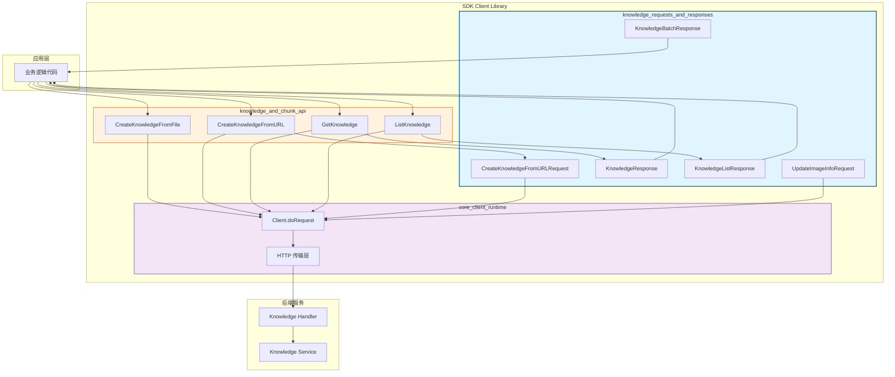

# knowledge_requests_and_responses 模块深度解析

## 模块概述

想象一下，你正在构建一个大型知识库系统，用户可以从各种来源（本地文件、URL、直接文本）导入知识条目。这个模块就是**SDK 客户端与后端知识服务之间的契约层**——它定义了"说什么"（请求结构）和"听到什么"（响应结构），但不关心"怎么说"（HTTP 传输细节）。

`knowledge_requests_and_responses` 模块的核心职责是**标准化知识条目的 CRUD 操作接口**。它解决了这样一个问题：当上层应用需要创建、查询或更新知识时，不应该直接拼接 JSON 或处理 HTTP 状态码，而是应该使用类型安全的结构体，让编译器帮助发现错误。这个设计遵循了**接口隔离原则**——将数据契约与传输逻辑分离，使得 API 调用代码更加清晰、可测试、可维护。

与 naive 方案（直接在业务代码中构造 map[string]interface{}）相比，这种强类型设计的好处在于：IDE 可以提供自动补全，重构时编译器会指出所有需要修改的地方，且文档即代码——结构体字段本身就是 API 文档。

## 架构定位与数据流



**数据流 walkthrough**：

1. **请求路径**：应用层调用 `Client.CreateKnowledgeFromURL(ctx, kbID, req)` → 方法内部将 `CreateKnowledgeFromURLRequest` 结构体序列化为 JSON → `Client.doRequest` 添加认证头、请求 ID → HTTP POST 到 `/api/v1/knowledge-bases/{id}/knowledge/url` → 后端 KnowledgeHandler 接收

2. **响应路径**：后端返回 JSON → `parseResponse` 反序列化为 `KnowledgeResponse` → 检查 HTTP 状态码（200 成功，409 冲突）→ 返回 `*Knowledge` 或特定错误（`ErrDuplicateURL`）→ 应用层处理

3. **关键设计点**：模块本身**不包含 HTTP 逻辑**，它只是数据容器的定义。真正的传输逻辑在 [`core_client_runtime`](core_client_runtime.md) 的 `Client` 结构中。这种分离使得：
   - 响应结构可以独立于传输协议演化
   - 单元测试可以 mock 响应而不需要启动 HTTP 服务器
   - 同一套响应结构可以用于 gRPC 或其他协议（如果需要）

## 核心组件深度解析

### 1. CreateKnowledgeFromURLRequest

**设计意图**：封装从 URL 创建知识条目的所有可选参数，同时支持**智能模式切换**。

```go
type CreateKnowledgeFromURLRequest struct {
    URL            string `json:"url"`
    FileName       string `json:"file_name,omitempty"`
    FileType       string `json:"file_type,omitempty"`
    EnableMultimodel *bool `json:"enable_multimodel,omitempty"`
    Title          string `json:"title,omitempty"`
    TagID          string `json:"tag_id,omitempty"`
}
```

**为什么这样设计**：

这个结构体最巧妙的设计在于 `FileName` 和 `FileType` 字段的**语义重载**。根据注释说明，当这两个字段之一被提供（或 URL 路径包含已知文件扩展名如 `.pdf`/`.docx`）时，服务器会**自动切换到文件下载模式**而非网页爬取模式。

这种设计的 tradeoff：
- **优点**：单一接口支持两种行为，减少 API 表面面积；客户端可以根据 URL 特征自动推断，无需显式指定模式
- **缺点**：行为不够显式，调试时需要理解隐式规则；如果 URL 有扩展名但实际是网页，可能产生意外行为

**使用示例**：
```go
// 场景 1：普通网页爬取
req := CreateKnowledgeFromURLRequest{
    URL: "https://example.com/article",
}

// 场景 2：强制文件下载模式（URL 无扩展名）
req := CreateKnowledgeFromURLRequest{
    URL:        "https://example.com/download/12345",
    FileName:   "report.pdf",
    FileType:   "pdf",
}

// 场景 3：启用多模态处理
enable := true
req := CreateKnowledgeFromURLRequest{
    URL:            "https://example.com/infographic",
    EnableMultimodel: &enable,
}
```

**注意事项**：`EnableMultimodel` 使用指针类型 `*bool` 而非 `bool`，这是 Go API 设计的常见模式——**区分"未设置"和"设置为 false"**。如果直接用 `bool`，零值 `false` 无法与"用户未指定"区分，可能导致意外覆盖服务端默认值。

### 2. UpdateImageInfoRequest

**设计意图**：为知识条目下的 chunk 提供图片信息更新能力。

```go
type UpdateImageInfoRequest struct {
    ImageInfo string `json:"image_info"` // JSON 格式的图片信息
}
```

**为什么 ImageInfo 是 string 而非结构化类型**：

这是一个值得注意的设计选择。字段注释说明这是"JSON 格式的图片信息"，但类型是 `string` 而非 `map[string]interface{}` 或具体结构体。这种设计的可能原因：

1. **灵活性**：图片信息的 schema 可能频繁变化，用 string 避免每次变更都更新 SDK
2. **透传设计**：SDK 不关心内容，只负责原样传递给后端
3. **历史原因**：可能从动态语言迁移而来，保留了原有接口

**Tradeoff 分析**：
- **优点**：schema 演化不需要 SDK 变更；减少编译依赖
- **缺点**：失去类型安全；调用方需要手动序列化；IDE 无法提供字段提示

**推荐用法**：
```go
// 调用方需要自己构造 JSON
imageInfo := map[string]interface{}{
    "width":  1920,
    "height": 1080,
    "format": "png",
}
imageInfoBytes, _ := json.Marshal(imageInfo)

req := &UpdateImageInfoRequest{
    ImageInfo: string(imageInfoBytes),
}
```

### 3. KnowledgeResponse / KnowledgeListResponse / KnowledgeBatchResponse

**设计意图**：标准化 API 响应格式，支持**统一错误处理**和**分页元数据**。

```go
type KnowledgeResponse struct {
    Success bool      `json:"success"`
    Data    Knowledge `json:"data"`
    Code    string    `json:"code"`
    Message string    `json:"message"`
}

type KnowledgeListResponse struct {
    Success  bool        `json:"success"`
    Data     []Knowledge `json:"data"`
    Total    int64       `json:"total"`
    Page     int         `json:"page"`
    PageSize int         `json:"page_size"`
}

type KnowledgeBatchResponse struct {
    Success bool        `json:"success"`
    Data    []Knowledge `json:"data"`
}
```

**响应模式分析**：

这三种响应结构体现了**RESTful API 的常见响应模式**：

| 响应类型 | 使用场景 | 关键特征 |
|---------|---------|---------|
| `KnowledgeResponse` | 单资源操作（GET/PUT/POST 单个知识） | 包含 `Code` 和 `Message` 用于错误诊断 |
| `KnowledgeListResponse` | 分页列表查询 | 包含 `Total`/`Page`/`PageSize` 分页元数据 |
| `KnowledgeBatchResponse` | 批量获取（无分页） | 简化结构，仅返回数据数组 |

**为什么 Success 字段是必要的**：

在 HTTP 层面，状态码已经表达了成功/失败（200 vs 4xx/5xx）。但在应用层保留 `Success` 字段有以下好处：

1. **业务逻辑错误**：HTTP 200 但业务失败（如"知识已存在"），此时 `Success=false` + `Code` 提供细粒度错误信息
2. **统一处理**：客户端可以用同一套逻辑处理所有响应，不需要为不同状态码写分支
3. **可观测性**：日志中可以记录 `Success` 字段，便于监控 API 健康度

**Knowledge 核心字段解读**：

```go
type Knowledge struct {
    ID               string          `json:"id"`
    TenantID         uint64          `json:"tenant_id"`
    KnowledgeBaseID  string          `json:"knowledge_base_id"`
    Type             string          `json:"type"`
    Title            string          `json:"title"`
    ParseStatus      string          `json:"parse_status"`      // 解析状态
    SummaryStatus    string          `json:"summary_status"`    // 摘要状态
    EnableStatus     string          `json:"enable_status"`     // 启用状态
    EmbeddingModelID string          `json:"embedding_model_id"`
    FileName         string          `json:"file_name"`
    FileType         string          `json:"file_type"`
    FileSize         int64           `json:"file_size"`
    FileHash         string          `json:"file_hash"`         // 去重依据
    FilePath         string          `json:"file_path"`
    StorageSize      int64           `json:"storage_size"`
    Metadata         json.RawMessage `json:"metadata"`          // 可扩展元数据
    CreatedAt        time.Time       `json:"created_at"`
    UpdatedAt        time.Time       `json:"updated_at"`
    ProcessedAt      *time.Time      `json:"processed_at"`      // 可为空
    ErrorMessage     string          `json:"error_message"`
}
```

**关键字段设计意图**：

- **`FileHash`**：用于**去重检测**。当上传文件时，服务端计算 hash 并与现有记录比对，如果相同则返回 409 Conflict。这是 [`ErrDuplicateFile`](#错误处理与边界条件) 的来源。

- **`Metadata` 使用 `json.RawMessage`**：这是 Go 处理**动态 schema** 的标准做法。`RawMessage` 是 `[]byte` 的别名，延迟反序列化。好处是：
  - SDK 不需要知道 metadata 的具体结构
  - 调用方可以根据 `Type` 字段决定如何解析
  - 避免字段变更导致 SDK 频繁更新

- **`ProcessedAt` 是指针**：知识条目创建后需要异步处理（解析、嵌入等），在处理完成前该字段为 `nil`。使用指针可以明确区分"未处理"和"处理时间为零值"。

- **三个状态字段**：`ParseStatus`/`SummaryStatus`/`EnableStatus` 分离了不同维度的状态，支持**细粒度状态查询**。例如，知识可能已解析完成（`ParseStatus=done`）但摘要生成中（`SummaryStatus=pending`）。

## 依赖关系分析

### 上游依赖（谁调用这个模块）

这个模块主要被 [`knowledge_and_chunk_api`](knowledge_and_chunk_api.md) 中的客户端方法使用：

| 调用方法 | 使用的响应类型 | 说明 |
|---------|--------------|------|
| `CreateKnowledgeFromFile` | `KnowledgeResponse` | 文件上传创建知识 |
| `CreateKnowledgeFromURL` | `KnowledgeResponse` | URL 创建知识 |
| `GetKnowledge` | `KnowledgeResponse` | 获取单个知识 |
| `GetKnowledgeBatch` | `KnowledgeBatchResponse` | 批量获取知识 |
| `ListKnowledge` | `KnowledgeListResponse` | 分页列表查询 |
| `UpdateImageInfo` | 匿名响应结构 | 更新 chunk 图片信息 |

这些方法都依赖 [`core_client_runtime`](core_client_runtime.md) 的 `Client.doRequest` 进行实际 HTTP 传输。

### 下游依赖（这个模块调用谁）

模块本身**不主动调用其他模块**——它只是数据结构定义。但使用这些结构的方法会调用：

1. **`Client.doRequest`**：处理 HTTP 请求构造、认证头注入、响应解析
2. **`parseResponse`**：通用响应解析函数，处理 HTTP 状态码和 JSON 反序列化
3. **标准库**：`encoding/json`（序列化）、`mime/multipart`（文件上传）、`net/http`（HTTP 客户端）

### 数据契约

**请求契约**：
- 所有请求结构体使用 `json` tag 定义序列化格式
- 可选字段使用 `omitempty` 避免发送零值
- 指针类型字段用于区分"未设置"和"设置为零值"

**响应契约**：
- HTTP 200 + `Success=true`：操作成功
- HTTP 200 + `Success=false`：业务逻辑错误（查看 `Code` 和 `Message`）
- HTTP 409：资源冲突（文件/URL 已存在），返回特定错误类型
- HTTP 4xx/5xx：传输层错误，`parseResponse` 返回 error

## 设计决策与权衡

### 1. 为什么响应结构包含 Success 字段而不是只用 HTTP 状态码？

**选择**：使用 `Success` + `Code` + `Message` 三元组，而非仅依赖 HTTP 状态码。

**权衡分析**：

| 方案 | 优点 | 缺点 |
|-----|------|------|
| 仅 HTTP 状态码 | RESTful 标准；HTTP 层语义清晰 | 业务错误码无法表达；需要为每种错误定义状态码 |
| HTTP + Success 字段 | 业务错误可细粒度表达；统一响应格式 | 冗余；需要同时检查两层状态 |

**为什么选择当前方案**：

知识库系统有大量**业务规则错误**（如"文件已存在"、"URL 已收录"、"知识库已满"），这些不适合映射到 HTTP 状态码。使用 `Success=false` + `Code` 可以在保持 HTTP 200（表示请求已成功处理）的同时，表达业务层面的失败。

**潜在问题**：调用方容易忘记检查 `Success` 字段，只检查 `err != nil`。文档中需要强调这一点。

### 2. 为什么 CreateKnowledgeFromURLRequest 支持隐式模式切换？

**选择**：通过 `FileName`/`FileType` 字段隐式触发文件下载模式，而非显式的 `Mode` 字段。

**权衡分析**：

| 方案 | 优点 | 缺点 |
|-----|------|------|
| 隐式模式 | API 简洁；常见场景无需额外参数 | 行为不透明；调试困难 |
| 显式 Mode 字段 | 行为清晰；易于理解 | API 冗长；多数场景需要传额外字段 |

**为什么选择当前方案**：

大多数 URL 可以**自动推断**正确模式（有文件扩展名→下载，无扩展名→爬取）。显式 `Mode` 字段在 90% 的场景下是冗余的。对于边缘情况（URL 有扩展名但实际是网页），可以通过设置 `FileName=""` 强制覆盖。

**风险**：如果后端推断逻辑变更，SDK 调用方可能无感知。建议在关键场景显式指定 `FileName`/`FileType`。

### 3. 为什么 Metadata 使用 json.RawMessage 而非 map[string]interface{}？

**选择**：使用 `json.RawMessage`（延迟反序列化）而非直接解析为 map。

**权衡分析**：

| 方案 | 优点 | 缺点 |
|-----|------|------|
| `json.RawMessage` | 灵活；schema 变更不影响 SDK；性能更好（按需解析） | 调用方需要手动解析；类型不安全 |
| `map[string]interface{}` | 开箱即用；类型相对安全 | schema 变更需要 SDK 更新；无法处理未知字段 |

**为什么选择当前方案**：

知识条目的 `Metadata` 是**高度可扩展**的——文件类型知识存储文件信息，URL 知识存储爬取信息，手动创建的知识可能存储用户自定义信息。使用 `RawMessage` 将解析责任交给调用方，SDK 保持**协议无关性**。

**最佳实践**：
```go
// 读取 Metadata
var fileInfo struct {
    Path string `json:"path"`
    Size int64  `json:"size"`
}
if err := json.Unmarshal(knowledge.Metadata, &fileInfo); err != nil {
    // 处理错误
}

// 写入 Metadata
metadata := map[string]string{"source": "import", "version": "1.0"}
metadataBytes, _ := json.Marshal(metadata)
knowledge.Metadata = metadataBytes
```

### 4. 为什么 EnableMultimodel 使用 *bool 而非 bool？

**选择**：使用指针类型 `*bool` 表示可选布尔值。

**这是 Go API 设计的标准模式**，解决"三值逻辑"问题：

| 值 | 含义 |
|---|------|
| `nil` | 用户未指定，使用服务端默认值 |
| `&true` | 用户显式启用 |
| `&false` | 用户显式禁用 |

如果直接用 `bool`，零值 `false` 无法与"未指定"区分，可能导致：
```go
// 问题：用户只想设置 Title，但 EnableMultimodel 零值 false 会被发送
req := CreateKnowledgeFromURLRequest{
    URL:   "https://example.com",
    Title: "My Article",
    // EnableMultimodel 默认为 false，可能被服务端解释为"禁用"
}
```

**使用指针的代价**：调用方需要处理 nil 检查，代码稍显冗长。但这是保证语义正确的必要成本。

## 使用指南与示例

### 创建知识条目

```go
// 从文件创建
knowledge, err := client.CreateKnowledgeFromFile(
    ctx,
    "kb-123",
    "/path/to/document.pdf",
    map[string]string{"department": "engineering"},
    nil, // 使用默认多模态设置
    "",  // 使用原文件名
)
if errors.Is(err, client.ErrDuplicateFile) {
    // 处理文件已存在
}

// 从 URL 创建
req := client.CreateKnowledgeFromURLRequest{
    URL:      "https://example.com/article",
    Title:    "Article Title",
    TagID:    "tag-456",
}
knowledge, err := client.CreateKnowledgeFromURL(ctx, "kb-123", req)
if errors.Is(err, client.ErrDuplicateURL) {
    // 处理 URL 已存在
}
```

### 分页查询知识列表

```go
page := 1
pageSize := 20
for {
    items, total, err := client.ListKnowledge(ctx, "kb-123", page, pageSize, "")
    if err != nil {
        return err
    }
    
    for _, item := range items {
        fmt.Printf("Knowledge: %s (%s)\n", item.Title, item.ParseStatus)
    }
    
    if int64(page*pageSize) >= total {
        break
    }
    page++
}
```

### 批量获取知识

```go
ids := []string{"k1", "k2", "k3"}
items, err := client.GetKnowledgeBatch(ctx, ids)
if err != nil {
    return err
}
// 注意：返回数量可能少于请求数量（部分知识可能已被删除）
```

### 更新 Chunk 图片信息

```go
imageInfo := map[string]interface{}{
    "url":    "https://cdn.example.com/img.png",
    "width":  1920,
    "height": 1080,
}
imageInfoBytes, _ := json.Marshal(imageInfo)

req := &client.UpdateImageInfoRequest{
    ImageInfo: string(imageInfoBytes),
}
err := client.UpdateImageInfo(ctx, "k1", "chunk-1", req)
```

### 重新解析知识

```go
// 当解析配置变更或解析失败时，触发重新解析
knowledge, err := client.ReparseKnowledge(ctx, "k1")
if err != nil {
    return err
}
// 知识状态变为 pending，异步处理
fmt.Printf("Reparse task submitted, status: %s\n", knowledge.ParseStatus)
```

## 边界条件与注意事项

### 1. 错误处理

模块定义了两个**特定错误类型**：

```go
var ErrDuplicateFile = errors.New("file already exists")
var ErrDuplicateURL = errors.New("URL already exists")
```

**使用模式**：
```go
knowledge, err := client.CreateKnowledgeFromFile(ctx, kbID, path, nil, nil, "")
if err != nil {
    if errors.Is(err, client.ErrDuplicateFile) {
        // 文件已存在，可能不需要报错
        log.Printf("File already exists: %s", path)
        return nil
    }
    return err
}
```

**注意**：这些错误在 HTTP 409 Conflict 时返回，但 `err` 本身不是 HTTP 错误。不要使用 `if resp.StatusCode == 409` 判断，而应该用 `errors.Is`。

### 2. 异步操作的状态轮询

`ReparseKnowledge` 和部分创建操作是**异步**的——调用返回时操作可能尚未完成。调用方需要轮询 `ParseStatus` 字段：

```go
// 提交重新解析
knowledge, err := client.ReparseKnowledge(ctx, "k1")
if err != nil {
    return err
}

// 轮询状态
for knowledge.ParseStatus == "pending" {
    time.Sleep(2 * time.Second)
    knowledge, err = client.GetKnowledge(ctx, "k1")
    if err != nil {
        return err
    }
}

if knowledge.ParseStatus == "failed" {
    return fmt.Errorf("parse failed: %s", knowledge.ErrorMessage)
}
```

**可能的状态值**（根据后端实现可能变化）：
- `pending`：处理中
- `done`：处理完成
- `failed`：处理失败（查看 `ErrorMessage`）

### 3. Metadata 的序列化陷阱

由于 `Metadata` 是 `json.RawMessage`，直接赋值字符串会导致双重序列化：

```go
// 错误：会导致 JSON 字符串被再次转义
knowledge.Metadata = []byte(`{"key": "value"}`) // 正确
knowledge.Metadata = []byte("{\"key\": \"value\"}") // 也是正确的
knowledge.Metadata = []byte("not json") // 运行时错误

// 错误：如果先 Marshal 再赋值给 string 字段
metadataStr := `{"key": "value"}`
knowledge.Metadata = []byte(metadataStr) // 正确
```

**推荐模式**：
```go
metadata := map[string]string{"key": "value"}
metadataBytes, err := json.Marshal(metadata)
if err != nil {
    return err
}
knowledge.Metadata = metadataBytes
```

### 4. 分页边界

`ListKnowledge` 返回的 `Total` 是**总记录数**，不是总页数。计算时需要小心：

```go
// 错误：可能漏掉最后一页
for page := 1; page*pageSize < total; page++ {
    // ...
}

// 正确
totalPages := (total + int64(pageSize) - 1) / int64(pageSize)
for page := 1; page <= int(totalPages); page++ {
    // ...
}
```

### 5. 并发安全

`Client` 结构体本身是**并发安全**的（使用无状态 HTTP 客户端），但响应中的 `Knowledge` 结构体包含 `time.Time` 和 `json.RawMessage`，在并发访问时需要注意：

```go
// 安全：每个 goroutine 获取自己的副本
knowledge, _ := client.GetKnowledge(ctx, id)
go func() {
    // 可以安全读取 knowledge 字段
    fmt.Println(knowledge.Title)
}()

// 不安全：多个 goroutine 修改同一对象
go func() {
    knowledge.Metadata = newData // 数据竞争
}()
```

## 与其他模块的关系

- **[core_client_runtime](core_client_runtime.md)**：提供 `Client.doRequest` 和 `parseResponse` 基础传输能力
- **[knowledge_and_chunk_api](knowledge_and_chunk_api.md)**：包含使用本模块响应类型的完整 API 方法
- **[chunk_management_api](chunk_management_api.md)**：与 chunk 相关的 API，`UpdateImageInfoRequest` 用于更新 chunk 的图片信息
- **[knowledge_base_api](knowledge_base_api.md)**：知识库配置管理，本模块的知识条目属于某个知识库

## 扩展点

### 添加新的请求类型

如果需要添加新的知识创建方式（如从文本直接创建）：

```go
// 1. 定义请求结构
type CreateKnowledgeFromTextRequest struct {
    Content        string  `json:"content"`
    Title          string  `json:"title"`
    FileType       string  `json:"file_type,omitempty"`
    EnableMultimodel *bool   `json:"enable_multimodel,omitempty"`
}

// 2. 在 Client 中添加方法
func (c *Client) CreateKnowledgeFromText(
    ctx context.Context,
    knowledgeBaseID string,
    req CreateKnowledgeFromTextRequest,
) (*Knowledge, error) {
    path := fmt.Sprintf("/api/v1/knowledge-bases/%s/knowledge/text", knowledgeBaseID)
    resp, err := c.doRequest(ctx, http.MethodPost, path, req, nil)
    if err != nil {
        return nil, err
    }
    var response KnowledgeResponse
    if err := parseResponse(resp, &response); err != nil {
        return nil, err
    }
    return &response.Data, nil
}
```

### 添加新的响应字段

如果后端 API 新增字段：

```go
// 在 Knowledge 结构体中添加
type Knowledge struct {
    // ... 现有字段 ...
    WordCount int `json:"word_count"` // 新增字段
}
```

由于 `json.Unmarshal` 会忽略未知字段，**旧版 SDK 可以兼容新版后端**（新字段会被忽略）。但**新版 SDK 与旧版后端**兼容时，新字段会保持零值。

## 总结

`knowledge_requests_and_responses` 模块是 SDK 客户端与知识服务之间的**协议层**。它的核心价值在于：

1. **类型安全**：用结构体替代 map，编译期发现错误
2. **语义清晰**：字段命名和注释表达业务含义
3. **灵活扩展**：`json.RawMessage` 和指针类型支持 schema 演化
4. **错误处理**：特定错误类型（`ErrDuplicateFile`/`ErrDuplicateURL`）简化调用方逻辑

理解这个模块的关键是认识到它**不处理传输**，只定义契约。真正的 HTTP 逻辑在 [`core_client_runtime`](core_client_runtime.md)，业务逻辑在 [`knowledge_and_chunk_api`](knowledge_and_chunk_api.md)。这种分层使得每层可以独立演化和测试。
