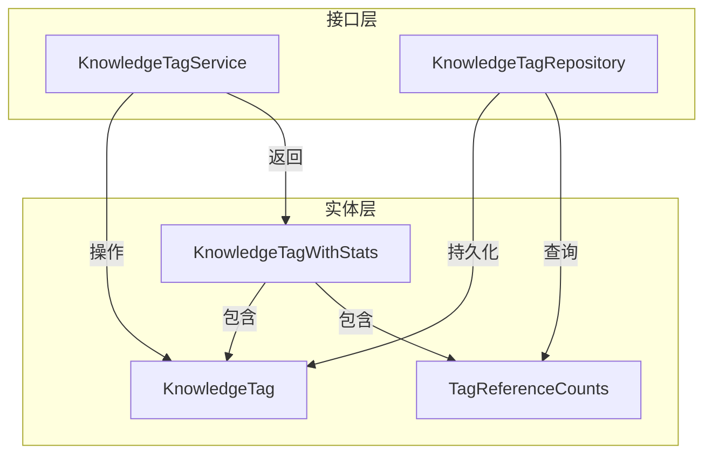

# knowledge_tagging_contracts 模块技术文档

## 1. 模块概述

在知识库系统中，如何高效地组织和分类知识内容是一个核心问题。`knowledge_tagging_contracts` 模块提供了一套完整的标签体系，用于对知识库中的文档（Knowledge）和文档片段（Chunk）进行分类和管理。

想象一下，标签就像是图书馆中的书架标签——它们帮助你快速找到相关的书籍，同时也让书籍的组织变得有序。本模块不仅定义了标签的数据结构，还提供了标签的创建、更新、删除、统计等核心操作的契约，为上层应用提供了统一的标签管理接口。

### 核心价值
- **统一的数据模型**：定义了标签的标准结构，确保系统中标签表示的一致性
- **清晰的服务契约**：通过接口定义了标签管理的所有核心操作，便于实现和测试
- **统计支持**：内置了标签使用统计功能，帮助用户了解标签的使用情况
- **知识库隔离**：标签严格限定在特定知识库范围内，避免跨知识库污染

## 2. 架构设计

### 2.1 核心组件关系图



### 2.2 组件职责说明

#### 实体层
- **KnowledgeTag**：标签的核心数据模型，包含标签的基本信息（名称、颜色、排序等）
- **TagReferenceCounts**：标签引用统计数据，记录标签被多少知识和片段使用
- **KnowledgeTagWithStats**：标签与统计数据的组合视图，便于上层应用一次性获取完整信息

#### 接口层
- **KnowledgeTagService**：标签服务接口，定义了标签管理的业务逻辑操作
- **KnowledgeTagRepository**：标签仓储接口，定义了标签数据的持久化操作

### 2.3 数据流向

当用户需要管理标签时，数据流向如下：

1. **标签列表查询**：
   - 用户请求 → KnowledgeTagService.ListTags → KnowledgeTagRepository.ListByKB + BatchCountReferences → 组合为 KnowledgeTagWithStats → 返回给用户

2. **标签创建**：
   - 用户请求 → KnowledgeTagService.CreateTag → 验证 → KnowledgeTagRepository.Create → 返回 KnowledgeTag

3. **标签删除**：
   - 用户请求 → KnowledgeTagService.DeleteTag → 检查引用 → 处理内容删除（可选）→ KnowledgeTagRepository.Delete → 完成

## 3. 核心组件详解

### 3.1 KnowledgeTag 结构体

`KnowledgeTag` 是整个标签系统的核心实体，它代表了一个在特定知识库下的标签。

#### 设计亮点
- **双重 ID 设计**：同时使用 UUID（ID）和自增整数（SeqID）
  - UUID 用于内部系统标识，确保全局唯一性
  - SeqID 用于外部 API，提供更友好的用户体验
- **知识库隔离**：通过 `KnowledgeBaseID` 字段确保标签严格限定在特定知识库内
- **租户隔离**：通过 `TenantID` 字段支持多租户架构
- **排序支持**：`SortOrder` 字段允许用户自定义标签的显示顺序

#### 字段说明
```go
type KnowledgeTag struct {
    ID              string    // UUID 主键
    SeqID           int64     // 自增序列 ID，用于外部 API
    TenantID        uint64    // 租户 ID
    KnowledgeBaseID string    // 所属知识库 ID
    Name            string    // 标签名称（知识库内唯一）
    Color           string    // 显示颜色（可选）
    SortOrder       int       // 排序顺序
    CreatedAt       time.Time // 创建时间
    UpdatedAt       time.Time // 更新时间
}
```

### 3.2 KnowledgeTagService 接口

`KnowledgeTagService` 定义了标签管理的所有业务逻辑操作，是上层应用与标签系统交互的主要入口。

#### 核心方法
- **ListTags**：列出知识库下的所有标签，并附带使用统计
- **CreateTag**：创建新标签
- **UpdateTag**：更新标签信息
- **DeleteTag**：删除标签（支持多种删除模式）
- **FindOrCreateTagByName**：按名称查找或创建标签（幂等操作）
- **ProcessIndexDelete**：处理异步索引删除任务

#### 设计亮点
- **灵活的删除策略**：DeleteTag 方法支持 `force`、`contentOnly` 和 `excludeIDs` 参数，满足不同场景的删除需求
- **异步处理**：ProcessIndexDelete 方法支持异步处理索引删除，避免长时间阻塞
- **幂等操作**：FindOrCreateTagByName 提供了幂等的标签创建方式，简化了批量处理逻辑

### 3.3 KnowledgeTagRepository 接口

`KnowledgeTagRepository` 定义了标签数据的持久化操作，负责与底层数据库交互。

#### 核心方法
- **Create/Update/Delete**：基础的 CRUD 操作
- **GetByID/GetBySeqID/GetByName**：各种查询方式
- **GetByIDs/GetBySeqIDs**：批量查询，优化性能
- **ListByKB**：分页列出知识库下的标签
- **CountReferences/BatchCountReferences**：统计标签引用
- **DeleteUnusedTags**：清理未使用的标签

#### 设计亮点
- **批量操作支持**：提供了多种批量查询和统计方法，减少数据库往返
- **租户安全**：所有查询方法都要求 `tenantID` 参数，确保数据隔离
- **性能优化**：BatchCountReferences 允许一次性统计多个标签的引用，大幅提升列表查询性能

## 4. 设计决策与权衡

### 4.1 双重 ID 设计

**决策**：同时使用 UUID 和自增整数 ID

**原因**：
- UUID 确保了分布式环境下的唯一性，适合内部系统使用
- 自增 ID 对用户更友好，便于在 API 中使用和记忆
- 分离内部和外部标识，增加了系统的灵活性

**权衡**：
- 增加了数据模型的复杂度
- 需要维护两个唯一索引，增加了存储开销
- 但带来了更好的用户体验和系统灵活性

### 4.2 知识库级别的标签隔离

**决策**：标签严格限定在知识库范围内，不支持跨知识库标签

**原因**：
- 简化了标签管理的复杂度
- 避免了标签名称冲突问题
- 符合知识库的独立性设计理念

**权衡**：
- 限制了标签的复用性
- 但确保了每个知识库的标签体系独立可控
- 如果需要跨知识库标签，可以在应用层通过标签映射实现

### 4.3 服务与仓储分离

**决策**：明确区分 Service 和 Repository 接口

**原因**：
- 遵循关注点分离原则，业务逻辑与数据访问分离
- 便于单元测试，可以轻松 mock Repository 测试 Service
- 提高了代码的可维护性和可扩展性

**权衡**：
- 增加了接口数量和代码量
- 但带来了更好的代码组织和可测试性

### 4.4 批量统计支持

**决策**：提供 BatchCountReferences 方法，一次性统计多个标签的引用

**原因**：
- 避免 N+1 查询问题，大幅提升标签列表查询性能
- 在常见的标签列表场景中，性能提升尤为明显

**权衡**：
- 增加了 Repository 接口的复杂度
- 但带来了显著的性能提升

## 5. 跨模块依赖关系

### 5.1 依赖其他模块

- **core_domain_types_and_interfaces**：依赖基础类型（如 Pagination、PageResult）
- **asynq**：依赖异步任务处理库（用于 ProcessIndexDelete 方法）

### 5.2 被其他模块依赖

- **application_services_and_orchestration**：知识标签配置服务依赖此模块
- **http_handlers_and_routing**：标签管理 HTTP 处理器依赖此模块
- **data_access_repositories**：标签仓储实现依赖此模块

## 6. 使用指南与注意事项

### 6.1 最佳实践

1. **标签名称唯一性**：在创建或更新标签时，确保标签名称在知识库内唯一
2. **谨慎使用 force 删除**：force=true 会强制删除标签及其关联内容，请谨慎使用
3. **批量操作优先**：查询多个标签时，优先使用批量方法（GetByIDs、BatchCountReferences）
4. **及时清理未使用标签**：定期调用 DeleteUnusedTags 清理未使用的标签

### 6.2 常见陷阱

1. **忽略租户隔离**：所有 Repository 方法都需要 tenantID，不要忘记传递
2. **混淆 ID 类型**：注意区分 UUID（ID）和自增 ID（SeqID），不要混用
3. **未处理异步任务**：删除标签后，确保 ProcessIndexDelete 被正确调用
4. **忽略 contentOnly 选项**：只删除标签内容而保留标签本身时，记得设置 contentOnly=true

### 6.3 扩展建议

- 如果需要支持标签层级结构，可以在 KnowledgeTag 中添加 ParentID 字段
- 如果需要标签的更多元数据，可以考虑添加一个 Metadata 字段
- 如果需要更复杂的标签权限控制，可以扩展 Service 接口添加权限检查

## 7. 子模块说明

本模块包含以下子模块：

- [knowledge_tag_entities](core_domain_types_and_interfaces-knowledge_graph_retrieval_and_content_contracts-knowledge_tagging_contracts-knowledge_tag_entities.md)：标签实体定义
- [knowledge_tag_statistics_and_enriched_views](core_domain_types_and_interfaces-knowledge_graph_retrieval_and_content_contracts-knowledge_tagging_contracts-knowledge_tag_statistics_and_enriched_views.md)：标签统计和富视图
- [knowledge_tag_service_and_persistence_interfaces](core_domain_types_and_interfaces-knowledge_graph_retrieval_and_content_contracts-knowledge_tagging_contracts-knowledge_tag_service_and_persistence_interfaces.md)：标签服务和持久化接口

每个子模块都有详细的文档，深入解释其设计和实现细节。
