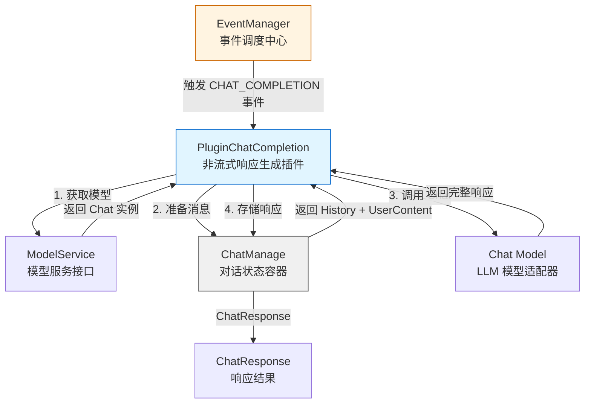

# LLM 非流式响应生成模块 (llm_non_streaming_response_generation)

## 概述

想象你在经营一家餐厅：顾客点餐后，厨房可以选择两种方式上菜——**流式**是厨师每做好一道菜就立即端出来，**非流式**则是等所有菜品完成后再一次性上桌。`llm_non_streaming_response_generation` 模块就是那个"等全部做完再上菜"的厨房工作站。

这个模块的核心职责是**在对话流水线的末端，调用 LLM 模型生成完整的响应并一次性返回**。它作为 [`chat_pipline_plugins_and_flow`](chat_pipline_plugins_and_flow.md) 子系统中的一个插件，通过事件驱动的方式被触发，负责将之前阶段准备好的对话历史、检索结果、上下文信息打包发送给 LLM，然后将模型的完整响应存储回流水线状态中供后续使用。

为什么需要单独的"非流式"模块？因为系统同时支持流式和非流式两种响应模式，它们的生命周期管理、数据传输方式和客户端交互模式完全不同。非流式模式适用于需要完整响应后才能进行后续处理的场景（如需要分析完整回答、进行二次处理、或客户端不支持流式接收），而流式模式则适合需要即时反馈的交互式对话。本模块通过插件化设计与流式模块并行存在，让系统可以根据请求配置灵活选择响应生成策略。

## 架构与数据流



### 组件角色说明

**EventManager** 是整个对话流水线的调度中枢，它维护着一个事件类型到插件列表的映射。当流水线执行到某个阶段时，会触发相应的事件，所有注册到该事件类型的插件按顺序执行。这种设计类似于**机场安检流水线**——每个安检口（事件点）有多个检查员（插件），每个检查员完成自己的工作后，旅客才能进入下一个安检口。

**PluginChatCompletion** 是本模块的核心组件，它实现了 `Plugin` 接口，声明自己只处理 `CHAT_COMPLETION` 类型的事件。当事件触发时，它执行三个关键步骤：
1. 通过 `ModelService` 获取配置好的 LLM 模型实例
2. 从 `ChatManage` 中提取对话历史和用户问题，组装成模型可接受的消息格式
3. 调用模型的 `Chat` 方法，等待完整响应返回后存入 `ChatManage.ChatResponse`

**ChatManage** 是对话流水线的"状态容器"，类似于一个**飞行记录仪**，它保存了从请求进入系统到响应生成完毕的完整状态：用户原始问题、重写后的查询、检索结果、对话历史、模型配置、以及最终的响应。所有插件都通过这个共享状态对象进行数据交换，而不是通过参数传递。

**ModelService** 是模型获取的抽象层，它屏蔽了不同模型提供商（OpenAI、Qwen、Ollama 等）的差异。本模块只关心"获取一个能对话的模型"，而不关心这个模型背后是调用哪个 API。这种设计使得系统可以动态切换模型提供商，而无需修改流水线逻辑。

### 数据流动路径

一次典型的非流式响应生成过程如下：

1. **事件触发**：当流水线执行到响应生成阶段，`EventManager` 触发 `CHAT_COMPLETION` 事件
2. **插件激活**：`PluginChatCompletion.OnEvent` 被调用，接收当前上下文、事件类型、`ChatManage` 状态和 `next` 回调函数
3. **模型准备**：调用 `prepareChatModel` 从 `ModelService` 获取 `Chat` 实例和 `ChatOptions` 配置
4. **消息组装**：调用 `prepareMessagesWithHistory` 将 `ChatManage.History` 和用户问题转换为 `Message` 数组
5. **模型调用**：执行 `chatModel.Chat(ctx, chatMessages, opt)`，这是一个**阻塞调用**，会等待 LLM 返回完整响应
6. **结果存储**：将 `ChatResponse` 存入 `ChatManage.ChatResponse`，供后续插件或 HTTP 处理器使用
7. **流水线继续**：调用 `next()` 将控制权交还给 `EventManager`，继续执行后续插件

## 核心组件详解

### PluginChatCompletion

**设计意图**：将 LLM 调用封装为可插拔的流水线阶段，使响应生成逻辑与其他阶段（如检索、重排序、历史加载）解耦。

```go
type PluginChatCompletion struct {
    modelService interfaces.ModelService
}
```

这个结构体非常简单，只依赖一个 `ModelService` 接口。这种极简设计是有意为之——它遵循**单一职责原则**，只负责"调用模型生成响应"这一件事。所有上下文管理、消息格式化、配置解析都由辅助函数或其他组件处理。

#### 关键方法

**`NewPluginChatCompletion(eventManager, modelService)`**

构造函数同时完成注册，这是一种**依赖注入 + 自动注册**的模式。传入 `EventManager` 后，插件立即将自己注册到事件系统中，无需调用方手动调用 `Register`。这种设计减少了样板代码，但也意味着插件的生命周期与 `EventManager` 绑定——一旦创建，就会一直存在于事件处理链中，直到 `EventManager` 被销毁。

**`ActivationEvents()`**

```go
func (p *PluginChatCompletion) ActivationEvents() []types.EventType {
    return []types.EventType{types.CHAT_COMPLETION}
}
```

这个方法声明了插件的"兴趣点"。`EventManager` 使用它来构建事件类型到插件的映射表。返回单个事件类型意味着这个插件是**专用型**的，只在一个特定阶段被激活。对比其他可能处理多个事件类型的通用插件，这种设计更清晰、更容易追踪数据流。

**`OnEvent(ctx, eventType, chatManage, next)`**

这是插件的核心执行逻辑，签名体现了流水线模式的关键特征：

- `ctx context.Context`：用于超时控制和请求追踪，贯穿整个调用链
- `eventType types.EventType`：触发当前调用的事件类型，可用于日志或条件分支
- `chatManage *types.ChatManage`：**共享状态指针**，所有插件通过它读写数据
- `next func() *PluginError`：**责任链模式的延续点**，调用它才能执行下一个插件

方法内部的处理流程体现了**防御性编程**思想：

```go
// 1. 记录输入状态（用于调试和监控）
pipelineInfo(ctx, "Completion", "input", ...)

// 2. 准备模型（可能失败）
chatModel, opt, err := prepareChatModel(ctx, p.modelService, chatManage)
if err != nil {
    return ErrGetChatModel.WithError(err)  // 立即返回，不继续执行
}

// 3. 准备消息
chatMessages := prepareMessagesWithHistory(chatManage)

// 4. 调用模型（可能失败）
chatResponse, err := chatModel.Chat(ctx, chatMessages, opt)
if err != nil {
    return ErrModelCall.WithError(err)  // 立即返回
}

// 5. 存储结果
chatManage.ChatResponse = chatResponse

// 6. 继续流水线
return next()
```

每个可能失败的步骤都会立即返回错误，阻止后续执行。这种**快速失败**策略避免了在无效状态下继续处理，减少了级联错误的可能性。

#### 参数与返回值

| 参数 | 类型 | 说明 |
|------|------|------|
| `ctx` | `context.Context` | 请求上下文，携带超时、追踪 ID 等信息 |
| `eventType` | `types.EventType` | 触发事件类型，此处应为 `CHAT_COMPLETION` |
| `chatManage` | `*types.ChatManage` | 对话状态容器，包含历史、配置、结果等 |
| `next` | `func() *PluginError` | 调用以继续执行流水线中的下一个插件 |

| 返回值 | 类型 | 说明 |
|--------|------|------|
| `*PluginError` | 错误对象 | `nil` 表示成功，非 `nil` 表示流水线应在此处中断 |

#### 副作用

- **修改 `chatManage.ChatResponse`**：这是最主要的副作用，将 LLM 响应写入共享状态
- **记录日志**：通过 `pipelineInfo` 和 `pipelineError` 记录关键节点信息
- **可能触发事件**：虽然本模块不直接发送事件，但 `ChatResponse` 中的内容可能被后续插件通过 `EventBus` 发送

### prepareChatModel（辅助函数）

虽然这个函数不在核心组件列表中，但理解它对于把握模块行为至关重要。它负责：

1. 从 `chatManage.ChatModelID` 获取模型 ID
2. 调用 `modelService.GetChatModel(ctx, modelId)` 获取 `Chat` 接口实例
3. 从 `chatManage` 中提取温度、TopP、MaxTokens 等参数，组装成 `ChatOptions`

这个函数的存在体现了**关注点分离**：`PluginChatCompletion` 只关心"调用模型"，而"如何获取和配置模型"由辅助函数处理。这使得主逻辑更清晰，也便于单元测试时 mock 模型准备过程。

### prepareMessagesWithHistory（辅助函数）

这个函数负责将 `ChatManage` 中的对话历史转换为 LLM 可接受的 `Message` 数组。典型处理包括：

1. 添加系统提示（如果有）
2. 按时间顺序添加历史对话（用户 - 助手交替）
3. 添加当前用户问题
4. 可能根据 `MaxRounds` 截断过长的历史

这个函数的设计反映了一个重要约束：**LLM 的上下文窗口是有限的**。如果无限制地添加历史，会导致 token 超限或成本过高。因此，消息准备逻辑必须包含截断或压缩策略（这由 [`llm_context_management_and_storage`](llm_context_management_and_storage.md) 模块处理）。

## 依赖关系分析

### 上游依赖（谁调用本模块）

本模块通过事件系统被 [`EventManager`](chat_pipline_plugins_and_flow.md) 调用。典型调用链：

```
HTTP Handler (session_qa_and_search_api)
    ↓
SessionService / AgentService
    ↓
EventManager.ExecutePipeline
    ↓
PluginChatCompletion.OnEvent (本模块)
```

HTTP 处理器接收用户请求后，创建 `ChatManage` 对象并填充配置，然后启动流水线。`EventManager` 按顺序触发各个阶段的事件，当到达 `CHAT_COMPLETION` 事件时，本模块被激活。

**隐式契约**：
- `ChatManage.ChatModelID` 必须已设置且有效
- `ChatManage.History` 应包含完整的对话历史（包括系统提示）
- `ChatManage.UserContent` 应包含当前用户问题
- 调用方应确保上下文有足够的超时时间（LLM 调用可能耗时较长）

### 下游依赖（本模块调用谁）

| 被调用组件 | 模块 | 调用目的 |
|-----------|------|----------|
| `ModelService.GetChatModel` | [`model_api`](model_api.md) | 获取 LLM 模型实例 |
| `Chat.Chat` | [`chat_completion_backends_and_streaming`](chat_completion_backends_and_streaming.md) | 执行实际的 LLM 调用 |
| `pipelineInfo/pipelineError` | 内部工具函数 | 记录日志和监控指标 |

**数据契约**：

本模块与 `ModelService` 之间的契约是 `interfaces.ModelService` 接口定义：
```go
GetChatModel(ctx context.Context, modelId string) (chat.Chat, error)
```

这个接口屏蔽了模型提供商的差异。无论底层是 OpenAI、Qwen 还是 Ollama，本模块都通过统一的 `Chat` 接口调用。

本模块与 `Chat` 实现之间的契约是：
- 输入：`[]Message` + `ChatOptions`
- 输出：`*ChatResponse` + `error`
- 行为：阻塞直到完整响应生成或超时

### 横向依赖（共享状态）

本模块与流水线中其他插件通过 `ChatManage` 共享状态：

| 共享字段 | 写入者 | 读取者 | 说明 |
|---------|--------|--------|------|
| `ChatModelID` | 请求处理器 | 本模块 | 指定使用哪个 LLM |
| `History` | [`PluginLoadHistory`](chat_pipline_plugins_and_flow.md) | 本模块 | 对话历史 |
| `UserContent` | 请求处理器 | 本模块 | 当前用户问题 |
| `ChatResponse` | 本模块 | 后续插件/HTTP 处理器 | LLM 完整响应 |
| `SummaryConfig` | 请求处理器 | 本模块（间接） | 影响模型参数 |

这种共享状态模式的优势是**减少参数传递的复杂性**，劣势是**隐式耦合**——插件之间通过共享字段产生依赖，但签名上没有体现。阅读代码时需要查看 `ChatManage` 的定义才能理解数据流。

## 设计决策与权衡

### 1. 插件化 vs 直接调用

**选择**：使用插件架构，通过 `EventManager` 间接调用

**权衡**：
- ✅ **优势**：
  - 响应生成逻辑与其他阶段解耦，可独立测试和替换
  - 支持在响应生成前后插入其他插件（如日志、指标、缓存）
  - 流式和非流式可以共存，通过事件类型区分
- ❌ **劣势**：
  - 增加了一层间接性，调试时需要理解事件系统
  - 共享状态模式导致隐式耦合，不如显式参数传递清晰
  - 插件执行顺序依赖注册顺序，不够显式

**为什么这样设计**：系统需要支持多种对话流程（简单问答、Agent 工具调用、多轮检索增强），插件化允许通过组合不同插件来构建不同流程，而无需为每种流程编写独立的处理函数。

### 2. 阻塞式调用 vs 流式调用

**选择**：本模块使用阻塞式 `Chat` 调用，等待完整响应

**权衡**：
- ✅ **优势**：
  - 实现简单，不需要处理流式数据的拼接和状态管理
  - 适合需要完整响应后才能处理的场景（如答案验证、二次生成）
  - Token 计数和用量统计更准确（一次性获取）
- ❌ **劣势**：
  - 首字延迟高，用户体验不如流式
  - 长响应时内存占用高（需要缓存完整响应）
  - 无法在生成过程中中断（如用户取消请求）

**为什么这样设计**：非流式模式是系统的**基础能力**，流式是在此之上的增强。先实现可靠的非流式响应，再扩展流式支持，符合渐进式开发原则。此外，某些场景（如批量处理、API 调用）确实需要完整响应。

### 3. 共享状态 vs 参数传递

**选择**：使用 `ChatManage` 作为共享状态容器

**权衡**：
- ✅ **优势**：
  - 插件签名简洁，不需要传递大量参数
  - 易于在插件之间传递复杂数据结构（如检索结果、图数据）
  - 支持插件按需读取/修改状态，灵活性高
- ❌ **劣势**：
  - 隐式依赖难以追踪，需要阅读 `ChatManage` 定义理解数据流
  - 并发安全性需要额外注意（虽然当前是顺序执行）
  - 测试时需要构造完整的 `ChatManage` 对象

**为什么这样设计**：对话流水线涉及大量上下文信息（历史、检索结果、配置、中间结果），如果用参数传递，每个插件的签名会变得非常复杂。共享状态模式牺牲了一定的显式性，换取了架构的简洁性和扩展性。

### 4. 快速失败 vs 容错重试

**选择**：遇到错误立即返回，不自动重试

**权衡**：
- ✅ **优势**：
  - 错误传播清晰，调用方能准确知道哪里失败
  - 避免在无效状态下继续执行，减少级联错误
  - 实现简单，不需要维护重试状态
- ❌ **劣势**：
  - 对瞬时错误（如网络抖动）不够友好
  - 需要调用方实现重试逻辑

**为什么这样设计**：重试策略应该由更上层的调用方（如 HTTP 处理器）统一处理，而不是在每个插件中重复实现。这样便于统一控制重试次数、退避策略和超时时间。

## 使用指南

### 基本使用场景

本模块通常不直接调用，而是通过配置流水线自动触发。典型使用流程：

```go
// 1. 创建 EventManager
eventManager := chatpipline.NewEventManager()

// 2. 创建 ModelService（依赖注入）
modelService := NewModelService(...)

// 3. 注册插件（自动注册到 EventManager）
chatpipline.NewPluginChatCompletion(eventManager, modelService)

// 4. 准备 ChatManage 状态
chatManage := &types.ChatManage{
    SessionID:   "session-123",
    ChatModelID: "gpt-4",
    History:     []*types.Message{...},
    UserContent: "用户问题",
}

// 5. 执行流水线（会触发 CHAT_COMPLETION 事件）
err := eventManager.ExecutePipeline(ctx, types.CHAT_COMPLETION, chatManage)

// 6. 获取响应
response := chatManage.ChatResponse
fmt.Println(response.Content)
```

### 配置选项

本模块的行为主要通过 `ChatManage` 中的字段配置：

| 字段 | 类型 | 说明 | 默认值 |
|------|------|------|--------|
| `ChatModelID` | `string` | LLM 模型 ID | 必填 |
| `History` | `[]*History` | 对话历史 | 空数组 |
| `MaxRounds` | `int` | 最大历史轮数 | 无限制 |
| `SummaryConfig` | `SummaryConfig` | 摘要配置 | 默认配置 |

模型级别的参数（温度、TopP、MaxTokens 等）在 `Model` 配置中定义，通过 `ModelService.GetChatModel` 获取时自动加载。

### 与流式模块的选择

系统同时提供 [`PluginChatCompletionStream`](llm_streaming_response_generation.md) 用于流式响应。选择依据：

| 场景 | 推荐模块 | 原因 |
|------|---------|------|
| 标准对话界面 | `PluginChatCompletionStream` | 用户体验更好，首字延迟低 |
| API 批量处理 | `PluginChatCompletion` | 需要完整响应后处理 |
| 答案验证/评分 | `PluginChatCompletion` | 需要完整内容才能评估 |
| Agent 工具调用 | `PluginChatCompletion` | 需要解析完整 ToolCalls |
| 低带宽环境 | `PluginChatCompletionStream` | 可边接收边显示 |

注意：两个插件都注册到不同的事件类型（`CHAT_COMPLETION` vs `CHAT_COMPLETION_STREAM`），不会冲突。调用方通过触发不同事件来选择模式。

## 边界情况与注意事项

### 1. 模型调用超时

LLM 调用可能耗时较长（尤其是长上下文或复杂推理）。**必须**在 `context.Context` 中设置合理的超时时间：

```go
// 推荐做法
ctx, cancel := context.WithTimeout(parentCtx, 60*time.Second)
defer cancel()
eventManager.ExecutePipeline(ctx, types.CHAT_COMPLETION, chatManage)
```

如果不设置超时，模型调用可能无限期阻塞，导致资源泄漏。

### 2. Token 超限处理

如果 `History` + `UserContent` 超过模型的上下文窗口，`Chat.Chat` 调用会失败。本模块**不自动处理**截断，需要：

- 在上游插件（如 [`PluginLoadHistory`](chat_pipline_plugins_and_flow.md)）中实现历史截断逻辑
- 或使用 [`contextManager`](llm_context_management_and_storage.md) 进行智能压缩
- 或在 `prepareMessagesWithHistory` 中添加保护逻辑

### 3. 错误类型区分

本模块返回的错误分为两类：

- **配置错误**（如模型 ID 无效）：应修复配置后重试
- **运行时错误**（如模型 API 超时）：可考虑重试

调用方应根据错误类型决定处理策略。可通过 `PluginError.ErrorType` 字段区分。

### 4. 并发安全性

`ChatManage` 是共享状态，但当前设计假设流水线是**顺序执行**的。如果在并发场景中使用（如多个 goroutine 同时修改同一个 `ChatManage`），需要外部同步。推荐做法是每个请求创建独立的 `ChatManage` 实例。

### 5. 响应内容验证

本模块**不验证** `ChatResponse.Content` 的内容质量。如果 LLM 返回空响应或格式错误的内容，会直接传递给调用方。需要质量保障的场景应在后续插件中添加验证逻辑。

### 6. 日志与监控

本模块通过 `pipelineInfo` 记录关键指标：
- 输入：session_id, user_question, history_rounds, chat_model
- 输出：answer_preview, finish_reason, completion_tokens, prompt_tokens

这些日志对于调试和监控非常重要。确保日志系统已正确配置，否则难以追踪问题。

### 7. 与 Agent 工具调用的交互

如果 LLM 响应中包含 `ToolCalls`，本模块会原样返回。但**不执行工具调用**——这是 Agent 引擎的职责。典型流程：

```
PluginChatCompletion → 返回带 ToolCalls 的响应
    ↓
AgentEngine → 解析 ToolCalls 并执行工具
    ↓
PluginChatCompletion → 再次调用 LLM（带工具结果）
```

这种设计将"生成响应"和"执行工具"解耦，使模块职责更清晰。

## 相关模块

- **[llm_streaming_response_generation](llm_streaming_response_generation.md)**：流式响应生成模块，使用 SSE 逐步返回响应片段
- **[chat_pipline_plugins_and_flow](chat_pipline_plugins_and_flow.md)**：对话流水线插件系统，本模块的父系统
- **[model_api](model_api.md)**：模型管理服务，提供模型配置和实例获取
- **[chat_completion_backends_and_streaming](chat_completion_backends_and_streaming.md)**：LLM 后端适配器，实现实际的模型调用
- **[llm_context_management_and_storage](llm_context_management_and_storage.md)**：上下文管理，处理历史截断和压缩
- **[agent_runtime_and_tools](agent_runtime_and_tools.md)**：Agent 引擎，处理工具调用和多轮推理

## 总结

`llm_non_streaming_response_generation` 模块是对话流水线的"最后一公里"——它将之前阶段准备好的所有信息打包发送给 LLM，然后将完整响应返回。虽然实现相对简单，但它体现了系统的关键设计哲学：

1. **插件化架构**：通过事件系统解耦各阶段，支持灵活组合
2. **共享状态模式**：用 `ChatManage` 减少参数传递复杂性
3. **快速失败策略**：遇到错误立即返回，避免级联问题
4. **接口抽象**：通过 `ModelService` 屏蔽模型提供商差异

理解这个模块的关键是把握它在整个流水线中的位置：它不负责检索、不负责历史管理、不负责工具执行，只专注于一件事——**调用 LLM 生成响应**。这种专注使得模块简单、可测试、易于维护。
