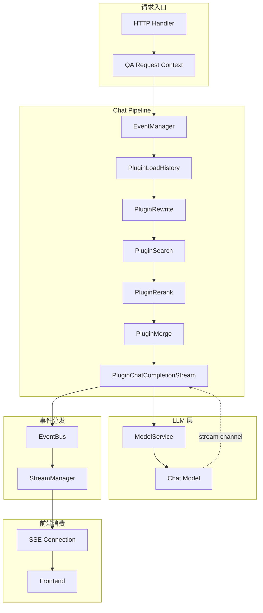

# LLM 流式响应生成模块 (llm_streaming_response_generation)

## 概述

想象你正在观看一场直播 —— 主播不是一次性把整场表演录好再播放，而是边演边播，观众能实时看到每一个动作、听到每一句话。**流式响应生成**做的就是同样的事情：它让 LLM 的回答像直播一样逐字逐句地推送给前端，而不是等整个回答生成完毕再一次性返回。

这个模块的核心价值在于**降低用户感知延迟**。在一个典型的 RAG 或 Agent 系统中，LLM 生成完整回答可能需要数秒甚至更长时间。如果采用传统的"请求 - 等待 - 返回"模式，用户在这段时间内看到的是空白或加载动画，体验极差。流式响应通过将回答拆分成细小的片段（chunk），在生成的同时立即推送，让用户在几百毫秒内就能看到第一个字，心理等待时间大幅缩短。

但流式响应的挑战在于**状态管理**和**事件协调**。LLM 的输出不是简单的文本流 —— 它可能包含思考过程（thinking）、工具调用（tool calls）、引用来源（references）等多种类型的内容，每种类型需要不同的前端渲染逻辑。这个模块通过**事件总线（EventBus）**和**插件化架构**，将复杂的流式响应拆解为一系列结构化的事件，让下游可以按需订阅和处理。

## 架构设计

### 模块定位



### 核心组件关系

| 组件 | 职责 | 依赖方向 |
|------|------|----------|
| `PluginChatCompletionStream` | 流式响应生成插件，协调 LLM 调用和事件发射 | 依赖 `ModelService`、`EventManager`、`EventBus` |
| `EventManager` | 插件注册和事件调度中心，按事件类型路由到对应插件 | 被 `PluginChatCompletionStream` 注册 |
| `EventBus` | 进程内事件总线，支持同步/异步事件分发 | 被 `PluginChatCompletionStream` 使用 |
| `StreamManager` | 流状态持久化（Redis/内存），支持断点续传 | 被 `EventBus` 间接使用 |
| `ModelService` | LLM 模型抽象层，统一不同提供商的 API | 被 `PluginChatCompletionStream` 调用 |

### 数据流 walkthrough

让我们追踪一个典型的流式问答请求：

1. **请求进入**：用户发起 QA 请求，`AgentStreamHandler` 创建 `qaRequestContext`，其中包含 `EventManager` 和 `EventBus`

2. **插件链执行**：`EventManager` 按顺序触发插件链：
   ```
   LoadHistory → Rewrite → Search → Rerank → Merge → ChatCompletionStream
   ```
   每个插件处理完后调用 `next()` 将控制权交给下一个插件

3. **流式调用启动**：`PluginChatCompletionStream.OnEvent` 被触发（事件类型 `CHAT_COMPLETION_STREAM`）：
   - 调用 `prepareChatModel` 获取配置好的 LLM 实例
   - 调用 `prepareMessagesWithHistory` 构建包含系统提示、历史对话、当前问题的消息列表
   - 调用 `chatModel.ChatStream(ctx, messages, opts)` 启动流式生成，返回一个 `responseChan`

4. **事件发射循环**：模块启动一个独立的 goroutine 消费 `responseChan`：
   ```
   for response := range responseChan {
       switch response.ResponseType {
       case Thinking:  发射 EventAgentFinalAnswer (带 <think> 标签)
       case Answer:    发射 EventAgentFinalAnswer (普通内容)
       case Error:     发射 EventError
       }
   }
   ```

5. **前端消费**：SSE 连接将事件实时推送给前端，前端根据事件类型渲染不同的 UI 组件（如 `deepThink.vue` 渲染思考过程）

## 组件深度解析

### PluginChatCompletionStream

**设计意图**：将流式响应生成封装为可插拔的 pipeline 组件，而非硬编码在 handler 中。这种设计使得：
- 可以轻松切换流式/非流式实现（参考 [`PluginChatCompletion`](llm_non_streaming_response_generation.md)）
- 可以在流式生成前后插入其他插件（如日志、监控、内容过滤）
- 便于单元测试，可以 mock `EventManager` 和 `ModelService`

**核心方法**：

```go
func (p *PluginChatCompletionStream) OnEvent(
    ctx context.Context,
    eventType types.EventType,
    chatManage *types.ChatManage,
    next func() *PluginError,
) *PluginError
```

**参数解析**：
- `ctx`：请求上下文，携带 trace ID、用户信息等，贯穿整个 pipeline
- `eventType`：触发事件类型，此处固定为 `CHAT_COMPLETION_STREAM`
- `chatManage`：**关键数据结构**，包含会话 ID、用户问题、历史对话、选中的模型 ID、EventBus 等所有必要信息
- `next`：插件链中的下一个插件，调用它表示当前插件完成工作

**内部状态机**：

流式消费 goroutine 维护了一个隐式的状态机来跟踪思考标签的完整性：

```
状态变量：
- thinkingStarted bool  // 是否已输出 <think> 开标签
- thinkingEnded   bool  // 是否已输出 </think> 闭标签
- finalContent    string // 累积的完整内容

状态转移：
Initial --(收到 Thinking)--> ThinkingStarted --(收到 Thinking Done)--> ThinkingEnded
ThinkingStarted --(收到 Answer)--> ThinkingEnded (强制闭合标签)
```

这个状态机解决了一个关键问题：**LLM 提供商的 thinking 响应可能不完整**。有些模型会在 thinking 结束时明确标记 `Done=true`，有些则不会。模块通过跟踪状态，确保即使模型没有正确闭合标签，前端也能收到完整的 `<think>...</think>` 包裹，从而正确渲染。

**关键代码片段分析**：

```go
// 思考内容处理：嵌入 <think> 标签
if response.ResponseType == types.ResponseTypeThinking {
    content := response.Content
    if !thinkingStarted {
        content = "<think>" + content  // 注入开标签
        thinkingStarted = true
    }
    if response.Done && !thinkingEnded {
        content = content + "</think>"  // 注入闭标签
        thinkingEnded = true
    }
    // 发射事件
    eventBus.Emit(ctx, types.Event{
        Type: types.EventType(event.EventAgentFinalAnswer),
        Data: event.AgentFinalAnswerData{
            Content: content,
            Done:    false,  // 思考不是最终答案
        },
    })
}
```

这里的设计决策值得注意：**为什么思考内容也通过 `EventAgentFinalAnswer` 发射，而不是单独的 `EventAgentThought`？**

答案是**前端渲染一致性**。在非 Agent 模式（普通问答）中，思考内容是嵌入在回答流中的，前端使用同一个组件（`deepThink.vue`）渲染。如果 Agent 模式使用不同的事件类型，前端需要维护两套渲染逻辑。通过统一事件类型，前端只需根据内容是否包含 `<think>` 标签来决定渲染方式。

### EventManager

**设计意图**：实现**责任链模式**，将复杂的 QA 流程拆解为独立可测试的插件。每个插件只关心自己负责的那一小块逻辑。

**注册机制**：
```go
func NewPluginChatCompletionStream(eventManager *EventManager, modelService interfaces.ModelService) *PluginChatCompletionStream {
    res := &PluginChatCompletionStream{modelService: modelService}
    eventManager.Register(res)  // 插件自注册
    return res
}
```

插件在构造时主动注册到 `EventManager`，`EventManager` 内部维护一个 `map[EventType][]Plugin`，将插件按处理的事件类型分组。

**执行流程**：
```go
// EventManager 内部伪代码
func (em *EventManager) Execute(ctx context.Context, eventType EventType, chatManage *ChatManage) *PluginError {
    plugins := em.listeners[eventType]
    var i int
    var next func() *PluginError
    next = func() *PluginError {
        if i >= len(plugins) {
            return nil
        }
        p := plugins[i]
        i++
        return p.OnEvent(ctx, eventType, chatManage, next)
    }
    return next()
}
```

这种设计使得插件可以**控制流程**：
- 调用 `next()` 继续执行后续插件
- 不调用 `next()` 直接返回，中断插件链（如权限校验失败）
- 在 `next()` 前后添加逻辑（如计时、日志）

### EventBus

**设计意图**：解耦事件生产者和消费者。`PluginChatCompletionStream` 只负责发射事件，不关心谁接收、如何存储、如何推送给前端。

**事件结构**：
```go
type Event struct {
    ID        string                 // 事件 ID（UUID，用于流式更新追踪）
    Type      EventType              // 事件类型（如 EventAgentFinalAnswer）
    SessionID string                 // 会话 ID（用于路由到正确的 SSE 连接）
    Data      interface{}            // 事件数据（如 AgentFinalAnswerData）
    Metadata  map[string]interface{} // 元数据
    RequestID string                 // 请求 ID（用于日志追踪）
}
```

**关键设计决策**：

1. **为什么事件 ID 是 UUID 而不是自增整数？**
   - 分布式系统中 UUID 更易去重和追踪
   - 前端可以用 ID 更新已有的消息块（而非追加新块）

2. **为什么 Data 是 interface{} 而不是具体类型？**
   - 不同事件类型有不同的数据结构
   - 使用接口保持灵活性，消费者通过类型断言获取具体数据

3. **同步 vs 异步**：
   `EventBus` 支持 `asyncMode` 配置。异步模式下，事件发射立即返回，事件在后台 goroutine 处理。这提高了吞吐量，但可能丢失事件（如果进程崩溃）。当前模块使用同步模式，确保事件可靠性。

## 依赖分析

### 上游依赖（谁调用这个模块）

| 调用方 | 调用方式 | 期望行为 |
|--------|----------|----------|
| [`EventManager`](chat_pipeline_plugins_and_flow.md) | `OnEvent(ctx, CHAT_COMPLETION_STREAM, chatManage, next)` | 处理流式生成事件，调用 `next()` 继续插件链 |
| [`AgentStreamHandler`](session_qa_and_search_api.md) | 间接通过 `EventManager.Execute()` | 期望模块发射事件到 `EventBus`，由 SSE 推送给前端 |

**关键契约**：
- 模块**必须**在 `OnEvent` 返回前启动流式消费 goroutine（否则事件不会发射）
- 模块**不应**阻塞 `OnEvent` 返回（流式消费在后台进行）
- 模块**必须**确保 `chatManage.EventBus` 不为 nil（否则返回错误）

### 下游依赖（这个模块调用谁）

| 被调用方 | 调用方式 | 用途 |
|----------|----------|------|
| [`ModelService`](model_api.md) | `chatModel.ChatStream(ctx, messages, opts)` | 调用 LLM 流式生成接口 |
| [`EventBus`](platform_infrastructure_and_runtime.md) | `eventBus.Emit(ctx, event)` | 发射流式事件 |
| `prepareChatModel` | 内部函数 | 从 `ModelService` 获取配置好的模型实例 |
| `prepareMessagesWithHistory` | 内部函数 | 构建消息列表（系统提示 + 历史 + 用户问题） |

**数据契约**：

1. **`ChatStream` 返回的 channel**：
   ```go
   type StreamResponse struct {
       ResponseType ResponseType  // Thinking, Answer, Error
       Content      string        // 当前片段内容
       Done         bool          // 是否是该类型的最后一片
       ToolCalls    []LLMToolCall // 工具调用（如果有）
   }
   ```
   模块假设 channel 在 LLM 完成或出错时关闭，使用 `for range` 安全消费。

2. **`EventBus.Emit` 的语义**：
   - 同步模式：事件立即分发给所有订阅者，`Emit` 返回时订阅者已处理完成
   - 错误处理：`Emit` 返回 error，但当前模块只记录日志，不中断流式消费（避免单点失败）

## 设计决策与权衡

### 1. 插件化 vs 硬编码

**选择**：插件化架构

**权衡**：
- ✅ **优点**：
  - 可测试性：可以 mock `EventManager` 单独测试插件逻辑
  - 可扩展性：可以轻松添加新的流式处理插件（如内容过滤、敏感词检测）
  - 可替换性：可以切换流式/非流式实现而不改动调用方
- ❌ **缺点**：
  - 复杂性：需要理解 `EventManager`、`next()` 等抽象
  - 性能开销：插件链调用有少量函数调用开销
  - 调试难度：错误堆栈更深，需要追踪插件链

**为什么适合这里**：Chat Pipeline 本身就是一个复杂的编排系统，包含历史加载、查询改写、检索、重排序、合并等多个步骤。将流式生成也作为插件，保持了架构一致性。

### 2. 事件驱动 vs 直接 SSE 写入

**选择**：事件驱动（通过 `EventBus` 发射事件，由其他组件写入 SSE）

**权衡**：
- ✅ **优点**：
  - 解耦：流式生成不关心 HTTP/SSE 细节
  - 可复用：同一套事件可以用于多种输出（SSE、WebSocket、日志）
  - 可观测性：事件可以被订阅用于监控、审计
- ❌ **缺点**：
  - 间接性：多了一层抽象，需要理解事件流转
  - 延迟：事件分发有少量开销

**为什么适合这里**：系统需要支持多种会话模式（Agent、普通问答），每种模式的事件类型和处理逻辑不同。事件驱动使得不同模式可以共享同一套 SSE 推送基础设施。

### 3. 思考标签注入 vs 依赖模型输出

**选择**：在模块中注入 `<think>` 和 `</think>` 标签

**权衡**：
- ✅ **优点**：
  - 一致性：确保所有思考内容都有完整的标签包裹
  - 容错性：即使模型输出不完整，前端也能正确渲染
  - 可控性：可以统一调整标签格式（如改为 `<think>`）
- ❌ **缺点**：
  - 耦合：模块需要知道前端期望的标签格式
  - 冗余：如果模型已经输出标签，会重复

**为什么适合这里**：不同 LLM 提供商的 thinking 输出格式不一致（有些有标签，有些没有）。模块统一注入标签，简化了前端逻辑。

### 4. Goroutine 消费 channel vs 同步消费

**选择**：启动独立 goroutine 消费 `responseChan`

**权衡**：
- ✅ **优点**：
  - 非阻塞：`OnEvent` 立即返回，不阻塞插件链
  - 并发性：流式消费和插件链后续步骤可以并行（虽然当前插件链在流式生成后结束）
- ❌ **缺点**：
  - 资源占用：每个请求多一个 goroutine
  - 错误处理复杂：goroutine 中的错误无法直接返回给调用方
  - 生命周期管理：需要确保 goroutine 在请求结束时退出

**为什么适合这里**：流式生成是长时间运行的操作（可能持续数秒），阻塞 `OnEvent` 会导致整个插件链卡住。使用 goroutine 是合理的选择。

## 使用指南

### 基本使用

模块通过 `NewPluginChatCompletionStream` 注册到 `EventManager`，通常由上层服务（如 `agentService` 或 `sessionService`）初始化：

```go
// 在 service 层初始化
eventManager := chatpipline.NewEventManager()
modelService := NewModelService()

// 注册流式响应插件
chatpipline.NewPluginChatCompletionStream(eventManager, modelService)

// 执行插件链
err := eventManager.Execute(ctx, types.CHAT_COMPLETION_STREAM, chatManage)
```

### 配置选项

流式行为通过 `ChatOptions` 控制：

```go
opt := &ChatOptions{
    Temperature:  0.7,
    MaxTokens:    2048,
    Thinking:     ptr.Bool(true),  // 启用思考模式
    Tools:        []Tool{...},     // 可用工具列表
    ToolChoice:   "auto",          // 工具选择策略
}
```

关键参数：
- `Thinking`：是否启用思考模式。启用后，LLM 会先输出思考过程，再输出最终答案
- `Tools`：工具列表。如果提供，LLM 可能返回工具调用而非直接回答
- `MaxTokens`：限制最大生成长度，避免流式时间过长

### 事件订阅

前端通过 SSE 订阅事件，后端通过 `EventBus` 发射事件。订阅示例：

```go
// 订阅 AgentFinalAnswer 事件
eventBus.Subscribe(types.EventAgentFinalAnswer, func(event types.Event) {
    data := event.Data.(event.AgentFinalAnswerData)
    if data.Done {
        // 流式结束，更新 UI 状态
    } else {
        // 追加内容到当前消息
        appendToMessage(data.Content)
    }
})
```

### 错误处理

模块在遇到错误时发射 `EventError` 事件：

```go
event.ErrorData{
    Error:     "LLM API timeout",
    Stage:     "chat_completion_stream",
    SessionID: "sess_123",
}
```

前端应监听该事件类型，显示友好的错误提示，并提供重试选项。

## 边界情况与陷阱

### 1. EventBus 为 nil

**现象**：`OnEvent` 返回 `ErrModelCall`，错误信息 "EventBus is required for streaming"

**原因**：`chatManage.EventBus` 未正确初始化

**解决方案**：确保在创建 `qaRequestContext` 时初始化 `EventBus`：
```go
chatManage.EventBus = event.NewEventBus()
```

### 2. 思考标签不闭合

**现象**：前端渲染的思考内容没有结束，后续内容也被当作思考

**原因**：LLM 在 thinking 响应中 `Done=false`，但后续直接切换到 answer 响应

**模块处理**：状态机检测到 `thinkingStarted && !thinkingEnded` 时，在收到第一个 answer 响应前强制注入 `</think>`

**注意事项**：如果自定义 LLM 适配器的 `ResponseType` 逻辑不正确，可能导致状态机失效。确保 `ChatStream` 正确区分 `Thinking` 和 `Answer`。

### 3. Channel 未关闭导致 Goroutine 泄漏

**现象**：请求结束后 goroutine 数量持续增长

**原因**：`responseChan` 在 LLM 异常时未正确关闭

**模块假设**：`ChatStream` 实现的 channel 在任何情况下（正常完成、错误、超时）都会关闭

**防御措施**：使用 `for range` 消费 channel，channel 关闭时循环自动退出。但如果 `ChatStream` 返回的 channel 永不关闭，goroutine 会永久阻塞。

**建议**：在 `ChatStream` 实现中添加超时机制：
```go
ctx, cancel := context.WithTimeout(ctx, 60*time.Second)
defer cancel()
```

### 4. 事件顺序错乱

**现象**：前端收到的内容片段顺序与 LLM 输出顺序不一致

**原因**：`EventBus` 使用异步模式，事件处理速度不一致

**模块现状**：当前使用同步 `Emit`，事件按发射顺序处理

**风险**：如果未来切换到异步模式，需要确保同一会话的事件按序处理。可以在 `Event` 中添加序列号，前端按序渲染。

### 5. 内存泄漏

**现象**：长时间运行后内存持续增长

**原因**：`finalContent` 累积所有内容，如果会话很长或流式时间很长，可能占用大量内存

**当前影响**：`finalContent` 仅用于调试日志，未实际使用

**优化建议**：如果不需要累积内容，可以移除 `finalContent` 变量，或限制累积长度。

## 扩展点

### 1. 自定义事件类型

可以扩展 `EventType` 支持新的事件类型（如引用来源、工具调用进度）：

```go
// 在 types/event_bus.go 中添加
const EventReferences EventType = "agent_references"

// 在插件中发射
eventBus.Emit(ctx, types.Event{
    Type: types.EventReferences,
    Data: event.AgentReferencesData{
        References: [...],
    },
})
```

### 2. 流式内容过滤

可以在插件链中插入内容过滤插件：

```go
type PluginContentFilter struct{}

func (p *PluginContentFilter) OnEvent(ctx context.Context, eventType types.EventType, chatManage *types.ChatManage, next func() *PluginError) *PluginError {
    // 包装 EventBus，拦截事件
    originalBus := chatManage.EventBus
    chatManage.EventBus = &FilteringEventBus{
        wrapped: originalBus,
        filter:  sensitiveWordFilter,
    }
    return next()
}
```

### 3. 流式响应缓存

可以实现缓存插件，对相同问题返回缓存的流式响应：

```go
type PluginStreamCache struct {
    cache Cache
}

func (p *PluginStreamCache) OnEvent(ctx context.Context, eventType types.EventType, chatManage *types.ChatManage, next func() *PluginError) *PluginError {
    cached := p.cache.Get(chatManage.UserContent)
    if cached != nil {
        // 重放缓存的流式事件
        p.replayCachedEvents(ctx, chatManage.EventBus, cached)
        return nil  // 不调用 next，跳过 LLM 调用
    }
    return next()
}
```

## 相关模块

- [`llm_non_streaming_response_generation`](llm_non_streaming_response_generation.md)：非流式响应生成插件，对比理解流式/非流式差异
- [`chat_pipeline_plugins_and_flow`](chat_pipeline_plugins_and_flow.md)：Chat Pipeline 整体架构，理解插件链执行流程
- [`session_qa_and_search_api`](session_qa_and_search_api.md)：QA 请求入口，了解 `qaRequestContext` 和 `EventManager` 初始化
- [`platform_infrastructure_and_runtime`](platform_infrastructure_and_runtime.md)：`EventBus` 和 `StreamManager` 底层实现

## 总结

`llm_streaming_response_generation` 模块的核心设计哲学是**解耦**和**可组合性**：

1. **解耦 LLM 调用和事件发射**：模块不直接写入 SSE，而是通过 `EventBus` 发射事件，使得流式生成逻辑与传输层解耦

2. **解耦插件职责**：通过 `EventManager` 和 `next()` 机制，每个插件只关心自己的逻辑，不关心上下游

3. **可组合的事件流**：事件可以被多个订阅者消费，支持日志、监控、前端渲染等多种用途

这种设计使得模块在保持简单核心逻辑的同时，能够灵活适应不同的使用场景（Agent 模式、普通问答、多模态等）。理解这个模块的关键是掌握**事件驱动架构**和**插件化模式**，这两者构成了整个 Chat Pipeline 的基础。
