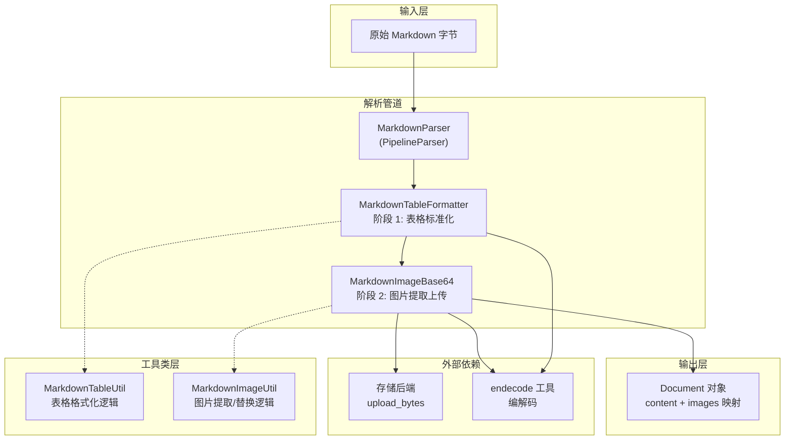

# markdown_native_parsing_and_render_helpers 模块深度解析

## 概述：为什么需要这个模块

想象你正在处理一个文档解析流水线，各种格式的文档源源不断地涌入 —— PDF、Word、Excel，当然还有 Markdown。Markdown 看似简单，但实际生产环境中它远非"纯文本"那么简单：表格可能来自不同工具导出，格式千奇百怪；图片可能以内嵌 base64 形式存在，体积庞大且无法被下游系统直接访问。

**这个模块解决的核心问题是**：如何将"原始"Markdown 转换为"标准化、可消费"的 Markdown，使其能够被后续的检索、索引和问答系统高效处理。

 naive 的做法可能是直接返回原始内容，但这会带来两个实际问题：

1. **表格格式混乱**：不同工具生成的 Markdown 表格对齐方式、空格使用不一致，导致后续基于规则的表格解析器无法可靠识别表格边界
2. **内嵌图片不可用**：base64 图片数据无法被外部系统访问，且占用大量内存，需要提取并上传到对象存储

`markdown_native_parsing_and_render_helpers` 模块采用**管道（Pipeline）模式**，将 Markdown 处理分解为多个独立阶段，每个阶段专注一个转换任务。这种设计使得代码易于测试、扩展和复用。

---

## 架构与数据流



### 数据流详解

1. **入口**：`MarkdownParser.parse_into_text(bytes)` 接收原始字节流
2. **阶段 1 - 表格格式化**：
   - `MarkdownTableFormatter` 解码字节为字符串
   - 调用 `MarkdownTableUtil.format_table()` 标准化所有表格
   - 返回包含格式化内容的 `Document`
3. **阶段 2 - 图片处理**：
   - `MarkdownImageBase64` 接收上一阶段的输出
   - `MarkdownImageUtil.extract_base64()` 提取 base64 图片并解码为二进制
   - 调用 `storage.upload_bytes()` 上传图片到对象存储
   - `MarkdownImageUtil.replace_path()` 将临时路径替换为最终 URL
4. **出口**：返回包含标准化内容和图片 URL 映射的 `Document`

### 管道模式的核心机制

`PipelineParser` 的设计精妙之处在于它**自动串联多个解析器**，并**累积各阶段的图片资源**：

```python
# PipelineParser.parse_into_text 的核心逻辑
images: Dict[str, str] = {}
for p in self._parsers:
    document = p.parse_into_text(content)
    content = endecode.encode_bytes(document.content)  # 转为字节传给下一阶段
    images.update(document.images)  # 累积图片
document.images.update(images)  # 合并到最终文档
```

这种设计使得每个解析器只需关注自己的转换逻辑，无需关心上下游如何处理数据。

---

## 核心组件深度解析

### 1. MarkdownParser —— 管道编排者

**设计意图**：作为 `PipelineParser` 的子类，`MarkdownParser` 本身不包含具体解析逻辑，而是通过声明 `_parser_cls` 类变量来配置处理管道的组成。

```python
class MarkdownParser(PipelineParser):
    _parser_cls = (MarkdownTableFormatter, MarkdownImageBase64)
```

**为什么这样设计？**

这是一种**配置优于编码**的思路。通过类变量而非硬编码的 `__init__`，系统可以在运行时动态创建不同的管道组合。例如，未来可能需要添加第三个阶段来处理数学公式，只需修改 `_parser_cls` 元组即可。

**关键特性**：
- **无状态编排**：不保存任何解析状态，所有状态都在 `Document` 对象中传递
- **可扩展性**：通过 `PipelineParser.create()` 工厂方法可动态创建新的管道组合

### 2. MarkdownTableFormatter —— 表格标准化器

**职责**：将任意格式的 Markdown 表格转换为统一的标准格式。

**核心算法**：两阶段正则替换

```python
# 第一阶段：格式化普通行（表头和数据行）
formatted_content = self.line_pattern.sub(process_line, formatted_content)
# 第二阶段：格式化对齐行（必须在之后，避免冲突）
formatted_content = self.align_pattern.sub(process_align, formatted_content)
```

**为什么分两阶段？**

对齐行（如 `|:---|---:|`）本身也匹配普通行的模式。如果先处理对齐行，后续处理普通行时会破坏已格式化的对齐标记。这个顺序是**经过实践验证的依赖关系**。

**处理逻辑**：
1. 使用 `line_pattern` 匹配所有表格行，统一添加 `| ` 前缀和 ` |` 后缀，列之间用 ` | ` 分隔
2. 使用 `align_pattern` 专门匹配对齐行，标准化为 `:---`、`---:` 或 `:---:` 三种形式
3. **保留原始缩进**：通过捕获组 `([\t ]*)` 提取行首空白，在输出时原样保留

**设计权衡**：
- ✅ **优点**：纯正则实现，性能高，无外部依赖
- ⚠️ **局限**：无法处理嵌套表格或极端复杂的表格结构（但这类情况在实际文档中极少见）

### 3. MarkdownImageBase64 —— 图片提取与上传器

**职责**：识别内嵌 base64 图片，解码并上传到对象存储，返回可公开访问的 URL。

**处理流程**：

```
原始 Markdown
    ↓
extract_base64() → 提取 base64 数据，生成临时路径 (images/uuid.png)
    ↓
storage.upload_bytes() → 上传二进制数据，获取真实 URL
    ↓
replace_path() → 将临时路径替换为真实 URL
    ↓
返回 Document(content=标准化 Markdown, images={URL: base64})
```

**关键设计决策**：

1. **两阶段路径替换**：
   - 第一阶段生成临时路径（如 `images/uuid.png`）
   - 上传后建立临时路径到真实 URL 的映射
   - 第二阶段用真实 URL 替换临时路径
   
   **为什么？** 因为 `extract_base64` 需要在返回文本前就知道图片路径，但上传操作需要访问 `storage` 实例。分离这两个步骤使得逻辑清晰且易于测试。

2. **图片数据双重存储**：
   ```python
   images[image_url] = base64.b64encode(b64_bytes).decode()
   ```
   `Document.images` 存储的是 `URL → base64 字符串` 的映射，而非二进制数据。
   
   **为什么？** 下游系统可能需要 base64 格式进行进一步处理（如生成缩略图），而 URL 用于渲染。这种设计避免了重复编解码。

3. **错误处理策略**：
   ```python
   if not image_byte:
       logger.error(f"Failed to decode base64 image skip it: {img_b64}")
       return title  # 返回纯文本替代
   ```
   解码失败时返回 alt 文本而非抛出异常，确保**单个图片失败不影响整体解析**。

### 4. MarkdownTableUtil & MarkdownImageUtil —— 工具类层

这两个工具类体现了**关注点分离**原则：

| 工具类 | 职责 | 无状态 |
|--------|------|--------|
| `MarkdownTableUtil` | 纯表格格式化逻辑 | ✅ 是 |
| `MarkdownImageUtil` | 图片提取、解码、路径替换 | ✅ 是 |

**为什么需要工具类？**

1. **可测试性**：工具类不依赖 `BaseParser` 的复杂初始化（如 `storage`、`chunking_config`），可以独立单元测试
2. **可复用性**：其他解析器（如 `MarkitdownParser`）可能也需要表格格式化，可直接复用 `MarkdownTableUtil`
3. **职责清晰**：解析器类负责协调和 I/O，工具类负责纯转换逻辑

---

## 依赖关系分析

### 上游依赖（被谁调用）

```
format_specific_parsers (父模块)
    └── 其他解析器可能通过 PipelineParser 组合使用本模块
```

本模块通常作为 `docreader_pipeline` 的一部分被调用，处理流程为：

```
文件类型检测 → 选择对应 Parser → MarkdownParser.parse() → Document
```

### 下游依赖（调用谁）

| 依赖 | 用途 | 耦合度 |
|------|------|--------|
| `PipelineParser` | 管道基类 | 紧耦合（继承） |
| `BaseParser` | 解析器接口 | 紧耦合（继承） |
| `Document` | 数据载体 | 紧耦合（返回类型） |
| `storage.upload_bytes` | 图片上传 | 松耦合（通过 `self.storage`） |
| `endecode.decode_bytes/encode_image` | 编解码工具 | 松耦合（工具函数） |

### 数据契约

**输入**：`bytes` —— 原始 Markdown 文件内容（自动检测编码）

**输出**：`Document` 对象，包含：
```python
Document(
    content=str,      # 标准化后的 Markdown 文本
    images={          # 图片 URL 到 base64 的映射
        "https://storage.com/uuid.png": "iVBORw0KGgo...",
    },
    chunks=[],        # 本模块不生成 chunks，由 BaseParser.parse() 后续处理
    metadata={}
)
```

**隐式契约**：
- `self.storage` 必须在解析器初始化时注入（由 `BaseParser.__init__` 根据 `chunking_config.storage_config` 创建）
- 图片上传必须成功，否则 URL 映射不完整

---

## 设计决策与权衡

### 1. 同步 vs 异步

**选择**：本模块采用**同步**实现，图片上传也是同步阻塞的。

**权衡分析**：
- ✅ **优点**：代码简单，调试容易，符合 `BaseParser` 的整体同步设计
- ⚠️ **缺点**：大量图片时阻塞时间长
- 🔧 **缓解**：`BaseParser` 在 chunk 级别的图片处理提供了异步方法（`process_chunks_images_async`），但 Markdown 解析阶段保持同步以确保管道顺序

**适用场景**：适合图片数量较少的文档。如果预期大量图片，应考虑在管道外部并行处理。

### 2. 继承 vs 组合

**选择**：使用**继承**（`MarkdownParser extends PipelineParser`）而非组合。

**权衡分析**：
- ✅ **优点**：符合框架整体设计模式，`PipelineParser` 的管道逻辑可复用
- ⚠️ **缺点**：耦合度较高，无法在运行时动态更换管道组成
- 💡 **改进点**：`PipelineParser.create()` 工厂方法提供了一定程度的动态性

### 3. 正则 vs 解析器

**选择**：使用**正则表达式**而非完整的 Markdown 解析器（如 `mistune`、`markdown-it`）。

**权衡分析**：
- ✅ **优点**：零依赖、性能高、只处理需要的特性（表格和图片）
- ⚠️ **缺点**：无法处理复杂嵌套结构，正则表达式维护成本高
- 🎯 **合理性**：本模块目标是"标准化"而非"完整解析"，正则足够满足需求

### 4. UUID 命名 vs 原始文件名

**选择**：使用 `uuid.uuid4()` 生成图片文件名，而非保留原始信息。

**权衡分析**：
- ✅ **优点**：避免文件名冲突，无需处理文件名 sanitization
- ⚠️ **缺点**：丢失原始文件名信息，调试时难以追溯
- 💡 **改进建议**：可在 `metadata` 中保留原始文件名映射

---

## 使用指南

### 基本用法

```python
from docreader.parser.markdown_parser import MarkdownParser

# 创建解析器实例
parser = MarkdownParser(
    file_name="example.md",
    chunking_config=chunking_config,  # 包含 storage_config
)

# 解析 Markdown 内容
with open("example.md", "rb") as f:
    content = f.read()

document = parser.parse_into_text(content)

# 访问结果
print(document.content)  # 标准化后的 Markdown
print(document.images)   # {url: base64, ...}
```

### 自定义管道

```python
from docreader.parser.chain_parser import PipelineParser
from docreader.parser.markdown_parser import MarkdownTableFormatter, MarkdownImageBase64

# 创建只包含表格格式化的管道
TableOnlyParser = PipelineParser.create(MarkdownTableFormatter)
parser = TableOnlyParser()

# 或添加自定义解析器
CustomParser = PipelineParser.create(
    MyPreprocessor,
    MarkdownTableFormatter,
    MarkdownImageBase64,
    MyPostprocessor,
)
```

### 配置存储后端

图片上传依赖 `storage` 实例，通过 `chunking_config.storage_config` 配置：

```python
from docreader.models.read_config import ChunkingConfig, StorageConfig

storage_config = StorageConfig(
    storage_type="minio",  # 或 "cos", "s3", "local"
    bucket="my-bucket",
    # ... 其他配置
)

chunking_config = ChunkingConfig(
    storage_config=storage_config,
    # ... 其他配置
)

parser = MarkdownParser(chunking_config=chunking_config)
```

---

## 边界情况与注意事项

### 1. Base64 解码失败

**现象**：某些 base64 字符串可能包含非法字符或截断。

**处理**：`extract_base64` 会记录错误并返回 alt 文本，不会中断整体解析。

**建议**：在生产环境中监控日志中的 `Failed to decode base64 image` 错误，可能指示数据质量问题。

### 2. 表格识别边界

**现象**：以下情况可能无法正确识别为表格：
- 缺少对齐行
- 列数不一致
- 表格中间有空行

**原因**：正则表达式设计为匹配"标准"Markdown 表格。

**建议**：如果源文档表格格式不规范，建议在生成 Markdown 时进行预处理。

### 3. 图片上传超时

**现象**：大量图片时，`upload_bytes` 可能超时或失败。

**当前行为**：异常会向上传播，导致整个解析失败。

**建议**：
- 在 `storage` 层实现重试机制
- 考虑在管道外部并行上传图片
- 设置合理的 `max_concurrent_tasks` 限制并发数

### 4. 编码自动检测

**现象**：`endecode.decode_bytes` 自动检测编码，但可能误判。

**建议**：如果已知文档编码，可在调用前显式解码：
```python
text = content.decode("utf-8")
document = parser.parse_into_text(text.encode("utf-8"))  # 仍需要 bytes 输入
```

### 5. 内存占用

**现象**：大 base64 图片会同时存在于：
1. 原始 content 字符串
2. 解码后的 bytes
3. Document.images 字典

**建议**：对于超大文档，考虑流式处理或分块解析。

---

## 扩展点

### 添加新的处理阶段

```python
class MarkdownMathFormatter(BaseParser):
    """自定义阶段：标准化数学公式"""
    
    def parse_into_text(self, content: bytes) -> Document:
        text = endecode.decode_bytes(content)
        # ... 处理逻辑
        return Document(content=text)

# 组合到管道
ExtendedMarkdownParser = PipelineParser.create(
    MarkdownTableFormatter,
    MarkdownMathFormatter,  # 新增阶段
    MarkdownImageBase64,
)
```

### 替换图片处理策略

如果不需要上传到对象存储，可继承 `MarkdownImageBase64` 并重写 `parse_into_text`：

```python
class LocalImageMarkdownParser(MarkdownImageBase64):
    def parse_into_text(self, content: bytes) -> Document:
        text = endecode.decode_bytes(content)
        text, img_b64 = self.image_helper.extract_base64(text, path_prefix="local_images")
        
        # 保存到本地而非上传
        for ipath, b64_bytes in img_b64.items():
            with open(ipath, "wb") as f:
                f.write(b64_bytes)
        
        return Document(content=text, images=img_b64)
```

---

## 相关模块参考

- [parser_framework_and_orchestration](parser_framework_and_orchestration.md) —— 解析器框架基础，`BaseParser` 和 `PipelineParser` 的设计
- [document_models_and_chunking_support](document_models_and_chunking_support.md) —— `Document` 和 `Chunk` 数据模型
- [format_specific_parsers](format_specific_parsers.md) —— 其他格式解析器（PDF、Word 等）的实现对比

---

## 总结

`markdown_native_parsing_and_render_helpers` 模块体现了**单一职责**和**管道模式**的经典设计：

1. **职责清晰**：表格格式化和图片处理分离，各自独立可测试
2. **易于扩展**：通过 `PipelineParser` 可灵活组合处理阶段
3. **容错设计**：单点失败不影响整体流程
4. **实用主义**：正则表达式足够满足需求，避免过度工程

理解这个模块的关键在于把握**管道思维**：每个阶段接收上一阶段的输出，进行特定转换，传递给下一阶段。这种模式在文档处理、ETL、编译器等场景中广泛适用。
