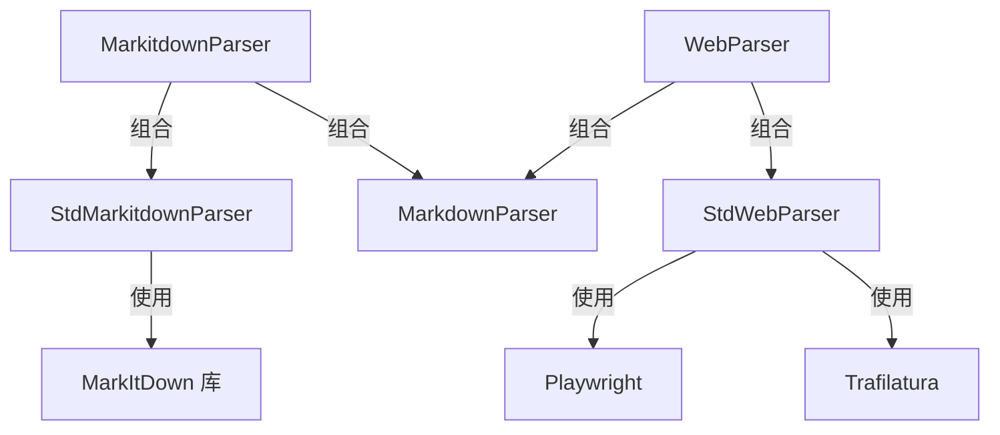

# Markitdown 和 Web 源解析模块

## 概述

在文档处理系统中，我们面临着两类特殊但常见的输入源：一是需要转换为结构化文本的各种二进制文档格式（如 DOCX、PPTX、PDF 等），二是需要提取干净内容的网页。`markitdown_and_web_source_parsing` 模块正是为了解决这两个问题而设计的。

这个模块的核心价值在于：它将异构的输入源（二进制文档和网页）统一转换为系统可以处理的 Markdown 格式，为后续的文档分析、索引和检索提供标准化的输入。

## 架构设计



### 核心组件说明

本模块采用了**管道（Pipeline）模式**，将文档解析过程分解为多个独立的步骤，每个步骤由专门的解析器负责。这种设计使得我们可以灵活地组合不同的解析器来处理不同类型的输入。

1. **MarkitdownParser**：作为管道解析器，它将 `StdMarkitdownParser` 和 `MarkdownParser` 串联起来，先使用 MarkItDown 库将二进制文档转换为 Markdown，再对生成的 Markdown 进行进一步处理。

2. **StdMarkitdownParser**：MarkItDown 库的封装器，负责将各种二进制文档格式转换为纯文本或 Markdown。

3. **WebParser**：另一个管道解析器，将 `StdWebParser` 和 `MarkdownParser` 组合在一起，用于处理网页内容。

4. **StdWebParser**：负责网页抓取和内容提取，使用 Playwright 进行网页渲染和抓取，再用 Trafilatura 从 HTML 中提取干净的内容。

## 设计决策与权衡

### 1. 管道模式的选择

**决策**：使用管道模式（PipelineParser）来组合多个解析器。

**原因**：
- 单一职责原则：每个解析器只负责一个特定的转换步骤
- 灵活性：可以根据需要轻松添加、移除或替换解析器
- 可测试性：每个解析器可以独立测试

**权衡**：
- 增加了一定的抽象层级，但带来了更好的可维护性
- 多个解析器之间的文档传递需要额外的序列化/反序列化开销

### 2. 异常处理策略

**决策**：在 `StdMarkitdownParser` 中移除了 try-catch，让异常由上层 `PipelineParser` 统一捕获。

**原因**：
- 集中式错误处理：所有解析器的异常都在同一层级处理
- 简化了单个解析器的代码
- 便于实现统一的错误日志和恢复策略

**权衡**：
- 单个解析器无法针对特定错误进行定制化处理
- 错误定位可能稍微复杂一些

### 3. Web 解析的技术选型

**决策**：使用 Playwright + Trafilatura 的组合来处理网页解析。

**原因**：
- Playwright 提供了强大的浏览器自动化能力，可以处理动态加载的内容
- Trafilatura 专门用于从网页中提取干净的文本内容，过滤广告和导航
- 两者结合可以处理大多数现代网页

**权衡**：
- Playwright 需要额外的依赖和浏览器二进制文件，增加了部署复杂度
- 对于静态网页，这种方案可能显得过于重量级

## 数据流程

### Markitdown 文档解析流程

1. 输入：二进制文档内容（如 DOCX、PPTX、PDF 等）
2. `MarkitdownParser` 接收输入，首先传递给 `StdMarkitdownParser`
3. `StdMarkitdownParser` 使用 MarkItDown 库将二进制内容转换为 Markdown 文本
4. 转换后的 Markdown 文本传递给 `MarkdownParser` 进行进一步处理
5. 输出：处理后的 Document 对象

### Web 页面解析流程

1. 输入：URL（编码为 bytes）
2. `WebParser` 接收输入，首先传递给 `StdWebParser`
3. `StdWebParser` 使用 Playwright 渲染并抓取网页 HTML
4. Trafilatura 从 HTML 中提取干净的内容并转换为 Markdown
5. Markdown 传递给 `MarkdownParser` 进行进一步处理
6. 输出：处理后的 Document 对象

## 子模块

本模块包含以下子模块，每个子模块都有详细的文档：

- [Markitdown 解析器接口与流程](docreader_pipeline-format_specific_parsers-markitdown_and_web_source_parsing-markitdown_parser_interface_and_flow.md)
- [标准 Markitdown 解析器实现](docreader_pipeline-format_specific_parsers-markitdown_and_web_source_parsing-standard_markitdown_parser_implementation.md)
- [Web 源解析适配器](docreader_pipeline-format_specific_parsers-markitdown_and_web_source_parsing-web_source_parsing_adapter.md)

## 跨模块依赖

本模块依赖于以下模块：

- [docreader.parser.base_parser](docreader_parser_base_parser.md)：提供解析器基类
- [docreader.parser.chain_parser](docreader_parser_chain_parser.md)：提供管道解析器功能
- [docreader.parser.markdown_parser](docreader_parser_markdown_parser.md)：提供 Markdown 解析功能
- [docreader.models.document](docreader_models_document.md)：定义文档数据模型

## 使用指南

### 解析二进制文档

```python
from docreader.parser.markitdown_parser import MarkitdownParser

# 创建解析器实例
parser = MarkitdownParser(file_type="docx")

# 读取文档内容
with open("document.docx", "rb") as f:
    content = f.read()

# 解析文档
document = parser.parse_into_text(content)
print(document.content)  # 输出解析后的 Markdown 内容
```

### 解析网页

```python
from docreader.parser.web_parser import WebParser

# 创建解析器实例
parser = WebParser(title="示例网页")

# 解析网页
url = "https://example.com"
document = parser.parse_into_text(url.encode())
print(document.content)  # 输出解析后的 Markdown 内容
```

## 注意事项与常见问题

1. **文件类型提示**：使用 `MarkitdownParser` 时，最好提供 `file_type` 参数，这可以帮助 MarkItDown 库更准确地解析文档。

2. **网页解析超时**：`StdWebParser` 中设置了 30 秒的页面加载超时，对于某些慢速网站可能需要调整。

3. **代理配置**：网页解析支持代理配置，通过 `CONFIG.external_https_proxy` 设置。

4. **异步到同步的转换**：`StdWebParser` 使用 `asyncio.run` 将异步的 Playwright 操作转换为同步调用，在已经有事件循环的环境中需要注意。

5. **MarkItDown 库的限制**：虽然 MarkItDown 支持多种格式，但对于某些复杂格式的文档，转换效果可能不理想，可能需要特定的解析器。
