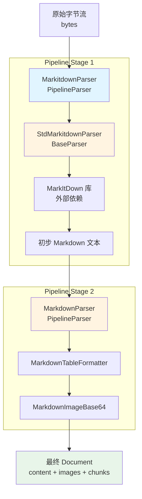

# MarkItDown Parser Interface and Flow

## 概述：为什么需要这个模块

想象你有一个"万能文档转换器"的需求：用户上传的可能是 Word、PPT、PDF、Excel 等十几种不同格式的文件，但你的下游系统只认 Markdown。最 naive 的做法是为每种格式写一个解析器，然后用一堆 `if-else` 判断该用哪个。但这种方式有两个致命问题：

1. **格式识别的模糊性**：文件扩展名可能错误，MIME 类型可能不准确，有些格式（如旧版 `.doc` 和新版 `.docx`）内部结构完全不同
2. **解析质量的层次性**：单一解析器很难在所有场景下都表现良好，有时需要"先粗后精"的多阶段处理

`markitdown_parser_interface_and_flow` 模块的核心设计洞察是：**将文档解析视为一个流水线（pipeline）而非一次性转换**。它通过组合两个关键组件来实现这一理念：

- **`StdMarkitdownParser`**：一个"粗转换器"，利用成熟的 `markitdown` 库将任意格式快速转为 Markdown
- **`MarkdownParser`**：一个"精修器"，对 Markdown 内容进行表格规范化、图片提取等后处理

这种设计的精妙之处在于，它不试图自己成为所有格式的专家，而是**站在巨人的肩膀上**——封装外部库的能力，同时通过流水线模式确保输出质量的一致性。

---

## 架构与数据流



### 组件角色说明

| 组件 | 架构角色 | 职责 |
|------|----------|------|
| `MarkitdownParser` | **流水线编排器** | 定义解析阶段的顺序，协调 `StdMarkitdownParser` 和 `MarkdownParser` 的执行 |
| `StdMarkitdownParser` | **格式转换器** | 调用 `markitdown` 库将任意格式（docx、pptx、pdf 等）转为 Markdown |
| `MarkdownParser` | **后处理器** | 对 Markdown 进行表格格式化、图片提取等精细化处理 |

### 数据流动路径

1. **输入**：原始文件字节流（`bytes`）进入 `MarkitdownParser.parse_into_text()`
2. **第一阶段**：`StdMarkitdownParser` 接收字节流，调用 `markitdown.convert()` 输出初步 Markdown 文本
3. **中间转换**：文本被编码回 `bytes`（通过 `endecode.encode_bytes()`），作为下一阶段的输入
4. **第二阶段**：`MarkdownParser` 接收 Markdown 字节流，依次通过 `MarkdownTableFormatter` 和 `MarkdownImageBase64` 处理
5. **图片累积**：每个阶段提取的图片被合并到 `document.images` 字典中
6. **输出**：返回包含 `content`、`images`、`chunks` 的完整 `Document` 对象

---

## 组件深度解析

### `MarkitdownParser`：流水线编排器

```python
class MarkitdownParser(PipelineParser):
    _parser_cls = (StdMarkitdownParser, MarkdownParser)
```

**设计意图**：这是一个**声明式配置**的典范。类本身几乎不包含逻辑，仅通过 `_parser_cls` 元组定义流水线的组成。这种设计遵循"配置优于编码"的原则——如果你想改变解析顺序或替换某个阶段，只需修改这个元组，无需触碰核心逻辑。

**继承关系**：`MarkitdownParser` → `PipelineParser` → `BaseParser`

**关键机制**：
- 在 `__init__` 中，`PipelineParser` 会实例化 `_parser_cls` 中的所有解析器
- 在 `parse_into_text()` 中，按顺序调用每个解析器，将上一阶段的输出作为下一阶段的输入
- 图片资源在所有阶段间**累积合并**，而非覆盖

**为什么选择继承而非组合？** 这里使用继承是为了利用 `PipelineParser` 的通用流水线逻辑。如果每个解析器都自己实现流水线，会导致大量重复代码。继承使得 `MarkitdownParser` 只需声明"用什么解析器"，而无需关心"如何执行流水线"。

---

### `StdMarkitdownParser`：格式转换适配器

```python
class StdMarkitdownParser(BaseParser):
    def __init__(self, *args, **kwargs):
        super().__init__(*args, **kwargs)
        self.markitdown = MarkItDown()

    def parse_into_text(self, content: bytes) -> Document:
        ext = self.file_type
        if ext and not ext.startswith('.'):
            ext = '.' + ext
        
        result = self.markitdown.convert(
            io.BytesIO(content),
            file_extension=ext,
            keep_data_uris=True
        )
        return Document(content=result.text_content)
```

**设计意图**：这是一个典型的**适配器模式（Adapter Pattern）**。`markitdown` 库有自己的 API 和返回格式，但系统内部使用统一的 `Document` 模型。`StdMarkitdownParser` 的作用就是在这两者之间做翻译。

**关键设计决策**：

1. **移除 try-catch**：代码注释明确说明"让异常由上层 PipelineParser 统一捕获"。这是一个**关注点分离**的设计——解析器只负责解析，错误处理由编排层统一管理。这样做的好处是：
   - 解析器逻辑更清晰，不会被错误处理代码污染
   - 上层可以根据策略决定是重试、跳过还是返回空文档

2. **`file_type` 的继承**：`self.file_type` 来自 `BaseParser` 的初始化。这使得解析器可以接收文件格式提示，帮助 `markitdown` 库更准确地识别格式。

3. **`keep_data_uris=True`**：保留内嵌的 base64 图片数据，供后续 `MarkdownImageBase64` 处理。

**依赖契约**：
- **输入**：`content: bytes`（原始文件字节流）
- **输出**：`Document` 对象（至少包含 `content` 字段）
- **前置条件**：`self.file_type` 已被正确设置（由 `BaseParser.__init__` 保证）

---

### `MarkdownParser`：Markdown 后处理流水线

```python
class MarkdownParser(PipelineParser):
    _parser_cls = (MarkdownTableFormatter, MarkdownImageBase64)
```

**设计意图**：`MarkdownParser` 本身也是一个 `PipelineParser`，这体现了**递归组合**的设计思想。一个流水线可以包含另一个流水线作为其阶段之一。

**子阶段职责**：

| 子解析器 | 职责 |
|----------|------|
| `MarkdownTableFormatter` | 规范化 Markdown 表格格式，确保列对齐、分隔符一致 |
| `MarkdownImageBase64` | 提取 base64 编码的图片，上传到对象存储，替换为可访问 URL |

**为什么需要独立的 Markdown 处理阶段？** `markitdown` 库的输出是"通用 Markdown"，但系统对 Markdown 有特定要求：
- 表格格式必须规范，便于后续解析和展示
- 图片不能以内嵌 base64 形式存在（体积大、难缓存），需要上传到对象存储

---

## 依赖分析

### 上游依赖（谁调用它）

`MarkitdownParser` 通常被 [`docreader.parser.chain_parser`](docreader_parser_chain_and_orchestration.md) 模块中的更高层编排器调用，或者被 [`docreader.service`](docreader_service_and_ingestion_flow.md) 层的知识导入服务直接使用。

典型调用场景：
```python
# 在知识导入服务中
parser = MarkitdownParser(file_name="document.pdf", file_type=".pdf")
document = parser.parse(content_bytes)
# document 包含 content、images、chunks
```

### 下游依赖（它调用谁）

| 依赖 | 类型 | 调用原因 |
|------|------|----------|
| `markitdown.MarkItDown` | 外部库 | 核心格式转换能力 |
| `docreader.parser.base_parser.BaseParser` | 内部基类 | 提供通用解析接口、OCR 引擎、图片处理、分块逻辑 |
| `docreader.parser.chain_parser.PipelineParser` | 内部基类 | 提供流水线编排逻辑 |
| `docreader.parser.markdown_parser.MarkdownParser` | 内部模块 | Markdown 后处理 |
| `docreader.models.document.Document` | 内部数据模型 | 统一文档表示 |

### 数据契约

**`Document` 模型结构**（来自 `docreader.models.document.Chunk` 同级模块）：
```python
@dataclass
class Document:
    content: str = ""           # 解析后的文本内容
    images: Dict[str, str] = field(default_factory=dict)  # image_url -> image_data
    chunks: List[Chunk] = field(default_factory=list)     # 分块结果
```

**关键约束**：
- `content` 必须为字符串（通常是 Markdown 格式）
- `images` 字典的 key 是图片原始 URL 或标识符，value 是图片数据（base64 或存储 URL）
- `chunks` 在 `BaseParser.parse()` 方法中由 `content` 自动分块生成（如果为空）

---

## 设计决策与权衡

### 1. 流水线模式 vs 单一解析器

**选择**：采用 `PipelineParser` 流水线模式

**权衡**：
- **优点**：
  - 每个阶段职责单一，易于测试和维护
  - 可以灵活调整阶段顺序或替换某个阶段
  - 图片等资源可以在阶段间累积
- **缺点**：
  - 每次阶段转换都需要序列化/反序列化（`content` → `bytes` → `content`）
  - 调试时需要追踪多个阶段的输出

**为什么这样选？** 文档解析是一个**多阶段、多格式**的问题。单一解析器很难在所有场景下都表现良好。流水线模式允许"先粗后精"——先用通用库快速转换，再针对特定格式（如 Markdown 表格）做精细化处理。

### 2. 异常处理策略：不捕获 vs 捕获

**选择**：`StdMarkitdownParser` 不捕获异常，由 `PipelineParser` 统一处理

**权衡**：
- **优点**：
  - 解析器逻辑更清晰
  - 上层可以根据上下文决定错误处理策略（如 `FirstParser` 会尝试下一个解析器）
- **缺点**：
  - 解析器无法针对特定错误做恢复

**为什么这样选？** 在 [`FirstParser`](docreader_parser_chain_and_orchestration.md) 的场景中，如果一个解析器失败，系统会尝试下一个。如果每个解析器都自己捕获异常并返回空文档，`FirstParser` 就无法判断是"解析失败"还是"内容为空"。

### 3. 继承 vs 组合

**选择**：使用继承（`MarkitdownParser` 继承 `PipelineParser`）

**权衡**：
- **优点**：
  - 复用 `PipelineParser` 的通用流水线逻辑
  - 代码简洁，只需声明 `_parser_cls`
- **缺点**：
  - 耦合度较高，`PipelineParser` 的变化会影响所有子类

**为什么这样选？** 这里的继承关系是"is-a"关系（`MarkitdownParser` **是一种** `PipelineParser`），且 `PipelineParser` 的逻辑是稳定的通用逻辑，不太可能频繁变化。

### 4. 图片累积策略

**选择**：在 `PipelineParser.parse_into_text()` 中累积所有阶段的图片

```python
images: Dict[str, str] = {}
for p in self._parsers:
    document = p.parse_into_text(content)
    content = endecode.encode_bytes(document.content)
    images.update(document.images)  # 累积图片
document.images.update(images)
```

**权衡**：
- **优点**：不会丢失任何阶段提取的图片
- **缺点**：如果不同阶段提取了同一图片的不同版本，后出现的会覆盖先出现的

**为什么这样选？** 在典型场景中，不同阶段处理的是不同来源的图片（如 `StdMarkitdownParser` 提取内嵌图片，`MarkdownImageBase64` 处理 base64 数据），冲突概率低。累积策略确保不会遗漏任何图片。

---

## 使用指南

### 基本用法

```python
from docreader.parser.markitdown_parser import MarkitdownParser

# 创建解析器
parser = MarkitdownParser(
    file_name="report.docx",
    file_type=".docx",
    enable_multimodal=True,  # 启用图片处理
    chunk_size=1000,         # 分块大小
    chunk_overlap=200        # 分块重叠
)

# 解析文件
with open("report.docx", "rb") as f:
    content = f.read()

document = parser.parse(content)  # 自动分块
# 或
document = parser.parse_into_text(content)  # 仅转换，不分块

# 访问结果
print(document.content)      # Markdown 文本
print(document.images)       # 图片字典
print(document.chunks)       # 分块列表
```

### 配置选项

`MarkitdownParser` 继承 `BaseParser` 的所有配置参数：

| 参数 | 类型 | 默认值 | 说明 |
|------|------|--------|------|
| `file_name` | `str` | `""` | 文件名（用于推断类型） |
| `file_type` | `str` | `None` | 文件扩展名（如 `.pdf`） |
| `enable_multimodal` | `bool` | `True` | 是否启用图片处理 |
| `chunk_size` | `int` | `1000` | 每个 chunk 的最大字符数 |
| `chunk_overlap` | `int` | `200` | chunk 之间的重叠字符数 |
| `ocr_backend` | `str` | `"no_ocr"` | OCR 引擎类型 |
| `max_image_size` | `int` | `1920` | 图片最大边长（超过会缩放） |
| `max_concurrent_tasks` | `int` | `5` | 图片并发处理数 |
| `max_chunks` | `int` | `1000` | 最大返回 chunk 数 |

### 扩展点

如果你想自定义解析流程，有以下几种方式：

**1. 修改 `_parser_cls`**：
```python
class CustomMarkitdownParser(PipelineParser):
    _parser_cls = (StdMarkitdownParser, MyCustomFormatter, MarkdownImageBase64)
```

**2. 使用 `PipelineParser.create()` 工厂方法**：
```python
CustomParser = PipelineParser.create(StdMarkitdownParser, MyCustomFormatter)
parser = CustomParser()
```

**3. 继承 `StdMarkitdownParser` 覆盖 `parse_into_text()`**：
```python
class MyMarkitdownParser(StdMarkitdownParser):
    def parse_into_text(self, content: bytes) -> Document:
        doc = super().parse_into_text(content)
        # 添加自定义后处理
        doc.content = self.post_process(doc.content)
        return doc
```

---

## 边界情况与注意事项

### 1. 文件格式识别失败

**问题**：如果 `file_type` 不正确，`markitdown` 可能无法正确解析。

**表现**：返回空文档或乱码内容。

**解决方案**：
```python
# 显式指定 file_type
parser = MarkitdownParser(file_type=".pdf")

# 或使用 FirstParser 尝试多种解析器
from docreader.parser.chain_parser import FirstParser
parser_cls = FirstParser.create(MarkitdownParser, TextParser)
parser = parser_cls()
```

### 2. 图片处理性能瓶颈

**问题**：大量图片会导致解析时间显著增加（每张图需要 OCR + 上传）。

**表现**：解析时间从秒级增加到分钟级。

**解决方案**：
```python
# 限制并发数
parser = MarkitdownParser(max_concurrent_tasks=10)

# 禁用图片处理（如果不需要）
parser = MarkitdownParser(enable_multimodal=False)

# 限制图片大小（减少 OCR 时间）
parser = MarkitdownParser(max_image_size=1024)
```

### 3. 内存溢出风险

**问题**：大文件（如几百页的 PDF）会产生大量中间数据。

**表现**：内存使用激增，可能触发 OOM。

**解决方案**：
```python
# 限制 chunk 数量
parser = MarkitdownParser(max_chunks=500)

# 减小 chunk 大小
parser = MarkitdownParser(chunk_size=500)
```

### 4. OCR 引擎初始化失败

**问题**：如果配置了 OCR 但引擎初始化失败，图片处理会静默跳过。

**表现**：`document.images` 中 OCR 文本为空。

**调试方法**：
```python
# 检查日志中的 OCR 初始化信息
# 或手动测试 OCR 引擎
from docreader.ocr import OCREngine
engine = OCREngine.get_instance("paddle")
print(engine)  # None 表示初始化失败
```

### 5. 网络依赖

**问题**：图片上传到对象存储需要网络连接。

**表现**：图片 URL 保持为原始 base64 或本地路径。

**解决方案**：
- 确保对象存储配置正确
- 检查网络代理设置（通过 `CONFIG.external_http_proxy`）

---

## 与其他模块的关系

- **[docreader_parser_chain_and_orchestration](docreader_parser_chain_and_orchestration.md)**：`PipelineParser` 和 `FirstParser` 的详细说明，了解流水线编排的通用模式
- **[docreader_parser_base_abstractions](docreader_parser_base_abstractions.md)**：`BaseParser` 的完整 API，包括 OCR、图片处理、分块等通用功能
- **[docreader_parser_markdown](docreader_parser_markdown_native_and_rendering.md)**：`MarkdownParser` 子阶段（`MarkdownTableFormatter`、`MarkdownImageBase64`）的详细实现
- **[docreader_service_and_ingestion](docreader_service_and_ingestion_flow.md)**：知识导入服务如何使用解析器处理用户上传的文件

---

## 总结

`markitdown_parser_interface_and_flow` 模块是一个**优雅的适配器 + 流水线**设计：

1. **适配器**：封装 `markitdown` 库，统一输出格式
2. **流水线**：通过多阶段处理确保输出质量
3. **可扩展**：通过修改 `_parser_cls` 或继承基类轻松定制

理解这个模块的关键是把握"**解析不是一次性转换，而是多阶段精修**"的设计哲学。每个阶段只做一件事，但组合起来就能处理复杂的文档解析场景。
