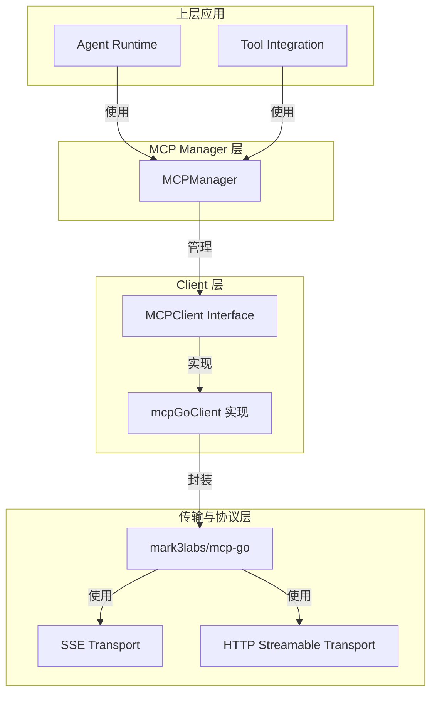

# MCP 连接与协议模型

## 概述

`mcp_connectivity_and_protocol_models` 模块是系统与外部 MCP (Model Context Protocol) 服务通信的核心基础设施。它提供了一套完整的机制来建立、管理和维护与 MCP 服务的连接，抽象了底层传输协议的复杂性，让上层应用可以无缝地调用外部工具和访问资源。

想象一下，这个模块就像是一个**国际航空枢纽**：它管理着多条不同航线（传输协议）的航班（连接），处理登机手续（初始化握手），确保旅客（数据）安全准点地到达目的地（MCP 服务）。枢纽负责维护航班时刻表、处理延误和取消，让旅行者无需关心底层的飞行技术细节。

## 架构概览



### 核心组件角色

1. **MCPManager** - 连接池管理器，负责创建、缓存和清理 MCP 客户端连接，就像枢纽的塔台控制中心
2. **MCPClient** - 客户端接口，定义了与 MCP 服务交互的标准契约
3. **mcpGoClient** - 基于 mark3labs/mcp-go 的具体实现，处理底层通信细节
4. **类型定义** - 一组数据结构，用于表示 MCP 协议的请求、响应和能力

### 数据流向

当系统需要调用 MCP 工具时，数据流如下：

1. **请求发起**：上层应用（如 Agent Runtime）通过 `MCPManager.GetOrCreateClient()` 获取客户端
2. **连接管理**：`MCPManager` 检查是否已有活跃连接，若无则创建新连接
3. **初始化握手**：新客户端执行 `Connect()` 和 `Initialize()` 完成协议握手
4. **工具调用**：应用通过 `CallTool()` 或 `ReadResource()` 执行具体操作
5. **结果转换**：底层响应被转换为系统内部类型后返回给调用者

## 核心设计决策

### 1. 接口抽象与具体实现分离

**决策**：定义 `MCPClient` 接口，由 `mcpGoClient` 提供具体实现

**原因**：
- 隔离第三方库依赖，便于未来更换底层实现
- 简化单元测试，可以轻松 mock 客户端接口
- 提供清晰的契约，明确客户端应具备的能力

**权衡**：
- 增加了一层抽象，代码稍微复杂
- 但带来了更好的可维护性和可测试性

### 2. 连接池化与复用

**决策**：`MCPManager` 缓存已建立的连接，避免重复创建

**原因**：
- MCP 服务连接（尤其是 SSE）建立成本较高
- 复用连接减少握手开销，提高响应速度
- 控制并发连接数，防止资源耗尽

**权衡**：
- 需要处理连接失效和重连逻辑
- 增加了内存占用，但换来性能提升

### 3. 禁用 Stdio 传输

**决策**：明确禁止使用 stdio 传输方式

**原因**：
- Stdio 传输存在命令注入安全风险
- 网络传输（SSE/HTTP）更可控且更安全
- 符合现代微服务架构的最佳实践

**权衡**：
- 失去了本地进程通信的便利性
- 但显著提升了系统安全性

### 4. 优雅的连接管理

**决策**：实现连接丢失检测、空闲清理和优雅关闭

**原因**：
- 网络不稳定是常态，需要自动恢复机制
- 防止僵尸连接占用资源
- 确保系统关闭时资源正确释放

**权衡**：
- 增加了后台 goroutine 和锁的复杂度
- 但提高了系统的健壮性和资源利用率

## 子模块说明

### 1. MCP 客户端接口与传输实现

这是模块的底层通信层，负责处理与 MCP 服务的原始数据交换。它封装了 mark3labs/mcp-go 库，提供了传输协议无关的接口。

**核心组件**：`MCPClient` 接口、`mcpGoClient` 实现、`ClientConfig` 配置

### 2. MCP 连接生命周期与管理器编排

这是模块的核心管理层，负责客户端连接的创建、缓存、监控和清理。它确保连接资源被高效利用，同时处理各种异常情况。

**核心组件**：`MCPManager`

### 3. MCP 服务能力与初始化契约

这是模块的协议层，定义了 MCP 服务初始化和能力协商的数据结构。它确保客户端和服务端能够正确理解彼此的能力。

**核心组件**：`InitializeResult`、`ServerCapabilities`、`ServerInfo`

### 4. MCP 资源与工具结果有效负载模型

这是模块的数据层，定义了工具调用和资源读取的请求/响应格式。它处理底层协议类型到系统内部类型的转换。

**核心组件**：`CallToolResult`、`ReadResourceResult`、`ContentItem`、`ResourceContent`

## 与其他模块的关系

- **依赖**：
  - `core_domain_types_and_interfaces` - 提供 `types.MCPService`、`types.MCPTool` 等基础类型
  - `platform_infrastructure_and_runtime` - 提供日志、配置等基础设施
  
- **被依赖**：
  - `agent_runtime_and_tools` - 通过此模块调用外部 MCP 工具
  - `application_services_and_orchestration` - 可能使用此模块集成外部能力

## 使用指南与注意事项

### 基本使用模式

```go
// 1. 获取 MCPManager 实例（通常通过依赖注入）
manager := mcp.NewMCPManager()

// 2. 准备服务配置
service := &types.MCPService{
    ID:             "my-service",
    Name:           "My MCP Service",
    Enabled:        true,
    TransportType:  types.MCPTransportSSE,
    URL:            &serviceURL,
    Headers:        map[string]string{"X-Custom-Header": "value"},
    AuthConfig:     &types.MCPAuthConfig{APIKey: "secret"},
    AdvancedConfig: &types.MCPAdvancedConfig{Timeout: 30},
}

// 3. 获取或创建客户端
client, err := manager.GetOrCreateClient(service)
if err != nil {
    // 处理错误
}

// 4. 调用工具
result, err := client.CallTool(ctx, "tool_name", map[string]interface{}{
    "param1": "value1",
})
```

### 注意事项

1. **连接生命周期**：不要手动管理客户端连接，让 `MCPManager` 处理连接的创建和销毁
2. **错误处理**：注意处理连接丢失的情况，`MCPManager` 会自动清理失效连接
3. **超时配置**：合理设置超时时间，防止长时间阻塞
4. **服务启用状态**：始终检查服务是否启用，`GetOrCreateClient` 会拒绝未启用的服务
5. **避免 stdio**：不要尝试使用 stdio 传输，它已被明确禁用

### 常见陷阱

- **重复创建客户端**：总是使用 `GetOrCreateClient` 而不是直接 `NewMCPClient`
- **忽略连接状态**：调用方法前不需要手动检查连接状态，方法内部会处理
- **上下文使用**：SSE 连接使用管理器的长生命周期上下文，不要使用请求上下文
- **资源泄漏**：程序退出时记得调用 `Shutdown()` 清理所有连接

## 总结

`mcp_connectivity_and_protocol_models` 模块是系统与外部 MCP 服务集成的桥梁。它通过精心设计的抽象层、连接池管理和安全考虑，让上层应用能够可靠、高效地使用外部工具和资源。虽然模块内部有一定的复杂性，但对外提供了简洁易用的接口，是系统扩展性和功能性的重要保障。
