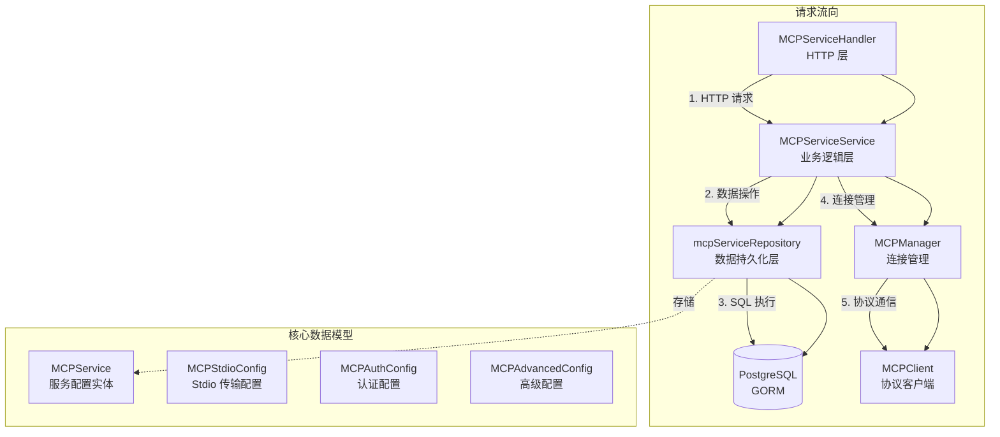

# MCP External Service Repository 模块深度解析

## 概述

想象一下，你的 AI 助手需要访问外部世界——调用第三方 API、读取远程数据库、与各种 SaaS 服务交互。但每个外部服务都有不同的认证方式、通信协议和数据格式。**MCP (Model Context Protocol) External Service Repository** 模块就是为了解决这个问题而生的：它提供了一个统一的持久化层，用于存储和管理 AI 助手可以连接的外部服务配置。

这个模块的核心洞察是：**外部服务配置是敏感且多变的**。敏感在于它包含 API 密钥、认证令牌等机密信息；多变在于服务地址、认证凭据可能随时调整。因此，模块采用了**租户隔离 + 软删除 + 敏感数据掩码**的设计模式，确保在多租户环境下，每个租户只能访问自己的服务配置，且操作可追溯、数据可恢复。

从架构角色来看，这是一个典型的**Repository 模式**实现——它不关心业务逻辑，只专注于数据的持久化操作。它向上层的 [`MCPServiceService`](#依赖分析) 提供 CRUD 接口，向下通过 GORM 操作数据库，是连接业务逻辑与数据存储的桥梁。

---

## 架构设计

### 组件关系图



### 架构角色解析

整个模块在系统中的位置非常清晰：

1. **HTTP Handler 层** (`MCPServiceHandler`)：接收 RESTful API 请求，解析 JSON，提取租户 ID，调用 Service 层
2. **Service 层** (`MCPServiceService`)：处理业务逻辑，包括安全校验（如禁用 Stdio 传输）、连接管理（更新配置时关闭旧连接）、敏感数据掩码
3. **Repository 层** (`mcpServiceRepository`)：本模块的核心，纯粹的数据访问层，不包含任何业务逻辑
4. **MCP Manager** (`MCPManager`)：管理到外部 MCP 服务的长连接，实现连接池和生命周期管理

这种分层的关键在于**职责分离**：Repository 只关心"如何存储"，Service 关心"何时存储"和"存储什么"，Handler 关心"如何暴露"。这样的设计使得每一层都可以独立测试和演进。

---

## 核心组件深度解析

### `mcpServiceRepository` 结构体

**设计意图**：这是模块的核心实现，一个典型的 Repository 模式载体。它的设计哲学是"** dumb but reliable**"——不做任何智能判断，只忠实地执行数据操作。

```go
type mcpServiceRepository struct {
    db *gorm.DB
}
```

只有一个依赖：`*gorm.DB`。这种极简设计是刻意为之——Repository 不应该依赖任何业务逻辑组件，它的唯一职责是将内存中的对象持久化到数据库。

#### 关键方法分析

##### `Create(ctx context.Context, service *types.MCPService) error`

最基础的创建操作，但注意它使用了 `WithContext`：

```go
func (r *mcpServiceRepository) Create(ctx context.Context, service *types.MCPService) error {
    return r.db.WithContext(ctx).Create(service).Error
}
```

**为什么需要 `ctx`？** 这不是装饰，而是生产级代码的必备。`ctx` 携带了超时控制、取消信号、链路追踪 ID 等关键信息。想象一个场景：数据库响应缓慢，如果没有超时控制，整个请求可能无限期挂起，拖垮服务。通过 `ctx`，上层可以在 30 秒后自动取消请求，释放资源。

##### `GetByID(ctx context.Context, tenantID uint64, id string) (*types.MCPService, error)`

这个方法的签名揭示了一个关键设计决策：**所有查询都必须携带 `tenantID`**。

```go
func (r *mcpServiceRepository) GetByID(ctx context.Context, tenantID uint64, id string) (*types.MCPService, error) {
    var service types.MCPService
    err := r.db.WithContext(ctx).
        Where("id = ? AND tenant_id = ?", id, tenantID).
        First(&service).Error
    if err != nil {
        if errors.Is(err, gorm.ErrRecordNotFound) {
            return nil, nil  // 注意：返回 nil, nil 而非 error
        }
        return nil, err
    }
    return &service, nil
}
```

**设计权衡**：为什么找不到记录时返回 `nil, nil` 而不是 `nil, ErrNotFound`？这是一种**调用友好**的设计。在 Go 中，"记录不存在"通常不是错误，而是一种正常的业务状态（比如检查某个资源是否存在）。返回 `nil, nil` 让调用者可以用简单的 `if service == nil` 判断，而不需要解包 error。这与 Go 标准库中 `map` 的 `val, ok := m[key]` 模式一脉相承。

**租户隔离**：注意 `Where("id = ? AND tenant_id = ?", id, tenantID)`——这是多租户系统的**安全底线**。如果漏掉 `tenant_id` 条件，租户 A 可能通过枚举 ID 访问租户 B 的配置。这种查询条件必须在 Repository 层固化，不能依赖上层传入。

##### `Update(ctx context.Context, service *types.MCPService) error`

这是整个 Repository 中**最复杂**的方法，体现了对"部分更新"场景的精细处理：

```go
func (r *mcpServiceRepository) Update(ctx context.Context, service *types.MCPService) error {
    updateMap := make(map[string]interface{})
    updateMap["updated_at"] = service.UpdatedAt
    updateMap["enabled"] = service.Enabled  // 始终更新 enabled
    
    if service.Name != "" {
        updateMap["name"] = service.Name
    }
    updateMap["description"] = service.Description  // 允许为空
    
    if service.TransportType != "" {
        updateMap["transport_type"] = service.TransportType
    }
    // ... 其他字段类似处理
}
```

**为什么这么麻烦？** 直接使用 `Updates(service)` 不就行了吗？问题在于 Go 的零值语义。如果用户想把 `description` 更新为空字符串，`Updates(service)` 会忽略这个字段（因为空字符串是零值）。但业务上，"清空描述"是一个合法的更新操作。

解决方案是**显式构建更新映射**：
- 对于不能为空的字段（如 `name`），检查非空后再加入 `updateMap`
- 对于可以为空的字段（如 `description`），无条件加入 `updateMap`
- 对于布尔值（如 `enabled`），无条件加入（因为 `false` 是有效值）

这种设计牺牲了代码简洁性，换来了**语义精确性**——每个字段的更新行为都符合业务预期。

##### `Delete(ctx context.Context, tenantID uint64, id string) error`

```go
func (r *mcpServiceRepository) Delete(ctx context.Context, tenantID uint64, id string) error {
    return r.db.WithContext(ctx).
        Where("id = ? AND tenant_id = ?", id, tenantID).
        Delete(&types.MCPService{}).Error
}
```

注意这里没有物理删除，而是**软删除**。`MCPService` 结构体包含 `gorm.DeletedAt` 字段，GORM 会自动将其转换为 `UPDATE ... SET deleted_at = NOW()` 而非 `DELETE FROM ...`。

**为什么选择软删除？**
1. **审计需求**：需要知道谁在什么时候删除了什么配置
2. **误操作恢复**：管理员可以手动恢复误删的配置
3. **外键约束**：如果有其他表引用了 MCP 服务，物理删除会破坏参照完整性

代价是**数据膨胀**和**查询复杂度**——所有查询都必须加上 `deleted_at IS NULL` 条件（GORM 自动处理）。

---

### 数据模型：`MCPService`

这是 Repository 操作的核心实体，理解它就理解了整个模块的数据结构：

```go
type MCPService struct {
    ID             string             `gorm:"type:varchar(36);primaryKey"`  // UUID
    TenantID       uint64             `gorm:"index"`                         // 租户隔离键
    Name           string             `gorm:"type:varchar(255);not null"`
    Description    string             `gorm:"type:text"`
    Enabled        bool               `gorm:"default:true;index"`           // 快速筛选启用状态
    TransportType  MCPTransportType   `gorm:"type:varchar(50);not null"`    // "sse", "http", "stdio"
    URL            *string            `gorm:"type:varchar(512)"`            // 可选，SSE/HTTP 需要
    Headers        MCPHeaders         `gorm:"type:json"`                    // JSON 存储
    AuthConfig     *MCPAuthConfig     `gorm:"type:json"`                    // JSON 存储
    AdvancedConfig *MCPAdvancedConfig `gorm:"type:json"`                    // JSON 存储
    StdioConfig    *MCPStdioConfig    `gorm:"type:json"`                    // 仅 stdio 需要
    EnvVars        MCPEnvVars         `gorm:"type:json"`                    // 环境变量
    CreatedAt      time.Time
    UpdatedAt      time.Time
    DeletedAt      gorm.DeletedAt     `gorm:"index"`                        // 软删除
}
```

**设计亮点**：

1. **混合存储策略**：核心字段（`name`, `enabled`）用关系型列，配置字段（`auth_config`, `headers`）用 JSON 列。这样既能用 SQL 高效查询（如 `WHERE enabled = true`），又能灵活扩展配置结构。

2. **指针 vs 值类型**：`URL`、`AuthConfig` 等用指针，因为它们是**可选的**。指针的 `nil` 值可以明确区分"未设置"和"空值"。

3. **索引设计**：`tenant_id`、`enabled`、`deleted_at` 都有索引，对应最常见的查询模式：
   - `WHERE tenant_id = ? AND deleted_at IS NULL`（列表查询）
   - `WHERE tenant_id = ? AND enabled = true`（获取启用的服务）

---

## 数据流分析

### 典型操作：创建 MCP 服务

```
用户请求 → Handler → Service → Repository → Database
   ↓         ↓         ↓          ↓           ↓
POST /    解析      校验       GORM       INSERT
mcp-services  JSON    运输类型    Create     记录
```

1. **Handler 层**：从 JWT 中提取 `tenantID`，注入到 `service.TenantID`
2. **Service 层**：检查 `TransportType` 是否为 `stdio`（出于安全考虑禁用），设置默认 `AdvancedConfig`
3. **Repository 层**：执行 `INSERT`，GORM 自动填充 `created_at`、`updated_at`
4. **Database 层**：持久化到 PostgreSQL

### 关键路径：更新服务配置

这是最复杂的流程，因为涉及**连接管理**：

```go
// Service 层逻辑
func (s *mcpServiceService) UpdateMCPService(...) {
    // 1. 获取现有配置
    existing := s.mcpServiceRepo.GetByID(...)
    
    // 2. 合并更新
    existing.Enabled = service.Enabled
    existing.URL = service.URL
    // ...
    
    // 3. 判断是否需要重连
    if !existing.Enabled || configChanged {
        s.mcpManager.CloseClient(service.ID)  // 关闭旧连接
    }
    
    // 4. 持久化
    s.mcpServiceRepo.Update(...)
}
```

**为什么先关闭连接再更新？** 这是**状态一致性**的要求。如果先更新数据库，但连接仍用旧配置，会导致后续工具调用失败。正确的顺序是：关闭连接 → 更新配置 → 下次使用时用新配置重建连接。

---

## 设计决策与权衡

### 1. 为什么禁用 Stdio 传输？

在 `CreateMCPService` 和 `UpdateMCPService` 中，都有这样的检查：

```go
if service.TransportType == types.MCPTransportStdio {
    return fmt.Errorf("stdio transport is disabled for security reasons")
}
```

**背景**：MCP 协议支持多种传输方式：
- **SSE/HTTP Streamable**：通过网络连接远程服务
- **Stdio**：在本地启动一个子进程，通过标准输入输出通信

**权衡**：Stdio 更灵活（可以运行任意本地命令），但**安全风险极高**。想象用户配置一个 MCP 服务，命令是 `rm -rf /`——这会直接危害服务器安全。因此，系统选择**牺牲灵活性换取安全性**，只允许网络传输。

**扩展点**：如果未来需要支持 Stdio，应该在**沙箱环境**中运行，限制子进程的系统调用权限。

### 2. 为什么 Repository 方法都接收完整实体而非 ID + 字段映射？

观察接口设计：

```go
Update(ctx context.Context, service *types.MCPService) error
```

而不是：

```go
Update(ctx context.Context, id string, updates map[string]interface{}) error
```

**原因**：
- **类型安全**：完整实体可以在编译期检查字段类型
- **业务逻辑上移**：哪些字段需要更新、如何合并，是 Service 层的职责，Repository 只负责执行
- **可测试性**：测试时可以构造完整的 `MCPService` 对象，无需关心内部更新逻辑

代价是**灵活性降低**——如果需要动态更新未知字段，这种设计就不适用。但在本模块中，字段是固定的，所以这是合理的权衡。

### 3. 租户隔离的实现策略

所有查询都强制加上 `tenant_id` 条件：

```go
Where("id = ? AND tenant_id = ?", id, tenantID)
```

**为什么不在 GORM 层面做全局过滤？** GORM 支持 `Scope` 功能，可以自动添加 `tenant_id` 条件。但这里选择**显式编写**，原因是：
- **可读性**：每个方法的查询条件一目了然
- **可控性**：某些特殊场景（如管理员后台）可能需要跨租户查询，显式编写更容易绕过限制
- **审计友好**：代码审查时容易发现遗漏租户条件的 bug

---

## 使用指南

### 基本使用模式

```go
// 1. 创建 Repository（通常在应用启动时）
repo := repository.NewMCPServiceRepository(db)

// 2. 创建服务
service := &types.MCPService{
    ID:            uuid.New().String(),
    TenantID:      123,
    Name:          "My MCP Service",
    TransportType: types.MCPTransportSSE,
    URL:           ptr.String("https://example.com/mcp"),
    Enabled:       true,
}
err := repo.Create(ctx, service)

// 3. 查询服务
service, err := repo.GetByID(ctx, 123, service.ID)
if service == nil {
    // 处理不存在的情况
}

// 4. 更新服务
service.Name = "Updated Name"
service.UpdatedAt = time.Now()
err := repo.Update(ctx, service)

// 5. 列出启用的服务
services, err := repo.ListEnabled(ctx, 123)

// 6. 删除服务（软删除）
err := repo.Delete(ctx, 123, service.ID)
```

### 配置示例

创建一个 SSE 传输的 MCP 服务：

```json
{
  "id": "550e8400-e29b-41d4-a716-446655440000",
  "tenant_id": 123,
  "name": "GitHub MCP",
  "description": "Access GitHub API via MCP",
  "enabled": true,
  "transport_type": "sse",
  "url": "https://api.github.com/mcp/sse",
  "auth_config": {
    "api_key": "ghp_xxxxxxxxxxxx"
  },
  "advanced_config": {
    "timeout": 60,
    "retry_count": 3,
    "retry_delay": 2
  },
  "headers": {
    "Accept": "application/vnd.github.v3+json"
  }
}
```

---

## 边界情况与注意事项

### 1. 敏感数据泄露风险

`MCPAuthConfig` 包含 API 密钥等敏感信息。虽然 Repository 层不做处理，但 Service 层的 `ListMCPServices` 会调用 `MaskSensitiveData()`：

```go
for _, service := range services {
    service.MaskSensitiveData()  // 掩码处理
}
```

**注意**：直接调用 Repository 的 `List` 方法会返回完整数据，包括敏感字段。因此，**永远不要绕过 Service 层直接调用 Repository**——这是安全边界。

### 2. 并发更新冲突

如果两个用户同时更新同一个服务，后提交的会覆盖先提交的。Repository 层没有乐观锁机制（如 `version` 字段）。

**缓解方案**：
- 在 Service 层检查 `updated_at`，如果与读取时不同，拒绝更新
- 或者在前端实现"最后写入获胜"的用户提示

### 3. JSON 字段的查询限制

`auth_config`、`headers` 等字段以 JSON 格式存储。虽然 PostgreSQL 支持 JSON 查询（如 `auth_config->>'api_key'`），但 Repository 层没有暴露这种能力。

**如果需要基于 JSON 字段查询**（如"找出所有使用特定 API 密钥的服务"），需要：
1. 在 Repository 层添加新方法
2. 使用 GORM 的 `Where("auth_config->>'api_key' = ?", key)`
3. 注意性能影响——JSON 查询通常比关系型列慢

### 4. 软删除的数据清理

软删除会导致数据只增不减。需要定期运行清理任务，物理删除超过保留期（如 90 天）的记录：

```go
// 伪代码
db.Unscoped().
    Where("deleted_at < ?", time.Now().AddDate(0, 0, -90)).
    Delete(&types.MCPService{})
```

**注意**：必须使用 `Unscoped()` 才能物理删除。

---

## 依赖关系

### 上游依赖（谁调用它）

- [`MCPServiceService`](../application_services_and_orchestration.md#mcp_service_configuration_management)：业务逻辑层，调用 Repository 进行数据持久化
- [`MCPServiceHandler`](../http_handlers_and_routing.md#mcp_service_management_handlers)：HTTP 层，间接通过 Service 调用

### 下游依赖（它调用谁）

- **GORM**：数据库 ORM 框架，执行 SQL 操作
- **PostgreSQL**：实际的数据存储（通过 GORM 抽象）

### 数据契约

| 数据类型 | 描述 | 敏感级别 |
|---------|------|---------|
| `MCPService` | 服务配置实体 | 高（含认证信息） |
| `MCPAuthConfig` | 认证配置（API Key、Token） | 极高 |
| `MCPStdioConfig` | Stdio 传输配置（命令、参数） | 高（可执行代码） |
| `MCPHeaders` | HTTP 请求头 | 中 |
| `MCPEnvVars` | 环境变量 | 高 |

---

## 相关模块

- [MCP Service Service](application_services_and_orchestration.md#mcp_service_configuration_management)：上层业务逻辑，处理连接管理和安全校验
- [MCP Client](platform_infrastructure_and_runtime.md#mcp_connectivity_and_protocol_models)：底层协议客户端，实际与外部 MCP 服务通信
- [Tenant Repository](data_access_repositories.md#tenant_management_repository)：租户管理，提供租户隔离的基础设施

---

## 总结

`mcpServiceRepository` 是一个**设计克制、职责单一**的数据访问层。它的价值不在于复杂的算法，而在于**对边界的坚守**：

- 不处理业务逻辑（那是 Service 层的事）
- 不做安全校验（那是 Handler 层的事）
- 不管理连接（那是 MCP Manager 的事）

它只做一件事：**安全、可靠、高效地存储和检索 MCP 服务配置**。这种"无聊"的设计，恰恰是生产级系统最需要的——因为简单，所以可维护；因为单一，所以可测试；因为克制，所以可扩展。
